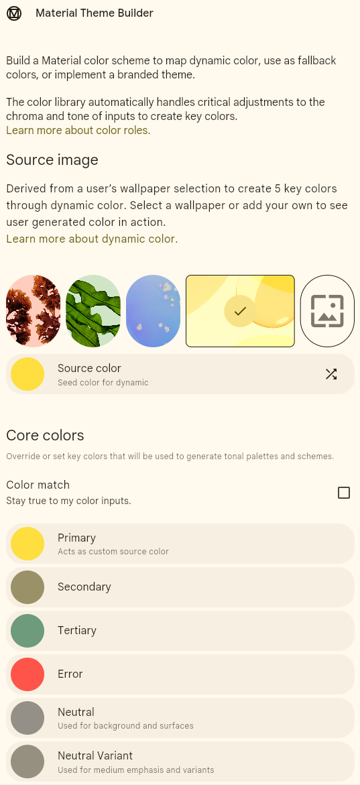

# **3.2. Temas en Material Design con Jetpack Compose**

## **Theming en Jetpack Compose con Material Design 3: Una Arquitectura de Estilo** 
 
 En el ecosistema de Android con Jetpack Compose, el pilar de esta coherencia es el sistema de **Theming** de [Material Design 3](https://m3.material.io/). Un "Theme" (tema) es mucho más que una simple paleta de colores; es un sistema completo que define la apariencia y el comportamiento de tu aplicación, encapsulando el color, la tipografía y la forma para crear una identidad de marca única y una experiencia de usuario consistente.

En este punto se profundiza en cómo aplicar y personalizar temas en Jetpack Compose, desde los conceptos básicos hasta la generación de paletas de colores dinámicas que dan vida a la filosofía de "Material You".

### ✨ 1. **La Anatomía de un Tema en Compose**

Cuando creas un nuevo proyecto de Jetpack Compose en Android Studio, se genera automáticamente un paquete `ui.theme` que contiene los tres pilares de tu tema:

*   **`Color.kt`**: Define los valores de color estáticos que usarás para construir tus esquemas de color.
*   **`Type.kt`**: Define la escala tipográfica de tu aplicación, es decir, los diferentes estilos de texto (títulos, cuerpos, etiquetas, etc.).
*   **`Theme.kt`**: Es el corazón del sistema. Aquí es donde se unen el color, la tipografía y la forma para crear el tema completo que se aplicará a tu aplicación.

El componente central es el composable `MaterialTheme`, que utiliza tres parámetros principales para configurar el tema:

1.  **`colorScheme`**: Un [esquema de color](https://developer.android.com/jetpack/compose/design-systems/material3#color-scheme) de Material 3 que asigna roles de color semánticos (como `primary`, `surface`, `onError`) a valores de color específicos.
2.  **`typography`**: Una [escala de tipos](https://developer.android.com/jetpack/compose/design-systems/material3#typography) que define el estilo para cada rol de texto (`displayLarge`, `bodyMedium`, `labelSmall`, etc.).
3.  **`shapes`**: Define los [atributos de forma](https://developer.android.com/jetpack/compose/design-systems/material3#shape), específicamente el radio de las esquinas para componentes pequeños, medianos y grandes.

Al envolver la UI de tu aplicación con `MaterialTheme`, todos los componentes de Material que utilices dentro de él (como `Button`, `Card`, `Scaffold`) heredarán y aplicarán automáticamente estos estilos, garantizando una consistencia visual sin esfuerzo.

```kotlin
// En tu Actividad principal o Composable raíz
MyAppTheme { // Tu tema personalizado que configura MaterialTheme
    Scaffold(...) {
        // Todo el contenido aquí dentro usará los colores,
        // tipografía y formas definidas en MyAppTheme
    }
}
```

#### 🎨 1.2 ColorScheme o Esquema de Color

Imaginad que estáis pintando un cuadro. No usaríais colores al azar, ¿verdad? Elegiríais una paleta de colores que funcionen bien juntos para transmitir una emoción o un estilo. En el diseño de interfaces, un esquema de color es exactamente eso: un conjunto de colores seleccionados cuidadosamente que se utilizan de manera coherente en toda la aplicación.

Este esquema define qué colores usar para los fondos, los botones, el texto, los iconos, etc. Un buen esquema de color ayuda a:

- **Crear Jerarquía Visual**: Guía la atención del usuario hacia los elementos más importantes.[1]
- **Mejorar la Usabilidad**: Asegura que el texto sea legible y que los elementos interactivos se distingan.[3]
- **Transmitir la Personalidad de la Marca**: Los colores evocan emociones y pueden reforzar la identidad de vuestra aplicación
- **Proporcionar Coherencia**: Ofrece una experiencia unificada y profesional al usuario.

!!! info "Material Design 3 y el Color Dinámico ("Material You")"

    Con la llegada de **Material Design 3**, también conocido como **Material You**, el concepto de esquema de color ha evolucionado significativamente. La característica estrella es el color dinámico.

    En dispositivos con Android 12 y versiones posteriores, el sistema puede extraer colores del fondo de pantalla del usuario para generar una paleta de colores única y personalizada que se aplica a todo el sistema y a las aplicaciones compatibles.
    Esto crea una experiencia profundamente personal y cohesiva para el usuario. Como desarrolladores, Jetpack Compose nos facilita enormemente la implementación de estos temas dinámicos.


!!! danger "Fundamental: Leer sobre Color Scheme y Color Roles"

    Fundamental leer para entender conceptos como ["**Color Schema**"](https://m3.material.io/styles/color/static/baseline), ["**Color Roles**"](https://m3.material.io/styles/color/roles)


### 🌈 2. **Personalizando tu Tema**

La verdadera potencia del sistema de Theming reside en su facilidad de personalización. Veamos cómo ajustar cada uno de los pilares.

#### Personalizar el Color 

La personalización del color se realiza en los archivos `Color.kt` y `Theme.kt`.

1.  **Define tus colores base en `Color.kt`:**
    ```kotlin
    // ui/theme/Color.kt
    val Purple80 = Color(0xFFD0BCFF)
    val PurpleGrey80 = Color(0xFFCCC2DC)
    val Pink80 = Color(0xFFEFB8C8)

    val Purple40 = Color(0xFF6650a4)
    val PurpleGrey40 = Color(0xFF625b71)
    val Pink40 = Color(0xFF7D5260)
    ```

2.  **Asigna esos colores a los roles del `ColorScheme` en `Theme.kt`:**
    Material 3 proporciona las funciones `lightColorScheme` y `darkColorScheme` para construir tus paletas. Solo necesitas asignar tus colores base a los roles que desees.

    ```kotlin
    // ui/theme/Theme.kt
    private val DarkColorScheme = darkColorScheme(
        primary = Purple80,
        secondary = PurpleGrey80,
        tertiary = Pink80,
        background = Color(0xFF1C1B1F),
        surface = Color(0xFF1C1B1F)
        // ... puedes personalizar todos los demás roles
    )

    private val LightColorScheme = lightColorScheme(
        primary = Purple40,
        secondary = PurpleGrey40,
        tertiary = Pink40,
        background = Color(0xFFFFFBFE),
        surface = Color(0xFFFFFBFE)
        // ... otros colores
    )
    ```
    La clave aquí es usar los [roles de color](https://m3.material.io/styles/color/the-color-system/color-roles) semánticamente. Por ejemplo, `primary` se usará para elementos prominentes como botones principales, mientras que `surface` se usará para el fondo de componentes como `Card` o `Dialog`.

#### Personalizar la Tipografía 📏

La tipografía se define en `Type.kt`. Puedes ajustar la familia de fuentes, el grosor, el tamaño y otros atributos para cada estilo de la escala.

1.  **Agrega tus fuentes:** Coloca tus archivos de fuentes (por ejemplo, `.ttf` u `.otf`) en la carpeta `res/font`.
2.  **Define la `FontFamily`:**
    ```kotlin
    // ui/theme/Type.kt
    val Montserrat = FontFamily(
        Font(R.font.montserrat_regular),
        Font(R.font.montserrat_bold, FontWeight.Bold)
    )
    ```
3.  **Crea tu objeto `Typography`:** Asigna tu `FontFamily` personalizada a los estilos de la escala tipográfica.

    ```kotlin
    // ui/theme/Type.kt
    val Typography = Typography(
        bodyLarge = TextStyle(
            fontFamily = Montserrat,
            fontWeight = FontWeight.Normal,
            fontSize = 16.sp,
            lineHeight = 24.sp,
            letterSpacing = 0.5.sp
        ),
        titleLarge = TextStyle(
            fontFamily = Montserrat,
            fontWeight = FontWeight.Bold,
            fontSize = 22.sp,
            lineHeight = 28.sp,
            letterSpacing = 0.sp
        )
        /* Define otros estilos de texto que necesites */
    )
    ```
    Luego, en tu composable de tema (`Theme.kt`), simplemente pasa este objeto `Typography` al parámetro `typography` de `MaterialTheme`.

#### Personalizar la Forma 📐

Las formas de los componentes se personalizan a través del objeto `Shapes` en `Theme.kt`. Puedes definir el radio de las esquinas para las tres categorías de tamaño.

```kotlin
// ui/theme/Theme.kt (o un archivo Shapes.kt dedicado)
val Shapes = Shapes(
    small = RoundedCornerShape(4.dp),
    medium = RoundedCornerShape(8.dp),
    large = RoundedCornerShape(16.dp)
)
```
Componentes como `Button` y `TextField` usarán por defecto `Shapes.small` o `Shapes.medium`, mientras que un `ModalBottomSheet` podría usar `Shapes.large`. Esta jerarquía de formas ayuda a crear una coherencia visual en toda la aplicación.

### 🎨 **3. Generando un Tema Completo desde un Único Color**



La característica más destacada de Material You es su capacidad para generar una paleta de colores rica y accesible a partir de un único **color semilla** (seed color). Esto no solo es la base para el [color dinámico](https://m3.material.io/styles/color/dynamic-color/overview) (que se adapta al fondo de pantalla del usuario), sino que también es una herramienta increíblemente poderosa para los desarrolladores para crear temas de marca personalizados.

La herramienta oficial para esto es el **[Material Theme Builder](https://m3.material.io/theme-builder)**, disponible tanto en la web como en Figma.

#### Pasos para Generar y Aplicar tu Tema:

1.  **Abre el Material Theme Builder:** Navega a la [herramienta web oficial](https://m3.material.io/theme-builder).
2.  **Elige tu Color Semilla:** En la sección "Primary", introduce el código hexadecimal de tu color de marca principal.
3.  **Observa la Magia:** La herramienta genera instantáneamente una paleta tonal completa para los colores primarios, secundarios, terciarios

<br/>

---

## 🏋️ **Actividades**


### 🚀 **A prácticar: Aplicación "Superhéroes" y "30 días"**

Para aprender los conceptos, vamos a trabajar con dos proyectos prácticos.

- ⬆️ **Práctica 1:**

    Proyecto. **App de Superhéroes**. Sigue las indicaciones [aquí](https://developer.android.com/codelabs/basic-android-kotlin-compose-practice-superheroes?hl=es-419).

<br/>

- ⬆️ **Práctica 2:**

    Proyecto. **30 días**. Sigue las indicaciones [aquí](https://developer.android.com/codelabs/basic-android-kotlin-compose-30-days?hl=es-419).

<br/>

!!! example "Aprende los conceptos previos que aplican en los proyectos"

    Para ello, realiza los siguientes proyectos guiados:

    1. Codelab. Temas de Material con Compose. [Codelab](https://developer.android.com/codelabs/basic-android-kotlin-compose-material-theming?hl=es-419).
    2. Codelab. Animación simple con Compose. [Codelab](https://developer.android.com/codelabs/basic-android-kotlin-compose-woof-animation?hl=es-419).


