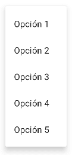
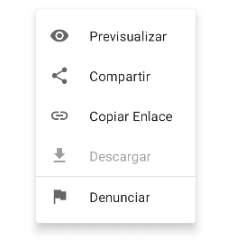

# **3.3. Elementos Tipo Menus**

Se incluye:

- Scaffold
- Menu
- TopAppBar
- BottomBar
- FloatingActionButton
- Drawer

El componente de layout usado con estos componentes es Scaffold


### 1. **Scaffold**

Piensa en Scaffold como el esqueleto básico de tu interfaz de usuario en una aplicación Compose. Proporciona una estructura estándar para implementar la mayoría de las interfaces de usuario comunes.

Estructura de Scaffold:
    
  - *`slots`* para diferentes partes de la interfaz, como la barra de aplicaciones (app bar), el contenido principal, un drawer (menú lateral), FABs (Floating Action Buttons), y barras de navegación o snackbar.
      
  - *Barra de Aplicaciones*: Scaffold te permite agregar fácilmente una barra de aplicaciones en la parte superior de la pantalla, donde generalmente colocas el título de la pantalla, menús, y otras acciones.
  - *Contenido Principa*l: Aquí es donde colocas el contenido principal de tu pantalla. Scaffold se encarga de posicionar este contenido de manera que no se superponga con otros elementos como la barra de aplicaciones o el FAB.
  - *Drawer (Cajon)*: menú lateral (como el menú de hamburguesa), Scaffold tiene un slot para esto. Es útil para la navegación en la app.
  - *Floating Action Button (FAB)*: Para acciones primarias en tu pantalla, puedes usar un FAB. Scaffold te permite agregarlo en un lugar adecuado, generalmente en la esquina inferior derecha.
  - *Bottom Bar y Snackbar*: Si necesitas una barra de navegación en la parte inferior o mostrar mensajes temporales (snackbars), Scaffold también te ofrece espacios para ellos.


El componente `Scaffold` es un contenedor que proporciona una estructura básica para la aplicación. Incluye áreas para el `TopAppBar`, `BottomBar`, `FloatingActionButton` y el contenido principal de la pantalla.

Ejemplo:

```kotlin
@Composable
fun ScaffoldExample() {
    var presses by remember { mutableIntStateOf(0) }

    Scaffold(
        topBar = {
            TopAppBar(
                colors = topAppBarColors(
                    containerColor = MaterialTheme.colorScheme.primaryContainer,
                    titleContentColor = MaterialTheme.colorScheme.primary,
                ),
                title = {
                    Text("Top app bar")
                }
            )
        },
        bottomBar = {
            BottomAppBar(
                containerColor = MaterialTheme.colorScheme.primaryContainer,
                contentColor = MaterialTheme.colorScheme.primary,
            ) {
                Text(
                    modifier = Modifier
                        .fillMaxWidth(),
                    textAlign = TextAlign.Center,
                    text = "Bottom app bar",
                )
            }
        },
        floatingActionButton = {
            FloatingActionButton(onClick = { presses++ }) {
                Icon(Icons.Default.Add, contentDescription = "Add")
            }
        }
    ) { innerPadding ->
        Column(
            modifier = Modifier
                .padding(innerPadding),
            verticalArrangement = Arrangement.spacedBy(16.dp),
        ) {
            Text(
                modifier = Modifier.padding(8.dp),
                text =
                """
                    This is an example of a scaffold. It uses the Scaffold composable's parameters to create a screen with a simple top app bar, bottom app bar, and floating action button.

                    It also contains some basic inner content, such as this text.

                    You have pressed the floating action button $presses times.
                """.trimIndent(),
            )
        }
    }
}
```

En este ejemplo, se incluyen otros componentes como:

- **TopAppBar y CenterAlignedTopAppBar** Es el equivalente básico de una toolbar. Puedes personalizar el título, los botones de acción, y el estilo en general. Por ejemplo
-**BottomAppBar**: Este no es exactamente una toolbar, pero se utiliza para una barra de navegación en la parte inferior de la pantalla. Es común en aplicaciones modernas, ofreciendo accesos directos a las funciones principales.
- **Custom AppBar**: Puedes crear tu propia AppBar personalizada usando Row o cualquier otro layout combinado con los componentes de Material Design como IconButton, Text, etc. Esto te da libertad total para diseñar algo único.
- **FloatingActionButton** : Este botón flotante es ideal para acciones principales en tus pantallas, como agregar un nuevo elemento, iniciar una nueva conversación, etc.
Drawer: cajón

### 2. **Menus**

#### 2.1. Menú desplegable (DropdownMenu) y Exponsed DropdownMenu

En este punto vamos a verel uso de [menús](https://material.io/components/menus) en Compose, con el fin de desplegar una lista de opciones en superficies que aparecen temporalmente hasta que el usuario selecciona una de ellas, o cancela la selección.

<figcaption>
  
    <p style="text-align: center;">Tipos de menús en Material Design</p>
</figcaption>

Existen dos tipos de menús: **Dropdown Menu** y **Exposed Dropdown Menu**. 

La siguiente es una tabla con más detalle sobre el contenido de la lección:

##### 2.1.1. Menú desplegable (DropdownMenu)

<figcaption>
  
    <p style="text-align: center;">Dropdown Menu en Compose</p>
</figcaption>

La función composable `DropdownMenu` muestra un menú desplegable que aparece al hacer clic en un botón o cualquier otro elemento interactivo. Este menú puede contener varias opciones que el usuario puede seleccionar.

```kotlin
@Composable
fun DropdownMenu(
    expanded: Boolean!,
    onDismissRequest: (() -> Unit)?,
    modifier: Modifier! = Modifier,
    offset: DpOffset! = DpOffset(0.dp, 0.dp),
    properties: PopupProperties! = PopupProperties(focusable = true),
    content: (@Composable @ExtensionFunctionType ColumnScope.() -> Unit)?
): Unit
```

Donde:

- `expanded`: Indica si el menú está expandido (visible) o no.
- `onDismissRequest`: Callback que se llama cuando el menú debe cerrarse.
- `modifier`: Modificador para personalizar el menú.
- `offset`: Desplazamiento del menú desde su posición predeterminada.
- `properties`: Propiedades del popup que contiene el menú.
- `content`: Contenido del menú, generalmente una lista de `DropdownMenuItem`.

##### Agregar elementos al menú

Dentro del contenido del `DropdownMenu`, puedes agregar elementos utilizando la función `DropdownMenuItem`. Cada elemento representa una opción en el menú.

```kotlin
@Composable
fun DropdownMenuItem(
    onClick: (() -> Unit)?,
    modifier: Modifier! = Modifier,
    enabled: Boolean! = true,
    contentPadding: PaddingValues! = PaddingValues(16.dp),
    leadingIcon: (@Composable () -> Unit)? = null,
    trailingIcon: (@Composable () -> Unit)? = null,
    text: (@Composable () -> Unit)?
): Unit
```

Donde:
- `onClick`: Callback que se llama cuando el elemento es seleccionado.
- `modifier`: Modificador para personalizar el elemento.
- `enabled`: Indica si el elemento está habilitado o deshabilitado.
- `contentPadding`: Padding alrededor del contenido del elemento.
- `leadingIcon`: Icono que aparece antes del texto.
- `trailingIcon`: Icono que aparece después del texto.
- `text`: Contenido de texto del elemento.


??? example "DropdownMenu simple"

    <figcaption>
    
        <p style="text-align: center;">Ejemplo de Dropdown Menu</p>
    </figcaption>

    Supongamos que tenemos una App de tareas y deseamos incluir en su vista de lista un menú para realizar las siguientes acciones:

    - Cambiar nombre
    - Enviar por email
    - Copiar enlace
    - Ocultar subtareas completas
    - Eliminar

    Para crear el menú debemos:

    1. Definir la expansión del menú como estado
    2. Declarar la lista de opciones
    3. Invocar a `DropdownMenu`
    4. Añadir cinco elementos `DropdownMenuItem`

    El código de la solución lo encuentras en la función `TaskMenu()`

    ```kotlin
    @Composable
    fun TaskMenu(
        expanded: Boolean, // (1)
        onItemClick: (String) -> Unit,
        onDismiss: () -> Unit
    ) {

        val options = listOf( // (2)
            "Cambiar nombre",
            "Enviar por email",
            "Copiar enlace",
            "Ocultar subtareas completas",
            "Eliminar"
        )

        DropdownMenu( // (3)
            expanded = expanded,
            onDismissRequest = onDismiss
        ) {
            options.forEach { option ->
                DropdownMenuItem( // (4)
                    onClick = {
                        onItemClick(option)
                        onDismiss()
                    }
                ) {
                    Text(text = option)
                }
            }
        }
    }
    ```
    Como ves, hemos elevado el estado de la expansión y las funciones ejecutadas al clickear un ítem y al descartar el menú. Estos valores son proveídos desde la función TasksUi(), la cual se encarga de dibujar la tarea y el icono que muestra al menú:

    ```kotlin
    @Composable
    fun TasksUi() {
        var taskMenuOpen by remember { mutableStateOf(false) }
        var action by remember { mutableStateOf("Ninguna") }

        Box(
            Modifier
                .border(width = 1.dp, shape = RectangleShape, color = Color.LightGray)
                .padding(horizontal = 16.dp)
                .fillMaxWidth()
                .height(56.dp)

        ) {
            Row(
                Modifier
                    .fillMaxWidth()
                    .align(Alignment.CenterStart),
                verticalAlignment = Alignment.CenterVertically
            ) {
                Checkbox(
                    checked = false,
                    onCheckedChange = {},
                    modifier = Modifier
                        .size(24.dp)
                )
                Spacer(modifier = Modifier.width(16.dp))
                Column {

                    Text(
                        text = "Limpiar alacena"
                    )
                    Text(text = "Acción: $action", style = MaterialTheme.typography.caption)
                }

            }
            IconButton(
                onClick = { taskMenuOpen = true },
                modifier = Modifier
                    .size(24.dp)
                    .align(Alignment.CenterEnd)
            ) {
                Icon(
                    imageVector = Icons.Filled.MoreVert,
                    contentDescription = "Acciones para tarea"
                )
                TaskMenu(
                    expanded = taskMenuOpen,
                    onItemClick = { action = it },
                    onDismiss = {
                        taskMenuOpen = false
                    }
                )
            }
        }
    }
    ```
    Al ejecutar la aplicación, veremos el siguiente resultado:

    <figcaption>
    
        <p style="text-align: center;">TaskUI() en acción</p>
    </figcaption>


??? example "Ejemplo: Item con icono, item deshabilitado y divisor"

    <figcaption>
    
        <p style="text-align: center;">DropdownMenu con ítems personalizados</p>
    </figcaption>

    Probemos con un caso donde podamos personalizar los ítems como el que se muestra en la imagen anterior.

    Consideremos una App donde permitamos al usuario desplegar un **menú para un imagen** que visualiza, cuando hace clic prolongado. Las opciones asociadas y las decoraciones son:

    - Previsualizar (Icono)
    - Compartir (Icono)
    - Copiar Enlace (Icono)
    - Descargar (Icono + Deshabilitado)
    - Denunciar (Icono + Divisor)

    ¿Cómo enfrentar estos requerimientos de interfaz?

    1. **Iconos**: Usa el componente `Icon` en el parámetro `content` de los ítems. Recuerda que este tiene un recibidor tipo `RowScope`, por lo que no es necesario añadir un elemento `Row`
    2. **Estado Deshabilitado**: Usa el parámetro `enabled` con el valor de `false` para deshabilitar un ítem
    3. **Divisor**: Invoca al componente `Divider` entre los ítems donde deseas visualizarlo. En nuestro caso es antes de «Descargar»

    Los elementos previos podemos agruparlos en una clase de datos llamada `Option`. Además, como deseamos tratar al divisor como otro ítem, podemos crear una interfaz sellada `MenuItem` que contenga ambos tipos


    ```kotlin
    sealed interface MenuItem {

        data class Option(
            val name: String,
            val icon: ImageVector?,
            val enabled: Boolean = true
        ) : MenuItem

        object Divider : MenuItem
    }
    ```
    Teniendo en cuenta lo anterior, te será fácil comprender la función de ejemplo ImageMenu():

    ```kotlin
    @Composable
    fun ImageMenu(
        expanded: Boolean,
        onItemClick: (Option) -> Unit, // (1)
        onDismiss: () -> Unit
    ) {
        val options = listOf( // (2)
            Option(
                "Previsualizar",
                ImageVector.vectorResource(R.drawable.ic_visibility)
            ),
            Option("Compartir", Icons.Filled.Share),
            Option("Copiar Enlace", ImageVector.vectorResource(R.drawable.ic_link)),
            Option("Descargar", ImageVector.vectorResource(R.drawable.ic_file_download), false),
            Divider,
            Option("Denunciar", ImageVector.vectorResource(R.drawable.ic_flag)),
        )

        DropdownMenu(
            expanded = expanded,
            onDismissRequest = onDismiss,
            offset = DpOffset(50.dp, 250.dp),
            modifier = Modifier.width(192.dp)
        ) {
            options.forEach { option ->
                when (option) { // (3)
                    is Option -> {
                        DropdownMenuItem(
                            enabled = option.enabled,
                            onClick = {
                                onItemClick(option)
                                onDismiss()
                            }
                        ) {
                            option.icon?.let { // (4)
                                val values = LocalContentAlpha provides
                                        if (option.enabled)
                                            ContentAlpha.medium
                                        else ContentAlpha.disabled
                                CompositionLocalProvider(values) {
                                    Icon(it, contentDescription = null)
                                }
                            }

                            Spacer(Modifier.width(24.dp))

                            Text(text = option.name)
                        }
                    }
                    Divider -> Divider() // (5)
                }

            }
        }
    }
    ```


    El en acción se ve así:

    <figcaption>
    
        <p style="text-align: center;">ImageUI en acción</p>
    </figcaption>

<br/>
<br/>

#### 2.2. Menú desplegable expuesto (Exposed Dropdown Menu)

<figcaption>
  
    <p style="text-align: center;">Exposed Dropdown Menu en Compose</p>
</figcaption>

Usa la función componible `ExposedDropdownMenuBox()` para mostrar un **menú desplegable expuesto**, con el objetivo de mantener visible la selección actual por encima de las demás opciones.

Esta es la firma de la función:

```kotlin
@ExperimentalMaterialApi
@Composable
fun ExposedDropdownMenuBox(
    expanded: Boolean!,
    onExpandedChange: ((Boolean) -> Unit)?,
    modifier: Modifier! = Modifier,
    content: (@Composable @ExtensionFunctionType ExposedDropdownMenuBoxScope.() -> Unit)?
): Unit
```

Nota: _Como ves, en el momento que escribo este tutorial, aún está marcada como experimental._

Sus parámetros son similares a `DropdownMenu`, salvo `onExpandedChange` que es una lambda que se ejecuta cuando el usuario hace clic sobre el menú.

??? example "Ejemplo: Expanded Dropdown Menu Simple"

    <figcaption>
    
        <p style="text-align: center;">Ejemplo de Exposed Dropdown Menu</p>
    </figcaption>

    Tomemos como ilustración un menú expuesto que permite seleccionar el tipo de teléfono que será asociado a un contacto (figura 7), donde las posibles opciones son:

    - Fijo
    - Móvil
    - Trabajo
    - Otro

    ¿Cómo abordar este simple escenario?

    1. Declarar la lista de tipos de número de teléfonos
    2. Declarar estados tanto para la apertura del menú como para la selección actual
    3. Invocar a `ExpandedDropdownMenuBox`
    4. Añadir un `[TextField](https://www.develou.com/android-textfield-en-compose/)`
    5. Añadir un `DropdownMenu` con los items

    La función componible `PhoneNumberTypeMenu()` es la encargada de aplicar las tareas anteriores:

    ```kotlin
    @OptIn(ExperimentalMaterialApi::class)
    @Composable
    fun PhoneNumberTypeMenu() {
        val types = listOf("Fijo", "Móvil", "Trabajo", "Otro")
        val default = 0

        var expanded by remember { mutableStateOf(false) }
        var selectedType by remember { mutableStateOf(types[default]) } // (1)

        ExposedDropdownMenuBox(
            expanded = expanded,
            onExpandedChange = {
                expanded = !expanded // (2)
            },
            modifier = Modifier.width(150.dp)
        ) {
            TextField(
                readOnly = true, // (3)
                value = selectedType, // (4)
                onValueChange = { },
                label = { Text("Tipo") },
                trailingIcon = {
                    ExposedDropdownMenuDefaults.TrailingIcon( // (5)
                        expanded = expanded
                    )
                },
                colors = ExposedDropdownMenuDefaults.textFieldColors()
            )
            ExposedDropdownMenu(
                expanded = expanded,
                onDismissRequest = {
                    expanded = false
                }
            ) {
                types.forEach { selectionOption ->
                    DropdownMenuItem(
                        onClick = {
                            selectedType = selectionOption
                            expanded = false
                        }
                    ) {
                        Text(text = selectionOption)
                    }
                }
            }
        }
    }
    ```

    Puntos a tener en cuenta del código preliminar:

    1. Es necesario recordar como estado la selección actual del `TextField`
    2. Modificamos el estado de expansión del menú desde `onExpandedChange`
    3. Como no deseamos recibir texto, marcamos al `TextField` como solo lectura
    4. El valor del campo de texto es definido por la selección actual
    5. El icono del final del campo de texto es proveído por `ExposedDropdownMenuDefaults.TrailingIcon()`. Si revisas su implementación, verás que se cambia la rotación del icono de expansión según el valor pasado como parámetro

    Al previsualizar en modo de interacción el resultado es:

    <figcaption>
    
        <p style="text-align: center;">`PhoneNumberTypeMenu()` en acción</p>
    </figcaption>


