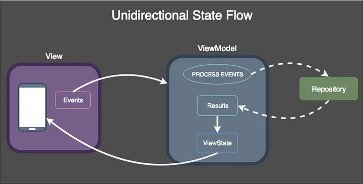

## 3.3.2 🧱 **Capa UI.** Arquitectura

La **capa de UI** es la parte de tu aplicación con la que el usuario interactúa directamente. Su principal responsabilidad es **mostrar los datos de la aplicación en la pantalla** y, a su vez, **ser el punto de entrada para las acciones del usuario** (clics, escritura, etc.).

Piensa en ella como la cabina de un avión ✈️. El piloto (usuario) ve los instrumentos (la pantalla) y acciona los controles (botones, gestos). La cabina no sabe cómo funciona el motor; solo muestra la velocidad y envía la orden "acelerar" a las capas internas.

Esta capa se compone fundamentalmente de dos tipos de elementos:

1.  **Elementos de la UI (UI Elements):** Son los componentes visuales que dibujan la pantalla. En Jetpack Compose, estos son tus funciones **`@Composable`**. Su única misión es transformar un estado en una interfaz gráfica. Son "tontos" por diseño: reciben un estado y lo pintan. No toman decisiones de lógica de negocio.
    
2.  **Contenedores de Estado (State Holders):** Son clases responsables de **contener el estado**, gestionar la lógica de la UI y exponer los datos a los Elementos de la UI. La clase más común para esto es el **`ViewModel`**. Este es el "cerebro" 🧠 de la pantalla.
    

### ↪️ El Flujo de Datos Unidireccional (UDF) 

Para que todo funcione de forma ordenada y predecible, la comunicación entre estos dos componentes sigue un patrón estricto llamado **Flujo de Datos Unidireccional** (Unidirectional Data Flow o UDF).

Es muy simple de entender:

*   **El Estado fluye hacia abajo (State flows down) 👇:** El `ViewModel` expone el estado (usando un `StateFlow`). El Composable lo recoge y se dibuja basándose en él.
    
*   **Los Eventos fluyen hacia arriba (Events flow up) 👆:** El Composable no modifica el estado directamente. Cuando el usuario hace clic en un botón, el Composable notifica al `ViewModel` de este "evento" (ej: `viewModel.onIncrementarClick()`). El `ViewModel` es quien decide qué hacer y, si es necesario, actualiza su estado.
    
<figcaption>
  
  <p style="text-align: center; font-style: italic;">UDF: Flujo de datos unidireccional.</p>
</figcaption>


Este ciclo crea un bucle predecible: `Evento -> Actualizar Estado -> Mostrar Nuevo Estado`.

El *flujo de datos unidireccional (UDF)* es una técnica que se utiliza principalmente en la **programación reactiva** funcional. También se conoce como flujo de datos unidireccional, lo que significa que los datos **solo pueden transferirse de una manera** a otras partes de la aplicación.

La *unidireccionalidad* significa que no obtenemos nuestros datos solicitándolos directamente. La única forma de obtenerlos es activando una acción desde nuestra vista a nuestra capa de datos. El efecto secundario de esta acción es actualizar el estado de nuestros datos.

La *vista es el resultado del estado* de la aplicación. El **estado** solo puede cambiar al activar acciones. Cuando se realizan acciones, el estado se actualiza.

<figcaption>
  
  <p style="text-align: center; font-style: italic;">Acción del estado sobre la vista.</p>
</figcaption>

* * *

### **¿Cómo definir el estado de la UI?**

La IU es lo que **ve el usuario**, el estado de la IU es lo que la **app dice que debería ver**. Al igual que dos caras de una moneda, la IU es la representación visual del estado de la IU. Cualquier cambio en el estado de la IU se refleja de inmediato en la IU.

<figcaption>
  
  <p class="text-small" style="text-align: center; font-style: italic;">La IU es el resultado de la vinculación de sus elementos en la pantalla con el estado correspondiente..</p>
</figcaption>


```kotlin
data class NewsUiState(
    val isSignedIn: Boolean = false,
    val isPremium: Boolean = false,
    val newsItems: List<NewsItemUiState> = listOf(),
    val userMessages: List<Message> = listOf()
)

data class NewsItemUiState(
    val title: String,
    val body: String,
    val bookmarked: Boolean = false,
    ...
)
```

**Inmutabilidad**

La **inmutabilidad** del estado significa que la UI tiene prohibido modificar los datos que recibe. Su única misión es actuar como un **espejo**, reflejando fielmente el estado actual.

Para realizar un cambio, no se "edita" el estado viejo, sino que se reemplaza por completo con una **instancia nueva y actualizada**.

Esto impone un orden estricto, garantizando una **única fuente de verdad**. Así se eliminan los errores impredecibles que ocurren cuando distintas partes del código intentan modificar los mismos datos a la vez, resultando en una app mucho más estable y predecible.

!!! info "Inmutablidad de forma simple"

    La **inmutabilidad** en Compose es crucial porque convierte el estado de tu pantalla en una **fotografía perfecta e inalterable** de un momento concreto.

    Piénsalo con esta analogía:

    *   **El Estado Inmutable** es como un **plano de una casa 🏠 sellado y firmado por el arquitecto**.
    *   **Jetpack Compose** es el **equipo de construcción 👷**.
    *   **El ViewModel** es el **arquitecto 📐**.
        

    Ahora, analicemos por qué esto es tan importante:

    1. **Claridad y Previsibilidad**

        El equipo de construcción (Compose) recibe el plano (el objeto de estado) y su única tarea es construir la casa _exactamente_ como dice el plano. No tienen que adivinar nada. Saben que el plano que tienen en sus manos es la **verdad absoluta** en ese momento. Esto hace que su trabajo sea simple y **predecible**.

        Esto es lo que el texto quiere decir con: _"los objetos inmutables proporcionan garantías sobre el estado de la aplicación en un momento determinado"_.

    2. **Evitar el Caos y los Errores**

        Imagina que el estado fuera **mutable** (que se pudiera cambiar). Sería como si, mientras los obreros construyen, ¡cualquiera de ellos pudiera coger un lápiz y modificar el plano sobre la marcha!

        *   ¿Dónde iría esa pared ahora?
        *   ¿El electricista estaría trabajando con el plano antiguo o con el nuevo que acaba de cambiar un fontanero?
        

        Sería un caos absoluto. Tendrías varias versiones de la "verdad" al mismo tiempo, lo que llevaría a errores de construcción (bugs en tu app) muy difíciles de encontrar.

        Esto es a lo que se refiere el texto con: _"Infringir este principio genera varias fuentes verídicas para la misma información, lo que genera inconsistencias en los datos y errores leves"_.

    3. **¿Cómo se hacen los cambios entonces?**

        Cuando el arquitecto (ViewModel) quiere hacer un cambio (por ejemplo, añadir una ventana), no borra y redibuja sobre el plano viejo. Lo que hace es crear **un plano completamente nuevo** con la ventana añadida y se lo entrega al equipo de construcción.

        El equipo de construcción ve el nuevo plano, lo compara con el anterior y de forma muy eficiente solo construye la parte nueva: la ventana.


**Contenedores de estado**

Un **State Holder** (o "contenedor de estado") es simplemente una clase responsable de **guardar y gestionar** los datos que tu UI necesita para mostrar en pantalla.

Su principal objetivo es **separar la lógica del diseño visual**. De esta forma, tus componentes de UI (`Composables`) se dedican únicamente a "pintar" el estado que reciben, mientras que el State Holder actúa como el **"cerebro" 🧠** que procesa las acciones del usuario y decide qué datos se deben mostrar.

En resumen, es el lugar donde vive el estado y la lógica de tu pantalla, manteniendo tu código de UI limpio, simple y fácil de probar. El `ViewModel` es el tipo de State Holder más común y recomendado en Android.

!!! important "Punto clave 💡"

    El **ViewModel** es la implementación recomendada para administrar el estado de la IU a nivel de pantalla con acceso a la capa de datos. Además, sobrevive automáticamente a los cambios de configuración. Las clases ViewModel definen la lógica que se aplica a los eventos en la app y, como resultado, producen un estado actualizado.

### 🧮 **MVVM: El Patrón Arquitectónico por Excelencia**

**MVVM** son las siglas de **Model-View-ViewModel**. Es un patrón de diseño arquitectónico que se adapta como un guante a los principios de la capa de UI y el flujo de datos unidireccional. Su objetivo es separar las responsabilidades de forma muy clara.

Vamos a desglosar sus tres componentes:

1. **Model (Modelo)**

      - **¿Qué es?** Es la capa de **datos** de tu aplicación. Contiene la lógica de negocio y es la fuente de la verdad.  
      - **¿Qué hace?** Es responsable de obtener y manipular los datos, ya sea desde una base de datos local (Room), una API de red (Retrofit) o cualquier otra fuente.
      - **Componentes:** Clases de datos (data classes), Repositorios, Casos de Uso, Fuentes de Datos (Data Sources).    

2. **View (Vista)**

      *   **¿Qué es?** Es la **interfaz de usuario** (UI). Lo que el usuario ve y con lo que interactúa.  
      *   **¿Qué hace?** Su única responsabilidad es observar los datos expuestos por el ViewModel y dibujarse a sí misma. Captura las interacciones del usuario y las notifica al ViewModel como eventos.
      *   **Componentes:** En Android tradicional, eran los `Activities` y `Fragments` con XML. En el mundo moderno, son tus funciones **`@Composable`** en Jetpack Compose.
    

3. **ViewModel (Vista-Modelo)**

      *   **¿Qué es?** Es el **intermediario** entre el Modelo y la Vista.  
      *   **¿Qué hace?** No tiene ninguna referencia a la Vista (¡muy importante!), lo que lo hace fácil de testear. Solicita datos al Modelo, aplica la lógica de presentación necesaria y expone el estado listo para ser consumido por la Vista (a través de `StateFlow`). También recibe los eventos de la Vista y decide qué acción pedirle al Modelo.
      *   **Componentes:** Clases que heredan de `androidx.lifecycle.ViewModel`.


<figcaption>
  
  <p class="text-small" style="text-align: center; font-style: italic;">Diagrama que ilustra el ciclo de eventos y datos en el flujo unidireccional de datos</p>
</figcaption>


#### Tipos de Lógica

La "lógica" se refiere de manera general a las **instrucciones, reglas y procesos algorítmicos** que dictan el comportamiento de una aplicación de software.

El texto distingue principalmente entre dos tipos de lógica esenciales en el desarrollo de aplicaciones: la **lógica empresarial** y la **lógica de la Interfaz de Usuario (IU)**, a veces llamada **lógica de comportamiento de la IU**.

-  **Lógica Empresarial**

    Representa la aplicación de las reglas y requerimientos funcionales fundamentales del producto directamente sobre los **datos** de la aplicación. Su propósito es definir qué debe hacer la aplicación con la información para cumplir con sus objetivos de valor.

    *   `Ubicación:` Generalmente reside en las capas de **dominio** o **datos**, asegurando que esté desacoplada de cómo se presenta la información. 
    *   `Principio Clave:` **Nunca** debe ubicarse en la capa de la Interfaz de Usuario (IU).


- **Lógica de la Interfaz de Usuario (IU) o Comportamiento de la IU**

    Determina **cómo** se manifiestan los cambios de estado o las acciones en la pantalla para el usuario. Se encarga de la gestión de la presentación visual y la interacción.

    - `Función:` Incluye la preparación de elementos para su visualización, la navegación entre vistas como respuesta a interacciones, y la gestión de retroalimentación visual al usuario (como mensajes temporales).
        
    - `Ubicación:` Debe encontrarse en la capa de la **IU** (la Vista). Si esta lógica se vuelve compleja, puede delegarse a una clase auxiliar dentro de la propia IU para mejorar la separación de responsabilidades y la capacidad de prueba, manteniendo su vínculo al ciclo de vida de la IU.


## **Aplicando todo. Ejemplos**

El el "Ejemplo 1" tenemos una aplicación simple "Contador", con un botón que incrementa un número al darle click al Botón. El estado "vive" dentro del componente "CounterScreen".

??? example "Ejemplo 1: App contador simple"

    ```kotlin
    // 1. Contador Simple (Estado Local)
    // El estado y la lógica residen en el mismo Composable.

    import androidx.compose.runtime.*
    import androidx.compose.ui.Modifier
    import androidx.compose.foundation.layout.*
    import androidx.compose.material3.*
    import androidx.compose.ui.Alignment
    import androidx.compose.ui.unit.dp

    // Función de entrada para la aplicación (simulando una actividad/main)
    @Composable
    fun CounterApp1() {
        MaterialTheme {
            CounterScreen()
        }
    }

    @Composable
    fun CounterScreen(modifier: Modifier = Modifier) {
        // 1. Definición del Estado: 'remember' conserva el valor, 'mutableStateOf' lo hace observable.
        var count by remember { mutableStateOf(0) } // Estado del contador

        Column(
            modifier = modifier
                .fillMaxSize()
                .padding(24.dp),
            horizontalAlignment = Alignment.CenterHorizontally,
            verticalArrangement = Arrangement.Center
        ) {
            Text("Estado: LOCAL", style = MaterialTheme.typography.titleMedium)
            Spacer(modifier = Modifier.height(32.dp))

            Card(
                modifier = Modifier.width(200.dp),
                elevation = CardDefaults.cardElevation(defaultElevation = 8.dp)
            ) {
                Column(
                    modifier = Modifier
                        .padding(24.dp)
                        .fillMaxWidth(),
                    horizontalAlignment = Alignment.CenterHorizontally
                ) {
                    Text(
                        text = "Contador Único",
                        style = MaterialTheme.typography.headlineSmall
                    )
                    Spacer(modifier = Modifier.height(16.dp))

                    // Muestra el valor del estado
                    Text(
                        text = "$count",
                        style = MaterialTheme.typography.displayLarge,
                        color = MaterialTheme.colorScheme.primary
                    )
                    Spacer(modifier = Modifier.height(24.dp))

                    // Botón que modifica el estado directamente
                    Button(
                        onClick = { count++ },
                        modifier = Modifier.fillMaxWidth()
                    ) {
                        Text("Aumentar (+1)")
                    }
                    Spacer(modifier = Modifier.height(8.dp))

                    // Botón para reiniciar el estado
                    OutlinedButton(
                        onClick = { count = 0 },
                        modifier = Modifier.fillMaxWidth()
                    ) {
                        Text("Reiniciar a 0")
                    }
                }
            }
        }
    }
    ```

En esta ejemplo 2, la complejidad aumenta. Ahora tenemos tres piezas de estado (count1, count2, generalCount) y toda la lógica que las conecta reside en el mismo componente CounterApp2.

??? example "Ejemplo 2: App 2 contadores"

    ```kotlin
    // 2. Contadores Múltiples y General (Todo Local)
    // Todos los estados (individuales y general) y la lógica de negocio combinada residen
    // en el mismo componente raíz.

    import androidx.compose.runtime.*
    import androidx.compose.ui.Modifier
    import androidx.compose.foundation.layout.*
    import androidx.compose.material3.*
    import androidx.compose.ui.Alignment
    import androidx.compose.ui.unit.dp

    @Composable
    fun CounterApp2() {
        MaterialTheme {
            CounterScreenWithCombinedState()
        }
    }

    @Composable
    fun CounterScreenWithCombinedState(modifier: Modifier = Modifier) {
        // Estados Individuales
        var count1 by remember { mutableStateOf(0) }
        var count2 by remember { mutableStateOf(0) }
        
        // Estado General: Se mantiene localmente y se actualiza junto con los otros.
        var generalCount by remember { mutableStateOf(0) }

        Column(
            modifier = modifier
                .fillMaxSize()
                .padding(16.dp),
            horizontalAlignment = Alignment.CenterHorizontally
        ) {
            Text("Arquitectura: Múltiples Estados LOCALES", style = MaterialTheme.typography.titleMedium)
            Spacer(modifier = Modifier.height(16.dp))

            // Tarjeta del Contador General
            Card(
                modifier = Modifier.fillMaxWidth().padding(8.dp),
                colors = CardDefaults.cardColors(containerColor = MaterialTheme.colorScheme.tertiaryContainer)
            ) {
                Column(
                    horizontalAlignment = Alignment.CenterHorizontally,
                    modifier = Modifier.fillMaxWidth().padding(16.dp)
                ) {
                    Text("Contador General", style = MaterialTheme.typography.headlineSmall)
                    Text("$generalCount", style = MaterialTheme.typography.displaySmall)
                }
            }
            Spacer(modifier = Modifier.height(16.dp))

            Row(Modifier.fillMaxWidth()) {
                // Lógica para el Contador 1
                CounterCard(
                    title = "Contador #1",
                    currentCount = count1,
                    onIncrement = {
                        count1++
                        generalCount++ // Lógica de negocio dentro de este Composable
                    },
                    onReset = { count1 = 0 },
                    modifier = Modifier.weight(1f)
                )

                // Lógica para el Contador 2
                CounterCard(
                    title = "Contador #2",
                    currentCount = count2,
                    onIncrement = {
                        count2++
                        generalCount++ // Lógica de negocio dentro de este Composable
                    },
                    onReset = { count2 = 0 },
                    modifier = Modifier.weight(1f)
                )
            }
            
            Spacer(modifier = Modifier.height(16.dp))
            Button(onClick = {
                count1 = 0
                count2 = 0
                generalCount = 0
            }) {
                Text("Reiniciar TODO")
            }
        }
    }

    // Componente Reutilizable Simple (UI Pura)
    @Composable
    fun CounterCard(
        title: String,
        currentCount: Int,
        onIncrement: () -> Unit,
        onReset: () -> Unit,
        modifier: Modifier = Modifier
    ) {
        Card(
            modifier = modifier
                .padding(8.dp),
        ) {
            Column(
                modifier = Modifier
                    .padding(16.dp)
                    .fillMaxWidth(),
                horizontalAlignment = Alignment.CenterHorizontally
            ) {
                Text(text = title, style = MaterialTheme.typography.titleMedium)
                Spacer(modifier = Modifier.height(8.dp))
                Text(
                    text = "$currentCount",
                    style = MaterialTheme.typography.headlineLarge,
                    color = MaterialTheme.colorScheme.primary
                )
                Spacer(modifier = Modifier.height(16.dp))

                Button(onClick = onIncrement, modifier = Modifier.fillMaxWidth()) {
                    Text("Aumentar (+1)")
                }
                Spacer(modifier = Modifier.height(8.dp))
                OutlinedButton(onClick = onReset, modifier = Modifier.fillMaxWidth()) {
                    Text("Reiniciar")
                }
            }
        }
    }
    ```

En esta ejemplo 3, es la versión más importante para entender la arquitectura.

El estado que afecta a varios componentes se "eleva" al componente padre común más cercano. El componente hijo solo gestiona su propio estado y emite eventos (callbacks) para que el padre lo modifique.

??? example "Ejemplo 3: App 2 contadores con Elevación del Estado (State Hoisting)"

    ```kotlin
    // 3. Elevación de Estado (State Hoisting)
    // El estado que afecta a varios componentes se "eleva" al componente padre común más cercano.
    // El componente hijo solo gestiona su propio estado y emite eventos (callbacks) para que el padre lo modifique.

    import androidx.compose.runtime.*
    import androidx.compose.ui.Modifier
    import androidx.compose.foundation.layout.*
    import androidx.compose.material3.*
    import androidx.compose.ui.Alignment
    import androidx.compose.ui.unit.dp

    @Composable
    fun CounterApp3() {
        MaterialTheme {
            ParentCounterScreen()
        }
    }

    // 1. Componente Padre: Responsable de los estados COMPARTIDOS
    @Composable
    fun ParentCounterScreen(modifier: Modifier = Modifier) {
        // Estado General: Se define y gestiona en el padre porque afecta a toda la pantalla.
        var generalCount by remember { mutableStateOf(0) }

        Column(
            modifier = modifier
                .fillMaxSize()
                .padding(16.dp),
            horizontalAlignment = Alignment.CenterHorizontally
        ) {
            Text("Arquitectura: ELEVACIÓN DE ESTADO (State Hoisting)", style = MaterialTheme.typography.titleMedium)
            Spacer(modifier = Modifier.height(16.dp))

            // Tarjeta del Contador General (gestionada por el padre)
            Card(
                modifier = Modifier.fillMaxWidth().padding(8.dp),
                colors = CardDefaults.cardColors(containerColor = MaterialTheme.colorScheme.tertiaryContainer)
            ) {
                Column(
                    horizontalAlignment = Alignment.CenterHorizontally,
                    modifier = Modifier.fillMaxWidth().padding(16.dp)
                ) {
                    Text("Contador General (Manejado por PADRE)", style = MaterialTheme.typography.headlineSmall)
                    Text("$generalCount", style = MaterialTheme.typography.displaySmall)
                }
            }
            Spacer(modifier = Modifier.height(16.dp))

            Row(Modifier.fillMaxWidth()) {
                // Contador 1 (Hijo): El padre pasa la función callback
                IndividualCounter(
                    title = "Contador #1 (Hijo)",
                    modifier = Modifier.weight(1f),
                    // Callback: Cuando el hijo se incrementa, el padre reacciona.
                    onIncremented = { generalCount++ } 
                )

                // Contador 2 (Hijo): El padre pasa la función callback
                IndividualCounter(
                    title = "Contador #2 (Hijo)",
                    modifier = Modifier.weight(1f),
                    // Callback: Cuando el hijo se incrementa, el padre reacciona.
                    onIncremented = { generalCount++ }
                )
            }
            
            Spacer(modifier = Modifier.height(16.dp))
            // Botón global que el padre gestiona
            Button(onClick = { generalCount = 0 }) {
                Text("Reiniciar Contador General (El padre no puede resetear al hijo)")
            }
        }
    }

    // 2. Componente Hijo: Responsable de su estado INDIVIDUAL
    @Composable
    fun IndividualCounter(
        title: String,
        onIncremented: () -> Unit, // Callback para notificar al padre
        modifier: Modifier = Modifier
    ) {
        // Estado Individual: El hijo gestiona su propio 'count'.
        var count by remember { mutableStateOf(0) }
        
        Card(
            modifier = modifier
                .padding(8.dp),
            colors = CardDefaults.cardColors(containerColor = MaterialTheme.colorScheme.surfaceVariant)
        ) {
            Column(
                modifier = Modifier
                    .padding(16.dp)
                    .fillMaxWidth(),
                horizontalAlignment = Alignment.CenterHorizontally
            ) {
                Text(text = title, style = MaterialTheme.typography.titleMedium)
                Text("Estado: $count", style = MaterialTheme.typography.headlineLarge)
                
                Spacer(modifier = Modifier.height(16.dp))

                Button(
                    onClick = {
                        count++ // 1. Actualiza su estado local
                        onIncremented() // 2. Llama al callback para notificar al padre
                    }, 
                    modifier = Modifier.fillMaxWidth()
                ) {
                    Text("Aumentar (+1)")
                }
                Spacer(modifier = Modifier.height(8.dp))
                
                OutlinedButton(
                    onClick = { count = 0 },
                    modifier = Modifier.fillMaxWidth()
                ) {
                    Text("Reiniciar Individual")
                }
            }
        }
    }
    ```

En el ejemplo 4, le agregamos un TextField para permitir al usuario indicar la cantidad a incrementar.

??? example "Ejemplo 4: App 4. Contador con incremento por TextField"

    ```kotlin
    // 4. Elevación de Estado con Input (TextField)
    // El componente hijo gestiona su estado local (count y amount) y notifica al padre
    // la cantidad exacta que se ha añadido para que el padre pueda actualizar el contador general.

    import androidx.compose.runtime.*
    import androidx.compose.ui.Modifier
    import androidx.compose.foundation.layout.*
    import androidx.compose.material3.*
    import androidx.compose.ui.Alignment
    import androidx.compose.ui.unit.dp
    import androidx.compose.foundation.text.KeyboardOptions
    import androidx.compose.ui.text.input.KeyboardType

    @Composable
    fun CounterApp4() {
        MaterialTheme {
            ParentCounterScreenWithInput()
        }
    }

    // 1. Componente Padre: Mantiene el estado COMPARTIDO (General Count)
    @Composable
    fun ParentCounterScreenWithInput(modifier: Modifier = Modifier) {
        // Estado General: Se define y gestiona en el padre
        var generalCount by remember { mutableStateOf(0) }

        Column(
            modifier = modifier
                .fillMaxSize()
                .padding(16.dp),
            horizontalAlignment = Alignment.CenterHorizontally
        ) {
            Text("Arquitectura: ELEVACIÓN DE ESTADO con Input", style = MaterialTheme.typography.titleMedium)
            Text("El Hijo notifica al Padre la cantidad sumada.", style = MaterialTheme.typography.bodySmall)
            Spacer(modifier = Modifier.height(16.dp))

            // Tarjeta del Contador General
            Card(
                modifier = Modifier.fillMaxWidth().padding(8.dp),
                colors = CardDefaults.cardColors(containerColor = MaterialTheme.colorScheme.tertiaryContainer)
            ) {
                Column(
                    horizontalAlignment = Alignment.CenterHorizontally,
                    modifier = Modifier.fillMaxWidth().padding(16.dp)
                ) {
                    Text("Contador General (Manejado por PADRE)", style = MaterialTheme.typography.headlineSmall)
                    Text("$generalCount", style = MaterialTheme.typography.displaySmall)
                }
            }
            Spacer(modifier = Modifier.height(16.dp))

            Row(Modifier.fillMaxWidth()) {
                // Contador 1 (Hijo): El callback ahora recibe la cantidad sumada
                IndividualCounterWithInput(
                    title = "Contador #1 (Hijo)",
                    modifier = Modifier.weight(1f),
                    // Callback: Recibe la 'amount' y la suma al estado general
                    onIncremented = { amount -> generalCount += amount } 
                )

                // Contador 2 (Hijo)
                IndividualCounterWithInput(
                    title = "Contador #2 (Hijo)",
                    modifier = Modifier.weight(1f),
                    // Callback: Recibe la 'amount' y la suma al estado general
                    onIncremented = { amount -> generalCount += amount }
                )
            }
            
            Spacer(modifier = Modifier.height(16.dp))
            Button(onClick = { generalCount = 0 }) {
                Text("Reiniciar Contador General")
            }
        }
    }

    // 2. Componente Hijo: Ahora gestiona dos estados locales (count y incrementAmount)
    @Composable
    fun IndividualCounterWithInput(
        title: String,
        onIncremented: (amount: Int) -> Unit, // Callback ahora espera un parámetro Int
        modifier: Modifier = Modifier
    ) {
        // Estado 1: Valor actual del contador
        var count by remember { mutableStateOf(0) }
        // Estado 2: Valor del TextField (cantidad a incrementar)
        var incrementAmountText by remember { mutableStateOf("1") }
        
        // Calcula la cantidad real a incrementar (parsea el texto a Int)
        val incrementAmount = incrementAmountText.toIntOrNull() ?: 0 // Usa 0 si no es válido

        Card(
            modifier = modifier
                .padding(8.dp),
            colors = CardDefaults.cardColors(containerColor = MaterialTheme.colorScheme.surfaceVariant)
        ) {
            Column(
                modifier = Modifier
                    .padding(16.dp)
                    .fillMaxWidth(),
                horizontalAlignment = Alignment.CenterHorizontally
            ) {
                Text(text = title, style = MaterialTheme.typography.titleMedium)
                Text("Estado: $count", style = MaterialTheme.typography.headlineLarge)
                
                Spacer(modifier = Modifier.height(16.dp))

                // TextField para modificar la cantidad
                OutlinedTextField(
                    value = incrementAmountText,
                    onValueChange = { newValue ->
                        // Solo permite números enteros positivos en el estado
                        if (newValue.all { it.isDigit() } || newValue.isEmpty()) {
                            incrementAmountText = newValue
                        }
                    },
                    label = { Text("Aumentar en") },
                    keyboardOptions = KeyboardOptions(keyboardType = KeyboardType.Number),
                    modifier = Modifier.fillMaxWidth()
                )
                Spacer(modifier = Modifier.height(16.dp))

                Button(
                    // Deshabilita si el input no es un número válido > 0
                    enabled = incrementAmount > 0, 
                    onClick = {
                        count += incrementAmount // 1. Actualiza su estado local
                        onIncremented(incrementAmount) // 2. Llama al padre con la cantidad
                    }, 
                    modifier = Modifier.fillMaxWidth()
                ) {
                    Text("Aumentar (+ $incrementAmount)")
                }
                Spacer(modifier = Modifier.height(8.dp))
                
                OutlinedButton(
                    onClick = { 
                        count = 0 
                    },
                    modifier = Modifier.fillMaxWidth()
                ) {
                    Text("Reiniciar Individual")
                }
            }
        }
    }
    ```

Ejemplo 5, versión final. Agregamos el ViewModel (VM)

??? example "Ejemplo 5: App 5. Contador con VM"

    === "Explicación"

        La aplicación se divide en tres capas bien definidas:

        1. La Capa de Estado (Data Layer)

            Aquí es donde se define **qué** son los datos de la UI.

            - **`data class CounterState`:** Define el estado de un único contador. No solo almacena el `count` (el número actual), sino también el `amountText` (el texto que el usuario ve en el `TextField`) y el `incrementAmount` (el valor entero ya parseado).
            - **`data class CountersScreenState`:** Es el contenedor de todo el estado que necesita la pantalla. Es una **única fuente de verdad** que incluye:
                
                *   `counter1`: El estado del primer contador (`CounterState`).        
                *   `counter2`: El estado del segundo contador (`CounterState`).
                *   `generalCount`: El estado del contador general.
                

        2. La Capa de Lógica (ViewModel)

            Aquí es donde se define **cómo** cambian los datos.

            - **`class CounterViewModel : ViewModel()`:**
                
                - **Contiene el Estado Mutable:** Utiliza `private val _state = MutableStateFlow(CountersScreenState())`. Este es el estado interno y mutable que solo el `ViewModel` puede modificar.
                    
                - **Expone el Estado Observado:** Utiliza `val state: StateFlow<CountersScreenState> = _state`. Este es el estado que la UI (los Composable) observa; es de **solo lectura**.
                    
                - **Define los Eventos (Lógica de Negocio):** Las funciones públicas (`incrementCounter`, `setIncrementAmount`, `resetAll`) son los **eventos** o **intenciones** que la UI envía al `ViewModel`.
                    
                    - **Seguridad y Centralización:** Cuando la UI llama a `incrementCounter`, el `ViewModel` usa `_state.update { ... }` para calcular el _nuevo_ estado a partir del _estado actual_. Esto garantiza que toda la lógica (incrementar el contador individual, validar el texto, y sumar al contador general) ocurre en un solo lugar, de forma segura.
                    

        3. La Capa de Presentación (Composable / UI)

            Aquí es donde se define **cómo** se muestra el estado y **qué** eventos se envían.

            - **`CounterScreenWithViewModel()`:**
                
                *   **Observación:** Usa `val state = viewModel.state.collectAsState().value` para **leer** el estado emitido por el `ViewModel`.      
                *   **UI Pura:** Toda la estructura de la pantalla es una función pura de la variable `state`. Si `state` cambia, la UI se recompone.
                *   **Delegación:** No contiene ninguna lógica de `remember { mutableStateOf(...) }` ni de negocio. Simplemente llama a las funciones del `ViewModel` cuando hay interacción (ej: `Button(onClick = { viewModel.incrementCounter(1) })`).
                    
            - **`IndividualCounterWithInput_VM()` (Componente Hijo):**
                
                *   Este es un componente **completamente pasivo**.
                *   Solo recibe el estado a través de sus parámetros (`currentCount`, `incrementAmountText`).
                *   Solo emite eventos (callbacks) a su componente padre (`onIncrement`, `onAmountChange`). En este caso, el padre es el `CounterScreenWithViewModel`, que a su vez pasa la llamada al `ViewModel`.

    === "Código"

        ```kotlin
        // 5. Versión Final: Implementación con ViewModel y StateFlow
        // Esta es la arquitectura recomendada: Lógica en el ViewModel, UI observando el estado.

        import androidx.compose.runtime.*
        import androidx.compose.ui.Modifier
        import androidx.lifecycle.ViewModel
        import kotlinx.coroutines.flow.MutableStateFlow
        import kotlinx.coroutines.flow.StateFlow
        import kotlinx.coroutines.flow.update // Import necesario para actualizar el StateFlow de forma segura
        import androidx.compose.foundation.layout.*
        import androidx.compose.material3.*
        import androidx.compose.ui.Alignment
        import androidx.compose.ui.unit.dp
        import androidx.compose.foundation.text.KeyboardOptions
        import androidx.compose.ui.text.input.KeyboardType
        import androidx.lifecycle.viewmodel.compose.viewModel 

        // ========== DATOS y VIEWMODEL (La capa de Lógica y Estado) ==========

        // 1. Definir el estado de un Contador individual
        data class CounterState(
            val count: Int = 0,
            val incrementAmount: Int = 1,
            val amountText: String = "1"
        )

        // 2. Definir el estado global de la Pantalla (Contenedor de todos los estados de la UI)
        data class CountersScreenState(
            val counter1: CounterState = CounterState(),
            val counter2: CounterState = CounterState(),
            val generalCount: Int = 0 
        )

        // 3. Implementar el ViewModel (Lugar de la LÓGICA DE NEGOCIO)
        class CounterViewModel : ViewModel() { // Clase renombrada
            // StateFlow privado y mutable
            private val _state = MutableStateFlow(CountersScreenState())
            // StateFlow público (solo lectura)
            val state: StateFlow<CountersScreenState> = _state

            /**
            * Lógica para incrementar un contador y el contador general.
            * TODA la actualización del estado ocurre aquí.
            * @param counterId El ID del contador (1 o 2).
            */
            fun incrementCounter(counterId: Int) {
                _state.update { currentState ->
                    // 1. Determinar el valor de incremento y el nuevo estado del contador individual
                    val (newCounterState, incrementValue) = when (counterId) {
                        1 -> {
                            val amount = currentState.counter1.amountText.toIntOrNull() ?: 0
                            Pair(currentState.counter1.copy(count = currentState.counter1.count + amount), amount)
                        }
                        2 -> {
                            val amount = currentState.counter2.amountText.toIntOrNull() ?: 0
                            Pair(currentState.counter2.copy(count = currentState.counter2.count + amount), amount)
                        }
                        else -> Pair(CounterState(), 0)
                    }

                    // 2. Retornar el nuevo estado de la pantalla
                    currentState.copy(
                        counter1 = if (counterId == 1) newCounterState else currentState.counter1,
                        counter2 = if (counterId == 2) newCounterState else currentState.counter2,
                        generalCount = currentState.generalCount + incrementValue // Actualiza el general
                    )
                }
            }
            
            /**
            * Lógica para actualizar el valor del TextField.
            * @param counterId El ID del contador.
            * @param amountText El nuevo texto ingresado.
            */
            fun setIncrementAmount(counterId: Int, amountText: String) {
                // Validación básica: solo permitir dígitos o cadena vacía
                if (amountText.all { it.isDigit() } || amountText.isEmpty()) {
                    _state.update { currentState ->
                        val newAmount = amountText.toIntOrNull() ?: 0
                        when (counterId) {
                            1 -> currentState.copy(
                                counter1 = currentState.counter1.copy(
                                    amountText = amountText,
                                    incrementAmount = newAmount
                                )
                            )
                            2 -> currentState.copy(
                                counter2 = currentState.counter2.copy(
                                    amountText = amountText,
                                    incrementAmount = newAmount
                                )
                            )
                            else -> currentState
                        }
                    }
                }
            }
            
            /**
            * Lógica para resetear todos los contadores.
            */
            fun resetAll() {
                // Al resetear al estado inicial, se resetea toda la UI automáticamente.
                _state.value = CountersScreenState()
            }
        }


        // ========== COMPOSABLES (La capa de Presentación/UI) ==========

        @Composable
        fun CounterApp_ViewModel() { // Función principal renombrada
            MaterialTheme {
                // 4. Obtener el ViewModel. Compose se encarga de su ciclo de vida.
                val viewModel: CounterViewModel = viewModel() // Renombrado aquí
                CounterScreenWithViewModel(viewModel)
            }
        }

        @Composable
        fun CounterScreenWithViewModel(viewModel: CounterViewModel, modifier: Modifier = Modifier) {
            // 5. Observar el estado. Transforma el StateFlow en un Compose State.
            // La UI se recompone cuando el estado cambia.
            val state = viewModel.state.collectAsState().value

            Column(
                modifier = modifier
                    .fillMaxSize()
                    .padding(16.dp),
                horizontalAlignment = Alignment.CenterHorizontally
            ) {
                Text("Arquitectura: ViewModel & StateFlow", style = MaterialTheme.typography.titleMedium)
                Text("La UI solo LEE el estado y ENVÍA eventos al ViewModel.", style = MaterialTheme.typography.bodySmall)
                Spacer(modifier = Modifier.height(16.dp))

                // Tarjeta del Contador General
                Card(
                    modifier = Modifier.fillMaxWidth().padding(8.dp),
                    colors = CardDefaults.cardColors(containerColor = MaterialTheme.colorScheme.tertiaryContainer)
                ) {
                    Column(
                        horizontalAlignment = Alignment.CenterHorizontally,
                        modifier = Modifier.fillMaxWidth().padding(16.dp)
                    ) {
                        Text("Contador General (Manejado por ViewModel)", style = MaterialTheme.typography.headlineSmall)
                        // 6. Mostrar el estado general
                        Text("${state.generalCount}", style = MaterialTheme.typography.displaySmall)
                    }
                }
                Spacer(modifier = Modifier.height(16.dp))

                Row(Modifier.fillMaxWidth()) {
                    // 7. Usar un componente puro (Hijo)
                    // Se le pasa el estado específico (state.counter1) y los callbacks (que llaman al VM)
                    IndividualCounterWithInput_VM(
                        title = "Contador #1 (VM)",
                        currentCount = state.counter1.count,
                        incrementAmountText = state.counter1.amountText,
                        onIncrement = { viewModel.incrementCounter(1) },
                        onAmountChange = { newText -> viewModel.setIncrementAmount(1, newText) },
                        onReset = { viewModel.resetAll() }, 
                        modifier = Modifier.weight(1f)
                    )

                    IndividualCounterWithInput_VM(
                        title = "Contador #2 (VM)",
                        currentCount = state.counter2.count,
                        incrementAmountText = state.counter2.amountText,
                        onIncrement = { viewModel.incrementCounter(2) },
                        onAmountChange = { newText -> viewModel.setIncrementAmount(2, newText) },
                        onReset = { viewModel.resetAll() },
                        modifier = Modifier.weight(1f)
                    )
                }

                Spacer(modifier = Modifier.height(16.dp))
                // 8. Llamar a la función del ViewModel para resetear todo
                Button(onClick = { viewModel.resetAll() }) {
                    Text("Reiniciar TODO (Llamando a VM)")
                }
            }
        }

        // Componente Puro de UI: Solo recibe ESTADO y CALLBACKS (no tiene lógica 'remember')
        @Composable
        fun IndividualCounterWithInput_VM(
            title: String,
            currentCount: Int,
            incrementAmountText: String,
            onIncrement: () -> Unit,
            onAmountChange: (String) -> Unit,
            onReset: () -> Unit,
            modifier: Modifier = Modifier
        ) {
            // La lógica de cálculo del 'incrementAmount' pasa al ViewModel.
            val incrementAmount = incrementAmountText.toIntOrNull() ?: 0

            Card(
                modifier = modifier.padding(8.dp),
                colors = CardDefaults.cardColors(containerColor = MaterialTheme.colorScheme.surfaceVariant)
            ) {
                Column(
                    modifier = Modifier.padding(16.dp).fillMaxWidth(),
                    horizontalAlignment = Alignment.CenterHorizontally
                ) {
                    Text(text = title, style = MaterialTheme.typography.titleMedium)
                    Text("Estado: $currentCount", style = MaterialTheme.typography.headlineLarge)

                    Spacer(modifier = Modifier.height(16.dp))

                    OutlinedTextField(
                        value = incrementAmountText,
                        onValueChange = onAmountChange, // Llama al callback que va al ViewModel
                        label = { Text("Aumentar en") },
                        keyboardOptions = KeyboardOptions(keyboardType = KeyboardType.Number),
                        modifier = Modifier.fillMaxWidth()
                    )
                    Spacer(modifier = Modifier.height(16.dp))

                    Button(
                        enabled = incrementAmount > 0,
                        onClick = onIncrement, // Llama al callback que va al ViewModel
                        modifier = Modifier.fillMaxWidth()
                    ) {
                        Text("Aumentar (+ $incrementAmount)")
                    }
                    Spacer(modifier = Modifier.height(8.dp))

                    OutlinedButton(
                        onClick = onReset, // Llama al callback que va al ViewModel
                        modifier = Modifier.fillMaxWidth()
                    ) {
                        Text("Reiniciar Individual")
                    }
                }
            }
        }
        ```


<br/>

---
