# **2. Funcionalidad completa de Login**

En esta 2ª parte del proyecto, vamos a crear la pantalla de login, desde el diseño de la interfaz hasta la implementación de la lógica, la navegación.

!!! tip "Repositorio de la Aplicación"
    El código fuente de la aplicación se encuentra en el repositorio de GitHub: [MyGameStore](https://github.com/jssdocente/MyGameStore)

#### Resumen

1. Crear la pantalla de login
2. Extraer componentes comunes
3. Crear ViewModel y UiState asociados 
4. Crear Repositorio y vincular con ViewModel
5. Implementar navegación

---


### 1) Creación de la pantalla de login

En la 1ª parte ya configuramos los colores y la tipografía. Ahora vamos a crear la interfaz de nuestra primera pantalla, la pantalla de *Iniciar sesión* o login a la que vamos a llamar LoginScreen.

<div class="grid cards grid-63-33" markdown>
-   __Código LoginScreen__
    
    ```kotlin
    @Composable
    fun LoginScreen() {

        var username by remember { mutableStateOf("") }
        var password by remember { mutableStateOf("") }

        Scaffold(
            topBar = {},
            modifier = Modifier.padding(MaterialTheme.dimens.paddingMedium)
        ) { innerPadding ->

            Box(
                modifier = Modifier
                    .fillMaxSize()
                    .padding(innerPadding)
            ) {
                Column(
                    modifier = Modifier
                        .fillMaxSize()
                        .navigationBarsPadding(),
                    verticalArrangement = Arrangement.Top,
                    horizontalAlignment = Alignment.CenterHorizontally
                ) {
                    Spacer(modifier = Modifier.height(MaterialTheme.dimens.large))
                    Text(
                        text = stringResource(R.string.app_name),
                        style = MaterialTheme.typography.headlineMedium.copy(fontWeight = FontWeight.SemiBold),
                        color = MaterialTheme.colorScheme.onBackground
                    )

                    Spacer(modifier = Modifier.height(MaterialTheme.dimens.extraLarge))

                    //Campo Username ccon etiqueta

                    LabeledTextFieldGS(
                        label = "Username",
                        value = username,
                        onValueChange = { username = it },
                        placeholder = "Enter your username",
                        modifier = Modifier.fillMaxWidth()
                    )

                    Spacer(modifier = Modifier.height(MaterialTheme.dimens.small))

                    // Campo de Password con etiqueta

                    LabeledTextFieldGS(
                        label = "Password",
                        value = password,
                        onValueChange = { password = it },
                        placeholder = "Enter your password",
                        modifier = Modifier.fillMaxWidth(),
                        visualTransformation = PasswordVisualTransformation()
                    )

                    Spacer(modifier = Modifier.height(MaterialTheme.dimens.large))

                    RoundedButton(
                        texto = "Login",
                        colorFondo = MaterialTheme.colorScheme.primary,
                        modifier = Modifier.fillMaxWidth().height(MaterialTheme.dimens.buttonHeightMedium),
                        onClick = {}
                    )

                    Spacer(modifier = Modifier.height(MaterialTheme.dimens.large))

                    // Botón Registro
                    Text(
                        text = "Register",
                        style = MaterialTheme.typography.titleMedium.copy(fontWeight = FontWeight.SemiBold),
                        color = MaterialTheme.colorScheme.onBackground
                    )

                    Spacer(modifier = Modifier.weight(1f))

                    // Texto al final de la página
                    Text(
                        text = stringResource(R.string.app_name),
                        style = MaterialTheme.typography.bodyLarge,
                        color = MaterialTheme.colorScheme.secondary,
                        modifier = Modifier.padding(bottom = MaterialTheme.dimens.paddingMedium)
                    )
                }
            }

        }
    }
    ```
-   __Pantalla de registro__

    

</div>

### 2) Extraer componentes comunes

Para facilitar la reutilización de los componentes, se han extraido como componentes comunes los siguientes:

- *TextFieldGS*: Para introducir texto
- *RoundedButton*: Para los botones redondeados
- *LabeledTextFieldGS*: Para los campos de texto con etiqueta

En todos ellos se utiliza el tema MaterialTheme y las dimensiones definidas indicadas para cada tipo de componente.

<div class="grid cards" markdown>

- __TextFieldGS__
    ```kotlin
    @Composable
    fun TextFieldGS(
        value: String,
        onValueChange: (String) -> Unit,
        placeholder: String,
        modifier: Modifier = Modifier,
        singleLine: Boolean = true,
        visualTransformation: VisualTransformation = VisualTransformation.None,
        keyboardOptions: KeyboardOptions = KeyboardOptions.Default,
        shape: RoundedCornerShape = RoundedCornerShape(MaterialTheme.dimens.medium),
        focusedBorderColor: Color = MaterialTheme.colorScheme.primary,
        unfocusedBorderColor: Color = MaterialTheme.colorScheme.outline,
        cursorColor: Color = MaterialTheme.colorScheme.primary,
        placeholderColor: Color = MaterialTheme.colorScheme.secondary
    ) {
        OutlinedTextField(
            value = value,
            onValueChange = onValueChange,
            placeholder = {
                Text(
                    text = placeholder,
                    color = placeholderColor
                )
            },
            singleLine = singleLine,
            shape = shape,
            visualTransformation = visualTransformation,
            keyboardOptions = keyboardOptions,
            modifier = modifier,
            colors = OutlinedTextFieldDefaults.colors(
                focusedBorderColor = focusedBorderColor,
                unfocusedBorderColor = unfocusedBorderColor,
                cursorColor = cursorColor
            )
        )
    }
    ```
- __LabeledTextFieldGS__

    ```kotlin
    @Composable
    fun LabeledTextFieldGS(
        label: String,
        value: String,
        onValueChange: (String) -> Unit,
        placeholder: String,
        modifier: Modifier = Modifier,
        singleLine: Boolean = true,
        visualTransformation: VisualTransformation = VisualTransformation.None,
        keyboardOptions: KeyboardOptions = KeyboardOptions.Default,
        shape: RoundedCornerShape = RoundedCornerShape(16.dp),
        focusedBorderColor: Color = MaterialTheme.colorScheme.primary,
        unfocusedBorderColor: Color = MaterialTheme.colorScheme.outline,
        cursorColor: Color = MaterialTheme.colorScheme.primary,
        placeholderColor: Color = MaterialTheme.colorScheme.secondary,
        labelColor: Color = MaterialTheme.colorScheme.onBackground,
        spacerHeight: Dp = MaterialTheme.dimens.small
    ) {
        val dimens = MaterialTheme.dimens

        Column(modifier = modifier) {
            // Label
            Text(
                text = label,
                style = MaterialTheme.typography.titleMedium,
                color = labelColor,
                modifier = Modifier.fillMaxWidth()
            )

            Spacer(modifier = Modifier.height(spacerHeight))

            // TextField
            TextFieldGS(
                value = value,
                onValueChange = onValueChange,
                placeholder = placeholder,
                modifier = Modifier.fillMaxWidth(),
                singleLine = singleLine,
                visualTransformation = visualTransformation,
                keyboardOptions = keyboardOptions,
                shape = shape,
                focusedBorderColor = focusedBorderColor,
                unfocusedBorderColor = unfocusedBorderColor,
                cursorColor = cursorColor,
                placeholderColor = placeholderColor
            )
        }
    }
    ```
</div>

<div class="grid cards" markdown>
- __RoundedButton__

    ```kotlin
    @Composable
    fun BaseBoton(
        texto: String,
        onClick: () -> Unit,
        modifier: Modifier = Modifier,
        colorFondo: Color = MaterialTheme.colorScheme.primary, // Color por defecto
        colorTexto: Color = MaterialTheme.colorScheme.onPrimary,
        shape: RoundedCornerShape
    ) {
        Button(
            onClick = onClick,
            modifier = modifier,
            colors = ButtonDefaults.buttonColors(
                containerColor = colorFondo,
                contentColor = colorTexto
            ),
            shape = shape
        ) {
            Text(text = texto,style = MaterialTheme.typography.titleMedium)
        }
    }

    @Composable
    fun RoundedButton(
        texto: String,
        onClick: () -> Unit,
        modifier: Modifier = Modifier,
        shape: RoundedCornerShape = RoundedCornerShape(MaterialTheme.dimens.small),
        colorFondo: Color = MaterialTheme.colorScheme.primary, // Color por defecto
        colorTexto: Color = MaterialTheme.colorScheme.onPrimary,
    ) {
        BaseBoton(
            texto = texto,
            onClick = onClick,
            colorFondo = colorFondo,
            colorTexto = colorTexto,
            shape = shape,
            modifier = modifier
        )
    }
    ```
</div>

### 3) Crear ViewModel y UiState

#### 1. ¿Por qué necesitamos un ViewModel?

**El problema inicial**

!!! danger "Problemas con estado local en Composables"
    ```kotlin
    @Composable
    fun LoginScreen() {
        var username by remember { mutableStateOf("") }
        var password by remember { mutableStateOf("") }
        
        // ❌ Problemas:
        // 1. El estado se pierde al rotar la pantalla
        // 2. La lógica de negocio está mezclada con la UI
        // 3. Difícil de testear
        // 4. No se puede compartir estado entre pantallas
    }
    ```

#### La solución: Arquitectura MVVM


!!! info "Arquitectura MVVM en Android"
    
    - [Video: Arquitectura MVVM en Android](https://www.youtube.com/watch?v=KQDeY7oIxp4)
    - [Video: Aplicando MVVM y State Básico en Jetpack Compose](https://youtu.be/X4gFllRa1_0)

!!! success "Ventajas de MVVM"
    - ✅ **Separación de responsabilidades**: UI solo renderiza, ViewModel maneja lógica
    - ✅ **Supervivencia al ciclo de vida**: El estado sobrevive a rotaciones
    - ✅ **Testeable**: Se puede testear la lógica sin UI
    - ✅ **Reutilizable**: Un ViewModel puede servir a múltiples pantallas

---

#### 2. Creando el UiState

**¿Qué es un UiState?**

!!! tip "Concepto clave"
    El **UiState** es una fotografía inmutable del estado completo de tu pantalla. Es como un contrato de datos que define todos los estados posibles.

**Paso 1: Definir la data class**

```kotlin
/**
 * 🎨 UiState: Representa el estado completo de la pantalla de Login
 * 
 * @property username Nombre de usuario ingresado
 * @property password Contraseña ingresada
 * @property isLoading Indica si hay una operación en curso
 * @property errorMessage Mensaje de error (null si no hay error)
 * @property isLoginSuccessful Indica si el login fue exitoso
 */
data class LoginUiState(
    val username: String = "",
    val password: String = "",
    val isLoading: Boolean = false,
    val errorMessage: String? = null,
    val isLoginSuccessful: Boolean = false
)
```

**¿Por qué usar data class?**

=== "Inmutabilidad"
    ```kotlin
    // ✅ Valores inmutables (val)
    data class LoginUiState(
        val username: String = ""
    )
    
    // ❌ Evitar valores mutables (var)
    data class BadState(
        var username: String = ""
    )
    ```

=== "Copy fácil"
    ```kotlin
    val oldState = LoginUiState(username = "admin")
    
    // Crear nuevo estado con cambios específicos
    val newState = oldState.copy(
        password = "1234"
    )
    
    println(oldState.username)  // "admin"
    println(oldState.password)  // ""
    println(newState.username)  // "admin"
    println(newState.password)  // "1234"
    ```

=== "Comparación automática"
    ```kotlin
    val state1 = LoginUiState(username = "admin")
    val state2 = LoginUiState(username = "admin")
    val state3 = LoginUiState(username = "user")
    
    println(state1 == state2)  // true
    println(state1 == state3)  // false
    ```

!!! warning "Buenas prácticas"
    - Usar `val` en lugar de `var`
    - Proporcionar valores por defecto
    - Usar tipos nullables (`String?`) para valores opcionales
    - Documentar cada propiedad

---

#### 3. Creando el ViewModel

**Paso 1: Extender de ViewModel**

```kotlin
import androidx.lifecycle.ViewModel

class LoginViewModel : ViewModel() {
    // La lógica va aquí
}
```

!!! info "¿Por qué heredar de ViewModel?"
    - 🔄 Sobrevive a rotaciones de pantalla
    - ♻️ Tiene un ciclo de vida atado a la navegación
    - 🧹 Se limpia automáticamente (`onCleared()`)
    - 🎯 Proporciona `viewModelScope` para coroutines

**Paso 2: Crear el StateFlow**

!!! info "Guía completa de Kotlin Flows"
    
    <iframe width="560" height="315" src="https://www.youtube.com/embed/vGgB4wBjM-c" title="Guía Completa de Kotlin Flows: Flows, StateFlows y SharedFlows" frameborder="0" allow="accelerometer; autoplay; clipboard-write; encrypted-media; gyroscope; picture-in-picture; web-share" referrerpolicy="strict-origin-when-cross-origin" allowfullscreen></iframe>

```kotlin
import kotlinx.coroutines.flow.MutableStateFlow
import kotlinx.coroutines.flow.StateFlow
import kotlinx.coroutines.flow.asStateFlow

class LoginViewModel : ViewModel() {
    
    // 🔒 Estado PRIVADO (mutable) - Solo el ViewModel puede modificarlo
    private val _uiState = MutableStateFlow(LoginUiState())
    
    // 🔓 Estado PÚBLICO (inmutable) - La UI solo puede leerlo
    val uiState: StateFlow<LoginUiState> = _uiState.asStateFlow()
}
```

*Analogía del restaurante 🍽️*


!!! example "Patrón de encapsulamiento"
    ```kotlin
    class LoginViewModel : ViewModel() {
        // ❌ MAL: Exponer MutableStateFlow directamente
        val uiState = MutableStateFlow(LoginUiState())
        
        // ✅ BIEN: Exponer solo lectura
        private val _uiState = MutableStateFlow(LoginUiState())
        val uiState: StateFlow<LoginUiState> = _uiState.asStateFlow()
    }
    ```

**Paso 3: Crear funciones para actualizar el estado**

```kotlin
import kotlinx.coroutines.flow.update

class LoginViewModel : ViewModel() {
    
    private val _uiState = MutableStateFlow(LoginUiState())
    val uiState: StateFlow<LoginUiState> = _uiState.asStateFlow()
    
    /**
     * 📝 Actualiza el username en el estado
     * 
     * @param newUsername Nuevo valor del username
     */
    fun onUsernameChange(newUsername: String) {
        _uiState.update { currentState ->
            currentState.copy(
                username = newUsername,
                errorMessage = null  // Limpia el error al escribir
            )
        }
    }
    
    /**
     * 🔒 Actualiza el password en el estado
     * 
     * @param newPassword Nuevo valor del password
     */
    fun onPasswordChange(newPassword: String) {
        _uiState.update { currentState ->
            currentState.copy(
                password = newPassword,
                errorMessage = null
            )
        }
    }
}
```

*¿Cómo funciona `.update()`?*

```mermaid
sequenceDiagram
    participant U as Usuario
    participant VM as ViewModel
    participant S as StateFlow
    participant UI as Screen
    
    U->>VM: onUsernameChange("admin")
    VM->>S: _uiState.update { }
    S->>S: Estado actual: username=""
    S->>S: Crear copia: username="admin"
    S->>UI: Emitir nuevo estado
    UI->>UI: Recomposición automática ✨
```



!!! tip "Ventajas de .update()"
    - **Thread-safe**: Maneja concurrencia automáticamente
    - **Atómico**: La actualización se completa o no se hace
    - **Reactivo**: Notifica a todos los observadores

**Paso 4: Implementar la lógica del login**

```kotlin
import androidx.lifecycle.viewModelScope
import kotlinx.coroutines.delay
import kotlinx.coroutines.launch

class LoginViewModel : ViewModel() {
    
    private val _uiState = MutableStateFlow(LoginUiState())
    val uiState: StateFlow<LoginUiState> = _uiState.asStateFlow()
    
    /**
     * 🚀 Ejecuta el proceso de login
     */
    fun onLoginClick() {
        // 🔍 PASO 1: Validaciones
        if (_uiState.value.username.isBlank()) {
            _uiState.update { 
                it.copy(errorMessage = "Username cannot be empty") 
            }
            return
        }

        if (_uiState.value.password.isBlank()) {
            _uiState.update { 
                it.copy(errorMessage = "Password cannot be empty") 
            }
            return
        }

        // 🚀 PASO 2: Iniciar proceso asíncrono
        viewModelScope.launch {
            
            // Mostrar loading
            _uiState.update { 
                it.copy(isLoading = true, errorMessage = null) 
            }

            try {
                // 🌐 PASO 3: Llamada asíncrona (simula API)
                delay(2000)
                
                val isValid = validateCredentials(
                    _uiState.value.username,
                    _uiState.value.password
                )

                // ✅ PASO 4: Actualizar según resultado
                if (isValid) {
                    _uiState.update { 
                        it.copy(
                            isLoading = false,
                            isLoginSuccessful = true
                        )
                    }
                } else {
                    _uiState.update { 
                        it.copy(
                            isLoading = false,
                            errorMessage = "Invalid username or password"
                        )
                    }
                }
                
            } catch (e: Exception) {
                // ❌ PASO 5: Manejar errores
                _uiState.update { 
                    it.copy(
                        isLoading = false,
                        errorMessage = "Network error: ${e.message}"
                    )
                }
            }
        }
    }
    
    /**
     * Simula la validación de credenciales
     * TODO: Reemplazar con la lógica real de autenticación
     */
    private suspend fun validateCredentials(
        username: String, 
        password: String
    ): Boolean {
        return username == "admin" && password == "1234"
    }
}
```

##### Diagrama de estados


!!! info "viewModelScope"
    ```kotlin
    viewModelScope.launch {
        // Esta coroutine:
        // - Se ejecuta en el contexto del ViewModel
        // - Se cancela automáticamente cuando el ViewModel es destruido
        // - Usa Dispatchers.Main por defecto
    }
    ```

**Paso 5: Funciones auxiliares**

```kotlin
class LoginViewModel : ViewModel() {
    
    // ... código anterior ...
    
    /**
     * 🧹 Limpia el mensaje de error
     */
    fun clearError() {
        _uiState.update { it.copy(errorMessage = null) }
    }

    /**
     * 🔄 Resetea el estado de login exitoso
     */
    fun resetLoginSuccess() {
        _uiState.update { it.copy(isLoginSuccessful = false) }
    }
}
```

---

#### 4. Conectando el ViewModel con la Screen

**Paso 1: Obtener instancia del ViewModel**

```kotlin
import androidx.lifecycle.viewmodel.compose.viewModel

@Composable
fun LoginScreen(
    viewModel: LoginViewModel = viewModel(),  // 🎯 Crea/recupera ViewModel
    onLoginSuccess: () -> Unit = {}           // 🚀 Callback de navegación
) {
    // ...
}
```

!!! question "¿Qué hace `viewModel()`?"
    - **Primera vez**: Crea una nueva instancia del ViewModel
    - **Recomposiciones**: Devuelve la misma instancia
    - **Rotación de pantalla**: Devuelve la misma instancia (sobrevive)
    - **Navegación atrás**: Destruye el ViewModel

**Paso 2: Observar el estado con collectAsState()**

```kotlin
import androidx.compose.runtime.collectAsState
import androidx.compose.runtime.getValue

@Composable
fun LoginScreen(viewModel: LoginViewModel = viewModel()) {
    
    // 👀 Observar el estado y recomponer cuando cambie
    val uiState by viewModel.uiState.collectAsState()
    
    // Ahora puedes usar:
    // - uiState.username
    // - uiState.isLoading
    // - uiState.errorMessage
    // etc.
}
```

*Flujo de datos*

```mermaid
graph LR
    A[ViewModel emite nuevo estado] --> B[StateFlow]
    B --> C[collectAsState]
    C --> D[Compose detecta cambio]
    D --> E[Recomposición automática ✨]
```



**Paso 3: Vincular el estado con la UI**

```kotlin
@Composable
fun LoginScreen(viewModel: LoginViewModel = viewModel()) {
    val uiState by viewModel.uiState.collectAsState()
    
    Scaffold(
        modifier = Modifier.padding(MaterialTheme.dimens.paddingMedium)
    ) { innerPadding ->
        Column(
            modifier = Modifier
                .fillMaxSize()
                .padding(innerPadding)
        ) {
            // Campo Username
            LabeledTextFieldGS(
                label = "Username",
                value = uiState.username,  // 📖 Leer del estado
                onValueChange = { newValue -> viewModel.onUsernameChange(newValue)},  // ✏️ Escribir al ViewModel
                placeholder = "Enter your username",
                modifier = Modifier.fillMaxWidth(),
                enabled = !uiState.isLoading  // 🔒 Deshabilitar durante loading
            )
            
            Spacer(modifier = Modifier.height(MaterialTheme.dimens.small))
            
            // Campo Password
            LabeledTextFieldGS(
                label = "Password",
                value = uiState.password,
                onValueChange = { newValue -> viewModel.onPasswordChange(newValue)},
                placeholder = "Enter your password",
                modifier = Modifier.fillMaxWidth(),
                visualTransformation = PasswordVisualTransformation(),
                enabled = !uiState.isLoading
            )
            
            Spacer(modifier = Modifier.height(MaterialTheme.dimens.large))
            
            // Botón Login
            RoundedButton(
                texto = if (uiState.isLoading) "Loading..." else "Login",
                modifier = Modifier
                    .fillMaxWidth()
                    .height(MaterialTheme.dimens.buttonHeightMedium),
                onClick = { viewModel.onLoginClick() },
                enabled = !uiState.isLoading
            )
            
            // Loading indicator
            if (uiState.isLoading) {
                CircularProgressIndicator(
                    modifier = Modifier
                        .align(Alignment.CenterHorizontally)
                        .padding(top = MaterialTheme.dimens.medium)
                )
            }
        }
    }
}
```

*Flujo bidireccional de datos*


**Paso 4: Reaccionar a eventos con LaunchedEffect**

```kotlin
import androidx.compose.runtime.LaunchedEffect
import androidx.compose.material3.SnackbarHostState

@Composable
fun LoginScreen(
    viewModel: LoginViewModel = viewModel(),
    onLoginSuccess: () -> Unit = {}
) {
    val uiState by viewModel.uiState.collectAsState()
    val snackbarHostState = remember { SnackbarHostState() }
    
    // 🚨 Mostrar errores
    LaunchedEffect(uiState.errorMessage) {
        uiState.errorMessage?.let { error ->
            snackbarHostState.showSnackbar(error)
            viewModel.clearError()
        }
    }
    
    // 🚀 Navegar cuando login exitoso
    LaunchedEffect(uiState.isLoginSuccessful) {
        if (uiState.isLoginSuccessful) {
            onLoginSuccess()
            viewModel.resetLoginSuccess()
        }
    }
    
    Scaffold(
        snackbarHost = { SnackbarHost(hostState = snackbarHostState) }
    ) { innerPadding ->
        // ... UI ...
    }
}
```

!!! warning "¿Por qué LaunchedEffect?"
    - Se ejecuta en un **contexto de coroutine**
    - Se **cancela y reinicia** cuando cambia la key
    - Es **seguro** para operaciones suspendidas como `showSnackbar()`
    
    ```kotlin
    LaunchedEffect(key) {
        // Se ejecuta cuando:
        // 1. El composable entra en la composición
        // 2. La key cambia
        
        // Se cancela cuando:
        // 1. El composable sale de la composición
        // 2. La key cambia (antes de ejecutar con la nueva key)
    }
    ```

---

#### 5. Flujo Completo del Login

##### Caso de uso: Usuario hace login

```mermaid
sequenceDiagram
    participant U as Usuario
    participant S as Screen
    participant VM as ViewModel
    participant R as Repository
    
    U->>S: Escribe "admin"
    S->>VM: onUsernameChange("admin")
    VM->>VM: _uiState.update { username = "admin" }
    VM->>S: Emite nuevo estado
    S->>S: Recomposición
    
    U->>S: Escribe "1234"
    S->>VM: onPasswordChange("1234")
    VM->>VM: _uiState.update { password = "1234" }
    VM->>S: Emite nuevo estado
    
    U->>S: Click en "Login"
    S->>VM: onLoginClick()
    VM->>VM: Validaciones
    VM->>VM: _uiState.update { isLoading = true }
    VM->>S: Emite estado (loading)
    S->>S: Muestra CircularProgressIndicator
    
    VM->>R: validateCredentials()
    R-->>VM: Resultado (success)
    VM->>VM: _uiState.update { isLoginSuccessful = true }
    VM->>S: Emite estado (success)
    S->>S: LaunchedEffect detecta success
    S->>S: onLoginSuccess() → Navega
```



##### Estados posibles

=== "Estado Inicial"
    ```kotlin
    LoginUiState(
        username = "",
        password = "",
        isLoading = false,
        errorMessage = null,
        isLoginSuccessful = false
    )
    ```

=== "Usuario escribiendo"
    ```kotlin
    LoginUiState(
        username = "admin",
        password = "12",
        isLoading = false,
        errorMessage = null,
        isLoginSuccessful = false
    )
    ```

=== "Loading"
    ```kotlin
    LoginUiState(
        username = "admin",
        password = "1234",
        isLoading = true,  // ⏳
        errorMessage = null,
        isLoginSuccessful = false
    )
    ```

=== "Error"
    ```kotlin
    LoginUiState(
        username = "admin",
        password = "wrong",
        isLoading = false,
        errorMessage = "Invalid username or password",  // ❌
        isLoginSuccessful = false
    )
    ```

=== "Success"
    ```kotlin
    LoginUiState(
        username = "admin",
        password = "1234",
        isLoading = false,
        errorMessage = null,
        isLoginSuccessful = true  // ✅
    )
    ```
    
---

!!! success "Ventajas de uso de ViewModel"
    - ✅ Estado sobrevive a rotaciones
    - ✅ Lógica separada de la UI
    - ✅ Testeable sin UI
    - ✅ Código organizado y mantenible
    - ✅ viewModelScope maneja el ciclo de vida

---


### 4) Crear Repositorio e integrar repositorio

#### 4.1) Crear Repositorio

**¿Qué es un Repository?**

!!! tip "Concepto clave"
    El **Repository** es una capa de abstracción que se encarga de manejar el acceso y la gestión de datos. Actúa como intermediario entre el ViewModel y las fuentes de datos, permitiendo que el ViewModel no necesite saber de dónde provienen los datos ni cómo se obtienen.

    <iframe width="560" height="315" src="https://www.youtube.com/embed/7FvfFab9-8M" title="🔸 Cómo estructurar la CAPA de DATOS - Repositories y DataSources" frameborder="0" allow="accelerometer; autoplay; clipboard-write; encrypted-media; gyroscope; picture-in-picture; web-share" referrerpolicy="strict-origin-when-cross-origin" allowfullscreen></iframe>


**Analogía simple:**

Imagina que el **ViewModel** es un chef de cocina y el **Repository** es el almacén de ingredientes. El chef no necesita saber si los ingredientes vienen del mercado local, de un proveedor internacional o del huerto del restaurante. Solo pide "tomates" y el almacén se encarga de conseguirlos.

<u>Arquitectura actualizada</u>


!!! success "Beneficios de usar Repositorio"
    - ✅ **Separación de responsabilidades**: El ViewModel no sabe de dónde vienen los datos
    - ✅ **Testeable**: Podemos crear implementaciones falsas (mocks) para testing
    - ✅ **Reutilizable**: Múltiples ViewModels pueden usar el mismo Repository
    - ✅ **Mantenible**: Cambiar la fuente de datos no afecta al ViewModel
    - ✅ **Escalable**: Fácil de evolucionar cuando agreguemos APIs o bases de datos

---

**Paso 1: Crear la interfaz AuthRepository**

Primero definimos un **contrato** (interfaz) que especifica qué operaciones puede hacer nuestro repositorio:

```kotlin
package com.pmdm.mygamestore.data.repository

/**
 * 📋 Interfaz que define las operaciones de autenticación
 * 
 * Usar una interfaz permite:
 * - Cambiar la implementación sin modificar el ViewModel
 * - Crear implementaciones de prueba para testing
 * - Aplicar el principio de Inversión de Dependencias
 */
interface AuthRepository {
    /**
     * Intenta autenticar a un usuario
     * 
     * @param username Nombre de usuario
     * @param password Contraseña
     * @return LoginResult indicando éxito o error
     */
    suspend fun login(username: String, password: String): LoginResult
}
```

!!! question "¿Por qué usar una interfaz?"
    - **Flexibilidad**: Podemos tener diferentes implementaciones (local, API, mock para tests)
    - **Testeable**: En tests podemos crear un `FakeAuthRepository` sin tocar el código real
    - **Principio SOLID**: Inversión de dependencias - dependemos de abstracciones, no de implementaciones concretas

---

**Paso 2: Crear LoginResult con sealed class**

Antes de implementar el Repository, necesitamos definir cómo representamos los resultados del login:

```kotlin
package com.pmdm.mygamestore.data.repository

//data/repository/Result.kt
/**
 * 🎯 Sealed class que representa los posibles resultados de un login
 * 
 * Una sealed class permite:
 * - Definir un conjunto cerrado y conocido de posibilidades
 * - Usar when exhaustivo (el compilador verifica que cubrimos todos los casos)
 * - Evitar errores con null o excepciones no controladas
 */
sealed class LoginResult {
    /**
     * Login exitoso
     * @param username Nombre del usuario autenticado
     */
    data class Success(val username: String) : LoginResult()
    
    /**
     * Login fallido
     * @param message Mensaje describiendo el error
     */
    data class Error(val message: String) : LoginResult()
}
```

#### ¿Por qué sealed class en lugar de otras alternativas?

=== "❌ Opción 1: Boolean"
    ```kotlin
    // ❌ MAL: Solo sabemos si funcionó o no
    suspend fun login(username: String, password: String): Boolean
    
    // Problemas:
    // - No sabemos QUÉ falló
    // - No podemos devolver datos adicionales del usuario
    // - Limitado a dos estados (true/false)
    ```

=== "❌ Opción 2: Excepciones"
    ```kotlin
    // ❌ MAL: Usar excepciones para flujo normal
    suspend fun login(username: String, password: String): User {
        if (invalid) throw LoginException("Invalid credentials")
        return user
    }
    
    // Problemas:
    // - Las excepciones son para casos excepcionales, no flujo normal
    // - Dificulta el testing
    // - Menos performante
    // - No sabemos qué excepciones puede lanzar sin leer el código
    ```

=== "❌ Opción 3: Nullable"
    ```kotlin
    // ❌ MAL: User nullable
    suspend fun login(username: String, password: String): User?
    
    // Problemas:
    // - null puede significar muchas cosas (¿error de red?, ¿credenciales inválidas?)
    // - No podemos devolver información sobre el error
    ```

=== "✅ Opción 4: Sealed Class"
    ```kotlin
    // ✅ BIEN: Estados explícitos y tipados
    suspend fun login(username: String, password: String): LoginResult
    
    // Ventajas:
    // - Estados claros y explícitos
    // - Compilador verifica que manejamos todos los casos
    // - Podemos incluir datos específicos en cada caso
    // - Fácil de extender (agregar estado Loading, etc.)
    ```

#### Uso de when exhaustivo con sealed class

```kotlin
when (result) {
    is LoginResult.Success -> {
        // El compilador sabe que result.username existe
        println("Bienvenido ${result.username}")
    }
    is LoginResult.Error -> {
        // El compilador sabe que result.message existe
        println("Error: ${result.message}")
    }
    // ✅ No necesitamos 'else' - el compilador verifica que cubrimos todos los casos
}
```

!!! warning "Sealed class vs Enum"
    - **Enum**: Todos los casos son instancias simples sin datos
    - **Sealed class**: Cada caso puede tener datos diferentes
    
    ```kotlin
    // Enum: Todos iguales
    enum class Status { SUCCESS, ERROR }
    
    // Sealed: Cada uno con sus datos
    sealed class LoginResult {
        data class Success(val username: String) : LoginResult()
        data class Error(val message: String) : LoginResult()
    }
    ```

---

**Paso 3: Implementar AuthRepositoryImpl**

Ahora creamos la implementación concreta del repositorio:

```kotlin
package com.pmdm.mygamestore.data.repository

import kotlinx.coroutines.delay

/**
 * 🔧 Implementación local del repositorio de autenticación
 * 
 * Esta implementación valida credenciales contra una lista local.
 * Simula el comportamiento de una fuente de datos real con delay.
 */
class AuthRepositoryImpl : AuthRepository {
    
    /**
     * Usuarios válidos para login (simulación local)
     * En un escenario real, esto vendría de una API o base de datos
     */
    private val validUsers = mapOf(
        "admin" to "1234",
        "user" to "password"
    )
    
    /**
     * Valida las credenciales del usuario
     * 
     * @param username Nombre de usuario
     * @param password Contraseña
     * @return LoginResult.Success si las credenciales son correctas,
     *         LoginResult.Error en caso contrario
     */
    override suspend fun login(username: String, password: String): LoginResult {
        // Simula el tiempo que tomaría una operación real
        // (consulta a API, lectura de base de datos, etc.)
        delay(1500)
        
        // Validar credenciales
        return if (validUsers[username] == password) {
            LoginResult.Success(username = username)
        } else {
            LoginResult.Error(message = "Invalid username or password")
        }
    }
}
```

!!! info "¿Por qué el delay?"
    El `delay(1500)` simula que la operación tarda tiempo, como pasaría con:
    - Una llamada a una API remota
    - Una consulta a base de datos
    - Procesamiento de encriptación
    º
    Esto ayuda a:
    - Ver el estado de `isLoading` en acción
    - Preparar el código para operaciones asíncronas reales
    - Hacer la simulación más realista

---

#### 4.2) Integrar repositorio en ViewModel

*Paso 4: Refactorizar el ViewModel*

Ahora modificamos el ViewModel para usar el Repository en lugar de validar directamente:

```kotlin
package com.pmdm.mygamestore.presentation.viewmodel

import androidx.lifecycle.ViewModel
import androidx.lifecycle.viewModelScope
import com.pmdm.mygamestore.data.repository.AuthRepository
import com.pmdm.mygamestore.data.repository.AuthRepositoryImpl
import com.pmdm.mygamestore.data.repository.LoginResult
import kotlinx.coroutines.flow.MutableStateFlow
import kotlinx.coroutines.flow.StateFlow
import kotlinx.coroutines.flow.asStateFlow
import kotlinx.coroutines.flow.update
import kotlinx.coroutines.launch

data class LoginUiState(
    val username: String = "",
    val password: String = "",
    val isLoading: Boolean = false,
    val errorMessage: String? = null,
    val isLoginSuccessful: Boolean = false
)

/**
 * ViewModel para gestionar el estado y la lógica de la pantalla de Login
 * 
 * @param authRepository Repositorio para operaciones de autenticación
 */
class LoginViewModel(
    private val authRepository: AuthRepository = AuthRepositoryImpl()
) : ViewModel() {

    private val _uiState = MutableStateFlow(LoginUiState())
    val uiState: StateFlow<LoginUiState> = _uiState.asStateFlow()

    fun onUsernameChange(newUsername: String) {
        _uiState.update { currentState ->
            currentState.copy(
                username = newUsername,
                errorMessage = null
            )
        }
    }

    fun onPasswordChange(newPassword: String) {
        _uiState.update { currentState ->
            currentState.copy(
                password = newPassword,
                errorMessage = null
            )
        }
    }

    /**
     * Ejecuta el proceso de login usando el Repository
     */
    fun onLoginClick() {
        // Validaciones de UI
        if (_uiState.value.username.isBlank()) {
            _uiState.update { it.copy(errorMessage = "Username cannot be empty") }
            return
        }

        if (_uiState.value.password.isBlank()) {
            _uiState.update { it.copy(errorMessage = "Password cannot be empty") }
            return
        }

        // Proceso de login
        viewModelScope.launch {
            // Mostrar loading
            _uiState.update { it.copy(isLoading = true, errorMessage = null) }

            // Llamar al Repository
            val result = authRepository.login(
                username = _uiState.value.username,
                password = _uiState.value.password
            )

            // Manejar resultado con when exhaustivo
            when (result) {
                is LoginResult.Success -> {
                    _uiState.update {
                        it.copy(
                            isLoading = false,
                            isLoginSuccessful = true,
                            errorMessage = null
                        )
                    }
                }
                
                is LoginResult.Error -> {
                    _uiState.update {
                        it.copy(
                            isLoading = false,
                            isLoginSuccessful = false,
                            errorMessage = result.message
                        )
                    }
                }
            }
        }
    }

    fun clearError() {
        _uiState.update { it.copy(errorMessage = null) }
    }

    fun resetLoginSuccess() {
        _uiState.update { it.copy(isLoginSuccessful = false) }
    }
}
```

---

#### 4.3) Flujo completo de datos


---

#### 4.4) Comparación: Antes vs Después

=== "❌ Antes (sin Repository)"
    ```kotlin
    class LoginViewModel : ViewModel() {
        
        fun onLoginClick() {
            viewModelScope.launch {
                _uiState.update { it.copy(isLoading = true) }
                
                delay(2000)
                
                // ❌ Lógica de validación en el ViewModel
                val isValid = (username == "admin" && password == "1234")
                
                if (isValid) {
                    _uiState.update { it.copy(isLoginSuccessful = true) }
                } else {
                    _uiState.update { it.copy(errorMessage = "Invalid") }
                }
            }
        }
    }
    ```
    
    **Problemas:**
    - Lógica de datos mezclada con lógica de presentación
    - Difícil de testear sin ejecutar coroutines
    - No reutilizable
    - Difícil de cambiar la fuente de datos

=== "✅ Después (con Repository)"
    ```kotlin
    class LoginViewModel(
        private val authRepository: AuthRepository = AuthRepositoryImpl()
    ) : ViewModel() {
        
        fun onLoginClick() {
            viewModelScope.launch {
                _uiState.update { it.copy(isLoading = true) }
                
                // ✅ Delegamos al Repository
                val result = authRepository.login(username, password)
                
                when (result) {
                    is LoginResult.Success -> { /* ... */ }
                    is LoginResult.Error -> { /* ... */ }
                }
            }
        }
    }
    ```
!!! success "Ventajas de uso de Repository"
    - ✅ Responsabilidades separadas
    - ✅ Fácil de testear (mock del Repository)
    - ✅ Reutilizable (otros ViewModels pueden usar AuthRepository)
    - ✅ Fácil de evolucionar

---

#### Responsabilidades de cada capa

| Capa | Responsabilidades | NO debe hacer |
|------|-------------------|---------------|
| **Screen** | - Mostrar UI<br>- Capturar eventos<br>- Navegar | - Lógica de negocio<br>- Acceder a datos |
| **ViewModel** | - Mantener estado de UI<br>- Validaciones de UI<br>- Coordinar operaciones | - Acceso directo a datos<br>- Lógica de fuentes de datos |
| **Repository** | - Acceder a fuentes de datos<br>- Validar credenciales<br>- Transformar datos | - Conocer detalles de UI<br>- Mantener estado de UI |

---

**Arquitectura actual con ViewModel y Repositorio:**


### 5) Implementar navegación

#### ¿Cómo funciona la navegación?

!!! tip "Concepto clave"
    La **navegación** en Jetpack Compose se maneja mediante un **backStack** (pila de navegación) que mantiene el historial de pantallas visitadas. Cada pantalla se comunica con el sistema de navegación mediante **callbacks** (funciones que se ejecutan cuando ocurre un evento).

---

**Paso 1: Entender el flujo de navegación**

La navegación tras un login exitoso sigue estos pasos:


#### Conceptos clave

=== "Callback"
    ```kotlin
    // Un callback es una función que se pasa como parámetro
    @Composable
    fun LoginScreen(
        onLoginSuccess: () -> Unit = {}  // 👈 Callback
    ) {
        // Cuando algo sucede, ejecutamos el callback
        onLoginSuccess()
    }
    ```
    
    **¿Para qué sirve?**
    
    - Permite que LoginScreen notifique eventos sin conocer los detalles
    - Separa la responsabilidad: LoginScreen no sabe cómo navegar
    - Hace el componente reutilizable

=== "BackStack"
    ```kotlin
    // El backStack es una lista de pantallas
    val backStack = rememberNavBackStack(AppRoutes.Login)
    
    // Agregar pantalla
    backStack.add(AppRoutes.Home)
    
    // Volver atrás
    backStack.removeLastOrNull()
    
    // Limpiar todo el historial
    backStack.clear()
    ```
    
    **Funcionamiento:**
    ```
    Estado inicial:  [Login]
    Usuario navega:  [Login, Home]
    Usuario vuelve:  [Login]
    ```

=== "LaunchedEffect"
    ```kotlin
    LaunchedEffect(uiState.isLoginSuccessful) {
        if (uiState.isLoginSuccessful) {
            onLoginSuccess()  // Ejecuta navegación
        }
    }
    ```
    
    **¿Por qué LaunchedEffect?**
    
    - Se ejecuta cuando cambia la key (`isLoginSuccessful`)
    - Perfecto para efectos secundarios (navegación, mostrar mensajes)
    - Evita ejecutar la navegación en cada recomposición

---

**Paso 2: Implementar el callback en LoginScreen**

En `LoginScreen.kt`, ya tenemos implementado el mecanismo de navegación:

```kotlin
@Composable
fun LoginScreen(
    viewModel: LoginViewModel = viewModel(),
    onLoginSuccess: () -> Unit = {}  // 👈 Callback de navegación
) {
    val uiState by viewModel.uiState.collectAsState()
    val snackbarHostState = remember { SnackbarHostState() }

    // 🚀 Detecta cuando el login es exitoso
    LaunchedEffect(uiState.isLoginSuccessful) {
        if (uiState.isLoginSuccessful) {
            onLoginSuccess()  // 👈 Ejecuta el callback
            viewModel.resetLoginSuccess()  // Resetea el estado
        }
    }
    
    // ... resto del código de UI
}
```

!!! warning "¿Por qué resetear el estado?"
    ```kotlin
    viewModel.resetLoginSuccess()
    ```

    Después de navegar, reseteamos `isLoginSuccessful` a `false` para evitar:
    - Navegaciones múltiples si el usuario vuelve atrás
    - Estados inconsistentes
    - Loops de navegación

---

**Paso 3: Configurar la navegación en NavGraph**

<u>ubicación:</u>: `presentation/ui/navigation/NavGraph.kt`

Ahora configuramos **qué sucede** cuando se ejecuta `onLoginSuccess`:

```kotlin
@Composable
fun AppNavigation() {
    val backStack = rememberNavBackStack(AppRoutes.Login)

    CompositionLocalProvider(LocalNavStack provides backStack) {
        NavDisplay(
            backStack = backStack,
            onBack = { backStack.removeLastOrNull() },
            entryProvider = entryProvider {
                
                // Pantalla de Login
                entry(AppRoutes.Login) {
                    val navStack = LocalNavStack.current  // 👈 Acceso al backStack
                    
                    LoginScreen(
                        onLoginSuccess = {
                            // 🧹 Limpiar historial de navegación
                            navStack.clear()
                            
                            // 🏠 Navegar a Home
                            navStack.add(AppRoutes.Home)
                        }
                    )
                }
                
                // Pantalla de Home
                entry(AppRoutes.Home) {
                    HomeScreen()
                }
                
                // ... otras pantallas
            }
        )
    }
}
```

¿Por qué limpiar el backStack?

```kotlin
navStack.clear()  // Elimina todo el historial
navStack.add(AppRoutes.Home)  // Solo queda Home
```

**Dos estrategias de navegación:**

=== "Sin limpiar (❌)"
    ```kotlin
    onLoginSuccess = {
        navStack.add(AppRoutes.Home)  // ❌ Login queda en el historial
    }
    ```
    
    **Resultado:**
    ```
    BackStack: [Login, Home]
    ```
    
    **Problema:**
    
    - Usuario presiona "Atrás" → Vuelve a Login
    - Mala experiencia: ya está logueado
    - Comportamiento inesperado

=== "Limpiando (✅)"
    ```kotlin
    onLoginSuccess = {
        navStack.clear()
        navStack.add(AppRoutes.Home)  // ✅ Solo queda Home
    }
    ```
    
    **Resultado:**
    ```
    BackStack: [Home]
    ```
    
    **Ventajas:**
    
    - Usuario presiona "Atrás" → Sale de la app
    - Comportamiento esperado
    - Usuario no puede volver a Login sin cerrar sesión

---

**Paso 4: Flujo completo de navegación**


!!! danger "Prevenir navegación atrás: Problemas de seguridad y UX"
    - 🔒 **Seguridad**: Usuario ya está autenticado, no tiene sentido volver a Login
    - 🔄 **Estado inconsistente**: ¿Qué pasa si vuelve a Login? ¿Sigue logueado?
    - 😕 **Confusión**: Usuario no entiende por qué ve Login si ya ingresó
    - 🐛 **Bugs potenciales**: Doble login, sesiones duplicadas


