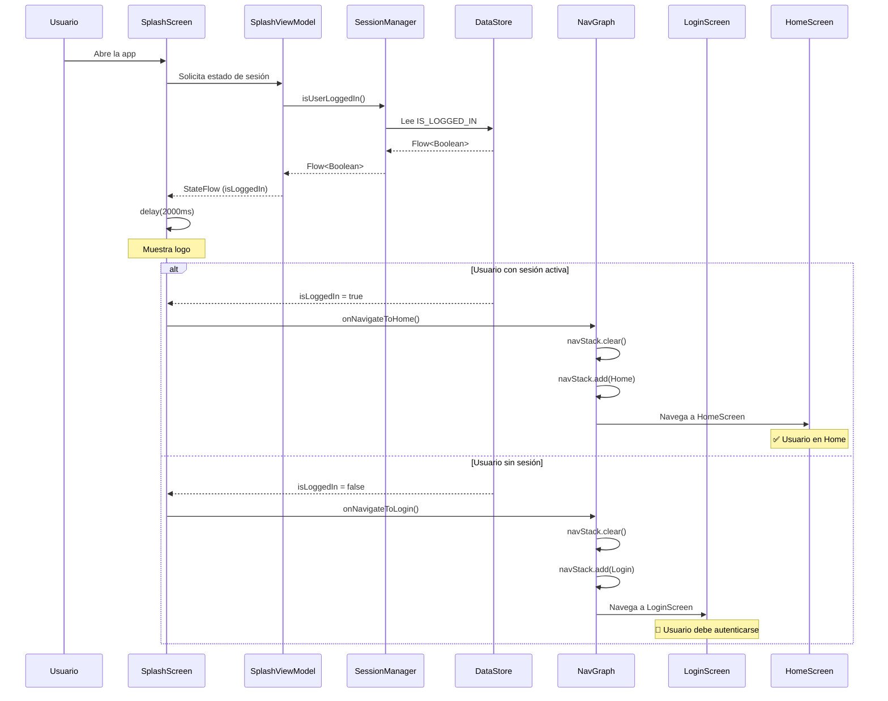

# Persistencia y Navegación Completa del Login

En esta 3ª parte del proyecto, vamos a resolver cómo y donde almacenar la información de la sesión del usuario, y cómo integrarla dentro de la App, teniendo en cuenta los casos de uso del Login e inicio de la App en función de si el usuario está logueado o no.

#### Resumen de lo que incluye V1

1. Guardar preferencias de Usuario con DataStore
2. Integrar la navegación en el flujo del Login

---

## 1. Guardar Preferencias de Usuario con DataStore

### 1.1. ¿Qué es la persistencia de sesión?

!!! tip "Concepto clave"
    La **persistencia de sesión** es la capacidad de la aplicación de "recordar" que un usuario ya se autenticó, incluso después de cerrar y volver a abrir la app. Esto mejora la experiencia del usuario al no obligarlo a iniciar sesión constantemente.

**Ejemplos de uso:**

- Usuario hace login → Cierra la app → Abre la app → **Va directo a Home** ✅
- Usuario hace logout → Cierra la app → Abre la app → **Ve pantalla de Login** ✅

---

### 1.2. ¿Qué es DataStore?

**DataStore** es la solución moderna de Android para almacenar datos de preferencias de forma asíncrona, segura y eficiente.

#### Comparación con SharedPreferences

=== "SharedPreferences (❌ Antiguo)"
    ```kotlin
    // ❌ Síncrono (bloquea el hilo principal)
    val prefs = getSharedPreferences("user_prefs", MODE_PRIVATE)
    prefs.edit().putBoolean("is_logged_in", true).apply()
    
    // ❌ No type-safe
    val isLoggedIn = prefs.getBoolean("is_logged_in", false)
    
    // ❌ Puede causar ANR (Application Not Responding)
    ```

=== "DataStore (✅ Moderno)"
    ```kotlin
    // ✅ Asíncrono (no bloquea)
    dataStore.edit { preferences ->
        preferences[IS_LOGGED_IN] = true
    }
    
    // ✅ Type-safe con keys tipadas
    val isLoggedIn: Flow<Boolean> = dataStore.data
        .map { it[IS_LOGGED_IN] ?: false }
    
    // ✅ Reactivo con Flow
    ```

#### Tipos de DataStore

| Tipo | Uso | Complejidad |
|------|-----|-------------|
| **Preferences DataStore** | Datos simples (clave-valor) | ⭐ Baja |
| **Proto DataStore** | Datos estructurados (objetos) | ⭐⭐⭐ Alta |

!!! success "Usaremos Preferences DataStore"
    Para guardar el estado de sesión (logueado/no logueado y username), **Preferences DataStore** es perfecto y más simple.

!!! info "Más información"
    - [Documentación oficial de DataStore](https://developer.android.com/topic/libraries/architecture/datastore)
    - [Migrar de SharedPreferences a DataStore](https://developer.android.com/codelabs/android-preferences-datastore)

---

### 1.3. Agregar dependencias

**Paso 1**: Abre `libs.versions.toml` y agrega la versión en la sección [versions].

```toml
[versions]
# ... otras versiones
datastore = "1.2.0"
```

y la libreria en la sección de [liraries]:

```toml
[libraries]
# ... otras librerías

# DataStore Preferences
androidx-datastore-preferences = { group = "androidx.datastore", name = "datastore-preferences", version.ref = "datastore" }
```

**Paso 2:** Abre el archivo `build.gradle.kts` del módulo `app`:

```kotlin
// app/build.gradle.kts
dependencies {
    // ... otras dependencias
    
    // DataStore Preferences
    implementation(libs.androidx.datastore.preferences)
}
```

**Paso 2:** Sincroniza el proyecto haciendo clic en **"Sync Now"**.

!!! warning "Versión de DataStore"
    Asegúrate de usar la versión `1.0.0` o superior. Si usas versiones anteriores (0.x), la API puede ser diferente.

---

### 1.4. Crear la interfaz SessionManager

Al igual que hicimos con `AuthRepository`, creamos primero una **interfaz** para definir el contrato:

<u>Ubicación</u>: `data/local/SessionManager.kt`

```kotlin
package com.pmdm.mygamestore.data.local

import kotlinx.coroutines.flow.Flow

/**
 * 📋 Interfaz que define las operaciones de gestión de sesión
 * 
 * Usar una interfaz permite:
 * - Cambiar la implementación (DataStore, Room, etc.) sin modificar el código que la usa
 * - Crear implementaciones de prueba para testing
 * - Aplicar el principio de Inversión de Dependencias
 */
interface SessionManager {
    
    /**
     * Guarda la sesión del usuario
     * 
     * @param username Nombre del usuario autenticado
     */
    suspend fun saveSession(username: String)
    
    /**
     * Verifica si hay un usuario con sesión activa
     * 
     * @return Flow que emite true si hay sesión activa, false en caso contrario
     */
    fun isUserLoggedIn(): Flow<Boolean>
    
    /**
     * Obtiene el nombre del usuario de la sesión activa
     * 
     * @return Flow que emite el username o null si no hay sesión
     */
    fun getUsername(): Flow<String?>
    
    /**
     * Limpia la sesión del usuario (logout)
     */
    suspend fun clearSession()
}
```

#### ¿Por qué usar Flow?

!!! question "Flow vs suspend fun"
    ```kotlin
    // ❌ suspend fun devuelve un valor único
    suspend fun isUserLoggedIn(): Boolean
    
    // ✅ Flow emite valores continuamente
    fun isUserLoggedIn(): Flow<Boolean>
    ```
    
    **Ventajas de Flow:**
    
    - **Reactivo**: Cuando cambia el valor en DataStore, Flow emite el nuevo valor automáticamente
    - **Observable**: Múltiples observadores pueden escuchar cambios
    - **Lifecycle-aware**: Se puede convertir a State en Compose con `collectAsState()`

---

### 1.5. Entendiendo Context en Android

#### ¿Qué es Context?

!!! tip "Concepto clave"
    **Context** es una clase fundamental de Android que proporciona acceso a recursos de la aplicación, servicios del sistema, y funcionalidades específicas del entorno de ejecución. Es como un "puente" entre tu código y el sistema operativo Android.

**Analogía:**

Imagina que Context es como tu **tarjeta de identificación** en una gran empresa:

- Te permite acceder a diferentes departamentos (recursos, bases de datos, preferencias)
- Te identifica dentro del sistema (nombre del paquete, información de la app)
- Te da permisos para usar servicios (archivos, red, sensores)

#### Tipos de Context

Android proporciona diferentes tipos de Context según el alcance y ciclo de vida:

=== "Application Context"
    ```kotlin
    val appContext = context.applicationContext
    ```
    
    **Características:**

    - ✅ Vive durante toda la vida de la aplicación
    - ✅ Es un singleton (una sola instancia)
    - ✅ No está atado a ninguna Activity específica
    - ✅ **Perfecto para servicios de larga duración** (DataStore, Repositories)
    
    **Cuándo usarlo:**

    - DataStore, SharedPreferences
    - Repositories
    - Singletons que viven toda la app
    
    **Cuándo NO usarlo:**

    - ❌ Para inflar vistas (layouts)
    - ❌ Para mostrar diálogos

=== "Activity Context"
    ```kotlin
    class LoginActivity : ComponentActivity() {
        // 'this' es el Activity Context
        val context: Context = this
    }
    ```
    
    **Características:**

    - ⏱️ Vive mientras la Activity existe
    - 🎨 Tiene información del tema (Theme)
    - 📱 Vinculado a la pantalla actual
    
    **Cuándo usarlo:**
    
    - Inflar layouts
    - Mostrar diálogos
    - Acceder a recursos con tema
    
    **Cuándo NO usarlo:**
    - ❌ En objetos que viven más que la Activity (memory leak)

=== "Compose Context"
    ```kotlin
    @Composable
    fun MyScreen() {
        val context = LocalContext.current
    }
    ```
    
    **Características:**

    - 🎯 Context del composable actual
    - 🔄 Cambia al recomponer si es necesario
    - ✅ Seguro para usar en Compose
    
    **Cuándo usarlo:**

    - Acceder a recursos (@string, @drawable)
    - Mostrar Toasts o navegar


!!! info "Context en nuevo proyecto"
    En el nuevo proyecto, SessionManager necesita Context para acceder a DataStore, y la mejore forma es pasarle el `applicationContext`.

    **Obtener Context en Compose**

    En Jetpack Compose, obtenemos el Context usando `LocalContext.current`:

    **¿Qué es `LocalContext`?**

    `LocalContext` proporciona acceso al Context actual en el árbol de composición.

    ```kotlin
    // Definido por Compose
    val LocalContext = staticCompositionLocalOf<Context> {
        error("No Context provided")
    }

    // Uso
    @Composable
    fun MyComposable() {
        val context = LocalContext.current  // ✅ Context seguro
    }
    ```

#### Comparación de enfoques

| Aspecto | Activity Context | Application Context |
|---------|------------------|---------------------|
| **Ciclo de vida** | Mientras vive la Activity | Toda la vida de la app |
| **Acceso a recursos** | ✅ Con tema aplicado | ⚠️ Sin tema |
| **Mostrar UI** | ✅ Diálogos, Toasts | ❌ No recomendado |
| **DataStore** | ⚠️ Riesgo de leak | ✅ Perfecto |
| **Repositories** | ❌ Memory leak | ✅ Correcto |
| **Obtención** | `this` en Activity | `context.applicationContext` |


### 1.6. Crear extensión para DataStore

Antes de implementar `SessionManager`, necesitamos crear una extensión de `Context` para acceder a DataStore:

!!! tip "¿Por qué crear una extensión para DataStore?"

    Crear una extensión de `Context` usando `by preferencesDataStore` es el **patrón oficial recomendado** por Google.<br>
    Esta delegación garantiza tres aspectos críticos: 

    - **singleton** (solo existe una instancia de DataStore por nombre, evitando que múltiples creaciones provoquen errores de escritura concurrente), 
    - **lazy initialization** (el DataStore solo se crea cuando realmente se usa, no al instanciar la clase), y **thread-safety** (maneja automáticamente el acceso concurrente desde múltiples hilos). 
    
    La extensión convierte algo complejo en una simple propiedad: `context.dataStorePreferences`, haciendo el código más limpio y seguro.

    ```kotlin
    // ✅ Extensión: Singleton automático, lazy, thread-safe
    val Context.dataStorePreferences by preferencesDataStore(name = "user_session")

    // ❌ Sin extensión: Verboso, propenso a errores, sin garantías de singleton
    private val dataStore = PreferenceDataStoreFactory.create(
        produceFile = { context.preferencesDataStoreFile("user_session") }
    )
    // ⚠️ Riesgo: Si creas múltiples instancias → Corrupción de datos
    ```

<u>Ubicación</u>: `data/local/DataStoreExt.kt`

```kotlin
package com.pmdm.mygamestore.data.local

import android.content.Context
import androidx.datastore.core.DataStore
import androidx.datastore.preferences.core.Preferences
import androidx.datastore.preferences.preferencesDataStore

/**
 * 🔧 Extensión de Context para acceder a DataStore de preferencias
 * 
 * La función `by preferencesDataStore` crea una instancia singleton de DataStore
 * asociada al contexto de la aplicación.
 * 
 * @param name Nombre del archivo de preferencias ("user_session.preferences_pb")
 */
val Context.dataStorePreferences: DataStore<Preferences> by preferencesDataStore(
    name = "user_session"
)
```

#### ¿Qué hace esta extensión?

=== "Concepto"
    ```kotlin
    // Convierte esto:
    context.dataStorePreferences
    
    // En esto internamente:
    preferencesDataStore(name = "user_session").getValue(context, property)
    ```

=== "Extension Function"
    Una **extension function** permite agregar funcionalidades a clases existentes sin modificarlas:
    
    ```kotlin
    // Extiende Context con una propiedad
    val Context.dataStorePreferences: DataStore<Preferences>
    
    // Ahora cualquier Context puede usarla
    val dataStore = context.dataStorePreferences
    ```

=== "Delegación (by)"
    La palabra clave `by` delega la creación del DataStore:
    
    ```kotlin
    by preferencesDataStore(name = "user_session")
    
    // Esto garantiza:
    // 1. Singleton (una sola instancia)
    // 2. Creación lazy (solo cuando se usa)
    // 3. Thread-safe
    ```

!!! info "Archivo generado"
    DataStore creará un archivo llamado `user_session.preferences_pb` en:
    ```
    /data/data/com.pmdm.mygamestore/files/datastore/
    ```

---

### 1.7. Implementar SessionManagerImpl

Ahora creamos la implementación concreta:

<u>Ubicación</u>: `data/local/SessionManagerImpl.kt`

```kotlin
package com.pmdm.mygamestore.data.local

import android.content.Context
import androidx.datastore.preferences.core.booleanPreferencesKey
import androidx.datastore.preferences.core.edit
import androidx.datastore.preferences.core.stringPreferencesKey
import kotlinx.coroutines.flow.Flow
import kotlinx.coroutines.flow.map

/**
 * 🔧 Implementación de SessionManager usando DataStore
 * 
 * @param context Contexto de la aplicación para acceder a DataStore
 */
class SessionManagerImpl(
    private val context: Context
) : SessionManager {

    // Acceso al DataStore a través de la extensión
    private val dataStore = context.dataStorePreferences

    companion object {
        /**
         * Keys tipadas para acceder a las preferencias
         * Usar keys garantiza type-safety y evita errores de tipeo
         */
        private val IS_LOGGED_IN = booleanPreferencesKey("is_logged_in")
        private val USERNAME = stringPreferencesKey("username")
    }

    /**
     * Guarda la sesión del usuario en DataStore
     */
    override suspend fun saveSession(username: String) {
        dataStore.edit { preferences ->
            preferences[IS_LOGGED_IN] = true
            preferences[USERNAME] = username
        }
    }

    /**
     * Verifica si el usuario tiene sesión activa
     * 
     * @return Flow que emite true si está logueado, false en caso contrario
     */
    override fun isUserLoggedIn(): Flow<Boolean> {
        return dataStore.data.map { preferences ->
            preferences[IS_LOGGED_IN] ?: false
        }
    }

    /**
     * Obtiene el nombre del usuario de la sesión activa
     * 
     * @return Flow que emite el username o null si no hay sesión
     */
    override fun getUsername(): Flow<String?> {
        return dataStore.data.map { preferences ->
            preferences[USERNAME]
        }
    }

    /**
     * Limpia toda la sesión del usuario
     */
    override suspend fun clearSession() {
        dataStore.edit { preferences ->
            preferences.clear()
        }
    }
}
```

#### Conceptos clave

**1. Preferences Keys:**

```kotlin
private val IS_LOGGED_IN = booleanPreferencesKey("is_logged_in")
private val USERNAME = stringPreferencesKey("username")
```

!!! tip "Type-safe keys"
    Las keys tipadas previenen errores:
    
    ```kotlin
    // ❌ SharedPreferences: Sin type-safety
    prefs.putString("is_logged_in", "true")  // Error: String en vez de Boolean
    
    // ✅ DataStore: Type-safe
    preferences[IS_LOGGED_IN] = "true"  // ❌ Error de compilación
    preferences[IS_LOGGED_IN] = true    // ✅ Correcto
    ```

**2. Operaciones de escritura:**

```kotlin
dataStore.edit { preferences ->
    preferences[IS_LOGGED_IN] = true
    preferences[USERNAME] = username
}
```

- `edit` es una función `suspend` (asíncrona)
- Los cambios se aplican de forma atómica (todo o nada)
- Thread-safe automáticamente

**3. Operaciones de lectura:**

```kotlin
dataStore.data.map { preferences ->
    preferences[IS_LOGGED_IN] ?: false
}
```

- `dataStore.data` es un `Flow<Preferences>`
- `map` transforma el Flow para obtener el valor específico
- `?: false` proporciona un valor por defecto si no existe

---

### 1.8. Modificar LoginViewModel para guardar sesión

Ahora integramos `SessionManager` en el ViewModel:

<u>Ubicación</u>: `presentation/viewmodel/LoginViewModel.kt`

```kotlin
package com.pmdm.mygamestore.presentation.viewmodel

import android.content.Context
import androidx.lifecycle.ViewModel
import androidx.lifecycle.viewModelScope
import com.pmdm.mygamestore.data.local.SessionManager
import com.pmdm.mygamestore.data.local.SessionManagerImpl
import com.pmdm.mygamestore.data.repository.AuthRepository
import com.pmdm.mygamestore.data.repository.AuthRepositoryImpl
import com.pmdm.mygamestore.data.repository.LoginResult
import kotlinx.coroutines.flow.MutableStateFlow
import kotlinx.coroutines.flow.StateFlow
import kotlinx.coroutines.flow.asStateFlow
import kotlinx.coroutines.flow.update
import kotlinx.coroutines.launch

data class LoginUiState(
    val username: String = "",
    val password: String = "",
    val isLoading: Boolean = false,
    val errorMessage: String? = null,
    val isLoginSuccessful: Boolean = false
)

/**
 * ViewModel para gestionar el estado y la lógica de la pantalla de Login
 * 
 * @param context Contexto para crear SessionManager
 * @param authRepository Repositorio para operaciones de autenticación
 * @param sessionManager Manager para persistir la sesión del usuario
 */
class LoginViewModel(
    context: Context,
    private val authRepository: AuthRepository = AuthRepositoryImpl(),
    private val sessionManager: SessionManager = SessionManagerImpl(context)
) : ViewModel() {

    private val _uiState = MutableStateFlow(LoginUiState())
    val uiState: StateFlow<LoginUiState> = _uiState.asStateFlow()

    fun onUsernameChange(newUsername: String) {
        _uiState.update { currentState ->
            currentState.copy(
                username = newUsername,
                errorMessage = null
            )
        }
    }

    fun onPasswordChange(newPassword: String) {
        _uiState.update { currentState ->
            currentState.copy(
                password = newPassword,
                errorMessage = null
            )
        }
    }

    /**
     * Ejecuta el proceso de login y guarda la sesión
     */
    fun onLoginClick() {
        // Validaciones de UI
        if (_uiState.value.username.isBlank()) {
            _uiState.update { it.copy(errorMessage = "Username cannot be empty") }
            return
        }

        if (_uiState.value.password.isBlank()) {
            _uiState.update { it.copy(errorMessage = "Password cannot be empty") }
            return
        }

        // Proceso de login
        viewModelScope.launch {
            _uiState.update { it.copy(isLoading = true, errorMessage = null) }

            // Llamar al Repository
            val result = authRepository.login(
                username = _uiState.value.username,
                password = _uiState.value.password
            )

            // Manejar resultado
            when (result) {
                is LoginResult.Success -> {
                    // 💾 Guardar sesión en DataStore
                    sessionManager.saveSession(result.username)
                    
                    _uiState.update {
                        it.copy(
                            isLoading = false,
                            isLoginSuccessful = true,
                            errorMessage = null
                        )
                    }
                }

                is LoginResult.Error -> {
                    _uiState.update {
                        it.copy(
                            isLoading = false,
                            isLoginSuccessful = false,
                            errorMessage = result.message
                        )
                    }
                }
            }
        }
    }

    fun clearError() {
        _uiState.update { it.copy(errorMessage = null) }
    }

    fun resetLoginSuccess() {
        _uiState.update { it.copy(isLoginSuccessful = false) }
    }
}
```

#### Cambios realizados

**1. Agregar SessionManager al constructor:**

```kotlin
class LoginViewModel(
    context: Context,  // 👈 Nuevo: necesitamos Context
    private val authRepository: AuthRepository = AuthRepositoryImpl(),
    private val sessionManager: SessionManager = SessionManagerImpl(context)  // 👈 Nuevo
)
```

**2. Guardar sesión tras login exitoso:**

```kotlin
when (result) {
    is LoginResult.Success -> {
        sessionManager.saveSession(result.username)  // 👈 Nuevo: guardar sesión
        _uiState.update { /* ... */ }
    }
}
```

---

### 1.9. Actualizar LoginScreen para pasar Context

<u>Ubicación</u>: `presentation/ui/screens/LoginScreen.kt`

Necesitamos pasar el `Context` al ViewModel:

```kotlin
package com.pmdm.mygamestore.presentation.ui.screens

import androidx.compose.runtime.Composable
import androidx.compose.ui.platform.LocalContext
import androidx.lifecycle.viewmodel.compose.viewModel
import com.pmdm.mygamestore.presentation.viewmodel.LoginViewModel

@Composable
fun LoginScreen(
    viewModel: LoginViewModel = viewModel(
        factory = LoginViewModelFactory(LocalContext.current)  // 👈 Pasar Context
    ),
    onLoginSuccess: () -> Unit = {}
) {
    // ... resto del código sin cambios
}
```

**Crear ViewModelFactory:**

<u>Ubicación</u>: `presentation/viewmodel/LoginViewModelFactory.kt`

```kotlin
package com.pmdm.mygamestore.presentation.viewmodel

import android.content.Context
import androidx.lifecycle.ViewModel
import androidx.lifecycle.ViewModelProvider

/**
 * Factory para crear LoginViewModel con Context
 */
class LoginViewModelFactory(
    private val context: Context
) : ViewModelProvider.Factory {
    
    @Suppress("UNCHECKED_CAST")
    override fun <T : ViewModel> create(modelClass: Class<T>): T {
        if (modelClass.isAssignableFrom(LoginViewModel::class.java)) {
            return LoginViewModel(context) as T
        }
        throw IllegalArgumentException("Unknown ViewModel class")
    }
}
```

!!! warning "Context.applicationContext"
    Es importante usar `context.applicationContext` dentro del ViewModel para evitar memory leaks:
    
    ```kotlin
    class SessionManagerImpl(context: Context) : SessionManager {
        private val appContext = context.applicationContext  // ✅ Usa application context
    }
    ```

---

#### 1.9.1 Solución de problemas comunes

<u>*Problema 1: "Cannot access DataStore"*</u>

```
java.lang.IllegalStateException: Cannot access DataStore before it is initialized
```

*Solución:* Asegúrate de que la extensión `dataStorePreferences` esté importada correctamente:

```kotlin
import com.pmdm.mygamestore.data.local.dataStorePreferences
```

<u>*Problema 2: "Type mismatch" con Flow*</u>

```
Type mismatch: inferred type is Flow<Boolean> but Boolean was expected
```

*Solución:* Usa `collectAsState()` en Compose o `collect` en coroutines:

```kotlin
// ✅ En Composable
val isLoggedIn by viewModel.isUserLoggedIn().collectAsState(initial = false)

// ✅ En ViewModel
viewModelScope.launch {
    sessionManager.isUserLoggedIn().collect { isLoggedIn ->
        // usar valor
    }
}
```


<u>Problema 3: Memory Leak con Context</u>

```
LeakCanary: LoginViewModel has leaked
```

*Solución:* Usa `applicationContext`:

```kotlin
class SessionManagerImpl(context: Context) : SessionManager {
    private val dataStore = context.applicationContext.dataStorePreferences
}
```

---

## **2. Integrar Navegación en el Flujo del Login**

Para integra la navegación en el flujo del login, vamos a utilizar la pantalla `SplashScreen` como punto de entrada de la aplicación. En esta pantalla, vamos a verificar si el usuario tiene sesión activa y, en función de eso, vamos a redirigirlo a la pantalla de login o a la pantalla principal.

!!! tip "Experiencia de usuario profesional"
    Una **pantalla Splash** es fundamental en aplicaciones profesionales por varias razones.<br>
    
    1. **oculta el tiempo de inicialización**: mientras la app verifica la sesión del usuario, carga configuraciones iniciales o conecta con servicios, el Splash muestra una interfaz atractiva en lugar de una pantalla en blanco. 
    2. **refuerza la identidad de marca**: es la primera impresión que el usuario tiene de tu app, mostrando el logo y estableciendo la identidad visual. Tercero, **mejora la percepción de velocidad**: aunque la app tarde 1-2 segundos en inicializar, una animación del logo hace que la espera se sienta intencional y profesional, no como un error o bloqueo. 
    3. es el **punto de decisión de navegación**: permite realizar operaciones asíncronas (como verificar autenticación) y redirigir al usuario a la pantalla correcta sin mostrar transiciones bruscas o pantallas intermedias. Sin un Splash, el usuario vería una pantalla en blanco o cargas abruptas, dando una impresión de app inacabada o de baja calidad.

### 2.1. Crear SplashViewModel

El `SplashScreen` ahora necesita verificar si hay sesión activa. Creamos un ViewModel para manejar esta lógica:

<u>Ubicación</u>: `presentation/viewmodel/SplashViewModel.kt`

```kotlin
package com.pmdm.mygamestore.presentation.viewmodel

import android.content.Context
import androidx.lifecycle.ViewModel
import androidx.lifecycle.viewModelScope
import com.pmdm.mygamestore.data.repository.SessionManager
import com.pmdm.mygamestore.data.repository.SessionManagerImpl
import kotlinx.coroutines.flow.SharingStarted
import kotlinx.coroutines.flow.StateFlow
import kotlinx.coroutines.flow.stateIn

/**
 * ViewModel para la pantalla Splash
 * 
 * Verifica si el usuario tiene sesión activa para decidir la navegación inicial
 * 
 * @param context Contexto para crear SessionManager
 * @param sessionManager Manager para verificar la sesión del usuario
 */
class SplashViewModel(
    context: Context,
    private val sessionManager: SessionManager = SessionManagerImpl(context)
) : ViewModel() {

    /**
     * Estado que indica si el usuario está logueado
     * 
     * Flow convertido a StateFlow para:
     * - Tener un valor inicial (false)
     * - Compartir el mismo Flow entre múltiples observadores
     * - Mantener el último valor emitido
     */
    val isUserLoggedIn: StateFlow<Boolean> = sessionManager.isUserLoggedIn()
        .stateIn(
            scope = viewModelScope,
            started = SharingStarted.WhileSubscribed(5000),
            initialValue = false
        )
}
```

#### ¿Qué es `.stateIn()`?

!!! tip "Flow vs StateFlow"
    ```kotlin
    // Flow: Emite valores solo cuando hay observadores
    fun isUserLoggedIn(): Flow<Boolean>
    
    // StateFlow: Mantiene siempre el último valor
    val isUserLoggedIn: StateFlow<Boolean>
    ```

**Parámetros de `stateIn()`:**

=== "scope"
    ```kotlin
    scope = viewModelScope
    ```
    Define el alcance de vida del StateFlow. Se cancela cuando el ViewModel es destruido.

=== "started"
    ```kotlin
    started = SharingStarted.WhileSubscribed(5000)
    ```
    **Estrategia de inicio:**

    - `WhileSubscribed(5000)`: Mantiene activo el Flow mientras haya suscriptores
    - `5000ms`: Espera 5 segundos después de que el último suscriptor se desconecte antes de cancelar
    - **Optimización**: Evita recrear el Flow si el usuario rota la pantalla rápidamente

=== "initialValue"
    ```kotlin
    initialValue = false
    ```
    Valor inicial mientras se obtiene el primer valor real de DataStore.

!!! info "Más sobre SharingStarted"
    - `Eagerly`: Inicia inmediatamente y nunca se detiene
    - `Lazily`: Inicia con el primer suscriptor y nunca se detiene
    - `WhileSubscribed(timeout)`: Inicia/detiene según suscriptores (⭐ recomendado)

---

### 2.2. Modificar SplashScreen

Actualizamos el `SplashScreen` para verificar la sesión y navegar en consecuencia:

<u>Ubicación</u>: `presentation/ui/screens/SplashScreen.kt`

```kotlin
package com.pmdm.mygamestore.presentation.ui.screens

import androidx.compose.foundation.Image
import androidx.compose.foundation.layout.Box
import androidx.compose.foundation.layout.fillMaxSize
import androidx.compose.foundation.layout.size
import androidx.compose.runtime.Composable
import androidx.compose.runtime.LaunchedEffect
import androidx.compose.runtime.collectAsState
import androidx.compose.runtime.getValue
import androidx.compose.ui.Alignment
import androidx.compose.ui.Modifier
import androidx.compose.ui.platform.LocalContext
import androidx.compose.ui.res.painterResource
import androidx.compose.ui.unit.dp
import androidx.lifecycle.viewmodel.compose.viewModel
import com.pmdm.mygamestore.R
import com.pmdm.mygamestore.presentation.viewmodel.SplashViewModel
import com.pmdm.mygamestore.presentation.viewmodel.SplashViewModelFactory
import kotlinx.coroutines.delay

/**
 * Pantalla Splash que verifica la sesión del usuario
 * 
 * @param viewModel ViewModel que gestiona la lógica de verificación de sesión
 * @param onNavigateToLogin Callback para navegar a Login
 * @param onNavigateToHome Callback para navegar a Home
 */
@Composable
fun SplashScreen(
    viewModel: SplashViewModel = viewModel(
        factory = SplashViewModelFactory(LocalContext.current)
    ),
    onNavigateToLogin: () -> Unit = {},
    onNavigateToHome: () -> Unit = {}
) {
    // Observar el estado de sesión
    val isLoggedIn by viewModel.isUserLoggedIn.collectAsState()

    // Verificar sesión después del delay
    LaunchedEffect(Unit) {
        delay(2000)  // Mostrar logo durante 2 segundos
        
        // Decidir navegación según estado de sesión
        if (isLoggedIn) {
            onNavigateToHome()  // Usuario ya está logueado
        } else {
            onNavigateToLogin()  // Usuario necesita autenticarse
        }
    }

    // UI del Splash Screen
    Box(
        modifier = Modifier.fillMaxSize(),
        contentAlignment = Alignment.Center
    ) {
        Image(
            painter = painterResource(id = R.drawable.ic_launcher_foreground),
            contentDescription = "Logo de la aplicación",
            modifier = Modifier.size(200.dp)
        )
    }
}
```

**Crear SplashViewModelFactory:**

<u>Ubicación</u>: `presentation/viewmodel/SplashViewModelFactory.kt`

```kotlin
package com.pmdm.mygamestore.presentation.viewmodel

import android.content.Context
import androidx.lifecycle.ViewModel
import androidx.lifecycle.ViewModelProvider

/**
 * Factory para crear SplashViewModel con Context
 */
class SplashViewModelFactory(
    private val context: Context
) : ViewModelProvider.Factory {
    
    @Suppress("UNCHECKED_CAST")
    override fun <T : ViewModel> create(modelClass: Class<T>): T {
        if (modelClass.isAssignableFrom(SplashViewModel::class.java)) {
            return SplashViewModel(context) as T
        }
        throw IllegalArgumentException("Unknown ViewModel class")
    }
}
```

---

### 2.3. Actualizar NavGraph

Actualizamos la configuración de navegación para conectar todo:

<u>Ubicación</u>: `presentation/ui/navigation/NavGraph.kt`

```kotlin
@Composable
fun AppNavigation() {
    val backStack = rememberNavBackStack(AppRoutes.Splash)

    CompositionLocalProvider(LocalNavStack provides backStack) {
        NavDisplay(
            backStack = backStack,
            onBack = { backStack.removeLastOrNull() },
            entryProvider = entryProvider {
                
                // 🚀 Pantalla Splash (inicial)
                entry(AppRoutes.Splash) {
                    val navStack = LocalNavStack.current
                    
                    SplashScreen(
                        onNavigateToLogin = {
                            navStack.clear()
                            navStack.add(AppRoutes.Login)
                        },
                        onNavigateToHome = {
                            navStack.clear()
                            navStack.add(AppRoutes.Home)
                        }
                    )
                }
                
                // 🔐 Pantalla Login
                entry(AppRoutes.Login) {
                    val navStack = LocalNavStack.current
                    
                    LoginScreen(
                        onLoginSuccess = {
                            navStack.clear()
                            navStack.add(AppRoutes.Home)
                        }
                    )
                }
                
                // 🏠 Pantalla Home
                entry(AppRoutes.Home) {
                    HomeScreen()
                }
                
                // ... otras pantallas
            }
        )
    }
}
```

---

### 2.4. Flujo completo con diagrama

**Caso de uso:** Usuario abre la aplicación



---

### 2.5. Comparación antes/después

=== "❌ Antes (sin persistencia)"
    ```kotlin
    // Usuario siempre ve Login al abrir la app
    @Composable
    fun SplashScreen(onNavigate: () -> Unit) {
        LaunchedEffect(Unit) {
            delay(2000)
            onNavigate()  // Siempre va a Login
        }
    }
    ```
    
    **Flujo:**
    ```
    1. Abre app → SplashScreen
    2. Espera 2s → LoginScreen
    3. Usuario ingresa credenciales → HomeScreen
    4. Cierra app
    5. Abre app → SplashScreen
    6. Espera 2s → LoginScreen ❌ (debe autenticarse de nuevo)
    ```

=== "✅ Después (con persistencia)"
    ```kotlin
    @Composable
    fun SplashScreen(
        viewModel: SplashViewModel,
        onNavigateToLogin: () -> Unit,
        onNavigateToHome: () -> Unit
    ) {
        val isLoggedIn by viewModel.isUserLoggedIn.collectAsState()
        
        LaunchedEffect(Unit) {
            delay(2000)
            if (isLoggedIn) {
                onNavigateToHome()  // Va directo a Home
            } else {
                onNavigateToLogin()
            }
        }
    }
    ```
---

### 2.6. Comprobación manual

**Escenario 1: Primera vez (sin sesión)**

1. ✅ Desinstalar la app (para limpiar datos)
2. ✅ Instalar y abrir la app
3. ✅ Ver SplashScreen durante 2 segundos
4. ✅ Navegar automáticamente a LoginScreen
5. ✅ Ingresar credenciales válidas (admin / 1234)
6. ✅ Navegar a HomeScreen

**Escenario 2: Usuario con sesión activa**

1. ✅ (Continuar del escenario 1)
2. ✅ Cerrar completamente la app (no solo minimizar)
3. ✅ Volver a abrir la app
4. ✅ Ver SplashScreen durante 2 segundos
5. ✅ **Navegar directo a HomeScreen** (sin pasar por Login)
6. ✅ Presionar "Atrás" → **Sale de la app** (no vuelve a Login)

**Escenario 3: Verificar persistencia**

1. ✅ Con la app cerrada, abrir "Configuración" del dispositivo
2. ✅ Ir a "Apps" → "MyGameStore" → "Almacenamiento"
3. ✅ **NO** borrar datos
4. ✅ Volver a abrir la app
5. ✅ Verificar que va directo a Home (sesión persiste)

**Escenario 4: Borrar sesión manualmente**

1. ✅ Con la app cerrada, ir a "Configuración" → "Apps" → "MyGameStore"
2. ✅ Tocar "Borrar datos" o "Limpiar almacenamiento"
3. ✅ Abrir la app
4. ✅ Verificar que va a LoginScreen (sesión eliminada)

---

### 2.7. Solución de problemas posibles

<u>Problema 1: La app siempre va a Login (no persiste)</u>

**Posibles causas:**

1. **No se está guardando la sesión:**
   ```kotlin
   // ❌ Falta llamar a saveSession
   when (result) {
       is LoginResult.Success -> {
           // sessionManager.saveSession(result.username)  // Olvidado
           _uiState.update { it.copy(isLoginSuccessful = true) }
       }
   }
   ```

2. **El Flow no se está observando correctamente:**
   ```kotlin
   // ❌ No se usa collectAsState
   val isLoggedIn = viewModel.isUserLoggedIn  // Flow, no Boolean
   
   // ✅ Correcto
   val isLoggedIn by viewModel.isUserLoggedIn.collectAsState()
   ```

<u>Problema 2: La app siempre va a Home (no puede hacer logout)</u>

**Causa:** No hay forma de limpiar la sesión.

_Solución_: (para debugging):**

```kotlin
// En HomeScreen, agregar un botón temporal
Button(onClick = {
    viewModelScope.launch {
        sessionManager.clearSession()
        // Navegar a Login
    }
}) {
    Text("DEBUG: Clear Session")
}
```

<u>Problema 3: Crash al abrir la app</u>

```
java.lang.IllegalStateException: ViewModelProvider.Factory is required
```

_Solución_: Asegúrate de pasar el Factory:

```kotlin
// ❌ Sin factory (crash si ViewModel tiene parámetros)
viewModel: SplashViewModel = viewModel()

// ✅ Con factory
viewModel: SplashViewModel = viewModel(
    factory = SplashViewModelFactory(LocalContext.current)
)
```    
