# **4. Pantalla de Registro y Logout de usuario**

En esta 4ª parte del proyecto, vamos a crear la pantalla de registro de un nuevo usuario, integrarla en el flujo de navegación y crear la funcionalidad de logout.

#### Resumen

1. Crear pantalla de registro con funcionalidad completa
2. Integrar registro en el flujo de navegación
3. Crear funcionalidad de logout

!!! info "Objetivo de esta sesión"
    Implementar el sistema completo de registro de usuarios, integrarlo en el flujo de navegación y agregar funcionalidad de cierre de sesión para completar el ciclo de autenticación de la aplicación.

---

## **1. Crear Pantalla de Registro**

### 1.1. Introducción

La pantalla de **Registro** es similar a la de Login, pero incluye campos adicionales para crear una nueva cuenta de usuario. Reutilizaremos los mismos patrones y componentes que ya conocemos: ViewModel, Repository, UiState y componentes reutilizables.

**Diferencias principales con Login:**

- ✅ Campos adicionales: Email y Confirmación de contraseña
- ✅ Validaciones más complejas
- ✅ Verificación de usuario único
- ✅ Guardar usuario en la "base de datos" local

---

### 1.2. Crear RegisterResult

Similar a `LoginResult`, creamos una sealed class para representar los resultados del registro:

<u>ubicación</u>: `data/repository/Result.kt`. Agrega esta clase dentro de este fichero.

```kotlin
package com.pmdm.mygamestore.data.repository

/**
 * 🎯 Sealed class que representa los posibles resultados de un registro
 */
sealed class RegisterResult {
    /**
     * Registro exitoso
     * @param username Nombre del usuario registrado
     */
    data class Success(val username: String) : RegisterResult()
    
    /**
     * Registro fallido
     * @param message Mensaje describiendo el error
     */
    data class Error(val message: String) : RegisterResult()
}
```

---

### 1.3. Extender AuthRepository

Agregamos el método `register` a la interfaz y su implementación:

<u>ubicación</u>: `data/repository/AuthRepository.kt`

```kotlin
package com.pmdm.mygamestore.data.repository

interface AuthRepository {
    suspend fun login(username: String, password: String): LoginResult
    
    /**
     * Registra un nuevo usuario
     * 
     * @param username Nombre de usuario
     * @param email Email del usuario
     * @param password Contraseña
     * @return RegisterResult indicando éxito o error
     */
    suspend fun register(
        username: String, 
        email: String, 
        password: String
    ): RegisterResult
}
```

<u>ubicación</u>: `data/repository/AuthRepositoryImpl.kt`

```kotlin
package com.pmdm.mygamestore.data.repository

import kotlinx.coroutines.delay

class AuthRepositoryImpl : AuthRepository {
    
    // Usuarios válidos para login
    private val validUsers = mutableMapOf(
        "admin" to "1234",
        "user" to "password"
    )
    
    // Base de datos simulada de usuarios registrados
    private val registeredUsers = mutableMapOf<String, UserData>(
        "admin" to UserData("admin", "admin@example.com", "1234"),
        "user" to UserData("user", "user@example.com", "password")
    )
    
    override suspend fun login(username: String, password: String): LoginResult {
        delay(1500)
        
        return if (validUsers[username] == password) {
            LoginResult.Success(username = username)
        } else {
            LoginResult.Error(message = "Invalid username or password")
        }
    }
    
    override suspend fun register(
        username: String,
        email: String,
        password: String
    ): RegisterResult {
        delay(1500)
        
        // Verificar si el usuario ya existe
        if (registeredUsers.containsKey(username)) {
            return RegisterResult.Error("Username already exists")
        }
        
        // Verificar si el email ya está registrado
        if (registeredUsers.values.any { it.email == email }) {
            return RegisterResult.Error("Email already registered")
        }
        
        // Registrar nuevo usuario
        registeredUsers[username] = UserData(username, email, password)
        validUsers[username] = password
        
        return RegisterResult.Success(username = username)
    }
}

/**
 * Clase de datos para almacenar información del usuario
 */
data class UserData(
    val username: String,
    val email: String,
    val password: String
)
```

---

### 1.4. Crear RegisterUiState

<u>ubicación</u>: `presentation/viewmodel/RegisterVM.kt`

```kotlin
package com.pmdm.mygamestore.presentation.viewmodel

data class RegisterUiState(
    val username: String = "",
    val email: String = "",
    val password: String = "",
    val confirmPassword: String = "",
    val isLoading: Boolean = false,
    val errorMessage: String? = null,
    val isRegisterSuccessful: Boolean = false
)
```

---

### 1.5. Crear RegisterViewModel

<u>ubicación</u>: `presentation/viewmodel/RegisterVM.kt`

```kotlin
package com.pmdm.mygamestore.presentation.viewmodel

import android.content.Context
import androidx.lifecycle.ViewModel
import androidx.lifecycle.viewModelScope
import com.pmdm.mygamestore.data.repository.SessionManager
import com.pmdm.mygamestore.data.repository.SessionManagerImpl
import com.pmdm.mygamestore.data.repository.AuthRepository
import com.pmdm.mygamestore.data.repository.AuthRepositoryImpl
import com.pmdm.mygamestore.data.repository.RegisterResult
import kotlinx.coroutines.flow.MutableStateFlow
import kotlinx.coroutines.flow.StateFlow
import kotlinx.coroutines.flow.asStateFlow
import kotlinx.coroutines.flow.update
import kotlinx.coroutines.launch

/**
 * ViewModel para gestionar el estado y la lógica de la pantalla de Registro
 */
class RegisterViewModel(
    context: Context,
    private val authRepository: AuthRepository = AuthRepositoryImpl(),
    private val sessionManager: SessionManager = SessionManagerImpl(context)
) : ViewModel() {

    private val _uiState = MutableStateFlow(RegisterUiState())
    val uiState: StateFlow<RegisterUiState> = _uiState.asStateFlow()

    fun onUsernameChange(newUsername: String) {
        _uiState.update { it.copy(username = newUsername, errorMessage = null) }
    }

    fun onEmailChange(newEmail: String) {
        _uiState.update { it.copy(email = newEmail, errorMessage = null) }
    }

    fun onPasswordChange(newPassword: String) {
        _uiState.update { it.copy(password = newPassword, errorMessage = null) }
    }

    fun onConfirmPasswordChange(newConfirmPassword: String) {
        _uiState.update { it.copy(confirmPassword = newConfirmPassword, errorMessage = null) }
    }

    /**
     * Ejecuta el proceso de registro con validaciones
     */
    fun onRegisterClick() {
        val state = _uiState.value
        
        // Validación: Username
        if (state.username.isBlank()) {
            _uiState.update { it.copy(errorMessage = "Username cannot be empty") }
            return
        }
        if (state.username.length < 3) {
            _uiState.update { it.copy(errorMessage = "Username must be at least 3 characters") }
            return
        }
        
        // Validación: Email
        if (state.email.isBlank()) {
            _uiState.update { it.copy(errorMessage = "Email cannot be empty") }
            return
        }
        if (!state.email.contains("@") || !state.email.contains(".")) {
            _uiState.update { it.copy(errorMessage = "Invalid email format") }
            return
        }
        
        // Validación: Password
        if (state.password.isBlank()) {
            _uiState.update { it.copy(errorMessage = "Password cannot be empty") }
            return
        }
        if (state.password.length < 6) {
            _uiState.update { it.copy(errorMessage = "Password must be at least 6 characters") }
            return
        }
        
        // Validación: Confirm Password
        if (state.password != state.confirmPassword) {
            _uiState.update { it.copy(errorMessage = "Passwords do not match") }
            return
        }

        // Proceso de registro
        viewModelScope.launch {
            _uiState.update { it.copy(isLoading = true, errorMessage = null) }

            val result = authRepository.register(
                username = state.username,
                email = state.email,
                password = state.password
            )

            when (result) {
                is RegisterResult.Success -> {
                    // Guardar sesión automáticamente tras registro
                    sessionManager.saveSession(result.username)
                    
                    _uiState.update {
                        it.copy(
                            isLoading = false,
                            isRegisterSuccessful = true
                        )
                    }
                }

                is RegisterResult.Error -> {
                    _uiState.update {
                        it.copy(
                            isLoading = false,
                            errorMessage = result.message
                        )
                    }
                }
            }
        }
    }

    fun clearError() {
        _uiState.update { it.copy(errorMessage = null) }
    }

    fun resetRegisterSuccess() {
        _uiState.update { it.copy(isRegisterSuccessful = false) }
    }
}
```

---

### 1.6. Crear RegisterViewModelFactory

<u>ubicación</u>: `presentation/viewmodel/RegisterViewModelFactory.kt`

```kotlin
package com.pmdm.mygamestore.presentation.viewmodel

import android.content.Context
import androidx.lifecycle.ViewModel
import androidx.lifecycle.ViewModelProvider

class RegisterViewModelFactory(
    private val context: Context
) : ViewModelProvider.Factory {
    
    @Suppress("UNCHECKED_CAST")
    override fun <T : ViewModel> create(modelClass: Class<T>): T {
        if (modelClass.isAssignableFrom(RegisterViewModel::class.java)) {
            return RegisterViewModel(context) as T
        }
        throw IllegalArgumentException("Unknown ViewModel class")
    }
}
```

---

### 1.7. Crear RegisterScreen

<u>ubicación</u>: `presentation/ui/screens/RegisterScreen.kt`

```kotlin
package com.pmdm.mygamestore.presentation.ui.screens

import androidx.compose.foundation.layout.Arrangement
import androidx.compose.foundation.layout.Box
import androidx.compose.foundation.layout.Column
import androidx.compose.foundation.layout.Spacer
import androidx.compose.foundation.layout.fillMaxSize
import androidx.compose.foundation.layout.fillMaxWidth
import androidx.compose.foundation.layout.height
import androidx.compose.foundation.layout.navigationBarsPadding
import androidx.compose.foundation.layout.offset
import androidx.compose.foundation.layout.padding
import androidx.compose.foundation.rememberScrollState
import androidx.compose.foundation.verticalScroll
import androidx.compose.material3.CircularProgressIndicator
import androidx.compose.material3.MaterialTheme
import androidx.compose.material3.Scaffold
import androidx.compose.material3.SnackbarHost
import androidx.compose.material3.SnackbarHostState
import androidx.compose.material3.Text
import androidx.compose.material3.TextButton
import androidx.compose.runtime.Composable
import androidx.compose.runtime.LaunchedEffect
import androidx.compose.runtime.collectAsState
import androidx.compose.runtime.getValue
import androidx.compose.runtime.remember
import androidx.compose.ui.Alignment
import androidx.compose.ui.Modifier
import androidx.compose.ui.platform.LocalContext
import androidx.compose.ui.res.stringResource
import androidx.compose.ui.text.font.FontWeight
import androidx.compose.ui.text.input.PasswordVisualTransformation
import androidx.compose.ui.unit.dp
import androidx.lifecycle.viewmodel.compose.viewModel
import com.pmdm.mygamestore.R
import com.pmdm.mygamestore.presentation.ui.componentes.LabeledTextFieldGS
import com.pmdm.mygamestore.presentation.ui.componentes.RoundedButton
import com.pmdm.mygamestore.presentation.ui.theme.dimens
import com.pmdm.mygamestore.presentation.viewmodel.RegisterViewModel
import com.pmdm.mygamestore.presentation.viewmodel.RegisterViewModelFactory

@Composable
fun RegisterScreen(
    viewModel: RegisterViewModel = viewModel(
        factory = RegisterViewModelFactory(LocalContext.current)
    ),
    onRegisterSuccess: () -> Unit = {},
    onNavigateToLogin: () -> Unit = {}
) {
    val uiState by viewModel.uiState.collectAsState()
    val snackbarHostState = remember { SnackbarHostState() }

    // Mostrar errores
    LaunchedEffect(uiState.errorMessage) {
        uiState.errorMessage?.let { error ->
            snackbarHostState.showSnackbar(error)
            viewModel.clearError()
        }
    }

    // Navegar tras registro exitoso
    LaunchedEffect(uiState.isRegisterSuccessful) {
        if (uiState.isRegisterSuccessful) {
            onRegisterSuccess()
            viewModel.resetRegisterSuccess()
        }
    }

    Scaffold(
        snackbarHost = { SnackbarHost(hostState = snackbarHostState) },
        modifier = Modifier.padding(MaterialTheme.dimens.paddingMedium)
    ) { innerPadding ->

        Box(
            modifier = Modifier
                .fillMaxSize()
                .padding(innerPadding)
        ) {
            Column(
                modifier = Modifier
                    .fillMaxSize()
                    .verticalScroll(rememberScrollState())
                    .navigationBarsPadding(),
                verticalArrangement = Arrangement.Top,
                horizontalAlignment = Alignment.CenterHorizontally
            ) {
                Spacer(modifier = Modifier.height(MaterialTheme.dimens.large))
                
                Text(
                    text = "Create Account",
                    style = MaterialTheme.typography.headlineMedium.copy(fontWeight = FontWeight.SemiBold),
                    color = MaterialTheme.colorScheme.onBackground
                )

                Spacer(modifier = Modifier.height(MaterialTheme.dimens.extraLarge))

                // Username
                LabeledTextFieldGS(
                    label = "Username",
                    value = uiState.username,
                    onValueChange = viewModel::onUsernameChange,
                    placeholder = "Enter your username",
                    modifier = Modifier.fillMaxWidth(),
                    enabled = !uiState.isLoading
                )

                Spacer(modifier = Modifier.height(MaterialTheme.dimens.small))

                // Email
                LabeledTextFieldGS(
                    label = "Email",
                    value = uiState.email,
                    onValueChange = viewModel::onEmailChange,
                    placeholder = "Enter your email",
                    modifier = Modifier.fillMaxWidth(),
                    enabled = !uiState.isLoading
                )

                Spacer(modifier = Modifier.height(MaterialTheme.dimens.small))

                // Password
                LabeledTextFieldGS(
                    label = "Password",
                    value = uiState.password,
                    onValueChange = viewModel::onPasswordChange,
                    placeholder = "Enter your password",
                    modifier = Modifier.fillMaxWidth(),
                    visualTransformation = PasswordVisualTransformation(),
                    enabled = !uiState.isLoading
                )

                Spacer(modifier = Modifier.height(MaterialTheme.dimens.small))

                // Confirm Password
                LabeledTextFieldGS(
                    label = "Confirm Password",
                    value = uiState.confirmPassword,
                    onValueChange = viewModel::onConfirmPasswordChange,
                    placeholder = "Confirm your password",
                    modifier = Modifier.fillMaxWidth(),
                    visualTransformation = PasswordVisualTransformation(),
                    enabled = !uiState.isLoading
                )

                Spacer(modifier = Modifier.height(MaterialTheme.dimens.large))

                // Botón Register
                RoundedButton(
                    texto = if (uiState.isLoading) "Creating Account..." else "Register",
                    modifier = Modifier
                        .fillMaxWidth()
                        .height(MaterialTheme.dimens.buttonHeightMedium),
                    onClick = viewModel::onRegisterClick,
                    enabled = !uiState.isLoading
                )

                Spacer(modifier = Modifier.height(MaterialTheme.dimens.medium))

                // Link a Login
                TextButton(onClick = onNavigateToLogin) {
                    Text(
                        text = "Already have an account? Login",
                        style = MaterialTheme.typography.bodyMedium,
                        color = MaterialTheme.colorScheme.primary
                    )
                }

                Spacer(modifier = Modifier.weight(1f))

                Text(
                    text = stringResource(R.string.app_name),
                    style = MaterialTheme.typography.bodyLarge,
                    color = MaterialTheme.colorScheme.secondary,
                    modifier = Modifier.padding(bottom = MaterialTheme.dimens.paddingMedium)
                )
            }

            // Loading indicator
            if (uiState.isLoading) {
                CircularProgressIndicator(
                    modifier = Modifier
                        .align(Alignment.Center)
                        .offset(y = 100.dp),
                    color = MaterialTheme.colorScheme.primary
                )
            }
        }
    }
}
```

<figure>
    
    <figcaption>Pantalla de registro</figcaption>
</figure>

!!! tip "Scroll para campos múltiples"
    Usamos `verticalScroll(rememberScrollState())` para que la pantalla sea desplazable si hay muchos campos y no caben en pantalla.

---

## **2. Integrar Registro en la Navegación**

### 2.1. Actualizar LoginScreen para navegar a Register

**Modificación en:** `presentation/ui/screens/LoginScreen.kt`

Agregar el parámetro `onNavigateToRegister`:

```kotlin
@Composable
fun LoginScreen(
    viewModel: LoginViewModel = viewModel(
        factory = LoginViewModelFactory(LocalContext.current)
    ),
    onLoginSuccess: () -> Unit = {},
    onNavigateToRegister: () -> Unit = {}  // 👈 Nuevo
) {
    // ... código existente ...
    
    // Reemplazar el Text "Register" por:
    TextButton(onClick = onNavigateToRegister) {
        Text(
            text = "Don't have an account? Register",
            style = MaterialTheme.typography.bodyMedium,
            color = MaterialTheme.colorScheme.primary
        )
    }
}
```

---

### 2.2. Actualizar NavGraph

**Modificación en:** `presentation/ui/navigation/NavGraph.kt`

```kotlin
@Composable
fun AppNavigation() {
    val backStack = rememberNavBackStack(AppRoutes.Splash)

    CompositionLocalProvider(LocalNavStack provides backStack) {
        NavDisplay(
            backStack = backStack,
            onBack = { backStack.removeLastOrNull() },
            entryProvider = entryProvider {
                
                // ... Splash entry ...
                
                // Login
                entry(AppRoutes.Login) {
                    val navStack = LocalNavStack.current
                    LoginScreen(
                        onLoginSuccess = {
                            navStack.clear()
                            navStack.add(AppRoutes.Home)
                        },
                        onNavigateToRegister = {
                            navStack.add(AppRoutes.Register)  // 👈 Navegar a Register
                        }
                    )
                }
                
                // Register
                entry(AppRoutes.Register) {
                    val navStack = LocalNavStack.current
                    RegisterScreen(
                        onRegisterSuccess = {
                            navStack.clear()
                            navStack.add(AppRoutes.Home)  // 👈 Ir a Home tras registro
                        },
                        onNavigateToLogin = {
                            navStack.removeLastOrNull()  
                            navStack.add(AppRoutes.Login) // 👈 Volver a Login
                        }
                    )
                }
                
                // ... Home y otras pantallas ...
            }
        )
    }
}
```

---

### 2.3. Flujo de navegación completo

```mermaid
graph TD
    A[SplashScreen] -->|No sesión| B[LoginScreen]
    A -->|Sesión activa| C[HomeScreen]
    B -->|Click Register| D[RegisterScreen]
    D -->|Click Login| B
    B -->|Login exitoso| C
    D -->|Registro exitoso| C
    C -->|Logout| B
    
    style A fill:#ffd93d
    style B fill:#4d96ff
    style D fill:#6bcf7f
    style C fill:#ff6b6b
```



**Navegación:**

- `Login → Register`: `backStack.add(AppRoutes.Register)`
- `Register → Login`: `backStack.removeLastOrNull()` (vuelve atrás)
- `Register → Home`: `backStack.clear()` + `backStack.add(AppRoutes.Home)`

---

## **3. Cerrar Sesión**

**Cerrar sesión (Logout)** consiste en:

1. **Limpiar los datos de sesión** almacenados en DataStore
2. **Limpiar el historial de navegación** (backStack)
3. **Navegar de vuelta a la pantalla de Login**

Esto garantiza que el usuario deba autenticarse nuevamente para acceder a la aplicación.

---

### 3.1. Método clearSession en SessionManager

El método `clearSession()` ya existe en nuestra interfaz `SessionManager`:

```kotlin
interface SessionManager {
    suspend fun saveSession(username: String)
    fun isUserLoggedIn(): Flow<Boolean>
    fun getUsername(): Flow<String?>
    suspend fun clearSession()  // 👈 Ya implementado
}
```

**Implementación en SessionManagerImpl:**

```kotlin
override suspend fun clearSession() {
    dataStore.edit { preferences ->
        preferences.clear()  // Elimina todos los datos
    }
}
```

---

### 3.3. Implementar Logout en HomeScreen

!!! warning "Solo para probar funcionalidad"
    Agregamos un botón  de logout directamente en `HomeScreen`.<br>
    En el futuro, este opción se incluirá en el `perfil del usuario`.

**Modificación en:** `presentation/ui/screens/HomeScreen.kt`

```kotlin
package com.pmdm.mygamestore.presentation.ui.screens

import androidx.compose.foundation.layout.Arrangement
import androidx.compose.foundation.layout.Box
import androidx.compose.foundation.layout.Column
import androidx.compose.foundation.layout.Spacer
import androidx.compose.foundation.layout.fillMaxSize
import androidx.compose.foundation.layout.fillMaxWidth
import androidx.compose.foundation.layout.height
import androidx.compose.foundation.layout.padding
import androidx.compose.material3.Button
import androidx.compose.material3.ButtonDefaults
import androidx.compose.material3.MaterialTheme
import androidx.compose.material3.Scaffold
import androidx.compose.material3.Text
import androidx.compose.runtime.Composable
import androidx.compose.runtime.remember
import androidx.compose.runtime.rememberCoroutineScope
import androidx.compose.ui.Alignment
import androidx.compose.ui.Modifier
import androidx.compose.ui.graphics.Color
import androidx.compose.ui.platform.LocalContext
import androidx.compose.ui.text.font.FontWeight
import androidx.compose.ui.unit.dp
import com.pmdm.mygamestore.data.repository.SessionManagerImpl
import com.pmdm.mygamestore.presentation.ui.navigation.AppRoutes
import com.pmdm.mygamestore.presentation.ui.navigation.LocalNavStack
import com.pmdm.mygamestore.presentation.ui.theme.dimens
import kotlinx.coroutines.launch

@Composable
fun HomeScreen() {
    val context = LocalContext.current
    val sessionManager = remember { SessionManagerImpl(context) }
    val scope = rememberCoroutineScope()
    val navStack = LocalNavStack.current

    Scaffold { innerPadding ->
        Box(
            modifier = Modifier
                .fillMaxSize()
                .padding(innerPadding)
        ) {
            Column(
                modifier = Modifier
                    .fillMaxSize()
                    .padding(MaterialTheme.dimens.paddingMedium),
                verticalArrangement = Arrangement.Center,
                horizontalAlignment = Alignment.CenterHorizontally
            ) {
                Text(
                    text = "Home Screen",
                    style = MaterialTheme.typography.headlineLarge.copy(fontWeight = FontWeight.Bold),
                    color = MaterialTheme.colorScheme.onBackground
                )
                
                Spacer(modifier = Modifier.height(MaterialTheme.dimens.medium))
                
                Text(
                    text = "Welcome to GameVault!",
                    style = MaterialTheme.typography.bodyLarge,
                    color = MaterialTheme.colorScheme.secondary
                )
            }

            // Botón de Logout (DEBUG) en la parte inferior
            Button(
                onClick = {
                    scope.launch {
                        // 1. Limpiar sesión en DataStore
                        sessionManager.clearSession()
                        
                        // 2. Limpiar historial de navegación
                        navStack.clear()
                        
                        // 3. Navegar a Login
                        navStack.add(AppRoutes.Login)
                    }
                },
                modifier = Modifier
                    .align(Alignment.BottomCenter)
                    .fillMaxWidth()
                    .padding(MaterialTheme.dimens.paddingMedium)
                    .height(MaterialTheme.dimens.buttonHeightMedium),
                colors = ButtonDefaults.buttonColors(
                    containerColor = Color.Red.copy(alpha = 0.7f),
                    contentColor = Color.White
                )
            ) {
                Text(
                    text = "🚪 Logout (DEBUG)",
                    style = MaterialTheme.typography.titleMedium.copy(fontWeight = FontWeight.SemiBold)
                )
            }
        }
    }
}
```

#### Conceptos nuevos

**1. rememberCoroutineScope()**

```kotlin
val scope = rememberCoroutineScope()
```

!!! tip "Coroutine Scope en Compose"
    `rememberCoroutineScope()` crea un scope de coroutine vinculado al ciclo de vida del Composable. Cuando el Composable se destruye, las coroutines se cancelan automáticamente.
    
    **Uso:** Para ejecutar operaciones `suspend` desde eventos de UI (clicks, etc.)

**2. launch { }**

```kotlin
scope.launch {
    sessionManager.clearSession()  // suspend function
}
```

Lanza una nueva coroutine dentro del scope. Necesario porque `clearSession()` es una función `suspend`.

---

### 3.4. Flujo completo de Logout


**Paso a paso:**

1. **Usuario** hace click en "Logout"
2. **HomeScreen** ejecuta `scope.launch { }`
3. **SessionManager** limpia DataStore con `clearSession()`
4. **NavStack** se limpia completamente (`clear()`)
5. **NavStack** agrega Login (`add(AppRoutes.Login)`)
6. **Usuario** ve LoginScreen

---

### 3.5. Comprobación manual del Logout

**Escenario completo:**

1. ✅ Abrir la app → Ver Splash
2. ✅ Si no hay sesión → LoginScreen
3. ✅ Ingresar credenciales válidas (`admin` / `1234`)
4. ✅ Navegar a HomeScreen
5. ✅ **Cerrar la app completamente** (no minimizar)
6. ✅ Abrir la app de nuevo
7. ✅ Verificar que va directo a HomeScreen (sesión persiste) ✅
8. ✅ Click en botón "Logout"
9. ✅ Verificar que navega a LoginScreen
10. ✅ Verificar que **no puede volver atrás** (presionar botón atrás → sale de la app)
11. ✅ **Cerrar la app**
12. ✅ Abrir la app de nuevo
13. ✅ Verificar que va a LoginScreen (sesión eliminada) ✅

**Resultado esperado:**

| Acción | Resultado Esperado |
|--------|-------------------|
| Login exitoso | Va a Home |
| Cerrar y abrir app | Va a Home (sesión persiste) |
| Click Logout | Va a Login |
| Presionar atrás en Login | Sale de la app |
| Cerrar y abrir app tras logout | Va a Login (sin sesión) |

---

### Ciclo completo de autenticación

```mermaid
graph LR
    A[Splash] -->|No sesión| B[Login]
    A -->|Sesión activa| E[Home]
    B -->|Registro| C[Register]
    C -->|Cuenta creada| D[Login/Home]
    B -->|Credenciales| E
    C -->|Credenciales| E
    E -->|Logout| B
    
    style A fill:#ffd93d
    style B fill:#4d96ff
    style C fill:#6bcf7f
    style E fill:#ff6b6b
```

