# **7. Persistencia Local con Room**

En esta 7ª entrega, transformaremos nuestra aplicación de una experiencia volátil a una **persistente**. Hasta ahora, si cerrábamos la app, perdíamos cualquier cambio (como los favoritos o el historial). Implementaremos **Room**, la biblioteca oficial de Android para el manejo de bases de datos, permitiendo que el usuario guarde su biblioteca personal, notas y preferencias de forma permanente en su dispositivo.

---

## 📖 Índice

1. [Nuevas Funcionalidades](#nuevas-funcionalidades)
2. [Introducción a Room y Configuración](#introducción-a-room)
3. [El Corazón de Room: Entitys y DAOs](#entitys-y-daos)
4. [Relacionando Datos: Foreign Keys](#relaciones-entidades)
5. [Mapeo de Datos y Conversores](#mapeo-de-datos)
6. [Arquitectura Híbrida y Reactividad](#arquitectura-híbrida)
7. [El Motor de la App: MyGameStoreApp](#motor-app)

---

## 🎯 Nuevas Funcionalidades {#nuevas-funcionalidades}

Con la integración de Room, nuestra aplicación deja de ser una "demo" estática para convertirse en una herramienta personalizada. Estas son las capacidades que el alumno aprenderá a implementar:

*   **Biblioteca Personal**: Permite al usuario gestionar su colección propia de videojuegos de forma persistente. A través de una tabla dedicada, podremos registrar qué juegos posee el usuario o cuáles tiene en su lista de deseos, permitiendo que esta información sobreviva incluso si el dispositivo se reinicia o la aplicación se cierra por completo.
*   **Sistema de Favoritos**: Implementaremos una funcionalidad de "corazón" que guarda el estado de preferencia de un juego directamente en la base de datos local. Al contrario que en las versiones anteriores donde el estado se perdía, ahora utilizaremos consultas SQL para marcar y desmarcar juegos, asegurando que el usuario encuentre siempre sus títulos preferidos al volver a la app.
*   **Historial Dinámico**: Crearemos un registro automático que almacena las búsquedas recientes del usuario y los últimos juegos visitados. Esta funcionalidad no solo mejora la experiencia de usuario (UX) al permitir accesos rápidos, sino que también sirve para practicar la gestión de inserciones con límites de registros (por ejemplo, guardar solo los últimos 5 elementos).
*   **Notas y Seguimiento**: Añadiremos la capacidad de que el usuario guarde anotaciones personales y estados de progreso para cada juego (*Pendiente, Jugando, Completado, Abandonado*). Esto permite trabajar con relaciones de datos más complejas y actualizaciones de registros existentes, transformando la app en un verdadero diario de juego personal.

---

## 🏗️ Introducción a Room y Configuración {#introducción-a-room}

**Room** es una capa de abstracción sobre **SQLite**, el motor de base de datos relacional que viene integrado en Android. Room nos permite trabajar con objetos de Kotlin en lugar de escribir SQL puro de forma manual para cada operación, proporcionando seguridad en tiempo de compilación.

Documentación sobre persistencia a datos dentro del módulo:

 - ⭐ [4.1. Persistencia de datos con Room](../../04/4.1-room.md)
 - [Documentación Oficial de Room](https://developer.android.com/training/data-storage/room?hl=es-419)

!!! video "Video"

    <div class="grid">

    <iframe width="560" height="315" src="https://www.youtube.com/embed/FK06jz_dg3E" title="Bases de datos con Room | Persistencia de datos en Android con Kotlin y Jetpack Compose" frameborder="0" allow="accelerometer; autoplay; clipboard-write; encrypted-media; gyroscope; picture-in-picture; web-share" referrerpolicy="strict-origin-when-cross-origin" allowfullscreen></iframe>

    <iframe width="560" height="315" src="https://www.youtube.com/embed/vSKzvA7bW6o" title="ROOM + HILT - 🗄️ Base de datos en Android - 👨‍💻 Curso ANDROID desde CERO 2024 [#9]" frameborder="0" allow="accelerometer; autoplay; clipboard-write; encrypted-media; gyroscope; picture-in-picture; web-share" referrerpolicy="strict-origin-when-cross-origin" allowfullscreen></iframe>

    </div>


### ¿Por qué Room?
1.  **Validación en compilación**: Si escribes mal una consulta SQL, Room te avisará antes de ejecutar la app.
2.  **Mapeo de Objetos (ORM)**: Convierte automáticamente filas de la base de datos en objetos de código.
3.  **Soporte para Flow**: Permite observar cambios en la base de datos en tiempo real.

### Configuración de Dependencias
Para usar Room con las mejores prácticas actuales, utilizaremos **KSP (Kotlin Symbol Processing)** en lugar del antiguo KAPT, lo que acelera significativamente la compilación.

<u>Ubicación</u>: `gradle/libs.versions.toml`
```toml
[versions]
room = "2.6.1"
ksp = "2.1.10-1.0.29"

[libraries]
androidx-room-runtime = { group = "androidx.room", name = "room-runtime", version.ref = "room" }
androidx-room-ktx = { group = "androidx.room", name = "room-ktx", version.ref = "room" }
androidx-room-compiler = { group = "androidx.room", name = "room-compiler", version.ref = "room" }

[plugins]
ksp = { id = "com.google.devtools.ksp", version.ref = "ksp" }
room = { id = "androidx.room", version.ref = "room" }
```

<u>Ubicación</u>: `app/build.gradle.kts`
```kotlin
plugins {
    alias(libs.plugins.ksp)
    alias(libs.plugins.room)
}

dependencies {
    implementation(libs.androidx.room.runtime)
    implementation(libs.androidx.room.ktx)
    ksp(libs.androidx.room.compiler) // Compilador de Room mediante KSP
}

room {
    schemaDirectory("$projectDir/schemas") // Directorio para exportar el esquema (opcional)
}
```

---

## 🏗️ El Corazón de Room: Entitys y DAOs {#entitys-y-daos}

La persistencia en Room se basa en tres pilares fundamentales: **Entities**, **DAOs** y la **Database**.

### Arquitectura de Room
Para entender cómo interactúan estos componentes, podemos visualizarlo de la siguiente manera:


### 1. Entities (Entidades)
Son clases de datos que representan las **tablas** de nuestra base de datos. Cada propiedad de la clase es una columna en la tabla.

*   **@PrimaryKey**: Identificador único de la fila.
*   **@ForeignKey**: Define relaciones entre tablas (ej: una nota pertenece a un usuario).
*   **@Index**: Optimiza la velocidad de las búsquedas en columnas específicas.

#### Ejemplo: LibraryEntity
Esta entidad gestiona la relación entre un usuario y sus juegos (favoritos, wishlist).

<u>Ubicación</u>: `data/local/entities/LibraryEntity.kt`
```kotlin
@Entity(
    tableName = "library",
    primaryKeys = ["username", "gameId"],
    foreignKeys = [
        ForeignKey(
            entity = UserEntity::class,
            parentColumns = ["username"],
            childColumns = ["username"],
            onDelete = ForeignKey.CASCADE
        )
    ],
    indices = [Index(value = ["username"])]
)
data class LibraryEntity(
    val username: String,
    val gameId: Int,
    val addedDate: Long,
    val status: String // FAVORITE, WISHLIST, OWNED
)
```

### 2. DAOs (Data Access Objects)
Son interfaces que definen **cómo** accedemos a los datos. Aquí es donde escribimos nuestras consultas:
*   `@Query`: Consultas de lectura personalizadas.
*   `@Insert`, `@Update`, `@Delete`: Operaciones básicas de escritura.

#### Ejemplo: LibraryDao
Define las operaciones para gestionar la biblioteca del usuario.

<u>Ubicación</u>: `data/local/dao/LibraryDao.kt`
```kotlin
@Dao
interface LibraryDao {
    @Query("SELECT * FROM library WHERE username = :username")
    fun getLibraryForUser(username: String): Flow<List<LibraryEntity>>

    @Query("SELECT * FROM library WHERE username = :username AND status = :status")
    fun getGamesByStatus(username: String, status: String): Flow<List<LibraryEntity>>

    @Insert(onConflict = OnConflictStrategy.REPLACE)
    suspend fun insertLibraryEntry(entry: LibraryEntity)

    @Query("DELETE FROM library WHERE username = :username AND gameId = :gameId")
    suspend fun deleteLibraryEntry(username: String, gameId: Int)
}
```

### 3. La Base de Datos (AppDatabase)
Es el punto de unión de todas las entidades y DAOs.

<u>Ubicación</u>: `data/local/AppDatabase.kt`
```kotlin
@Database(
    entities = [
        UserEntity::class,
        LibraryEntity::class,
        SearchHistoryEntity::class,
        RecentGameEntity::class,
        GameNoteEntity::class
    ],
    version = 1,
    exportSchema = false
)
abstract class AppDatabase : RoomDatabase() {
    abstract fun userDao(): UserDao
    abstract fun libraryDao(): LibraryDao
    abstract fun searchHistoryDao(): SearchHistoryDao
    abstract fun recentGameDao(): RecentGameDao
    abstract fun gameNoteDao(): GameNoteDao
}
```

### Diagrama de Relaciones
A continuación, vemos cómo se relacionan nuestras entidades en el sistema:


---

## 🔗 Relacionando Datos: Foreign Keys {#relaciones-entidades}

En una base de datos relacional, es vital que los datos estén conectados. Room utiliza las **Foreign Keys** (Claves Foráneas) para asegurar la **integridad referencial**.

### ¿Qué es una Clave Foránea?
Es una columna que establece una conexión entre dos tablas. Por ejemplo, en nuestra tabla `library`, la columna `username` es una clave foránea que apunta a la tabla `users`.

### Cómo implementar una relación en Room
Para relacionar dos entidades, usamos el parámetro `foreignKeys` dentro de la anotación `@Entity`.

#### Ejemplo: Relación Usuario -> Biblioteca
Queremos que un registro de la biblioteca solo pueda existir si el usuario asociado existe en la tabla de usuarios.

```kotlin
@Entity(
    tableName = "library",
    primaryKeys = ["username", "gameId"], // Clave primaria compuesta
    foreignKeys = [
        ForeignKey(
            entity = UserEntity::class,      // Tabla padre
            parentColumns = ["username"],    // Columna en la tabla padre
            childColumns = ["username"],     // Columna en esta tabla (hija)
            onDelete = ForeignKey.CASCADE    // Si se borra el usuario, se borra su biblioteca
        )
    ]
)
data class LibraryEntity(
    val username: String,
    val gameId: Int,
    val addedDate: Long,
    val status: String
)
```

### Tipos de Relaciones comunes:

1.  **Uno a Muchos (1:N)**: Un usuario tiene muchos juegos en su biblioteca. Se implementa poniendo el ID del "padre" (`username`) como clave foránea en la tabla "hija" (`library`).
2.  **Muchos a Muchos (N:M)**: Muchos usuarios pueden tener muchos juegos. Room lo maneja mediante una **tabla asociativa** (como nuestra tabla `library`, que asocia un `username` con un `gameId`).

### Integridad Referencial: `onDelete = CASCADE`
Esta es una funcionalidad muy potente. Al configurar `CASCADE`, le decimos a SQLite: *"Si eliminas este usuario de la base de datos, elimina automáticamente todos sus juegos favoritos, notas y búsquedas relacionadas"*. Esto evita que queden "datos huérfanos" en nuestra base de datos.

---

## 🛡️ Mapeo de Datos y Conversores {#mapeo-de-datos}

Podrías preguntarte: *¿Por qué no usamos las mismas clases de Room en toda la app?* La respuesta es por **Arquitectura Limpia (Clean Architecture)**.

### 1. TypeConverters: Los traductores de SQLite
Room solo entiende tipos básicos (String, Int, Long). Para guardar tipos complejos como Enums o Fechas, necesitamos conversores.

<u>Ubicación</u>: `data/local/RoomConverters.kt` (Propuesta didáctica)
```kotlin
class RoomConverters {
    @TypeConverter
    fun fromLibraryStatus(status: LibraryStatus): String = status.name

    @TypeConverter
    fun toLibraryStatus(value: String): LibraryStatus = LibraryStatus.valueOf(value)
}
```
*Nota: Debes registrar estos conversores en tu clase `AppDatabase` usando la anotación `@TypeConverters(RoomConverters::class)`.*

### 2. Mappers: Protegiendo el Dominio
El Mapper traduce de la **Capa de Datos** (`Entity`) a la **Capa de Dominio** (`Game`).

¿Por qué usarlos?
1.  **Desacoplamiento**: Si usamos `@Entity` en la UI, estamos "contaminando" la vista con detalles de la base de datos.
2.  **Transformación de Tipos**: Traduce de `"FAVORITE"` (String en BD) a `LibraryStatus.FAVORITE` (Enum en código).
3.  **Seguridad**: Asegura que solo los datos necesarios lleguen a la UI.

### TypeConverters vs Mappers
*   **TypeConverter**: Se encarga de que Room sepa cómo guardar un tipo complejo en el disco (ej: Enum -> String). Opera a nivel de persistencia.
*   **Mapper**: Se encarga de convertir modelos entre capas (ej: Entity -> Domain Model). Opera a nivel de arquitectura.

### Diagrama de Flujo de Datos
Para visualizar cómo interactúan todos estos componentes, observa el siguiente diagrama de secuencia. Muestra el camino que recorre un dato desde que el usuario interactúa con la pantalla hasta que se guarda o recupera de la base de datos:

```mermaid
sequenceDiagram
    participant UI as UI (Compose Screen)
    participant VM as ViewModel
    participant UC as UseCase
    participant Repo as Repository
    participant Mapper as Mapper
    participant Room as Room (DAO)
    participant TC as TypeConverter
    participant DB as SQLite (Disco)

    Note over UI, DB: Flujo de Recuperación de Datos (Observación)

    UI->>VM: Observa StateFlow
    VM->>UC: Solicita Flow de datos
    UC->>Repo: Solicita Resource<Flow>
    Repo->>Room: Consulta al DAO
    Room->>DB: SELECT * FROM tabla
    DB-->>TC: Devuelve tipos básicos (String, Int)
    TC-->>Room: Convierte a tipos complejos (Enums)
    Room-->>Repo: Devuelve Entity (ej: LibraryEntity)
    Repo->>Mapper: Convierte Entity a Domain Model
    Mapper-->>Repo: Devuelve Domain Model (ej: Game)
    Repo-->>UC: Devuelve Resource.Success(Game)
    UC-->>VM: Emite nuevo estado
    VM-->>UI: Actualiza la pantalla automáticamente
```



---

## ⚙️ Arquitectura Híbrida y Reactividad {#arquitectura-híbrida}

Nuestra aplicación ahora utiliza un **Repositorio Híbrido** (`MockGamesRepositoryImpl`). Este actúa como un orquestador que combina dos fuentes de datos:
1.  **MockDataSource**: Para la información estática de los juegos (título, imagen, etc.).
2.  **AppDatabase (Room)**: Para la información dinámica del usuario (si es favorito, sus notas, etc.).

#### Implementación en el Repositorio
Observa cómo el repositorio mezcla los datos de Room con los del Mock:

<u>Ubicación</u>: `data/repository/MockGamesRepositoryImpl.kt`
```kotlin
override fun getFavoriteGames(): Flow<Resource<List<Game>>> = flow {
    emit(Resource.Loading)
    val user = getCurrentUser()
    // 1. Escuchamos cambios en Room (DAO)
    db.libraryDao().getGamesByStatus(user, "FAVORITE").collect { entities ->
        // 2. Cruzamos los IDs de Room con los datos del MockDataSource
        val games = entities.mapNotNull { entity ->
            dataSource.games.find { it.id == entity.gameId }
        }
        // 3. Emitimos el resultado final al UseCase
        emit(Resource.Success(games))
    }
}
```

### Integración en el ViewModel
El ViewModel ya no gestiona listas estáticas, sino que observa los flujos de datos que vienen de la base de datos.

<u>Ubicación</u>: `presentation/viewmodel/DetailViewModel.kt`
```kotlin
class DetailViewModel(
    private val useCases: GameUseCases,
    private val gameId: Int
) : ViewModel() {

    private val _uiState = MutableStateFlow(DetailUiState())
    val uiState: StateFlow<DetailUiState> = _uiState.asStateFlow()

    init {
        loadGame()
        checkIfFavorite() // Comprueba estado inicial
        loadNote()        // Carga nota de Room
    }

    fun toggleFavorite() {
        viewModelScope.launch {
            // Actualiza Room y la UI reaccionará sola gracias al Flow
            useCases.toggleFavorite(gameId)
            checkIfFavorite()
        }
    }
}
```

### El poder de Flow en Room
Al definir los métodos del DAO devolviendo `Flow<List<T>>`, Room implementa automáticamente la **reactividad**. Si el usuario marca un juego como favorito, Room detecta el cambio en el disco y emite automáticamente la nueva lista. La UI se actualiza sola sin que tengamos que pedir los datos de nuevo.

---

## 🚀 El Motor de la App: MyGameStoreApp {#motor-app}

En Android, la clase `Application` es el punto de entrada global de la aplicación. Se crea una sola vez cuando se lanza el proceso de la app y vive hasta que este finaliza.

<u>Ubicación</u>: `MyGameStoreApp.kt`
```kotlin
class MyGameStoreApp : Application() {
    companion object {
        lateinit var database: AppDatabase
            private set
    }

    override fun onCreate() {
        super.onCreate()
        // Inicialización de la base de datos como Singleton
        database = Room.databaseBuilder(
            applicationContext,
            AppDatabase::class.java,
            "mygamestore_db"
        ).build()
    }
}
```

### ¿Por qué es importante?
1.  **Patrón Singleton**: Crear una instancia de base de datos es una operación "pesada". Al hacerlo en la clase `Application`, aseguramos que solo exista **una instancia** en toda la vida de la app, evitando fugas de memoria y bloqueos de base de datos.
2.  **Punto de Acceso Global**: Al estar en un `companion object`, cualquier parte de la app (como los repositorios) puede acceder a la base de datos de forma segura.
3.  **Configuración Única**: Es el lugar ideal para configurar migraciones de base de datos o inicializar datos por defecto.

---

### 💡 Conclusión
Con Room, hemos dado el paso definitivo hacia una aplicación profesional. Ahora los datos del usuario son persistentes, la arquitectura es robusta gracias a los Mappers y la UI es reactiva gracias a Flow. ¡MyGameStore ya tiene memoria!
