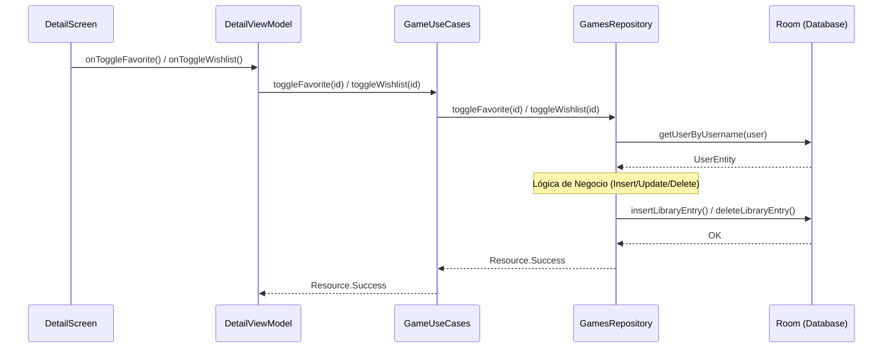
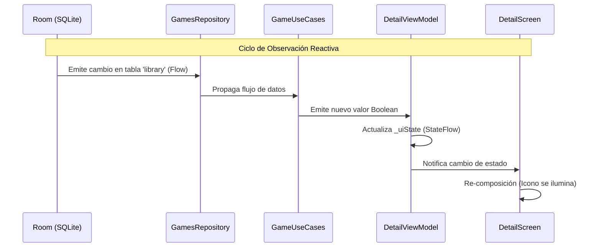

# **8. LibraryScreen y Detalle Avanzado**

En esta 8ª entrega, daremos el salto final en la experiencia de usuario de nuestra aplicación. Aprenderemos a diseñar la pantalla de **Mi Biblioteca** (`LibraryScreen`) integrando filtros dinámicos y acciones avanzadas como el **Swipe-to-Action**. Además, profundizaremos en la implementación técnica de los flujos de persistencia para **Favoritos** y **Lista de Deseos**, y cómo la arquitectura reactiva permite que la aplicación se actualice sola.

---

## 📖 Índice

1. [El Flujo de Persistencia: Favoritos y Wishlist](#flujo-persistencia)
2. [Diseño de LibraryScreen: Tu Colección Personal](#diseno-library)
3. [Navegación y LibraryGameCard](#navegacion-card)
4. [Interacción Avanzada: Swipe-to-Action y Diálogos](#swipe-action)
5. [Modificaciones en Componentes Existentes](#modificaciones)

---

## 🏗️ El Flujo de Persistencia: Favoritos y Wishlist {#flujo-persistencia}

Una de las partes más importantes de esta entrega es entender cómo un click en la UI se convierte en un dato permanente. Hemos implementado dos flujos paralelos pero casi idénticos para `Favorite` y `Wishlist`.

### 1.1. De la UI al Repositorio
Ubicación: `presentation/ui/screens/DetailScreen.kt`

Cuando el usuario pulsa el icono del corazón o del marcador en `DetailScreen`, se desencadena la siguiente cadena:

1.  **UI (`DetailScreen`)**: Llama a `viewModel.toggleFavorite()`.
2.  **ViewModel (`DetailViewModel`)**: Ejecuta una corrutina que invoca al Caso de Uso `useCases.toggleFavorite(gameId)`.
3.  **Caso de Uso (`GameUseCases`)**: Actúa como pasarela hacia el repositorio.
4.  **Repositorio (`MockGamesRepositoryImpl`)**: Contiene la lógica de negocio. 

    *   Comprueba si el usuario existe en Room (integridad referencial).
    *   Si el juego no está, lo inserta con el estado correspondiente.
    *   Si ya está con ese estado, lo mantiene o elimina (comportamiento de "toggle").
    *   Si está con otro estado, lo actualiza.



### 1.2. La Magia de la Reactividad (Flow)
Para que el botón cambie de color instantáneamente, no usamos una variable simple, sino un **Flow**:

*   El ViewModel observa `useCases.isFavorite(gameId)` desde el `init`.
*   Room emite un nuevo valor cada vez que la tabla `library` cambia.
*   La UI reacciona automáticamente al nuevo estado del `StateFlow` en el ViewModel.



---

## 🏗️ Diseño de LibraryScreen: Tu Colección Personal {#diseno-library}

La `LibraryScreen` es el "hub" central del usuario. Su implementación se basa en un filtrado dinámico sobre los datos de Room.

### 2.1. Implementación de la Pantalla
Ubicación: `presentation/ui/screens/LibraryScreen.kt`

La pantalla utiliza un `LibraryViewModel` que gestiona el estado de los juegos cargados. El corazón de la pantalla es la combinación de:

*   **Estado de Filtro**: Un `LibraryStatus` que cambia cuando el usuario pulsa los chips superiores.
*   **Carga de Datos**: El método `loadLibrary()` solicita al repositorio los juegos que coinciden con el filtro seleccionado.

```kotlin
// En LibraryViewModel.kt
fun loadLibrary() {
    viewModelScope.launch {
        useCases.getLibraryGames(selectedFilter).collect { resource ->
            _uiState.update { it.copy(libraryGames = resource) }
        }
    }
}
```

---

## 🏗️ Navegación y LibraryGameCard {#navegacion-card}

Para que la aplicación sea fluida, la biblioteca debe permitir volver al detalle de cualquier juego.

### 3.1. Navegación desde la Card
Ubicación: `presentation/ui/screens/LibraryScreen.kt`

Dentro de la `LibraryScreen`, cada elemento de la lista es una `LibraryGameCard`. Le pasamos un callback `onClick` que utiliza nuestro sistema de navegación:

```kotlin
LibraryGameCard(
    game = game,
    status = uiState.selectedFilter,
    onClick = { navStack.add(AppRoutes.Detail(game.id)) }, // Navegación al detalle
    onDelete = { gameToDelete = game }
)
```

### 3.2. Diseño de LibraryGameCard
Ubicación: `presentation/ui/componentes/LibraryCard.kt`

A diferencia de la `GameCard` de la Home, esta tarjeta es horizontal para aprovechar mejor el espacio:

*   **Fila 1**: Iconos de plataformas y un "Badge" que indica el estado (ej: "Deseados").
*   **Fila 2**: Título en negrita con truncado de texto.
*   **Fila 3**: Rating con estrella dorada.
*   **Fila 4**: Géneros del juego (GenreChipsRow).
*   **Espaciado**: Se utiliza `Arrangement.SpaceEvenly` para que toda la información quede perfectamente distribuida verticalmente.

---

## 🏗️ Interacción Avanzada: Swipe-to-Action y Diálogos {#swipe-action}

Hemos implementado el gesto de deslizar para eliminar, una de las interacciones más comunes en Android moderno.

### 4.1. Swipe-to-DismissBox
Ubicación: `presentation/ui/componentes/LibraryCard.kt`

Utilizamos el componente experimental de Material 3 `SwipeToDismissBox`. Lo configuramos para que solo permita deslizar de derecha a izquierda (EndToStart).

### 4.2. Confirmación con AlertDialog
Ubicación: `presentation/ui/screens/LibraryScreen.kt`

Para evitar borrados accidentales, el swipe no borra el dato directamente, sino que activa un estado `gameToDelete`. Esto dispara un `AlertDialog`:

*   Si el usuario confirma, se llama a `viewModel.removeFromLibrary()`.
*   Si cancela, el estado vuelve a `null` y la tarjeta recupera su posición.

---

## 🏗️ Modificaciones en Componentes Existentes {#modificaciones}

Para albergar estas funciones, hemos tenido que "tocar" piezas que ya teníamos:

1.  **`GameUseCases.kt`**: Se han añadido los métodos para Wishlist, notas y borrado. Es nuestro punto único de acceso a la lógica de juegos.

    Ubicación: `domain/usecase/GameUseCases.kt`

    ```kotlin
    // Nuevos métodos en GameUseCases.kt
    suspend fun toggleWishlist(gameId: Int): Resource<Unit> = gamesRepository.toggleWishlist(gameId)
    fun isInWishlist(gameId: Int): Flow<Boolean> = gamesRepository.isInWishlist(gameId)
    suspend fun removeFromLibrary(gameId: Int): Resource<Unit> = gamesRepository.removeFromLibrary(gameId)
    suspend fun saveNoteForGame(gameId: Int, note: String, status: GameProgress) =
        gamesRepository.saveNoteForGame(gameId, note, status)
    ```

2.  **`DetailViewModel.kt`**: Ha crecido para observar múltiples flujos (isFavorite, isInWishlist, note, progress). Ahora es un ViewModel mucho más robusto y reactivo.

    Ubicación: `presentation/viewmodel/DetailViewModel.kt`

    ```kotlin
    // DetailViewModel.kt: Observación de múltiples flujos
    init {
        loadGame()
        observeFavoriteStatus()
        observeWishlistStatus()
        loadNoteAndProgress()
        addToRecent()
    }

    private fun observeFavoriteStatus() {
        viewModelScope.launch {
            useCases.isFavorite(gameId).collect { favorite ->
                _uiState.update { it.copy(isFavorite = favorite) }
            }
        }
    }
    ```

3.  **`AuthRepositoryImpl.kt`**: Ahora asegura que el usuario se guarde en Room al hacer login. Sin esto, las Claves Foráneas de Room fallarían por falta de integridad.

    Ubicación: `data/repository/AuthRepositoryImpl.kt`

    ```kotlin
    // AuthRepositoryImpl.kt: Sincronización con Room
    override suspend fun login(username: String, password: String): LoginResult {
        // ... validación ...
        if (validUsers[username] == password) {
            val userData = registeredUsers[username]
            if (userData != null) {
                db.userDao().insertUser(
                    UserEntity(
                        username = userData.username,
                        name = userData.username.replaceFirstChar { it.uppercase() },
                        email = userData.email
                    )
                )
            }
            return LoginResult.Success(username = username)
        }
        // ...
    }
    ```

4.  **`MockGamesRepositoryImpl.kt`**: Se ha convertido en un repositorio híbrido que mezcla datos estáticos (del Mock) con datos dinámicos (de Room) mediante operaciones de cruce por ID.

    Ubicación: `data/repository/MockGamesRepositoryImpl.kt`

    ```kotlin
    // MockGamesRepositoryImpl.kt: Repositorio híbrido
    override fun getLibraryGames(status: LibraryStatus): Flow<Resource<List<Game>>> = flow {
        emit(Resource.Loading)
        val user = getCurrentUser()
        val flow = if (status == LibraryStatus.ALL) {
            db.libraryDao().getLibraryForUser(user)
        } else {
            db.libraryDao().getGamesByStatus(user, status)
        }

        flow.collect { entities ->
            val games = entities.mapNotNull { entity ->
                dataSource.games.find { it.id == entity.gameId }
            }
            emit(Resource.Success(games))
        }
    }
    ```

---

## 🎯 Resumen de Aprendizaje

Al finalizar esta parte, el alumno domina:

1.  **Flujos Reactivos Completos**: Desde la persistencia hasta la actualización visual.
2.  **Arquitectura Híbrida**: Mezclar fuentes de datos estáticas y dinámicas.
3.  **Componentes UX Modernos**: Swipe, diálogos de confirmación y badges de estado.
4.  **Integridad de Datos**: Gestión de Foreign Keys y sincronización de usuarios.
