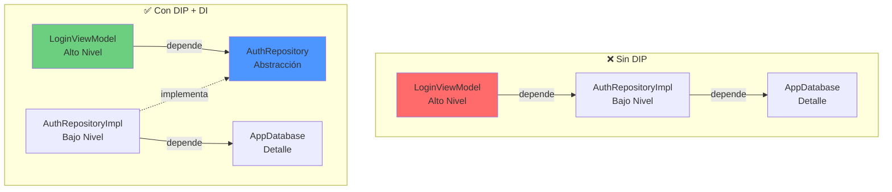
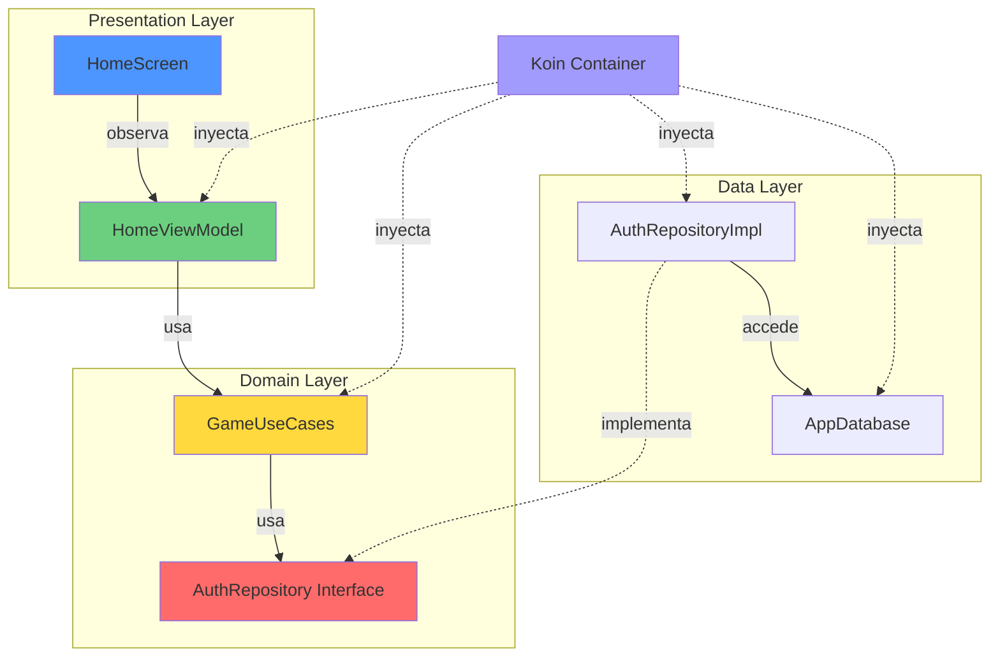
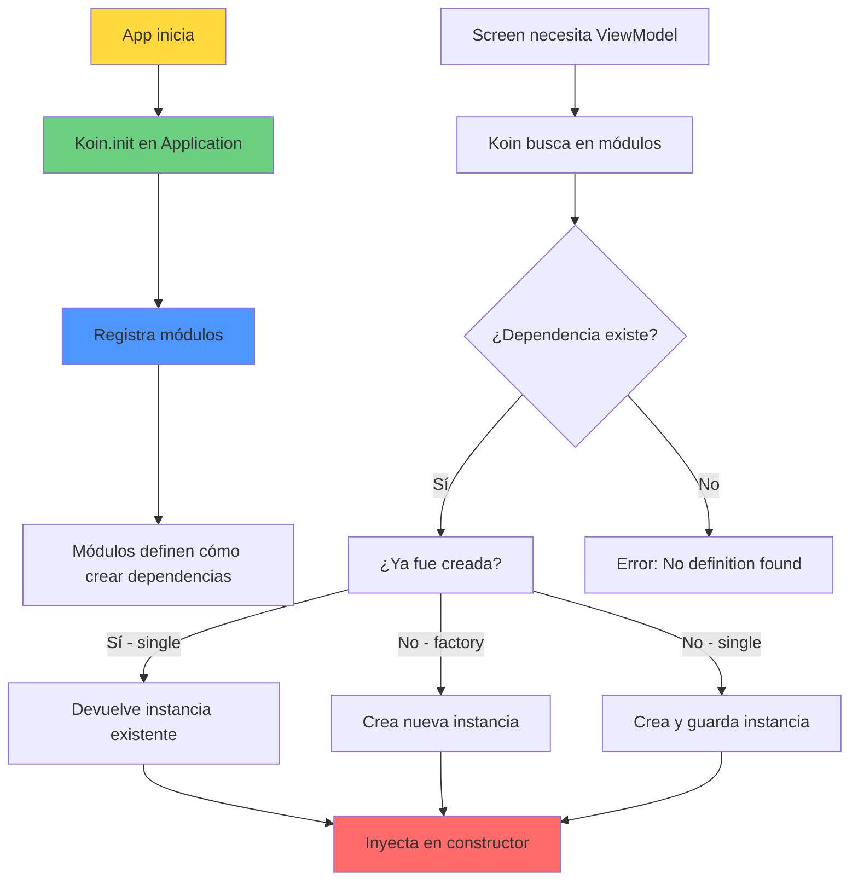
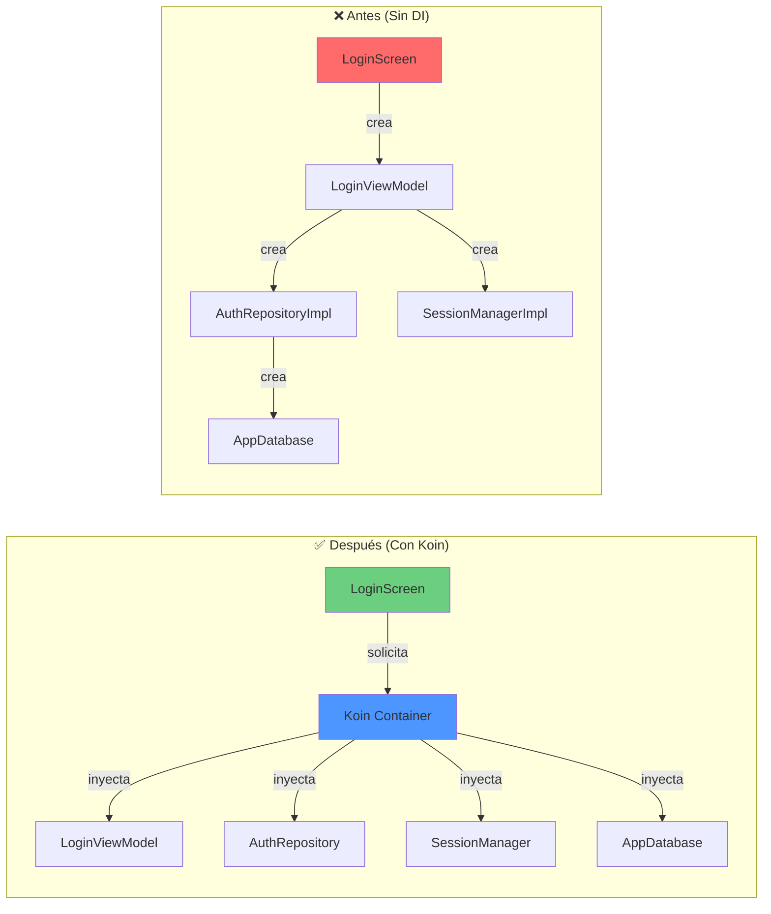

# **9. Inyección de Dependencias con Koin**

En esta 9ª parte del proyecto, refactorizaremos nuestra aplicación para implementar **Inyección de Dependencias (DI)** utilizando **Koin**. Este cambio arquitectónico es fundamental antes de integrar servicios externos como Firebase, ya que nos permitirá gestionar las dependencias de forma centralizada, testeable y escalable.

!!! tip "Repositorio de la Aplicación"
    El código fuente de la aplicación se encuentra en el repositorio de GitHub: [MyGameStore](https://github.com/jssdocente/MyGameStore)

#### Resumen

0. Fundamentos: Inversión de Control (IoC) e Inyección de Dependencias (DI)
1. ¿Qué es la Inyección de Dependencias y por qué usarla?
2. Configuración de Koin en el proyecto
3. Creación de módulos de Koin
4. Refactorización de ViewModels y Repositorios
5. Ventajas y buenas prácticas

---

## **0. Fundamentos: Inversión de Control (IoC) e Inyección de Dependencias (DI)**

Antes de implementar cualquier framework de DI, es fundamental comprender los principios arquitectónicos que lo sustentan. En esta sección exploraremos conceptos que van más allá de Android y son aplicables a cualquier lenguaje de programación orientado a objetos.

---

### 0.1. El Problema de las Dependencias Hardcoded (a fuego en el código)

Imagina que estás construyendo un coche. En un diseño tradicional (sin IoC), cada componente crearía sus propias piezas:

```kotlin
// ❌ Diseño acoplado - Ejemplo conceptual
class Coche {
    private val motor = MotorDiesel()      // Crea su propio motor
    private val ruedas = RuedasMichelin()  // Crea sus propias ruedas
    
    fun arrancar() {
        motor.encender()
    }
}
```


**Problemas evidentes:**

1. **Acoplamiento rígido**: `Coche` está "soldado" a `MotorDiesel`. Si quieres un motor eléctrico, tienes que modificar la clase `Coche`.
2. **Imposible testear**: No puedes probar `Coche` con un `MotorFalso` que simule fallos.
3. **Reutilización nula**: No puedes usar el mismo `Coche` con diferentes motores.
4. **Violación de principios SOLID**: Específicamente el **Principio de Inversión de Dependencias** (la "D" de SOLID).

---

### 0.2. ¿Qué es la Inversión de Control (IoC)?

**Inversión de Control (IoC)** es un **principio de diseño** donde el flujo de control de una aplicación se invierte: en lugar de que tu código llame al framework, el framework llama a tu código.

#### Analogía: El Restaurante

Piensa en dos modelos de restaurante:

**Sin IoC (Control tradicional):**
```
Tú (el código) → Vas a la cocina
                → Eliges ingredientes
                → Cocinas el plato
                → Te lo sirves
```

Tú controlas todo el proceso.

**Con IoC (Control invertido):**
```
Tú (el código) → Pides el plato al camarero
Framework      → Decide cómo cocinarlo
               → Te lo sirve listo
```

El framework controla el proceso, tú solo defines qué necesitas.

#### Implementación técnica

En programación, IoC se manifiesta en varios patrones:

1. **Template Method Pattern**: El framework define el esqueleto del algoritmo.
2. **Observer Pattern**: Los objetos se registran para ser notificados.
3. **Dependency Injection**: Las dependencias se "inyectan" desde fuera.

```kotlin
// ✅ Con IoC - Ejemplo conceptual
class Coche(
    private val motor: Motor,      // Recibe el motor desde fuera
    private val ruedas: Ruedas     // Recibe las ruedas desde fuera
) {
    fun arrancar() {
        motor.encender()
    }
}

// Ahora el "framework" (o contenedor) controla la creación:
val cocheElectrico = Coche(MotorElectrico(), RuedasGoodYear())
val cocheDiesel = Coche(MotorDiesel(), RuedasMichelin())
```


**Ventaja clave:** `Coche` ya no controla su construcción, solo define qué necesita.

---

### 0.3 . ¿Qué es la Inyección de Dependencias (DI)?

**Inyección de Dependencias (DI)** es una **implementación específica** del principio IoC. Es la técnica de "pasar" las dependencias de una clase desde el exterior, en lugar de que la clase las cree internamente.

#### Los tres tipos de Inyección de Dependencias

**1. Inyección por Constructor (Constructor Injection)** - **⭐ Recomendada**

```kotlin
class LoginViewModel(
    private val authRepository: AuthRepository,  // ← Inyectada
    private val sessionManager: SessionManager   // ← Inyectada
) : ViewModel()
```


**Ventajas:**
- ✅ Dependencias obligatorias (no pueden ser null)
- ✅ Inmutabilidad (`val`)
- ✅ Facilita testing

---

**2. Inyección por Setter (Setter Injection)**

```kotlin
class LoginViewModel : ViewModel() {
    lateinit var authRepository: AuthRepository  // ← Se asigna después
    
    fun setAuthRepository(repo: AuthRepository) {
        this.authRepository = repo
    }
}
```


**Desventajas:**
- ⚠️ Dependencias opcionales (pueden quedar sin inicializar)
- ⚠️ Mutabilidad
- ❌ Poco común en Android moderno

---

**3. Inyección por Interfaz (Interface Injection)**

```kotlin
interface AuthRepositoryInjector {
    fun inject(repo: AuthRepository)
}

class LoginViewModel : ViewModel(), AuthRepositoryInjector {
    private lateinit var authRepository: AuthRepository
    
    override fun inject(repo: AuthRepository) {
        this.authRepository = repo
    }
}
```


**Uso:** Muy raro, principalmente en frameworks legacy.

---

### 0.4. El Principio de Inversión de Dependencias (DIP)

La Inyección de Dependencias está estrechamente relacionada con el **Principio de Inversión de Dependencias**, la "D" de **SOLID**:

!!! quote "Principio de Inversión de Dependencias (Robert C. Martin)"
    **A.** Los módulos de alto nivel no deben depender de módulos de bajo nivel. Ambos deben depender de abstracciones.
    
    **B.** Las abstracciones no deben depender de detalles. Los detalles deben depender de abstracciones.

#### Aplicado a nuestro proyecto

**❌ Violación del DIP (Código actual):**

```kotlin
class LoginViewModel(
    context: Context,
    private val authRepository: AuthRepository = AuthRepositoryImpl(),  // ← Depende de implementación
    private val sessionManager: SessionManager = SessionManagerImpl(context)
) : ViewModel()
```


**Problema:** `LoginViewModel` (módulo de alto nivel) depende de `AuthRepositoryImpl` (módulo de bajo nivel concreto).

---

**✅ Cumplimiento del DIP (Con DI):**

```kotlin
class LoginViewModel(
    private val authRepository: AuthRepository,  // ← Depende de abstracción
    private val sessionManager: SessionManager   // ← Depende de abstracción
) : ViewModel()
```


**Solución:** `LoginViewModel` depende de las **interfaces** (`AuthRepository`, `SessionManager`), no de las implementaciones.

#### Diagrama de dependencias




**Observa:** En el diseño correcto, las flechas de dependencia apuntan **hacia arriba** (hacia las abstracciones), no hacia abajo (hacia los detalles).

---

### 0.5. Contenedores de Inyección de Dependencias

Hasta ahora hemos visto **qué** es DI, pero no **cómo** gestionarla. Aquí es donde entran los **Contenedores de DI** (también llamados **IoC Containers**).

#### ¿Qué es un Contenedor de DI?

Un contenedor de DI es un **"almacén inteligente"** que:

1. **Registra** cómo crear cada dependencia (configuración)
2. **Resuelve** las dependencias cuando alguien las solicita
3. **Gestiona** el ciclo de vida (singleton, factory, scoped)
4. **Inyecta** automáticamente en constructores

#### Ejemplo manual vs con Contenedor

=== "**Sin Contenedor (Manual DI):**"

    ```kotlin
    // En cada Screen, creamos manualmente el árbol de dependencias
    @Composable
    fun LoginScreen() {
        val context = LocalContext.current
        val database = MyGameStoreApp.database
        val sessionManager = SessionManagerImpl(context)
        val authRepository = AuthRepositoryImpl(database)
        val viewModel = LoginViewModel(authRepository, sessionManager)
        
        // ... UI ...
    }
    ```
    **Problemas:**

    - 😓 Repetitivo (cada Screen hace lo mismo)
    - 🐛 Propenso a errores (olvidar una dependencia)
    - 🔄 Difícil cambiar implementaciones

=== "**Con Contenedor (Koin):**"

    ```kotlin
    // Configuración única en un módulo
    val appModule = module {
        single { AppDatabase.getInstance(androidContext()) }
        single<SessionManager> { SessionManagerImpl(androidContext()) }
        single<AuthRepository> { AuthRepositoryImpl(get()) }
        viewModel { LoginViewModel(get(), get()) }
    }

    // En la Screen, solo pedimos el ViewModel
    @Composable
    fun LoginScreen() {
        val viewModel: LoginViewModel = koinViewModel()  // ¡Koin resuelve todo!
        
        // ... UI ...
    }
    ```


**Ventajas:**

- ✅ Configuración centralizada
- ✅ Resolución automática de dependencias
- ✅ Gestión de ciclo de vida
- ✅ Fácil cambiar implementaciones

---

### 0.6. Contenedores populares en el ecosistema Android

| Característica | **Koin** | **Hilt** | **Dagger 2** |
|---------------|----------|----------|--------------|
| **Paradigma** | Service Locator | DI real | DI real |
| **Compilación** | Runtime | Compile-time | Compile-time |
| **Curva aprendizaje** | ⭐ Baja | ⭐⭐ Media | ⭐⭐⭐ Alta |
| **Configuración** | DSL Kotlin | Anotaciones | Anotaciones |
| **Velocidad compilación** | Rápida | Media | Lenta |
| **Detección de errores** | Runtime ⚠️ | Compilación ✅ | Compilación ✅ |
| **Ideal para** | Apps medianas, aprendizaje | Apps enterprise con ViewModel | Apps enterprise grandes |

**Para este proyecto elegimos Koin porque:**

1. 📚 Curva de aprendizaje suave (ideal para estudiantes)
2. 🚀 Configuración rápida (en minutos)
3. 🎯 DSL Kotlin nativo (más idiomático)
4. 🔧 Suficientemente potente para apps reales

---

### 0.7. IoC y DI en Clean Architecture

En nuestro proyecto seguimos **Clean Architecture**, donde la DI juega un papel fundamental para cumplir la **Regla de Dependencia**:

#### Diagrama de capas con DI




**Observa:**

- Las flechas sólidas (dependencias) siempre apuntan **hacia abstracciones**
- Koin (líneas punteadas) inyecta en todas las capas, **sin violar** las dependencias

---

### 0.8. Beneficios de IoC y DI en el Mundo Real

#### 1. **Testing más fácil**

```kotlin
// Producción: Usa base de datos real
val productionModule = module {
    single<AuthRepository> { AuthRepositoryImpl(get()) }
}

// Testing: Usa mock
val testModule = module {
    single<AuthRepository> { FakeAuthRepository() }
}
```


#### 2. **Múltiples implementaciones sin cambiar código**

```kotlin
// Desarrollo local
single<AuthRepository> { MockAuthRepositoryImpl() }

// Producción con Firebase
single<AuthRepository> { FirebaseAuthRepositoryImpl() }

// ¡LoginViewModel no cambia en absoluto!
```


#### 3. **Gestión automática de recursos**

```java
// Koin asegura una única instancia de AppDatabase (singleton)
single { AppDatabase.getInstance(androidContext()) }

// Sin DI, podrías crear múltiples instancias accidentalmente → crash
```

---

## **1. ¿Cómo usar la DI en este proyecto?**

### 1.1. El problema actual

Actualmente, nuestros ViewModels crean sus propias dependencias de forma manual:

```kotlin
// ❌ Acoplamiento directo - Código actual
class LoginViewModel(
    context: Context,
    private val authRepository: AuthRepository = AuthRepositoryImpl(),
    private val sessionManager: SessionManager = SessionManagerImpl(context)
) : ViewModel()
```


**Problemas de este enfoque:**

1. **Acoplamiento fuerte**: El ViewModel "conoce" la implementación concreta (`AuthRepositoryImpl`)
2. **Difícil de testear**: No podemos inyectar un `FakeRepository` para pruebas
3. **Violación de principios SOLID**: Dependemos de implementaciones, no de abstracciones
4. **Difícil de mantener**: Cambiar la implementación requiere modificar múltiples clases
5. **Gestión manual del ciclo de vida**: Tenemos que crear y destruir instancias manualmente

### 1.2. La solución: Inyección de Dependencias

La **Inyección de Dependencias** es un patrón de diseño donde las dependencias de una clase se "inyectan" desde el exterior en lugar de crearlas internamente.

```kotlin
// ✅ Con DI - Código objetivo
class LoginViewModel(
    private val authRepository: AuthRepository,  // Se inyecta
    private val sessionManager: SessionManager   // Se inyecta
) : ViewModel()
```


**Ventajas:**

- ✅ **Desacoplamiento**: El ViewModel solo conoce las interfaces
- ✅ **Testeable**: Fácil inyectar mocks o fakes
- ✅ **Flexible**: Cambiar implementaciones en un solo lugar
- ✅ **Reutilizable**: Las dependencias se comparten entre clases
- ✅ **Mantenible**: Código más limpio y organizado

### 1.3. ¿Por qué Koin?

Existen varias librerías de DI para Android, pero Koin destaca por:

| Característica | Koin | Hilt/Dagger | Manual |
|---------------|------|-------------|--------|
| **Curva de aprendizaje** | ⭐ Baja | ⭐⭐⭐ Alta | ⭐⭐ Media |
| **Configuración** | ⭐⭐⭐ Mínima | ⭐ Compleja | ⭐⭐ Media |
| **DSL Kotlin** | ✅ Nativo | ❌ Java | ❌ N/A |
| **Tiempo de compilación** | ✅ Rápido | ❌ Lento | ✅ Rápido |
| **Detección de errores** | ⚠️ Runtime | ✅ Compilación | ⚠️ Runtime |
| **Ideal para** | Apps medianas | Apps enterprise | Proyectos pequeños |

**Para este proyecto, Koin es perfecto porque:**

- 📚 Es fácil de aprender para estudiantes
- 🚀 Configuración rápida (minutos, no horas)
- 🎯 Sintaxis Kotlin idiomática (DSL)
- 🔧 Suficientemente potente para apps reales

!!! info "Recursos adicionales"
    - [Documentación oficial de Koin](https://insert-koin.io/)
    - [Koin vs Hilt: Comparativa técnica](https://medium.com/@farhanroy/koin-vs-hilt-dependency-injection-frameworks-in-android-73c63f6e7c63)

---

### 1.4. Conceptos clave de DI

Antes de empezar con la implementación, es importante entender estos conceptos:

#### **Módulo (Module)**
Es un contenedor lógico donde defines **cómo** crear las dependencias.

```kotlin
val dataModule = module {
    single<AuthRepository> { AuthRepositoryImpl() }
    single<SessionManager> { SessionManagerImpl(androidContext()) }
}
```


#### **Scope (Ámbito)**
Define el **ciclo de vida** de una dependencia:

- `single`: **Singleton** - Una sola instancia en toda la app
- `factory`: **Nueva instancia** cada vez que se solicita
- `viewModel`: **Vinculada al ciclo de vida** del ViewModel

```kotlin
module {
    single { AppDatabase.getInstance(androidContext()) }  // Singleton
    factory { MyRepository() }                            // Nueva instancia
    viewModel { HomeViewModel(get()) }                    // Tied to ViewModel lifecycle
}
```


#### **Inyección (Injection)**
El **acto de obtener** una dependencia del contenedor de Koin:

```kotlin
class LoginViewModel(
    private val authRepository: AuthRepository  // ← Inyectada por Koin
) : ViewModel()
```


#### **Resolución de dependencias**
Koin resuelve automáticamente las dependencias transitivas:

```kotlin
// LoginViewModel necesita AuthRepository
// AuthRepository necesita AppDatabase
// Koin crea AppDatabase → AuthRepository → LoginViewModel
viewModel { LoginViewModel(get()) }  // get() obtiene AuthRepository
single<AuthRepository> { AuthRepositoryImpl(get()) }  // get() obtiene AppDatabase
single { AppDatabase.getInstance(androidContext()) }
```


---

### 1.5. Flujo de DI con Koin




---

## **2. Configuración de Koin en el proyecto**

Ahora que entendemos **qué** es DI y **por qué** usarla, vamos a configurar Koin en nuestro proyecto paso a paso.

---

### 2.1. Agregar dependencias

Primero, añadimos las librerías de Koin al proyecto.

**Paso 1:** Abre `gradle/libs.versions.toml` y agrega la versión de Koin:

```toml
[versions]
# ... otras versiones
koin = "4.0.1"
```

**Paso 2:** Agrega las librerías en la sección `[libraries]`:

```toml
[libraries]
# ... otras librerías

# Koin para Android
koin-android = { group = "io.insert-koin", name = "koin-android", version.ref = "koin" }
koin-androidx-compose = { group = "io.insert-koin", name = "koin-androidx-compose", version.ref = "koin" }
```

**Paso 3:** Abre `app/build.gradle.kts` y añade las dependencias:

```kotlin
dependencies {
    // ... dependencias existentes
    
    // Koin
    implementation(libs.koin.android)
    implementation(libs.koin.androidx.compose)
}
```


**Paso 4:** Sincroniza el proyecto haciendo clic en **"Sync Now"**.

---

### 2.2. Crear la clase Application

Para inicializar Koin, necesitamos una clase que extienda `Application`. Esta clase se ejecuta **antes** que cualquier Activity o Screen.

**Ubicación:** `app/src/main/java/com/pmdm/mygamestore/MyGameStoreApp.kt` (ya existe)

```kotlin
package com.pmdm.mygamestore

import android.app.Application
import androidx.room.Room
import com.pmdm.mygamestore.data.local.AppDatabase
import org.koin.android.ext.koin.androidContext
import org.koin.android.ext.koin.androidLogger
import org.koin.core.context.startKoin
import org.koin.core.logger.Level

class MyGameStoreApp : Application() {
    
    companion object {
        lateinit var database: AppDatabase
            private set
    }

    override fun onCreate() {
        super.onCreate()
        
        // Inicializar Room (ya existente)
        database = Room.databaseBuilder(
            applicationContext,
            AppDatabase::class.java,
            "mygamestore_db"
        ).build()
        
        // 🆕 Inicializar Koin
        startKoin {
            // Logger de Koin para debugging
            androidLogger(Level.ERROR)
            
            // Contexto de Android
            androidContext(this@MyGameStoreApp)
            
            // Módulos de dependencias (los crearemos en el siguiente punto)
            modules(
                // dataModule,
                // domainModule,
                // presentationModule
            )
        }
    }
}
```


!!! warning "No olvides registrar la clase Application"
    Asegúrate de que tu `AndroidManifest.xml` tenga registrada esta clase:

```xml
<application
        android:name=".MyGameStoreApp"
        ...>
```


---

### 2.3. Conceptos de la inicialización de Koin

#### **startKoin { }**
Es el punto de entrada de Koin. Se ejecuta **una sola vez** al iniciar la app.

```kotlin
startKoin {
    androidLogger(Level.DEBUG)  // Logs para debugging
    androidContext(this@MyApp)  // Contexto de Android
    modules(myModule1, myModule2)  // Módulos con dependencias
}
```


#### **androidContext()**
Proporciona el `Context` de Android a Koin. Esto permite que las dependencias que necesiten `Context` puedan obtenerlo:

```kotlin
single<SessionManager> { 
    SessionManagerImpl(androidContext())  // ← androidContext() da acceso al Context
}
```


#### **androidLogger()**
Configura el nivel de logs de Koin:

- `Level.DEBUG`: Muestra todos los logs (útil en desarrollo)
- `Level.ERROR`: Solo errores (recomendado en producción)
- `Level.NONE`: Sin logs

#### **modules()**
Lista de módulos donde defines las dependencias. Los veremos en detalle en el siguiente punto.

---

### 2.4. Verificación de la configuración

Para asegurarnos de que Koin está correctamente configurado, podemos crear un módulo de prueba temporal:

**Ubicación temporal:** `MyGameStoreApp.kt` (al final del archivo)

```kotlin
// 🧪 Módulo de prueba temporal
private val testModule = module {
    single { "Koin funciona correctamente!" }
}

// En onCreate(), agregar:
modules(testModule)
```


**Para verificar**, en cualquier Activity o Composable:

```kotlin
@Composable
fun TestKoinScreen() {
    val message: String = get()  // Obtenemos el String del módulo
    Text(text = message)  // Debería mostrar "Koin funciona correctamente!"
}
```


Si ves el mensaje, **Koin está correctamente configurado**. Ahora podemos eliminar este módulo de prueba y crear los módulos reales.

---

### 2.5. Comparación: Antes vs Después



**Ventajas visibles:**

1. **Centralización**: Todo se gestiona desde `startKoin { }`
2. **Reutilización**: `AppDatabase` se crea una sola vez (singleton)
3. **Testeable**: Podemos reemplazar módulos con mocks
4. **Mantenible**: Cambiar implementaciones en un solo lugar

---

## **3. Creación de módulos de Koin**

Los módulos de Koin organizan las dependencias por capas arquitectónicas. Cada módulo agrupa las responsabilidades de una capa específica.

### 3.1. Organización de módulos por capas

Siguiendo Clean Architecture, crearemos tres módulos:

```
di/
├─ DataModule.kt       → Capa de Datos (Repositories, Database, SessionManager)
├─ DomainModule.kt     → Capa de Dominio (UseCases)
└─ PresentationModule.kt → Capa de Presentación (ViewModels)
```


---

### 3.2. DataModule - Capa de Datos

Este módulo gestiona el acceso a datos: repositories, base de datos y managers.

**Ubicación**: `app/src/main/java/com/pmdm/mygamestore/di/DataModule.kt`

```kotlin
package com.pmdm.mygamestore.di

import com.pmdm.mygamestore.MyGameStoreApp
import com.pmdm.mygamestore.data.repository.*
import org.koin.android.ext.koin.androidContext
import org.koin.core.module.dsl.singleOf
import org.koin.dsl.bind
import org.koin.dsl.module

val dataModule = module {
    
    // Database (Singleton - ya existe en MyGameStoreApp)
    single { MyGameStoreApp.database }
    
    // SessionManager (Singleton con binding automático)
    singleOf(::SessionManagerImpl) bind SessionManager::class
    
    // AuthRepository (Singleton con binding automático)
    singleOf(::AuthRepositoryImpl) bind AuthRepository::class
    
    // GamesRepository (Singleton con binding automático)
    singleOf(::MockGamesRepositoryImpl) bind GamesRepository::class
}
```


**Conceptos clave:**

#### **singleOf con bind**

La sintaxis moderna de Koin 4.x utiliza `singleOf` con `bind` para simplificar el código:

```kotlin
// ❌ Sintaxis antigua (verbose)
single<SessionManager> { SessionManagerImpl(androidContext()) }

// ✅ Sintaxis moderna (concisa)
singleOf(::SessionManagerImpl) bind SessionManager::class
```


**Ventajas:**

- ✅ Menos código boilerplate
- ✅ Type-safe (errores en compilación)
- ✅ Constructor injection automático
- ✅ `bind` asocia la implementación con la interfaz

---

### 3.3. DomainModule - Capa de Dominio

Este módulo contiene los casos de uso (UseCases) con la lógica de negocio.

**Ubicación**: `app/src/main/java/com/pmdm/mygamestore/di/DomainModule.kt`

```kotlin
package com.pmdm.mygamestore.di

import com.pmdm.mygamestore.domain.usecase.GameUseCases
import org.koin.core.module.dsl.factoryOf
import org.koin.dsl.module

val domainModule = module {
    
    // GameUseCases (Factory - nueva instancia cada vez)
    factoryOf(::GameUseCases)
}
```


**¿Por qué `factory` en lugar de `single`?**

Los UseCases suelen ser **stateless** (sin estado interno), por lo que no necesitamos compartir instancias:

```kotlin
// ✅ Factory: Nueva instancia cada vez (ligero)
factoryOf(::GameUseCases)

// ❌ Single: Compartir instancia (innecesario para UseCases)
singleOf(::GameUseCases)
```


---

### 3.4. PresentationModule - Capa de Presentación

Este módulo gestiona los ViewModels vinculados al ciclo de vida de las pantallas.

**Ubicación**: `app/src/main/java/com/pmdm/mygamestore/di/PresentationModule.kt`

```kotlin
package com.pmdm.mygamestore.di

import com.pmdm.mygamestore.presentation.viewmodel.DetailViewModel
import com.pmdm.mygamestore.presentation.viewmodel.HomeViewModel
import com.pmdm.mygamestore.presentation.viewmodel.LibraryViewModel
import com.pmdm.mygamestore.presentation.viewmodel.LoginViewModel
import com.pmdm.mygamestore.presentation.viewmodel.RegisterViewModel
import com.pmdm.mygamestore.presentation.viewmodel.SplashViewModel
import org.koin.core.module.dsl.viewModelOf
import org.koin.dsl.module

val presentationModule = module {
    
    // ViewModels con ciclo de vida automático
    viewModelOf(::SplashViewModel)
    viewModelOf(::LoginViewModel)
    viewModelOf(::RegisterViewModel)
    viewModelOf(::HomeViewModel)
    viewModelOf(::DetailViewModel)  // Acepta parámetros dinámicos
    viewModelOf(::LibraryViewModel)
}
```


**Conceptos clave:**

#### **viewModelOf**

La función `viewModelOf` simplifica la declaración de ViewModels:

```kotlin
// ❌ Sintaxis antigua
viewModel { HomeViewModel(get(), get()) }

// ✅ Sintaxis moderna
viewModelOf(::HomeViewModel)
```


Koin resuelve automáticamente los parámetros del constructor usando `get()` interno.

---

### 3.5. Registrar los módulos en MyGameStoreApp

Ahora conectamos los módulos al inicializar Koin:

**Ubicación**: `app/src/main/java/com/pmdm/mygamestore/MyGameStoreApp.kt`

```kotlin
import com.pmdm.mygamestore.di.dataModule
import com.pmdm.mygamestore.di.domainModule
import com.pmdm.mygamestore.di.presentationModule

class MyGameStoreApp : Application() {
    
    override fun onCreate() {
        super.onCreate()
        
        // Inicializar Room...
        
        // Inicializar Koin
        startKoin {
            androidLogger(Level.ERROR)
            androidContext(this@MyGameStoreApp)
            
            // 👇 Módulos organizados por capas
            modules(
                dataModule,
                domainModule,
                presentationModule
            )
        }
    }
}
```


---

<u>✅ Resumen del Punto 3</u>

Has creado los tres módulos fundamentales:

1. ✅ **DataModule**: Repositories, Database, SessionManager
2. ✅ **DomainModule**: GameUseCases
3. ✅ **PresentationModule**: Todos los ViewModels
4. ✅ **Sintaxis moderna**: `singleOf`, `factoryOf`, `viewModelOf`

---

## **4. Refactorización de ViewModels y Screens**

Con los módulos configurados, ahora refactorizamos el código para usar Koin.

### 4.1. Refactorizar ViewModels

Los ViewModels ya no crean sus dependencias, solo las declaran en el constructor.

#### Ejemplo: LoginViewModel

**Antes (con valores por defecto):**
```kotlin
class LoginViewModel(
    context: Context,
    private val authRepository: AuthRepository = AuthRepositoryImpl(),
    private val sessionManager: SessionManager = SessionManagerImpl(context)
) : ViewModel()
```


**Después (solo declaración):**
```kotlin
class LoginViewModel(
    private val authRepository: AuthRepository,
    private val sessionManager: SessionManager
) : ViewModel()
```


**Cambios aplicados:**

- ❌ Eliminado `context: Context` (ya no se necesita)
- ❌ Eliminados valores por defecto (`= AuthRepositoryImpl()`)
- ✅ Solo declaración de interfaces

---

### 4.2. Eliminar ViewModelFactories

Las factories ya no son necesarias porque Koin gestiona la creación:

**Archivos eliminados:**
```
presentation/viewmodel/
├─ LoginViewModelFactory.kt       ❌ Eliminado
├─ RegisterViewModelFactory.kt    ❌ Eliminado
├─ SplashViewModelFactory.kt      ❌ Eliminado
├─ HomeViewModelFactory.kt        ❌ Eliminado
├─ LibraryViewModelFactory.kt     ❌ Eliminado
└─ DetailViewModelFactory.kt      ❌ Eliminado
```


---

### 4.3. Actualizar Screens para usar koinViewModel()

Las Screens ahora obtienen los ViewModels directamente desde Koin.

#### Ejemplo: LoginScreen

**Antes:**
```kotlin
@Composable
fun LoginScreen(
    viewModel: LoginViewModel = viewModel(
        factory = LoginViewModelFactory(LocalContext.current)
    ),
    // ...
)
```


**Después:**
```kotlin
import org.koin.androidx.compose.koinViewModel

@Composable
fun LoginScreen(
    viewModel: LoginViewModel = koinViewModel(),
    // ...
)
```


**Cambios:**

- ❌ Eliminado `LocalContext.current`
- ❌ Eliminado `factory = LoginViewModelFactory(...)`
- ✅ Simplificado a `koinViewModel()`

---

#### Caso especial: DetailViewModel con parámetros

**DetailViewModel necesita `gameId` dinámico**, que se pasa desde la navegación:

**Ubicación**: `presentation/ui/screens/DetailScreen.kt`

```kotlin
import org.koin.androidx.compose.koinViewModel
import org.koin.core.parameter.parametersOf

@Composable
fun DetailScreen(
    gameId: Int,
    onBack: () -> Unit
) {
    // ViewModel con parámetro dinámico
    val viewModel: DetailViewModel = koinViewModel(
        key = "DetailViewModel_$gameId"  // Key única para cada juego
    ) {
        parametersOf(gameId)  // Pasar gameId como parámetro
    }
    
    // ... resto del código
}
```


**Conceptos clave:**

- **`key`**: Fuerza a Koin a crear un nuevo ViewModel si el `gameId` cambia
- **`parametersOf(gameId)`**: Pasa el parámetro al constructor del ViewModel

---

<u>✅ Resumen del Punto 4</u>

Has refactorizado completamente el código:

1. ✅ ViewModels sin valores por defecto
2. ✅ ViewModelFactories eliminadas (6 archivos)
3. ✅ Screens usando `koinViewModel()`
4. ✅ Parámetros dinámicos con `parametersOf()`

---

## **5. Ventajas y Buenas Prácticas**

### 5.1. Ventajas alcanzadas

Con Koin implementado, nuestra aplicación ahora tiene:

#### **1. Desacoplamiento total**

```kotlin
// ViewModel no sabe QUÉ implementación usa
class LoginViewModel(
    private val authRepository: AuthRepository  // Interfaz, no implementación
)

// Cambiar de Mock a Firebase: Solo editar DataModule
singleOf(::FirebaseAuthRepositoryImpl) bind AuthRepository::class
```


#### **2. Testing simplificado**

```kotlin
// Módulo de prueba
val testModule = module {
    singleOf(::FakeAuthRepository) bind AuthRepository::class
}

// En test, reemplazar módulos
startKoin {
    modules(testModule)  // Usa fakes en lugar de implementaciones reales
}
```


#### **3. Configuración centralizada**

Cambiar de entorno (dev, staging, prod) en un solo lugar:

```kotlin
val dataModule = module {
    single<GamesRepository> {
        if (BuildConfig.DEBUG) {
            MockGamesRepositoryImpl()  // Mock en desarrollo
        } else {
            FirebaseGamesRepositoryImpl()  // Firebase en producción
        }
    }
}
```


---

### 5.2. Buenas Prácticas con Koin

#### **1. Organizar módulos por feature (opcional)**

Para apps grandes, organizar por funcionalidad:

```kotlin
// di/features/
├─ AuthModule.kt      → Login, Register, Session
├─ GamesModule.kt     → Games, Library, Detail
└─ ProfileModule.kt   → Profile, Settings
```

#### **2. Logs en desarrollo**

Configurar logs según el entorno:

```kotlin
startKoin {
    androidLogger(
        if (BuildConfig.DEBUG) Level.DEBUG else Level.ERROR
    )
    // ...
}
```


---

### 5.3. Preparación para Firebase

Con Koin implementado, integrar Firebase será trivial:

**Paso 1**: Crear `FirebaseAuthRepositoryImpl`

```kotlin
class FirebaseAuthRepositoryImpl(
    private val auth: FirebaseAuth
) : AuthRepository {
    override suspend fun login(username: String, password: String): LoginResult {
        // Implementación con Firebase
    }
}
```


**Paso 2**: Actualizar `DataModule`

```kotlin
val dataModule = module {
    // Firebase Auth
    single { Firebase.auth }
    
    // Cambiar implementación (¡sin tocar ViewModels!)
    singleOf(::FirebaseAuthRepositoryImpl) bind AuthRepository::class
}
```


**¡Listo!** Los ViewModels seguirán funcionando sin modificaciones.

---

<u>✅ Resumen del Punto 5</u>

1. ✅ **Desacoplamiento**: Cambiar implementaciones sin tocar ViewModels
2. ✅ **Testing**: Inyectar fakes fácilmente
3. ✅ **Configuración centralizada**: Un solo lugar para cambios
4. ✅ **Preparado para Firebase**: Migración sin dolor

---

## **✅ Conclusión del Capítulo 9**

Has completado exitosamente la implementación de Inyección de Dependencias con Koin:

1. ✅ Configuración de Koin en el proyecto
2. ✅ Creación de módulos organizados por capas
3. ✅ Refactorización completa de ViewModels
4. ✅ Eliminación de Factories manuales
5. ✅ Screens simplificadas con `koinViewModel()`
6. ✅ Arquitectura preparada para Firebase
