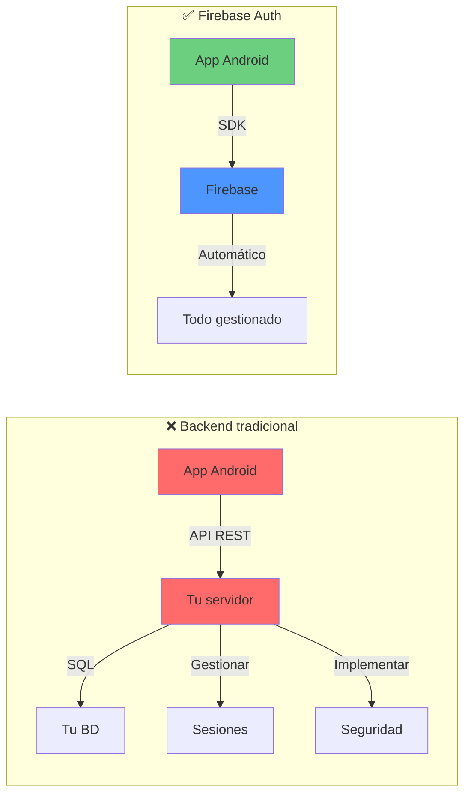
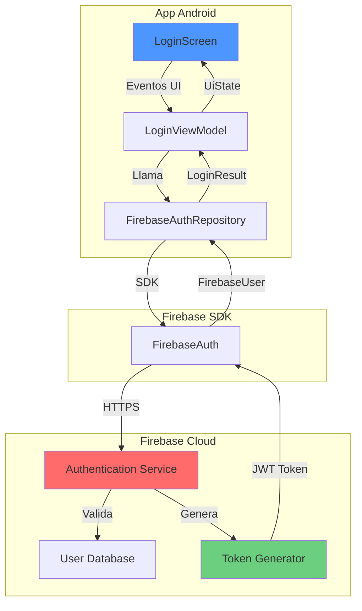
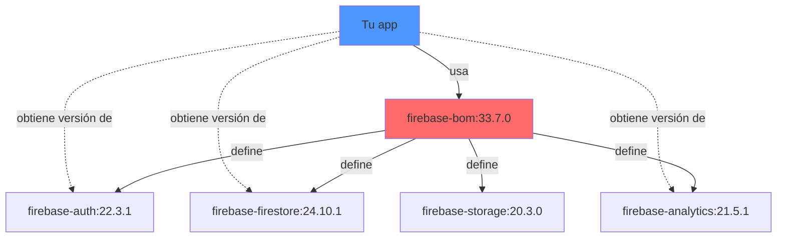
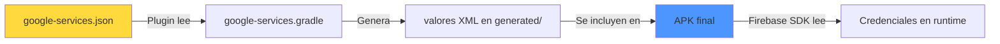
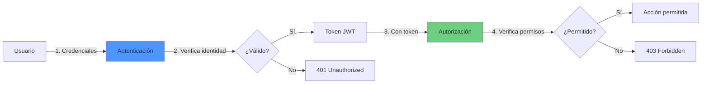
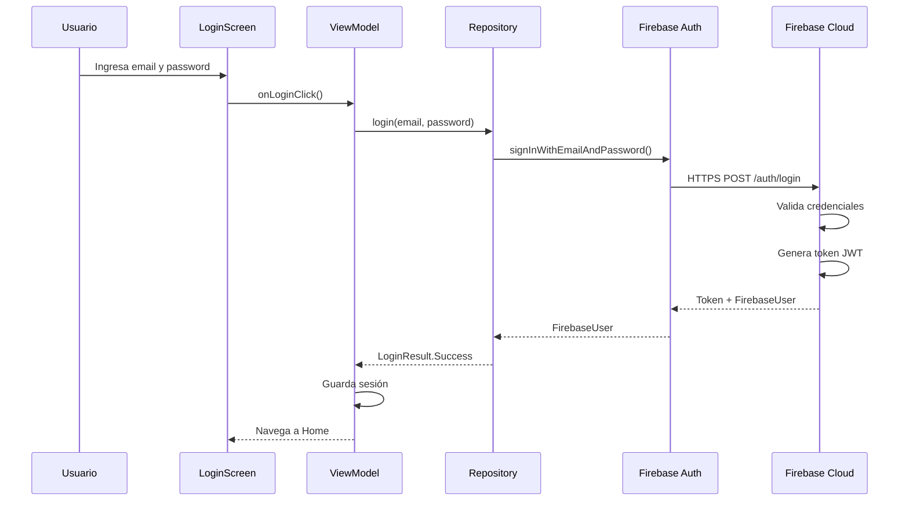

# **10. Autenticación con Firebase**

En esta 10ª parte del proyecto, integraremos **Firebase Authentication** en nuestra aplicación. Gracias a la arquitectura de Inyección de Dependencias que implementamos en el capítulo anterior, este cambio será transparente para nuestros ViewModels y UI. Aprenderemos a configurar Firebase, implementar autenticación con email/password y agregar autenticación con Google como proveedor OAuth.

!!! tip "Repositorio de la Aplicación"
    El código fuente de la aplicación se encuentra en el repositorio de GitHub: [MyGameStore](https://github.com/jssdocente/MyGameStore)

#### Resumen

1. Introducción a Firebase
2. Configuración de Firebase en el proyecto
3. Autenticación: Conceptos y práctica

---

## **1. Introducción a Firebase**

### 1.1. ¿Qué es Firebase?

**Firebase** es una plataforma **BaaS (Backend as a Service)** desarrollada por Google que proporciona un conjunto completo de herramientas y servicios para desarrollar aplicaciones móviles y web sin necesidad de gestionar infraestructura de servidor.

#### Analogía del restaurante

Imagina que estás montando un restaurante:

**Sin Firebase (Backend tradicional):**
```
Tú debes:
├─ Comprar y configurar servidores físicos
├─ Instalar y mantener bases de datos
├─ Configurar sistemas de autenticación
├─ Implementar APIs REST
├─ Gestionar escalabilidad
├─ Monitorear logs y errores
└─ Configurar backups y seguridad
```


**Con Firebase:**
```
Firebase proporciona:
├─ Servidores en la nube (gestionados por Google)
├─ Base de datos lista para usar
├─ Sistema de autenticación completo
├─ APIs automáticas
├─ Escalabilidad automática
├─ Monitoreo integrado
└─ Backups automáticos
```


Tú solo te enfocas en **cocinar** (desarrollar tu app), no en **gestionar el local** (infraestructura).

---

### 1.2. Servicios principales de Firebase para Android

Firebase ofrece más de 20 servicios. Aquí están los más relevantes para desarrollo Android:


=== "**🔐 Servicios Core (Infraestructura)**"

    **1. Firebase Authentication**

    - Sistema completo de gestión de usuarios
    - Múltiples proveedores: Email, Google, Facebook, Twitter, GitHub
    - Gestión de sesiones y tokens JWT
    - **Ideal para:** Login, registro, recuperación de contraseña

    **2. Cloud Firestore**

    - Base de datos NoSQL en tiempo real
    - Sincronización automática entre dispositivos
    - Consultas potentes y escalables
    - **Ideal para:** Datos estructurados (usuarios, posts, productos)

    **3. Realtime Database**

    - Base de datos NoSQL en tiempo real (versión legacy)
    - Menor funcionalidad que Firestore
    - Sincronización ultra-rápida
    - **Ideal para:** Chat en tiempo real, presencia de usuarios

    **4. Cloud Storage**

    - Almacenamiento de archivos (imágenes, videos, PDFs)
    - CDN integrado para acceso rápido
    - Gestión de permisos por usuario
    - **Ideal para:** Avatares, fotos de productos, documentos

=== "**📊 Servicios de Crecimiento**"

    **5. Cloud Messaging (FCM)**

    - Notificaciones push a dispositivos
    - Segmentación de usuarios
    - Programación de mensajes
    - **Ideal para:** Notificaciones de nuevos contenidos, ofertas

    **6. Analytics**
    - Análisis de comportamiento de usuarios
    - Eventos personalizados
    - Integración con Google Ads
    - **Ideal para:** Medir conversiones, retención de usuarios

    **7. Crashlytics**
    - Reportes automáticos de crashes
    - Stack traces detallados
    - Priorización de errores por impacto
    - **Ideal para:** Debugging en producción

    **8. Remote Config**
    - Configuración dinámica sin actualizar la app
    - A/B testing
    - Personalización por segmentos
    - **Ideal para:** Feature flags, mensajes promocionales

=== "**🧪 Servicios de Calidad**"

    **9. Performance Monitoring**

    - Métricas de rendimiento de la app
    - Detección de ANRs (Application Not Responding)
    - Tiempos de carga de pantallas
    - **Ideal para:** Optimizar velocidad de la app

    **10. Test Lab**
    - Testing automatizado en dispositivos reales
    - Ejecución en la nube
    - Screenshots automáticos
    - **Ideal para:** Testing antes de lanzamientos

    **11. App Distribution**
    - Distribución de versiones beta
    - Invitaciones a testers
    - Feedback integrado
    - **Ideal para:** Testing con usuarios reales

---

### 1.3. ¿Por qué usar Firebase Authentication?

Firebase Authentication destaca por varias razones clave:

#### **1. Sin backend propio**




**Ahorro de tiempo:**

- ❌ Sin Firebase: Semanas implementando autenticación segura
- ✅ Con Firebase: Minutos integrando el SDK

---

#### **2. Múltiples proveedores listos para usar**

Firebase soporta más de 10 proveedores de autenticación:

| Proveedor | Tipo | Configuración |
|-----------|------|---------------|
| **Email/Password** | Tradicional | ⭐ Simple |
| **Google** | OAuth | ⭐ Simple |
| **Facebook** | OAuth | ⭐⭐ Media |
| **Twitter** | OAuth | ⭐⭐ Media |
| **GitHub** | OAuth | ⭐⭐ Media |
| **Apple** | OAuth | ⭐⭐⭐ Compleja (iOS) |
| **Microsoft** | OAuth | ⭐⭐ Media |
| **Teléfono** | SMS | ⭐⭐ Media |
| **Anónima** | Temporal | ⭐ Muy simple |
| **Personalizada** | Tokens propios | ⭐⭐⭐ Avanzada |

**En este proyecto usaremos:**

- ✅ Email/Password (autenticación básica)
- ✅ Google (OAuth para mejor UX)

---

#### **3. Seguridad robusta**

Firebase maneja toda la seguridad por ti:

- **Tokens JWT**: Autenticación basada en tokens seguros
- **Sesiones persistentes**: El usuario sigue logueado tras cerrar la app
- **Renovación automática**: Tokens se renuevan sin intervención
- **Protección contra ataques**: Rate limiting, protección CSRF

```kotlin
// Firebase gestiona automáticamente:
// - Encriptación de contraseñas (bcrypt)
// - Generación de tokens JWT
// - Renovación de sesiones
// - Revocación de tokens

// Tú solo haces:
firebaseAuth.signInWithEmailAndPassword(email, password)
```


---

#### **4. Escalabilidad automática**

| Aspecto | Firebase | Backend propio |
|---------|----------|----------------|
| **Usuarios concurrentes** | Millones | Depende de tu servidor |
| **Gestión de carga** | Automática | Manual (load balancers) |
| **Costos iniciales** | $0 | Servidor + BD + DevOps |
| **Mantenimiento** | $0 (tiempo) | Horas/semana |

**Plan gratuito de Firebase Auth:**

- ✅ Autenticación ilimitada de usuarios
- ✅ 10,000 verificaciones de teléfono/mes
- ✅ Todos los proveedores incluidos

---

#### **5. Integración con otros servicios de Firebase**

Una vez autenticado, el usuario tiene acceso controlado a:

```kotlin
// El mismo FirebaseUser se usa en todos los servicios
val user = FirebaseAuth.getInstance().currentUser

// Firestore: Reglas de seguridad por usuario
firestore.collection("games")
    .whereEqualTo("userId", user.uid)  // Solo sus datos

// Storage: Permisos por usuario
storage.reference("avatars/${user.uid}/profile.jpg")

// Realtime Database: Acceso controlado
database.reference("users/${user.uid}")
```


---

#### **6. Experiencia de usuario mejorada**

**Funcionalidades incluidas sin código adicional:**

- 🔐 **Recuperación de contraseña**: Email automático
- ✉️ **Verificación de email**: Link de confirmación
- 🔄 **Cambio de contraseña**: Flujo seguro
- 🚪 **Logout en todos los dispositivos**: Revocación de tokens
- 📱 **Detección de cuenta existente**: Evita duplicados

---

### 1.5. Arquitectura de Firebase Authentication




**Flujo simplificado:**

1. Usuario ingresa credenciales en la UI
2. ViewModel llama al Repository
3. Repository usa Firebase SDK
4. SDK envía credenciales a Firebase Cloud (HTTPS)
5. Firebase valida y genera token JWT
6. Token se almacena automáticamente en el dispositivo
7. Repository devuelve `LoginResult.Success`
8. ViewModel actualiza el estado de la UI

Perfecto, continúo con el **Punto 2: Configuración de Firebase en el proyecto**.

---

## **2. Configuración de Firebase en el proyecto**

En esta sección aprenderás a conectar tu proyecto Android con Firebase desde cero. El proceso incluye crear el proyecto en Firebase Console, descargar la configuración y agregar las dependencias necesarias usando el **BoM (Bill of Materials)**.

### 2.1. Requisitos previos

Antes de empezar, asegúrate de tener:

- ✅ **Cuenta de Google** (Gmail)
- ✅ **Proyecto Android** funcional en Android Studio
- ✅ **Package name** del proyecto (en nuestro caso: `com.pmdm.mygamestore`)
- ✅ **Conexión a Internet** para acceder a Firebase Console

!!! tip "Verificar el package name"
    El package name está en `app/build.gradle.kts`:
    ```kotlin
    android {
            namespace = "com.pmdm.mygamestore"
            // ...
        }
    ```


### 2.2. Crear proyecto en Firebase Console

#### **Paso 1: Acceder a Firebase Console**

1. Abre tu navegador y ve a [Firebase Console](https://console.firebase.google.com/)
2. Inicia sesión con tu cuenta de Google
3. Verás el dashboard de Firebase

#### **Paso 2: Crear nuevo proyecto**

1. Haz click en **"Agregar proyecto"** o **"Create a project"**
2. **Nombre del proyecto**: Escribe el nombre de tu app

   - Este nombre es solo para identificar el proyecto en Firebase
   - No tiene que coincidir con el nombre de tu app
3. Click en **"Continuar"**

#### **Paso 3: Configurar Google Analytics (Opcional)**

1. Firebase preguntará si quieres habilitar Google Analytics
2. **Recomendación para aprendizaje**: Desactivar (puedes activarlo después)
3. Click en **"Crear proyecto"**

!!! info "Google Analytics"
    Analytics es útil en producción para medir usuarios, eventos y conversiones. Para desarrollo y aprendizaje, puedes desactivarlo inicialmente.

#### **Paso 4: Esperar a que se cree el proyecto**

Firebase tardará unos 30-60 segundos en:

- Crear la infraestructura
- Provisionar servicios
- Configurar reglas de seguridad por defecto

Cuando termine, verás: **"Tu nuevo proyecto está listo"**

#### **Paso 5: Agregar aplicación Android**

1. En el dashboard de Firebase, verás varios íconos: iOS, Android, Web, etc.
2. Click en el ícono de **Android** 
3. Completa el formulario:

**a) Package name (Obligatorio):**
```
com.pmdm.mygamestore
```

⚠️ **Importante**: Debe coincidir **exactamente** con el `namespace` de tu `build.gradle.kts`

**b) App nickname (Opcional):**
```
MyGameStore Android
```

Solo para identificar la app si tienes múltiples (Android, iOS, Web)

**c) SHA-1 Debug certificate (Opcional por ahora):**

- Déjalo vacío por ahora
- Lo necesitaremos más adelante para **Google Sign-In**
- Explicaremos cómo obtenerlo en la sección 3.4

4. Click en **"Registrar app"**

---

### 2.3. Descargar google-services.json

Después de registrar la app, Firebase te mostrará una pantalla con un archivo JSON.

#### **¿Qué es google-services.json?**

Es el **archivo de configuración** que conecta tu app con Firebase. Contiene:

```json
{
  "project_info": {
    "project_number": "123456789",
    "project_id": "mygamestore-abc123",
    "storage_bucket": "mygamestore-abc123.appspot.com"
  },
  "client": [
    {
      "client_info": {
        "mobilesdk_app_id": "1:123456789:android:abc123",
        "android_client_info": {
          "package_name": "com.pmdm.mygamestore"
        }
      },
      "api_key": [
        {
          "current_key": "AIzaSyXXXXXXXXXXXXXXXXXXXXXXXX"
        }
      ]
    }
  ]
}
```


**Campos importantes:**

| Campo | Descripción |
|-------|-------------|
| `project_id` | ID único del proyecto Firebase |
| `mobilesdk_app_id` | ID único de tu app Android |
| `package_name` | Package de tu app (validación) |
| `api_key` | Clave de API para comunicarse con Firebase |

#### **Descargar el archivo**

1. Click en **"Descargar google-services.json"**
2. Guarda el archivo (normalmente va a `Descargas`)

#### **Ubicar el archivo en el proyecto**

!!! danger "Ubicación crítica"
    El archivo **DEBE** estar en `app/google-services.json`, NO en la raíz del proyecto.

**Estructura correcta:**
```
MyGameStore/
├─ app/
│  ├─ src/
│  ├─ build.gradle.kts
│  └─ google-services.json  ← AQUÍ
├─ gradle/
└─ build.gradle.kts
```


**Pasos en Android Studio:**

1. En el explorador de archivos, ve a la carpeta `app` de tu proyecto
2. Arrastra el archivo `google-services.json` desde `Descargas`
3. Suéltalo directamente en la carpeta `app`
4. Android Studio detectará el archivo automáticamente

**Verificación:**

En la vista de proyecto (Project view), deberías ver:
```
app/
├─ manifests/
├─ java/
├─ res/
├─ build.gradle.kts
└─ google-services.json  ✅
```


---

### 2.4. ¿Qué es el BoM (Bill of Materials)?

El **BoM de Firebase** es una lista centralizada de versiones compatibles entre sí. Es como una "receta" que garantiza que todas las librerías de Firebase funcionen correctamente juntas.

#### **Problema sin BoM**

Antes del BoM, tenías que gestionar versiones manualmente:

```kotlin
// ❌ Sin BoM: Riesgo de incompatibilidades
implementation("com.google.firebase:firebase-auth:21.0.1")
implementation("com.google.firebase:firebase-firestore:24.0.0")  // ⚠️ Puede no ser compatible
implementation("com.google.firebase:firebase-analytics:21.2.0")  // ⚠️ Puede no ser compatible
```


**Problemas:**
- 😵 Difícil saber qué versiones son compatibles
- 🐛 Bugs sutiles por incompatibilidades
- ⏰ Tiempo perdido resolviendo conflictos

#### **Solución con BoM**

```kotlin
// ✅ Con BoM: Compatibilidad garantizada
implementation(platform("com.google.firebase:firebase-bom:33.7.0"))  // Una versión del BoM
implementation("com.google.firebase:firebase-auth")                   // Sin versión
implementation("com.google.firebase:firebase-firestore")              // Sin versión
implementation("com.google.firebase:firebase-analytics")              // Sin versión
```


**Ventajas:**

| Ventaja | Descripción |
|---------|-------------|
| ✅ **Compatibilidad garantizada** | Google asegura que todas las versiones funcionan juntas |
| ✅ **Menos código** | No repetir versiones en cada librería |
| ✅ **Actualizaciones simples** | Cambiar una sola línea (el BoM) actualiza todo |
| ✅ **Menos errores** | Imposible mezclar versiones incompatibles |

#### **Cómo funciona el BoM**
º



Cuando declaras el BoM, todas las librerías de Firebase **heredan automáticamente** la versión correcta.

---

### 2.5. Configurar dependencias con BoM

Ahora vamos a agregar Firebase al proyecto usando el BoM.

#### **Paso 1: Agregar versiones en libs.versions.toml**

**Ubicación:** `gradle/libs.versions.toml`

```toml
[versions]
# ... otras versiones
firebaseBom = "33.7.0"
googleServices = "4.4.4"
```

**¿Por qué estas versiones?**

- `firebaseBom`: Versión del BoM (contiene todas las librerías Firebase)
- `googleServices`: Plugin que procesa `google-services.json`

---

#### **Paso 2: Agregar librerías en libs.versions.toml**

En la sección `[libraries]`:

```toml
[libraries]
# ... otras librerías

# Firebase BoM (Bill of Materials)
firebase-bom = { group = "com.google.firebase", name = "firebase-bom", version.ref = "firebaseBom" }

# Firebase Services (sin versión, controladas por BoM)
firebase-auth = { group = "com.google.firebase", name = "firebase-auth" }
firebase-analytics = { group = "com.google.firebase", name = "firebase-analytics" }
```

**Observa:**

- `firebase-bom` **SÍ** tiene `version.ref` (la versión del BoM)
- `firebase-auth` y `firebase-analytics` **NO** tienen versión (la heredan del BoM)

---

#### **Paso 3: Agregar plugin en libs.versions.toml**

En la sección `[plugins]`:

```toml
[plugins]
# ... otros plugins
google-services = { id = "com.google.gms.google-services", version.ref = "googleServices" }
```


Este plugin es necesario para procesar el archivo `google-services.json`.

---

#### **Paso 4: Aplicar plugin en build.gradle.kts (proyecto)**

**Ubicación:** `build.gradle.kts` (raíz del proyecto)

```kotlin
plugins {
    alias(libs.plugins.android.application) apply false
    alias(libs.plugins.kotlin.android) apply false
    alias(libs.plugins.kotlin.compose) apply false
    alias(libs.plugins.kotlin.serialization) apply false
    alias(libs.plugins.ksp) apply false
    alias(libs.plugins.room) apply false
    
    // 👇 Agregar plugin de Google Services
    alias(libs.plugins.google.services) apply false
}
```

**¿Por qué `apply false`?**

- El plugin se declara aquí pero se aplica en el módulo `app`
- Permite reutilizar la versión en múltiples módulos

---

#### **Paso 5: Configurar build.gradle.kts (app)**

**Ubicación:** `app/build.gradle.kts`

**a) Aplicar el plugin al inicio:**

```kotlin
plugins {
    alias(libs.plugins.android.application)
    alias(libs.plugins.kotlin.android)
    alias(libs.plugins.kotlin.compose)
    alias(libs.plugins.kotlin.serialization)
    alias(libs.plugins.ksp)
    alias(libs.plugins.room)
    
    // 👇 Aplicar plugin de Google Services
    alias(libs.plugins.google.services)
}
```


**b) Agregar dependencias Firebase:**

```kotlin
dependencies {
    // ... dependencias existentes
    
    // Firebase BoM (Bill of Materials)
    implementation(platform(libs.firebase.bom))
    
    // Firebase Services (versiones controladas por BoM)
    implementation(libs.firebase.auth)
    implementation(libs.firebase.analytics)
}
```


**Conceptos clave:**

```kotlin
// platform() indica que es un BoM
implementation(platform(libs.firebase.bom))

// Las siguientes librerías NO tienen versión explícita
implementation(libs.firebase.auth)  // Versión viene del BoM
```


---

#### **Paso 6: Sincronizar proyecto**

1. Click en **"Sync Now"** (aparece en la parte superior de Android Studio)
2. Gradle descargará las dependencias de Firebase
3. Espera a que termine (puede tardar 1-2 minutos la primera vez)

**Si hay errores de sincronización:**

```
Error: Failed to resolve: com.google.firebase:firebase-bom:33.7.0
```

**Soluciones:**

1. Verifica tu conexión a Internet
2. Asegúrate de que `google-services.json` esté en `app/`
3. Revisa que las versiones en `libs.versions.toml` sean correctas
4. Intenta **File → Invalidate Caches / Restart**

---

### 2.6. Verificar la configuración

#### **Prueba 1: Verificar que Firebase se inicializa**

**Ubicación:** `MyGameStoreApp.kt`

```kotlin
import com.google.firebase.Firebase
import com.google.firebase.initialize

class MyGameStoreApp : Application() {
    override fun onCreate() {
        super.onCreate()
        
        // Inicializar Room...
        // Inicializar Koin...
        
        // 👇 Verificar Firebase (opcional, se inicializa automáticamente)
        Firebase.initialize(this)
        println("✅ Firebase inicializado correctamente")
    }
}
```


#### **Prueba 2: Verificar que FirebaseAuth funciona**

En cualquier pantalla o ViewModel, agrega temporalmente:

```kotlin
import com.google.firebase.auth.FirebaseAuth

class LoginViewModel(...) : ViewModel() {
    init {
        val auth = FirebaseAuth.getInstance()
        println("✅ FirebaseAuth disponible: ${auth != null}")
        println("📧 Usuario actual: ${auth.currentUser?.email ?: "No hay usuario"}")
    }
}
```


**Ejecuta la app** y revisa el Logcat. Deberías ver:

```
✅ Firebase inicializado correctamente
✅ FirebaseAuth disponible: true
📧 Usuario actual: No hay usuario
```


---

### 2.7. google-services.json en profundidad

Ahora que Firebase está configurado, entendamos qué hace realmente este archivo.

#### **¿Por qué es tan importante?**

El archivo `google-services.json` es el **contrato** entre tu app y Firebase. Sin él:

- ❌ Firebase no sabe a qué proyecto pertenece tu app
- ❌ Las peticiones serán rechazadas (401 Unauthorized)
- ❌ Analytics no registrará eventos
- ❌ Authentication no funcionará

#### **Contenido detallado**

```json
{
  "project_info": {
    "project_number": "123456789",           // ID numérico del proyecto
    "firebase_url": "https://...",           // URL de Realtime Database
    "project_id": "mygamestore-abc123",      // ID legible del proyecto
    "storage_bucket": "..."                  // Bucket de Cloud Storage
  },
  "client": [
    {
      "client_info": {
        "mobilesdk_app_id": "1:123:android:abc",  // ID único de esta app
        "android_client_info": {
          "package_name": "com.pmdm.mygamestore"  // Package de tu app
        }
      },
      "oauth_client": [                      // Para Google Sign-In (lo veremos después)
        {
          "client_id": "...apps.googleusercontent.com",
          "client_type": 3                   // Tipo: Android
        }
      ],
      "api_key": [                           // Clave de API
        {
          "current_key": "AIzaSy..."        // Clave para autenticar peticiones
        }
      ],
      "services": {                          // Servicios habilitados
        "appinvite_service": { ... },
        "analytics_service": { ... }
      }
    }
  ]
}
```


#### **¿Qué hace el plugin google-services?**

Cuando sincronizas Gradle, el plugin:

1. **Lee** `google-services.json`
2. **Extrae** las credenciales
3. **Genera** archivos auxiliares en `app/build/generated/`
4. **Inyecta** las credenciales en tu app en tiempo de compilación




---

#### **⚠️ Seguridad: ¿Debo subir google-services.json a Git?**

**Depende del contexto:**

| Escenario | Recomendación | Razón |
|-----------|---------------|-------|
| **Repositorio privado** | ✅ Sí | Solo tu equipo tiene acceso |
| **Repositorio público** | ⚠️ Depende | Las API keys están restringidas por dominio |
| **Producción con secrets** | ❌ No | Usar CI/CD para inyectar el archivo |

**Para este proyecto educativo:**

- ✅ **Puedes subirlo** (Firebase tiene protecciones)
- ⚠️ Pero es buena práctica agregarlo a `.gitignore` para acostumbrarte

---

## **3. Autenticación: Conceptos y práctica**

En esta sección implementaremos la autenticación completa con Firebase, integrándola perfectamente en nuestra arquitectura con Koin. Aprenderás tanto los conceptos teóricos como la implementación práctica.

---

### 3.1. ¿Qué es la autenticación?

La **autenticación** es el proceso de verificar la identidad de un usuario. Es la respuesta a la pregunta: *"¿Quién eres?"*

#### **Autenticación vs Autorización**

Estos dos conceptos suelen confundirse, pero son diferentes:

| Concepto | Pregunta | Ejemplo |
|----------|----------|---------|
| **Autenticación** | ¿Quién eres? | Login con email/password |
| **Autorización** | ¿Qué puedes hacer? | ¿Puedes eliminar este juego? |




**Ejemplo en nuestra app:**

```kotlin
// Autenticación: ¿Quién eres?
val user = firebaseAuth.signInWithEmailAndPassword(email, password)

// Autorización: ¿Qué puedes hacer?
if (user.uid == game.ownerId) {
    // Permitir eliminar juego
} else {
    // Denegar acción
}
```


---

#### **Flujo básico de autenticación**




---

#### **Tipos de autenticación en Firebase**

Firebase soporta múltiples métodos de autenticación:

**1. Email/Password (Tradicional)**
```kotlin
firebaseAuth.createUserWithEmailAndPassword(email, password)  // Registro
firebaseAuth.signInWithEmailAndPassword(email, password)      // Login
```


**2. Proveedores OAuth (Google, Facebook, etc.)**
```kotlin
val credential = GoogleAuthProvider.getCredential(idToken, null)
firebaseAuth.signInWithCredential(credential)
```


**3. Autenticación anónima**
```kotlin
firebaseAuth.signInAnonymously()  // Usuario temporal
```


**4. Teléfono (SMS)**
```kotlin
PhoneAuthProvider.verifyPhoneNumber(phoneNumber, ...)
```


**5. Personalizada (Custom tokens)**
```kotlin
firebaseAuth.signInWithCustomToken(token)
```

**En este proyecto implementaremos:**

- ✅ **Email/Password** (autenticación básica)
- ✅ **Google Sign-In** (mejor UX, más rápido)

---

### 3.2. Autenticación con Email/Password

Comenzaremos con la autenticación tradicional usando email y contraseña.

---

#### **Paso 1: Habilitar Email/Password en Firebase Console**

1. Ve a [Firebase Console](https://console.firebase.google.com/)
2. Selecciona tu proyecto
3. En el menú lateral, click en **"Authentication"**
4. Pestaña **"Sign-in method"**
5. Click en **"Email/Password"**
6. **Habilitar** el primer switch (Email/Password)
7. (Opcional) Deja deshabilitado "Email link" por ahora
8. Click en **"Guardar"**

!!! tip "Verificar configuración"
    Deberías ver "Email/Password" con estado **Enabled** en la lista de proveedores.

---

#### **Paso 2: Crear FirebaseAuthRepositoryImpl**

Ahora crearemos la implementación del repositorio que usa Firebase en lugar del mock.

**Ubicación:** `data/repository/FirebaseAuthRepositoryImpl.kt`

```kotlin
package com.pmdm.mygamestore.data.repository

import com.google.firebase.auth.FirebaseAuth
import com.google.firebase.auth.FirebaseAuthInvalidCredentialsException
import com.google.firebase.auth.FirebaseAuthInvalidUserException
import com.google.firebase.auth.FirebaseAuthUserCollisionException
import com.google.firebase.auth.FirebaseAuthWeakPasswordException
import com.pmdm.mygamestore.MyGameStoreApp
import com.pmdm.mygamestore.data.local.entities.UserEntity
import kotlinx.coroutines.tasks.await

/**
 * Implementación del repositorio de autenticación usando Firebase
 * 
 * Esta clase encapsula todas las operaciones de autenticación con Firebase,
 * convirtiendo las respuestas de Firebase en nuestros tipos de dominio
 * (LoginResult, RegisterResult).
 * 
 * Ventajas de esta implementación:
 * - Manejo robusto de errores de Firebase
 * - Sincronización con Room para persistencia local
 * - Conversión automática de FirebaseUser a nuestros modelos
 * - Compatible con la interfaz AuthRepository (DI)
 */
class FirebaseAuthRepositoryImpl(
    private val firebaseAuth: FirebaseAuth
) : AuthRepository {

    /**
     * Inicia sesión con email y contraseña usando Firebase
     * 
     * @param username En este caso, usamos el email como username
     * @param password Contraseña del usuario
     * @return LoginResult.Success si las credenciales son correctas,
     *         LoginResult.Error con mensaje específico en caso contrario
     */
    override suspend fun login(username: String, password: String): LoginResult {
        return try {
            // Intentar login en Firebase
            val result = firebaseAuth.signInWithEmailAndPassword(username, password).await()
            
            // Verificar que el usuario existe
            val firebaseUser = result.user
            if (firebaseUser != null) {
                // Sincronizar usuario en Room para acceso offline
                syncUserToRoom(firebaseUser.uid, firebaseUser.email ?: username)
                
                LoginResult.Success(username = firebaseUser.email ?: username)
            } else {
                LoginResult.Error("Authentication failed: User is null")
            }
            
        } catch (e: FirebaseAuthInvalidUserException) {
            // Usuario no existe
            LoginResult.Error("No account found with this email")
        } catch (e: FirebaseAuthInvalidCredentialsException) {
            // Contraseña incorrecta
            LoginResult.Error("Invalid password")
        } catch (e: Exception) {
            // Otros errores (red, etc.)
            LoginResult.Error("Login failed: ${e.message}")
        }
    }

    /**
     * Registra un nuevo usuario con email y contraseña
     * 
     * @param username Email del usuario
     * @param email Email del usuario (mismo que username en este caso)
     * @param password Contraseña del usuario
     * @return RegisterResult.Success si el registro es exitoso,
     *         RegisterResult.Error con mensaje específico en caso contrario
     */
    override suspend fun register(
        username: String,
        email: String,
        password: String
    ): RegisterResult {
        return try {
            // Crear usuario en Firebase
            val result = firebaseAuth.createUserWithEmailAndPassword(email, password).await()
            
            val firebaseUser = result.user
            if (firebaseUser != null) {
                // Sincronizar en Room
                syncUserToRoom(firebaseUser.uid, email)
                
                // (Opcional) Enviar email de verificación
                firebaseUser.sendEmailVerification().await()
                
                RegisterResult.Success(username = email)
            } else {
                RegisterResult.Error("Registration failed: User is null")
            }
            
        } catch (e: FirebaseAuthWeakPasswordException) {
            // Contraseña débil (menos de 6 caracteres)
            RegisterResult.Error("Password should be at least 6 characters")
        } catch (e: FirebaseAuthInvalidCredentialsException) {
            // Email inválido
            RegisterResult.Error("Invalid email format")
        } catch (e: FirebaseAuthUserCollisionException) {
            // Email ya registrado
            RegisterResult.Error("An account already exists with this email")
        } catch (e: Exception) {
            RegisterResult.Error("Registration failed: ${e.message}")
        }
    }

    /**
     * Sincroniza el usuario de Firebase con Room
     * 
     * Esto permite:
     * - Acceso offline a información básica del usuario
     * - Relaciones con otras entidades (Library, Notes, etc.)
     * - Consistencia entre Firebase Auth y nuestra base de datos local
     * 
     * @param userId UID de Firebase
     * @param email Email del usuario
     */
    private suspend fun syncUserToRoom(userId: String, email: String) {
        try {
            val userEntity = UserEntity(
                username = email,  // Usamos email como username
                name = email.substringBefore("@"),  // Nombre por defecto
                email = email,
                avatarUrl = null,
                bio = null
            )
            
            MyGameStoreApp.database.userDao().insertUser(userEntity)
        } catch (e: Exception) {
            // Log error pero no fallar el login
            println("⚠️ Error syncing user to Room: ${e.message}")
        }
    }
}
```


**Conceptos clave del código:**

1. **suspend fun + await()**
```kotlin
// Firebase devuelve Tasks (asíncronas)
val task: Task<AuthResult> = firebaseAuth.signInWithEmailAndPassword(email, password)

// await() convierte Task en suspend function
val result: AuthResult = task.await()
```


2. **Manejo específico de excepciones de Firebase**
```kotlin
catch (e: FirebaseAuthInvalidUserException) {
    // Usuario no existe
}
catch (e: FirebaseAuthInvalidCredentialsException) {
    // Contraseña incorrecta o email inválido
}
catch (e: FirebaseAuthWeakPasswordException) {
    // Contraseña débil (< 6 caracteres)
}
```


3. **Sincronización con Room**
```kotlin
// Guardar usuario en Room para:
// - Acceso offline
// - Relaciones con otras entidades (Foreign Keys)
MyGameStoreApp.database.userDao().insertUser(userEntity)
```


---

#### **Paso 3: Actualizar DataModule con Firebase**

Ahora configuramos Koin para usar Firebase en lugar del mock.

**Ubicación:** `di/DataModule.kt`

```kotlin
package com.pmdm.mygamestore.di

import com.google.firebase.auth.FirebaseAuth
import com.pmdm.mygamestore.MyGameStoreApp
import com.pmdm.mygamestore.data.local.SessionManager
import com.pmdm.mygamestore.data.local.SessionManagerImpl
import com.pmdm.mygamestore.data.repository.AuthRepository
import com.pmdm.mygamestore.data.repository.FirebaseAuthRepositoryImpl  // 👈 Import nuevo
import com.pmdm.mygamestore.data.repository.GamesRepository
import com.pmdm.mygamestore.data.repository.MockGamesRepositoryImpl
import org.koin.core.module.dsl.singleOf
import org.koin.dsl.bind
import org.koin.dsl.module

val dataModule = module {
    
    // Database (Singleton)
    single { MyGameStoreApp.database }
    
    // 🆕 Firebase Auth (Singleton)
    single { FirebaseAuth.getInstance() }
    
    // SessionManager (Singleton)
    singleOf(::SessionManagerImpl) bind SessionManager::class
    
    // 🔄 AuthRepository: Cambiar de Mock a Firebase
    singleOf(::FirebaseAuthRepositoryImpl) bind AuthRepository::class
    
    // GamesRepository (Mock por ahora)
    singleOf(::MockGamesRepositoryImpl) bind GamesRepository::class
}
```


**¡Observa la magia de la DI!**

```kotlin
// ❌ Antes (Mock)
singleOf(::AuthRepositoryImpl) bind AuthRepository::class

// ✅ Ahora (Firebase)
singleOf(::FirebaseAuthRepositoryImpl) bind AuthRepository::class
```


**¿Qué cambió en la app?**

- ✅ **LoginViewModel**: Sin cambios
- ✅ **RegisterViewModel**: Sin cambios
- ✅ **LoginScreen**: Sin cambios
- ✅ **RegisterScreen**: Sin cambios

**Solo cambiamos UNA línea y toda la app usa Firebase.** 🎉

---

#### **Paso 4: Testing del flujo completo**

Ahora vamos a probar que todo funciona.

=== "Escenario 1: Registro de nuevo usuario"

    1. Abre la app
    2. Ve a RegisterScreen
    3. Ingresa:

    - Email: `test@example.com`
    - Password: `password123`
    - Confirm Password: `password123`

    4. Click en "Register"
    5. **Resultado esperado:**

    - Loading indicator aparece
    - Se crea el usuario en Firebase
    - Navegas a HomeScreen

    **Verificar en Firebase Console:**

    1. Ve a Authentication → Users
    2. Deberías ver el usuario `test@example.com`
    3. Click en el usuario para ver detalles

=== "Escenario 2: Login con usuario existente"

    1. Cierra la app completamente
    2. Abre la app de nuevo
    3. Ve a LoginScreen
    4. Ingresa:

        - Email: `test@example.com`
        - Password: `password123`
    5. Click en "Login"
    6. **Resultado esperado:**

        - Loading indicator
        - Login exitoso
        - Navegas a HomeScreen

=== "Escenario 3: Error - Contraseña incorrecta"

    1. Ve a LoginScreen
    2. Ingresa:

        - Email: `test@example.com`
        - Password: `wrongpassword`
    3. Click en "Login"
    4. **Resultado esperado:**

        - Snackbar con mensaje: "Invalid password"
        - No navegas
        - Puedes intentar de nuevo

=== "Escenario 4: Error - Usuario no existe"

    1. LoginScreen
    2. Ingresa:

        - Email: `noexiste@example.com`
        - Password: `password123`
    3. **Resultado esperado:**

        - Snackbar: "No account found with this email"

---

#### **Paso 5: Debugging común**

=== "Problema 1: "FirebaseAuth has not been initialized"

    ```
    java.lang.IllegalStateException: Default FirebaseApp is not initialized
    ```
    **Solución:**

    - Verifica que `google-services.json` esté en `app/`
    - Asegúrate de que el plugin está aplicado en `app/build.gradle.kts`
    - Sync Gradle de nuevo

=== "Problema 2: "Email already exists"

    Si intentas registrar el mismo email dos veces, Firebase rechazará el segundo intento.

    **Solución:**

    1. Ve a Firebase Console → Authentication → Users
    2. Elimina el usuario
    3. Intenta registrar de nuevo

=== "Problema 3: "Weak password"

    Firebase requiere mínimo 6 caracteres en la contraseña.

    **Solución:**

    - Actualiza las validaciones en `RegisterViewModel`:

        ```kotlin
        if (state.password.length < 6) {
            _uiState.update { 
                it.copy(errorMessage = "Password must be at least 6 characters") 
            }
            return
        }
        ```


---

<u>✅ Resumen de Email/Password</u>

Has implementado autenticación completa con Firebase:

1. ✅ Habilitado Email/Password en Firebase Console
2. ✅ Creado `FirebaseAuthRepositoryImpl`
3. ✅ Actualizado `DataModule` con Firebase Auth
4. ✅ Testing completo del flujo de registro y login
5. ✅ Manejo robusto de errores de Firebase
6. ✅ Sincronización automática con Room

**Ventajas alcanzadas:**

- 🔒 Autenticación segura gestionada por Firebase
- 📦 Sin cambios en ViewModels ni UI (gracias a DI)
- 🧪 Fácil volver al mock para testing
- 📱 Persistencia de sesión automática


