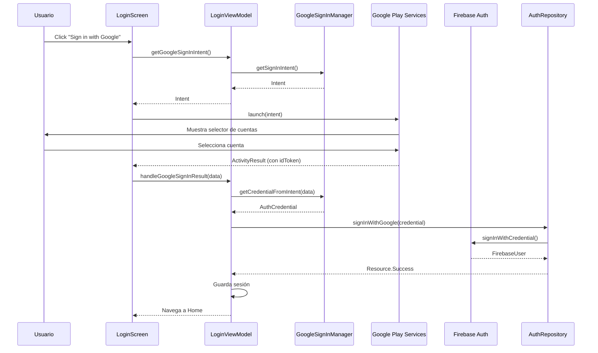

# Guía:  Integración de Google Sign-In con Firebase en Android

En esta 11ª parte de la guía se implementará la autenticación con Google Sign-In.

---

## 📖 Índice

1. [Introducción](#introducción)
2. [Paso 1: Configuración en Firebase Console](#paso-1-configuración-en-firebase-console)
3. [Paso 2: Configuración en Google Cloud Console](#paso-2-configuración-en-google-cloud-console)
4. [Paso 3: Agregar dependencias de Google Sign-In](#paso-3-agregar-dependencias-de-google-sign-in)
5. [Paso 4: Crear GoogleSignInManager](#paso-4-crear-googlesigninmanager)
6. [Paso 5: Extender FirebaseAuthRepositoryImpl](#paso-5-extender-firebaseauthrepositoryimpl)
7. [Paso 6: Actualizar DataModule con GoogleSignInManager](#paso-6-actualizar-datamodule-con-googlesigninmanager)
8. [Paso 7: Actualizar LoginViewModel](#paso-7-actualizar-loginviewmodel)
9. [Paso 8: Actualizar LoginScreen con botón de Google](#paso-8-actualizar-loginscreen-con-botón-de-google)
10. [Paso 9: Agregar ícono de Google](#paso-9-agregar-ícono-de-google)
11. [Paso 10: Actualizar HomeViewModel con logout](#paso-10-actualizar-homeviewmodel-con-logout)
12. [Paso 11: Testing del flujo completo](#paso-11-testing-del-flujo-completo)
13. [Resumen de archivos](#resumen-de-archivos)
14. [Diagrama del flujo completo](#diagrama-del-flujo-completo)

---

## 🎯 Introducción {#introducción}

La autenticación es un componente crítico en cualquier aplicación moderna. En esta guía implementaremos:

- ✅ **Autenticación con Email/Password**: Registro y login tradicional usando Firebase Auth
- ✅ **Google Sign-In**: Inicio de sesión con cuenta de Google (OAuth 2.0)
- ✅ **Gestión de Sesión**: Persistencia del estado de autenticación
- ✅ **Manejo de Errores**: Mensajes descriptivos para cada tipo de error
- ✅ **UX Optimizada**: Feedback visual claro en cada paso

### Arquitectura del sistema de autenticación

```
┌─────────────────────────────────────────────────┐
│           PRESENTATION LAYER                    │
│  ┌──────────────┐      ┌──────────────────┐     │
│  │ LoginScreen  │◄─────│ LoginViewModel   │     │
│  └──────────────┘      └──────────────────┘     │
└──────────────────────────┬──────────────────────┘
                           │
┌──────────────────────────▼──────────────────────┐
│              DATA LAYER                         │
│  ┌────────────────────────────────────────┐     │
│  │   GoogleSignInManager                  │     │
│  │   (Helper para Google OAuth)           │     │
│  └────────────────────────────────────────┘     │
│                                                  │
│  ┌────────────────────────────────────────┐     │
│  │   FirebaseAuthRepositoryImpl           │     │
│  │   - signInWithGoogle()                 │     │
│  │   - login(email, password)             │     │
│  │   - register(email, password)          │     │
│  └────────────────────────────────────────┘     │
└──────────────────────────────────────────────────┘
```


---

## 🔧 Paso 1: Configuración en Firebase Console {#paso-1-configuración-en-firebase-console}

### 1.1. Habilitar Google como proveedor de autenticación

1. Accede a [Firebase Console](https://console.firebase.google.com/)
2. Selecciona tu proyecto
3. En el menú lateral, ve a **Authentication** → **Sign-in method**
4. Haz clic en **Google**
5. Activa el interruptor **Enable**
6. Configura el **email de soporte del proyecto** (tu email de desarrollador)
7. Haz clic en **Guardar**

!!! info "Importante"
    Los pasos específicos en este punto pueden variar, ya que la interfaz de Firebase cambia con frecuencia. Consulta la **[documentación oficial](https://firebase.google.com/docs/auth/android/google-signin)** de Firebase para obtener las instrucciones más actualizadas.
---

## 🔐 Paso 2: Configuración en Google Cloud Console {#paso-2-configuración-en-google-cloud-console}

### 2.1. Generar SHA-1 del certificado de debug

El SHA-1 es una huella digital de tu certificado de firma. Google lo usa para verificar que las peticiones provienen de tu app.

**En Windows:**

```shell
gradlew signingReport
```

**Busca en la salida:**

```text
Variant: debug
Config: debug
Store: C:\Users\TuUsuario\.android\debug.keystore
Alias: AndroidDebugKey
SHA1: A1:B2:C3:D4:E5:F6:...
```


**Copia el valor del SHA1** que aparece en `Variant: debug`.

### 2.2. Agregar SHA-1 a Firebase

1. Vuelve a **Firebase Console** → **Project Settings** (icono de engranaje)
2. Ve a la pestaña **General**
3. Haz scroll hasta la sección **Your apps**
4. En tu app Android, haz clic en **Add fingerprint**
5. Pega el **SHA-1** que copiaste
6. Haz clic en **Save**

### 2.3. Descargar nuevo google-services.json

!!! danger "Crítico"
    Después de agregar el SHA-1, Firebase genera un nuevo archivo `google-services.json` con las credenciales OAuth. Debes reemplazar el archivo antiguo.

1. En la misma pantalla de **Project Settings**, haz clic en el botón **Download google-services.json**
2. Reemplaza el archivo en `app/google-services.json`
3. **Sync** el proyecto en Android Studio

---

## 📦 Paso 3: Agregar dependencias de Google Sign-In {#paso-3-agregar-dependencias-de-google-sign-in}

### 3.1. Actualizar libs.versions.toml


```toml
[versions]
# ... otras versiones ...
playServicesAuth = "21.3.0"

[libraries]
# ... otras librerías ...
play-services-auth = { group = "com.google.android.gms", name = "play-services-auth", version.ref = "playServicesAuth" }
```


### 3.2. Actualizar app/build.gradle.kts

```kotlin
dependencies {
    // ... otras dependencias ...
    
    // Google Sign-In
    implementation(libs.play.services.auth)
}
```


**Sync** el proyecto después de estos cambios.

---

Tienes razón, el `default_web_client_id` se genera automáticamente en el archivo `google-services.json` cuando configuras Firebase correctamente. Voy a actualizar solo la sección del **Paso 4** de la guía para reflejar esto correctamente:

---

## 🛠️ Paso 4: Crear GoogleSignInManager {#paso-4-crear-googlesigninmanager}

Esta clase encapsula toda la lógica de Google Sign-In, facilitando su uso y mantenimiento.

**Ubicación**: `app/src/main/java/com/pmdm/mygamestore/data/auth/GoogleSignInManager.kt`

```kotlin
package com.pmdm.mygamestore.data.auth

import android.content.Context
import android.content.Intent
import com.google.android.gms.auth.api.signin.GoogleSignIn
import com.google.android.gms.auth.api.signin.GoogleSignInClient
import com.google.android.gms.auth.api.signin.GoogleSignInOptions
import com.google.android.gms.common.api.ApiException
import com.google.firebase.auth.AuthCredential
import com.google.firebase.auth.GoogleAuthProvider
import com.pmdm.mygamestore.R

/**
 * 🔐 GoogleSignInManager - Helper para gestionar Google Sign-In
 *
 * RESPONSABILIDADES:
 * - Configurar GoogleSignInClient con el Web Client ID
 * - Proporcionar el Intent para iniciar el flujo OAuth
 * - Convertir GoogleSignInAccount a AuthCredential de Firebase
 * - Manejar errores específicos de Google Sign-In
 *
 * VENTAJAS:
 * ✅ Encapsula la complejidad de Google Sign-In
 * ✅ Reutilizable en cualquier parte de la app
 * ✅ Manejo robusto de errores
 * ✅ Fácil de testear
 *
 * @param context Contexto de Android
 */
class GoogleSignInManager(
    context: Context
) {

    /**
     * Cliente de Google Sign-In configurado con el Web Client ID
     *
     * IMPORTANTE - Web Client ID automático:
     * ✅ El ID se obtiene automáticamente de R.string.default_web_client_id
     * ✅ Este recurso se genera automáticamente desde google-services.json
     * ✅ NO necesitas copiarlo manualmente
     * 
     * REQUISITOS:
     * 1. Tener google-services.json actualizado en app/
     * 2. Haber agregado el SHA-1 en Firebase Console
     * 3. Haber habilitado Google Sign-In en Firebase Authentication
     * 4. Haber sincronizado el proyecto después de agregar google-services.json
     */
    private val googleSignInClient: GoogleSignInClient

    init {
        // Configurar opciones de Google Sign-In
        val gso = GoogleSignInOptions.Builder(GoogleSignInOptions.DEFAULT_SIGN_IN)
            .requestIdToken(context.getString(R.string.default_web_client_id))
            .requestEmail()
            .build()

        googleSignInClient = GoogleSignIn.getClient(context, gso)
    }

    /**
     * 🚀 Obtiene el Intent para iniciar el flujo de Google Sign-In
     *
     * FLUJO:
     * 1. Usuario hace click en "Sign in with Google"
     * 2. LoginScreen llama a este método
     * 3. Se lanza el Intent con el selector de cuentas de Google
     * 4. Usuario selecciona su cuenta
     * 5. Google devuelve el resultado a través de ActivityResult
     *
     * @return Intent para lanzar el selector de cuentas
     */
    fun getSignInIntent(): Intent {
        return googleSignInClient.signInIntent
    }

    /**
     * 🔄 Convierte el resultado de Google Sign-In a credencial de Firebase
     *
     * FLUJO:
     * 1. ActivityResult devuelve un Intent con datos de la cuenta
     * 2. Extraemos GoogleSignInAccount del Intent
     * 3. Obtenemos el idToken de la cuenta
     * 4. Creamos AuthCredential para Firebase
     *
     * MANEJO DE ERRORES:
     * - 12501: Usuario canceló el proceso
     * - 10: Error de configuración (SHA-1 o Web Client ID incorrecto)
     * - 7: Error de red
     * - Otros: Errores desconocidos
     *
     * @param data Intent devuelto por ActivityResult
     * @return AuthCredential para usar con Firebase Auth (puede ser null si falla)
     * @throws Exception con mensaje descriptivo si hay error
     */
    fun getCredentialFromIntent(data: Intent?): AuthCredential? {
        return try {
            // Obtener cuenta de Google desde el Intent
            val task = GoogleSignIn.getSignedInAccountFromIntent(data)
            val account = task.getResult(ApiException::class.java)

            // Extraer ID token
            val idToken = account?.idToken

            if (idToken != null) {
                // Crear credencial de Firebase con el ID token
                GoogleAuthProvider.getCredential(idToken, null)
            } else {
                println("⚠️ Google Sign-In: ID Token is null")
                null
            }

        } catch (e: ApiException) {
            // Manejar errores específicos de Google Sign-In
            val message = when (e.statusCode) {
                12501 -> "Sign-in cancelled by user"
                10 -> "Developer error: Check SHA-1 and Web Client ID in Firebase Console"
                7 -> "Network error. Please check your internet connection"
                else -> "Google Sign-In failed: ${e.statusCode}"
            }
            println("❌ Google Sign-In Error: $message")
            throw Exception(message)
        } catch (e: Exception) {
            println("❌ Unexpected error in Google Sign-In: ${e.message}")
            throw e
        }
    }

    /**
     * 🚪 Cierra sesión de Google
     *
     * IMPORTANTE:
     * - Limpia la cuenta de Google en el dispositivo
     * - Permite al usuario elegir otra cuenta en el próximo login
     * - Debe llamarse junto con Firebase signOut()
     *
     * CASO DE USO:
     * - Usuario hace logout desde ProfileScreen
     * - HomeViewModel llama a este método además de sessionManager.clearSession()
     */
    suspend fun signOut() {
        try {
            googleSignInClient.signOut()
        } catch (e: Exception) {
            println("⚠️ Error signing out from Google: ${e.message}")
        }
    }
}
```


### 📝 ¿De dónde viene `default_web_client_id`?

!!! info "Generación Automática"
    El recurso `R.string.default_web_client_id` se genera automáticamente cuando:
    
    1. ✅ Agregas el archivo `google-services.json` a la carpeta `app/`
    2. ✅ El plugin de Google Services procesa el archivo
    3. ✅ Se genera un archivo `values.xml` en `build/generated/res/google-services/debug/values/`
    
    **Contenido generado automáticamente:**
    ```xml
    <?xml version="1.0" encoding="utf-8"?>
        <resources>
            <string name="default_web_client_id" translatable="false">
                123456789-abc123def456.apps.googleusercontent.com
            </string>
            <!-- ... otros recursos de Firebase ... -->
        </resources>
    ```


### ⚠️ Verificación del Web Client ID

Si quieres verificar que el `default_web_client_id` se generó correctamente:

**Opción 1: En Android Studio**

1. Ve a **Build** → **Rebuild Project**
2. Navega a `app/build/generated/res/google-services/debug/values/values.xml`
3. Busca el recurso `default_web_client_id`

**Opción 2: En google-services.json**

Abre `app/google-services.json` y busca:

```json
{
  "client": [
    {
      "oauth_client": [
        {
          "client_id": "123456789-abc123.apps.googleusercontent.com",
          "client_type": 3
        }
      ]
    }
  ]
}
```


El `client_type: 3` corresponde al **Web Client ID**.

### 🔴 Errores comunes

**Error 1: `R.string.default_web_client_id` no se encuentra**

```
Unresolved reference: default_web_client_id
```


**Solución:**

1. Verifica que `google-services.json` esté en `app/`
2. Verifica que tengas el plugin en `app/build.gradle.kts`:
```kotlin
plugins {
       id("com.google.gms.google-services")
   }
```

3. **Sync** el proyecto
4. **Rebuild** el proyecto

**Error 2: "Developer error: Check SHA-1" en runtime**

```
ApiException: statusCode=10
```


**Solución:**

1. Verifica que agregaste el SHA-1 en Firebase Console
2. Descarga el nuevo `google-services.json` **después** de agregar el SHA-1
3. Reemplaza el archivo y vuelve a hacer **Sync**

---

Con esta actualización, la guía ahora refleja correctamente que **NO es necesario copiar manualmente el Web Client ID**, ya que Firebase lo gestiona automáticamente a través del `google-services.json`.

---

## 🔗 Paso 5: Extender FirebaseAuthRepositoryImpl {#paso-5-extender-firebaseauthrepositoryimpl}

### 5.1. Agregar método en la interfaz AuthRepository

```kotlin
interface AuthRepository {
    suspend fun login(username: String, password: String): Resource<Unit>
    suspend fun register(username: String, email: String, password: String): Resource<Unit>
    
    // 🆕 Nuevo método para Google Sign-In
    suspend fun signInWithGoogle(credential: AuthCredential): Resource<Unit>
}
```


### 5.2. Implementar en FirebaseAuthRepositoryImpl

```kotlin
/**
 * 🔐 Autentica usuario con credencial de Google
 *
 * FLUJO:
 * 1. Recibe AuthCredential de GoogleSignInManager
 * 2. Llama a Firebase signInWithCredential()
 * 3. Obtiene FirebaseUser del resultado
 * 4. Sincroniza con Room (crea/actualiza usuario local)
 * 5. Retorna Resource.Success o Resource.Error
 *
 * VENTAJAS:
 * ✅ No requiere email/password
 * ✅ Usuario ya verificado por Google
 * ✅ Experiencia más rápida
 * ✅ Vinculación automática con cuentas existentes
 *
 * @param credential Credencial de Google obtenida del Manager
 * @return Resource.Success si la autenticación fue exitosa
 */
override suspend fun signInWithGoogle(credential: AuthCredential): Resource<Unit> {
    return try {
        // Autenticar con Firebase usando la credencial de Google
        val result = firebaseAuth.signInWithCredential(credential).await()
        val firebaseUser = result.user
            ?: return Resource.Error(AppError.Unknown("Firebase user is null"))

        // Obtener datos del usuario
        val userId = firebaseUser.uid
        val email = firebaseUser.email
            ?: return Resource.Error(AppError.ValidationError("Email is required"))
        val displayName = firebaseUser.displayName ?: email.substringBefore("@")

        // Sincronizar con Room
        val existingUser = userDao.getUserByEmail(email)
        
        if (existingUser == null) {
            // Usuario nuevo: crear en Room
            val newUser = User(
                id = userId,
                username = displayName,
                email = email,
                password = "" // No almacenamos password para usuarios de Google
            )
            userDao.insert(newUser)
        } else {
            // Usuario existente: actualizar ID de Firebase si es diferente
            if (existingUser.id != userId) {
                userDao.update(existingUser.copy(id = userId))
            }
        }

        Resource.Success(Unit)

    } catch (e: FirebaseAuthException) {
        // Errores específicos de Firebase Auth
        val error = when (e.errorCode) {
            "ERROR_ACCOUNT_EXISTS_WITH_DIFFERENT_CREDENTIAL" -> 
                AppError.ValidationError("Account already exists with different sign-in method")
            "ERROR_INVALID_CREDENTIAL" -> 
                AppError.ValidationError("Invalid Google credentials")
            else -> AppError.Unknown(e.message ?: "Google Sign-In failed")
        }
        Resource.Error(error)
        
    } catch (e: Exception) {
        Resource.Error(AppError.Unknown(e.message ?: "Unknown error during Google Sign-In"))
    }
}
```


---

## 🧩 Paso 6: Actualizar DataModule con GoogleSignInManager {#paso-6-actualizar-datamodule-con-googlesigninmanager}

```kotlin
val dataModule = module {
    // ... dependencias existentes ...
    
    // 🆕 Google Sign-In Manager
    single { GoogleSignInManager(androidContext()) }
}
```


!!! info "Inyección Automática"
    Como usamos `viewModelOf(::LoginViewModel)` en Koin, el `GoogleSignInManager` se inyectará automáticamente cuando se cree el `LoginViewModel`.

---

## 🎨 Paso 7: Actualizar LoginViewModel {#paso-7-actualizar-loginviewmodel}

### 7.1. Inyectar GoogleSignInManager

```kotlin
class LoginViewModel(
    private val authRepository: AuthRepository,
    private val sessionManager: SessionManager,
    private val googleSignInManager: GoogleSignInManager  // 🆕 Inyección
) : ViewModel() {
    
    // ... código existente ...
```


### 7.2. Agregar función para iniciar Google Sign-In

```kotlin
/**
     * 🚀 Obtiene el Intent para iniciar Google Sign-In
     *
     * CASO DE USO:
     * - Usuario hace click en botón "Sign in with Google"
     * - LoginScreen llama a este método
     * - Se lanza el Intent con ActivityResultLauncher
     *
     * @return Intent para el selector de cuentas de Google
     */
    fun getGoogleSignInIntent(): Intent {
        return googleSignInManager.getSignInIntent()
    }
```


### 7.3. Agregar función para manejar resultado

```kotlin
/**
     * 🔄 Maneja el resultado de Google Sign-In
     *
     * FLUJO:
     * 1. ActivityResult devuelve el Intent con datos
     * 2. GoogleSignInManager extrae la credencial
     * 3. AuthRepository autentica con Firebase
     * 4. SessionManager guarda la sesión
     * 5. UI navega a Home
     *
     * MANEJO DE ERRORES:
     * ✅ Captura excepciones lanzadas por GoogleSignInManager
     * ✅ Muestra mensajes descriptivos al usuario
     * ✅ Siempre sale del estado isLoading
     *
     * @param data Intent devuelto por ActivityResult (puede ser null si se canceló)
     */
    fun handleGoogleSignInResult(data: Intent?) {
        viewModelScope.launch {
            // Iniciar loading y limpiar error previo
            _uiState.update { 
                it.copy(
                    isLoading = true, 
                    errorMessage = null
                ) 
            }

            try {
                // Obtener credencial de Google
                val credential = googleSignInManager.getCredentialFromIntent(data)

                // Autenticar con Firebase
                val result = authRepository.signInWithGoogle(credential)

                when (result) {
                    is Resource.Success -> {
                        // Guardar sesión
                        val username = sessionManager.getUsername().firstOrNull() ?: "Usuario"
                        sessionManager.saveSession(username)

                        // Actualizar UI (navegación manejada en LoginScreen)
                        _uiState.update { 
                            it.copy(
                                isLoading = false,
                                errorMessage = null
                            ) 
                        }
                    }

                    is Resource.Error -> {
                        // Mostrar error específico
                        val errorMsg = when (result.error) {
                            is AppError.ValidationError -> result.error.message
                            is AppError.NetworkError -> "No internet connection"
                            else -> "Google Sign-In failed. Please try again"
                        }

                        _uiState.update { 
                            it.copy(
                                isLoading = false,
                                errorMessage = errorMsg
                            ) 
                        }
                    }

                    is Resource.Loading -> {
                        // No debería llegar aquí, pero por exhaustividad
                    }
                }

            } catch (e: Exception) {
                // Captura excepciones lanzadas por GoogleSignInManager
                _uiState.update { 
                    it.copy(
                        isLoading = false,
                        errorMessage = e.message ?: "An unexpected error occurred"
                    ) 
                }
            }
        }
    }

    /**
     * 🧹 Limpia el error cuando el usuario cancela Google Sign-In
     */
    fun clearError() {
        _uiState.update { it.copy(errorMessage = null) }
    }
```


---

## 🖼️ Paso 8: Actualizar LoginScreen con botón de Google {#paso-8-actualizar-loginscreen-con-botón-de-google}

### 8.1. Configurar ActivityResultLauncher

```kotlin
@Composable
fun LoginScreen(
    viewModel: LoginViewModel = koinViewModel(),
    onLoginSuccess: () -> Unit,
    onNavigateToRegister: () -> Unit
) {
    val uiState by viewModel.uiState.collectAsState()

    // 🆕 Configurar ActivityResultLauncher para Google Sign-In
    val googleSignInLauncher = rememberLauncherForActivityResult(
        contract = ActivityResultContracts.StartActivityForResult()
    ) { result ->
        // Verificar que el usuario no canceló
        if (result.resultCode == android.app.Activity.RESULT_OK) {
            viewModel.handleGoogleSignInResult(result.data)
        } else {
            // Usuario canceló o error de sistema
            viewModel.clearError()
        }
    }

    // Navegación automática cuando login es exitoso
    LaunchedEffect(uiState.isLoginSuccess) {
        if (uiState.isLoginSuccess) {
            onLoginSuccess()
        }
    }

    // ... resto del código de UI ...
```


### 8.2. Agregar botón de Google Sign-In

Dentro de tu `Column` principal, después de los botones de login tradicional:

```kotlin
// Divisor "OR"
    Row(
        modifier = Modifier
            .fillMaxWidth()
            .padding(vertical = MaterialTheme.dimens.medium),
        verticalAlignment = Alignment.CenterVertically
    ) {
        HorizontalDivider(
            color = MaterialTheme.colorScheme.onSurfaceVariant,
            modifier = Modifier.weight(1f)
        )
        Text(
            text = "OR",
            modifier = Modifier.padding(horizontal = MaterialTheme.dimens.medium),
            style = MaterialTheme.typography.bodySmall,
            color = MaterialTheme.colorScheme.onSurfaceVariant
        )
        HorizontalDivider(
            color = MaterialTheme.colorScheme.onSurfaceVariant,
            modifier = Modifier.weight(1f)
        )
    }

    // 🆕 Botón de Google Sign-In
    OutlinedButton(
        onClick = {
            val signInIntent = viewModel.getGoogleSignInIntent()
            googleSignInLauncher.launch(signInIntent)
        },
        modifier = Modifier.fillMaxWidth(),
        enabled = !uiState.isLoading
    ) {
        Icon(
            painter = painterResource(R.drawable.ic_google),
            contentDescription = "Google",
            modifier = Modifier.size(20.dp)
        )
        Spacer(modifier = Modifier.width(MaterialTheme.dimens.small))
        Text("Sign in with Google")
    }
```


---

## 🎨 Paso 9: Agregar ícono de Google {#paso-9-agregar-ícono-de-google}

### Opción A: Usar Material Icons Extended (Recomendado)

Si ya agregaste la dependencia de Material Icons Extended en el Paso 3:

```kotlin
Icon(
    imageVector = Icons.Filled.Login, // o cualquier icono alternativo
    contentDescription = "Google"
)
```


### Opción B: Descargar ícono oficial de Google

1. Descarga el ícono oficial desde [Google Brand Resources](https://about.google/brand-resources/)
2. Guarda el archivo en `app/src/main/res/drawable/ic_google.xml`

---

## 🚪 Paso 10: Actualizar HomeViewModel con logout {#paso-10-actualizar-homeviewmodel-con-logout}

Para que el logout sea completo, debemos cerrar sesión tanto en Firebase como en Google.

```kotlin
class HomeViewModel(
    private val gameUseCases: GameUseCases,
    private val sessionManager: SessionManager,
    private val googleSignInManager: GoogleSignInManager  // 🆕 Inyección
) : ViewModel() {

    // ... código existente ...

    /**
     * 🚪 Cierra sesión del usuario
     *
     * FLUJO COMPLETO:
     * 1. Limpiar sesión local (SessionManager)
     * 2. Cerrar sesión de Google (GoogleSignInManager)
     * 3. Navegar a LoginScreen
     *
     * IMPORTANTE:
     * ✅ Limpia tanto Firebase como Google
     * ✅ Permite elegir otra cuenta en el próximo login
     * ✅ Sin esto, Google reutiliza la última cuenta automáticamente
     *
     * @param onSuccess Callback para navegar a LoginScreen
     */
    fun logout(onSuccess: () -> Unit) {
        viewModelScope.launch {
            // 1. Limpiar sesión local
            sessionManager.clearSession()
            
            // 2. Forzar logout de Google
            googleSignInManager.signOut()
            
            // 3. Navegar a Login
            onSuccess()
        }
    }
}
```


---

## ✅ Paso 11: Testing del flujo completo {#paso-11-testing-del-flujo-completo}

### 11.1. Escenarios de prueba

=== "Escenario 1: Login exitoso con Google"

    1. Abre la app y haz clic en **"Sign in with Google"**
    2. Se abre el selector de cuentas de Google
    3. Selecciona una cuenta
    4. Firebase autentica correctamente
    5. La app navega a **HomeScreen**
    6. Verifica que el nombre del usuario aparece en la TopAppBar

=== "Escenario 2: Cancelar Google Sign-In"

    1. Haz clic en **"Sign in with Google"**
    2. Presiona el botón **"Atrás"** en el selector de cuentas
    3. Verifica que la app **NO crashea**
    4. Permaneces en **LoginScreen** sin mensaje de error

=== "Escenario 3: Error de configuración (SHA-1 incorrecto)"

    Este escenario solo ocurre si configuraste mal el SHA-1.

    1. Intenta hacer Google Sign-In
    2. Si el SHA-1 no coincide, verás un error
    3. Mensaje: **"Developer error: Check SHA-1 and Web Client ID configuration"**

=== "Escenario 4: Cuenta ya existente con email/password"

    1. Regístrate con email/password: `test@gmail.com` / `password123`
    2. Haz **logout**
    3. Haz clic en **"Sign in with Google"**
    4. Selecciona la cuenta `test@gmail.com`
    5. Firebase **vincula automáticamente** las cuentas
    6. Ahora puedes iniciar sesión con cualquiera de los dos métodos

=== "Escenario 5: Logout completo"

    1. Inicia sesión con Google
    2. Ve a **ProfileScreen** (o donde tengas el botón de logout)
    3. Haz clic en **Logout**
    4. La app navega a **LoginScreen**
    5. Vuelve a hacer **"Sign in with Google"**
    6. Verifica que **se muestra el selector** de cuentas (no inicia sesión automáticamente)

---

## 📁 Resumen de archivos {#resumen-de-archivos}

```
📁 Nuevos archivos creados:
├─ data/auth/GoogleSignInManager.kt          ← Helper para Google OAuth

📝 Archivos modificados:
├─ gradle/libs.versions.toml                 ← Versión de play-services-auth
├─ app/build.gradle.kts                      ← Dependencia de Google Sign-In
├─ data/repository/AuthRepository.kt         ← Método signInWithGoogle()
├─ data/repository/FirebaseAuthRepositoryImpl.kt ← Implementación de Google Sign-In
├─ di/DataModule.kt                          ← Inyección de GoogleSignInManager
├─ presentation/viewmodel/LoginViewModel.kt  ← Funciones de Google Sign-In
├─ presentation/viewmodel/HomeViewModel.kt   ← Logout completo
├─ presentation/ui/screens/LoginScreen.kt    ← Botón de Google y ActivityResult
├─ app/google-services.json                  ← Nuevo archivo con credenciales OAuth

🎨 Recursos opcionales:
└─ res/drawable/ic_google.xml                ← Ícono oficial de Google
```


---

## 🔄 Diagrama del flujo completo {#diagrama-del-flujo-completo}




---

## 🎉 Conclusión

¡Enhorabuena! Has implementado un sistema de autenticación completo y profesional que incluye:

- ✅ **Registro y Login** con email/password
- ✅ **Google Sign-In** con OAuth 2.0
- ✅ **Gestión robusta de errores** con mensajes descriptivos
- ✅ **Sincronización** entre Firebase y Room
- ✅ **Logout completo** que limpia todas las sesiones
- ✅ **UX optimizada** con feedback visual en cada paso