# **Guía Práctica: Implementación Completa de una Feature**
## **Del Prototipo Rápido a la Persistencia Real con Room**

En esta guía aprenderás el proceso completo para implementar una funcionalidad (feature) desde cero, siguiendo las mejores prácticas de **Clean Architecture**. Empezaremos con un prototipo funcional usando datos en memoria y evolucionaremos hacia una solución profesional con persistencia real en base de datos.

---

## 📖 Índice

1. [Introducción y Conceptos Fundamentales](#1-introducción-y-conceptos-fundamentales)
2. [El Ejemplo Práctico: Feature "Notas de Juego"](#2-el-ejemplo-práctico-feature-notas-de-juego)
3. [FASE 1: El Modelo de Dominio](#3-fase-1-el-modelo-de-dominio)
4. [FASE 2: La Interfaz del Repositorio](#4-fase-2-la-interfaz-del-repositorio)
5. [FASE 3: FakeDataSource (Prototipado Rápido)](#5-fase-3-fakedatasource-prototipado-rápido)
6. [FASE 4: FakeRepository (Implementación en Memoria)](#6-fase-4-fakerepository-implementación-en-memoria)
7. [FASE 5: Casos de Uso (Domain Layer)](#7-fase-5-casos-de-uso-domain-layer)
8. [FASE 6: Estado y ViewModel](#8-fase-6-estado-y-viewmodel)
9. [FASE 7: UI Screen (Composable)](#9-fase-7-ui-screen-composable)
10. [✅ CHECKPOINT: Feature Funcionando](#10-checkpoint-feature-funcionando-con-fakerepository)
11. [FASE 8: Evolución - ¿Qué es una Entity?](#11-fase-8-evolución-qué-es-una-entity)
12. [FASE 9: Crear la Entity de Room](#12-fase-9-crear-la-entity-de-room)
13. [FASE 10: Los Mappers (Transformadores de Datos)](#13-fase-10-los-mappers-transformadores-de-datos)
14. [FASE 11: DAO de Room](#14-fase-11-dao-de-room)
15. [FASE 12: Repositorio Real con Room](#15-fase-12-repositorio-real-con-room)
16. [FASE 13: Cambio Mágico - Inyección de Dependencias](#16-fase-13-cambio-mágico-inyección-de-dependencias)
17. [FASE 14: Integración en AppDatabase](#17-fase-14-integración-en-appdatabase)
18. [Arquitectura Completa Final](#18-arquitectura-completa-final)
19. [Resumen y Mejores Prácticas](#19-resumen-y-mejores-prácticas)

---

## 1. Introducción y Conceptos Fundamentales

### ¿Qué es una Feature completa?

Una **feature** (funcionalidad) en una aplicación Android moderna no es solo "una pantalla". Es un conjunto completo de componentes que trabajan juntos siguiendo una arquitectura clara y mantenible.

Una feature completa incluye:

- ✅ **Modelo de Dominio**: La representación "pura" de los datos
- ✅ **Repositorio**: La fuente de datos (fake o real)
- ✅ **Casos de Uso**: La lógica de negocio
- ✅ **ViewModel**: El gestor del estado de la UI
- ✅ **Screen**: La interfaz visual (Composables)

### Clean Architecture: Las 3 Capas

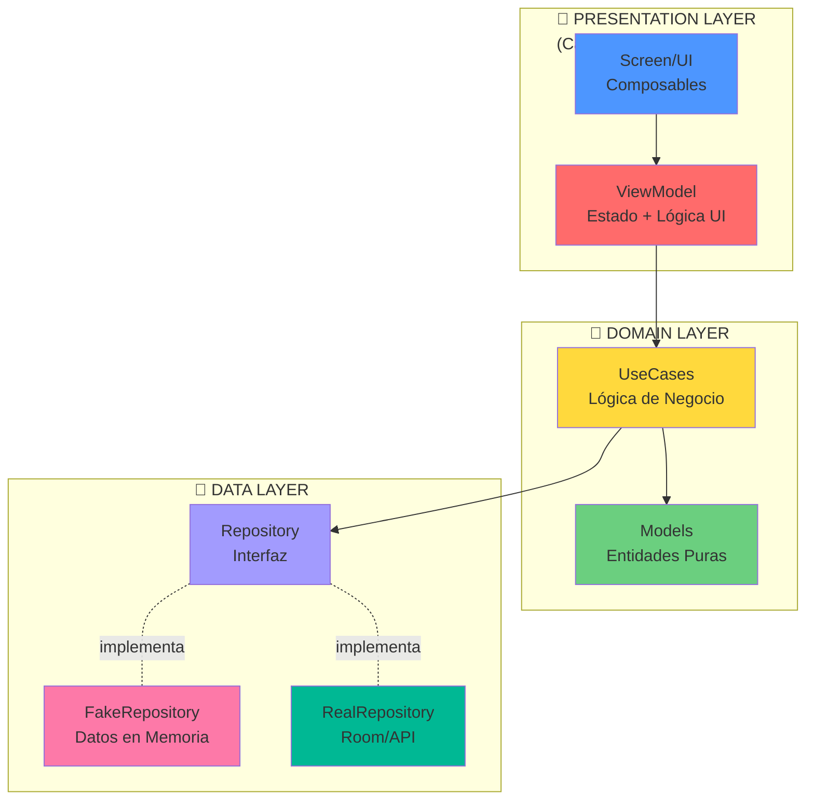


!!! tip "¿Por qué Clean Architecture?"
    - **Separación de responsabilidades**: Cada capa tiene un propósito claro
    - **Testeable**: Puedes probar cada capa de forma independiente
    - **Mantenible**: Los cambios en una capa no afectan a otras
    - **Escalable**: Fácil agregar nuevas funcionalidades
    - **Independiente del framework**: La lógica no depende de Android

### El flujo de desarrollo: Prototipo → Producción

En esta guía seguiremos un enfoque **iterativo e incremental**:

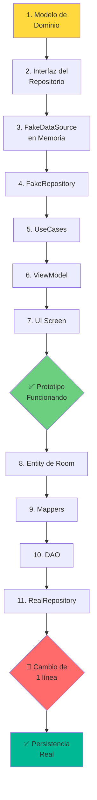


**Ventajas de este enfoque:**

1. **Ves resultados rápido**: En pocos pasos tienes algo funcionando
2. **Aprendes incrementalmente**: Cada fase agrega complejidad gradualmente
3. **Fácil de debuggear**: Si algo falla, sabes exactamente dónde
4. **Profesional**: Es cómo se trabaja en equipos reales

---

## 2. El Ejemplo Práctico: Feature "Notas de Juego"

### Descripción de la funcionalidad

Vamos a implementar una feature que permite al usuario **guardar notas personales** sobre sus videojuegos. Es como un diario de jugador donde puede:

- ✍️ Escribir comentarios sobre un juego
- 📊 Marcar el estado de progreso (Pendiente, Jugando, Completado, Abandonado)
- 📅 Ver cuándo fue la última actualización
- 🗑️ Eliminar notas que ya no necesita

### Requisitos funcionales

| Funcionalidad | Descripción |
|---------------|-------------|
| **Ver notas** | Mostrar todas las notas del usuario para un juego específico |
| **Crear nota** | Guardar una nueva nota con texto y estado |
| **Actualizar nota** | Modificar una nota existente |
| **Eliminar nota** | Borrar una nota del sistema |
| **Validar** | El texto no puede estar vacío |

### Mockup visual de la UI

```mermaid
graph TD
    subgraph "GameNoteScreen"
        A[TopAppBar<br/>← Volver | Notas del Juego]
        B[TextField<br/>Escribe tu nota aquí...]
        C[Selector de Estado<br/>⚪ Pendiente | 🎮 Jugando | ✅ Completado | ❌ Abandonado]
        D[Botón: Guardar Nota]
        E[Lista de Notas Guardadas<br/>📝 Nota 1<br/>📝 Nota 2<br/>📝 Nota 3]
    end
    
    A --> B
    B --> C
    C --> D
    D --> E
    
    style A fill:#4d96ff
    style B fill:#ffd93d
    style C fill:#a29bfe
    style D fill:#00b894
    style E fill:#ff6b6b
```


---

## 3. FASE 1: El Modelo de Dominio

### ¿Qué es un Modelo de Dominio?

El **Modelo de Dominio** es la representación "pura" de los datos en tu aplicación. Es la entidad tal como existe en la lógica de negocio, **sin dependencias** de frameworks, bases de datos o librerías externas.

!!! success "Características del Domain Model"
- ✅ **Inmutable**: Usa `val` en lugar de `var`
- ✅ **Kotlin puro**: No anotaciones de Room, Retrofit, etc.
- ✅ **Data class**: Aprovecha las ventajas de Kotlin
- ✅ **Tipos complejos**: Puede usar Enums, otras data classes, etc.
- ✅ **Lógica de dominio**: Puede tener métodos de validación

### ¿Por qué empezamos aquí?

El modelo de dominio es el **corazón** de tu feature. Define:

- Qué información es importante
- Cómo se relacionan los datos
- Qué validaciones son necesarias

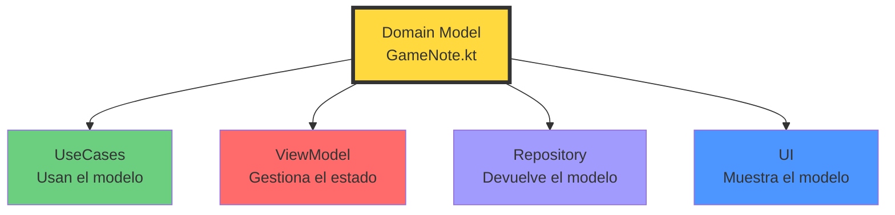


### Crear el Modelo: GameNote.kt

**Ubicación**: `domain/model/GameNote.kt`


??? info "GameNote.kt"
    ```kotlin
    package com.pmdm.mygamestore.domain.model

    /**
    * 📝 Modelo de dominio que representa una nota de juego
    * 
    * CARACTERÍSTICAS:
    * - Inmutable (val): No se modifica después de crearse
    * - Kotlin puro: Sin dependencias de frameworks
    * - Data class: equals, hashCode, toString, copy generados automáticamente
    * 
    * @property id Identificador único de la nota (0 para notas nuevas)
    * @property gameId ID del juego al que pertenece la nota
    * @property username Nombre del usuario que creó la nota
    * @property note Texto de la nota (observaciones, comentarios)
    * @property progressStatus Estado de progreso del juego
    * @property lastUpdated Timestamp de la última actualización (epoch millis)
    */
    data class GameNote(
        val id: Int = 0,
        val gameId: Int,
        val username: String,
        val note: String,
        val progressStatus: ProgressStatus,
        val lastUpdated: Long = System.currentTimeMillis()
    ) {
        /**
        * 🔍 Validación: Verifica si la nota es válida para guardarse
        * 
        * @return true si la nota tiene contenido válido
        */
        fun isValid(): Boolean {
            return note.isNotBlank() && note.length <= 500
        }
        
        /**
        * 📊 Utilidad: Obtiene un mensaje descriptivo del estado
        */
        fun getStatusDescription(): String {
            return when (progressStatus) {
                ProgressStatus.PENDING -> "Pendiente de jugar"
                ProgressStatus.PLAYING -> "Jugando actualmente"
                ProgressStatus.COMPLETED -> "Juego completado"
                ProgressStatus.ABANDONED -> "Abandonado"
            }
        }
    }

    /**
    * 📊 Estados posibles de progreso de un juego
    * 
    * Enum que representa las diferentes etapas en las que puede estar
    * un juego en la biblioteca del usuario.
    */
    enum class ProgressStatus {
        /** ⚪ El juego está en la lista pero no se ha empezado */
        PENDING,
        
        /** 🎮 El usuario está jugando activamente */
        PLAYING,
        
        /** ✅ El juego ha sido completado */
        COMPLETED,
        
        /** ❌ El usuario decidió no continuar */
        ABANDONED
    }
    ```


### Conceptos clave del modelo

#### 1. **¿Por qué `data class`?**

```kotlin
// Kotlin genera automáticamente:

// equals(): Compara por contenido
val note1 = GameNote(id = 1, gameId = 10, ...)
val note2 = GameNote(id = 1, gameId = 10, ...)
println(note1 == note2) // true

// hashCode(): Para usar en colecciones
val set = setOf(note1, note2) // Solo guarda 1 elemento

// toString(): Para debugging
println(note1) // GameNote(id=1, gameId=10, username=admin, ...)

// copy(): Para crear variantes
val updated = note1.copy(note = "Nuevo texto")
```


#### 2. **¿Por qué inmutabilidad (`val`)?**

```kotlin
// ❌ MAL: Mutable (var)
data class BadNote(
    var note: String
)
val bad = BadNote("Texto original")
bad.note = "Modificado" // Peligroso en arquitecturas reactivas

// ✅ BIEN: Inmutable (val)
data class GameNote(
    val note: String
)
val good = GameNote("Texto original")
val modified = good.copy(note = "Modificado") // Crea nueva instancia
```


**Ventajas de la inmutabilidad:**

- 🔒 **Thread-safe**: No hay condiciones de carrera
- 🐛 **Menos bugs**: No se modifica accidentalmente
- 🔄 **Reactivo**: Perfecto para StateFlow/Flow
- 📝 **Historial**: Puedes mantener versiones anteriores

#### 3. **¿Por qué métodos en el modelo?**

```kotlin
// Lógica de dominio dentro del modelo
fun isValid(): Boolean {
    return note.isNotBlank() && note.length <= 500
}

// Uso en el ViewModel
fun saveNote() {
    if (currentNote.isValid()) {
        // Guardar
    } else {
        // Mostrar error
    }
}
```


**Ventaja**: La lógica de validación está donde pertenece (en el modelo), no dispersa en ViewModels o Repositories.

---

## 4. FASE 2: La Interfaz del Repositorio

### ¿Por qué definir el contrato primero?

En programación orientada a objetos, una **interfaz** es un contrato que define **qué** hace un componente, pero no **cómo** lo hace. Esto es fundamental en Clean Architecture.

!!! tip "Principio de Inversión de Dependencias (SOLID)"

    Las capas superiores (ViewModel, UseCases) deben depender de **abstracciones** (interfaces), no de implementaciones concretas (clases).

    ```mermaid
    graph TB
        subgraph "❌ MAL: Dependencia de implementación"
            VM1[ViewModel]
            REPO1[FakeRepositoryImpl]
            VM1 -.depende de.- REPO1
        end
        
        subgraph "✅ BIEN: Dependencia de abstracción"
            VM2[ViewModel]
            INTERFACE[GameNoteRepository<br/>Interface]
            FAKE[FakeRepositoryImpl]
            REAL[RealRepositoryImpl]
            
            VM2 -.depende de.- INTERFACE
            INTERFACE -.implementa.- FAKE
            INTERFACE -.implementa.- REAL
        end
        
        style VM1 fill:#ff6b6b
        style REPO1 fill:#fd79a8
        style VM2 fill:#6bcf7f
        style INTERFACE fill:#ffd93d
        style FAKE fill:#a29bfe
        style REAL fill:#00b894
    ```


### Repository como puente entre capas

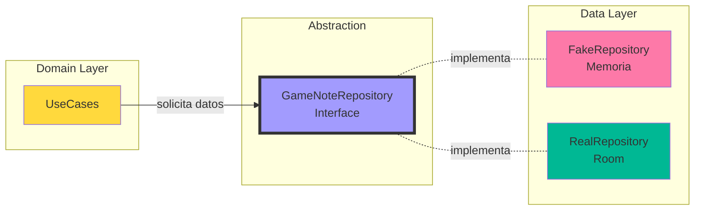


### Crear la Interfaz: GameNoteRepository.kt

**Ubicación**: `domain/repository/GameNoteRepository.kt`

??? info "GameNoteRepository.kt"
    
    ```kotlin
    package com.pmdm.mygamestore.domain.repository

    import com.pmdm.mygamestore.domain.model.GameNote
    import com.pmdm.mygamestore.domain.model.Resource
    import kotlinx.coroutines.flow.Flow

    /**
    * 📋 Interfaz que define el contrato del repositorio de notas de juego
    * 
    * PATRÓN REPOSITORY:
    * - Abstrae la fuente de datos (memoria, Room, API)
    * - Permite múltiples implementaciones (Fake, Real)
    * - Facilita testing con mocks
    * - Aplica Inversión de Dependencias (SOLID)
    * 
    * IMPLEMENTACIONES:
    * 1. FakeGameNoteRepositoryImpl → Desarrollo rápido, datos en memoria
    * 2. GameNoteRepositoryImpl → Producción, persistencia con Room
    * 
    * IMPORTANTE - Resource Pattern:
    * Todos los métodos devuelven Flow<Resource<T>> o Resource<T> para manejar:
    * - Loading: Operación en progreso
    * - Success: Datos obtenidos correctamente
    * - Error: Algo falló con información específica
    */
    interface GameNoteRepository {
        
        /**
        * 📚 Obtiene todas las notas de un usuario específico
        * 
        * @param username Nombre del usuario
        * @return Flow que emite Resource con lista de notas
        * 
        * Ejemplo de uso:
        * ```
        * repository.getAllNotes("admin").collect { resource ->
        *     when (resource) {
        *         is Resource.Loading -> showLoading()
        *         is Resource.Success -> showNotes(resource.data)
        *         is Resource.Error -> showError(resource.error)
        *     }
        * }
        * ```
        */
        fun getAllNotes(username: String): Flow<Resource<List<GameNote>>>
        
        /**
        * 🔍 Obtiene la nota de un juego específico para un usuario
        * 
        * @param gameId ID del juego
        * @param username Nombre del usuario
        * @return Resource con la nota encontrada o null si no existe
        * 
        * Uso típico:
        * - Cargar nota existente al entrar en DetailScreen
        * - Verificar si el usuario ya tiene nota antes de crear una nueva
        */
        suspend fun getNoteByGameId(gameId: Int, username: String): Resource<GameNote?>
        
        /**
        * 💾 Guarda o actualiza una nota
        * 
        * Si la nota tiene id = 0, crea una nueva.
        * Si la nota tiene id > 0, actualiza la existente.
        * 
        * @param note Nota a guardar/actualizar
        * @return Resource.Success(Unit) si todo OK, Resource.Error si falla
        * 
        * Validaciones recomendadas antes de llamar:
        * - note.isValid() == true
        * - note.note.isNotBlank()
        */
        suspend fun saveNote(note: GameNote): Resource<Unit>
        
        /**
        * 🗑️ Elimina la nota de un juego específico
        * 
        * @param gameId ID del juego
        * @param username Nombre del usuario
        * @return Resource.Success(Unit) si se eliminó, Resource.Error si no existe o falla
        */
        suspend fun deleteNote(gameId: Int, username: String): Resource<Unit>
        
        /**
        * 📊 Obtiene todas las notas filtradas por estado de progreso
        * 
        * @param username Nombre del usuario
        * @param status Estado a filtrar (PENDING, PLAYING, COMPLETED, ABANDONED)
        * @return Flow que emite Resource con lista filtrada
        * 
        * Uso típico:
        * - Mostrar solo juegos "Jugando"
        * - Crear sección de "Completados"
        */
        fun getNotesByStatus(username: String, status: ProgressStatus): Flow<Resource<List<GameNote>>>
    }
    ```


### Conceptos clave de la interfaz

#### 1. **¿Por qué Flow<Resource<T>>?**

```kotlin
// Flow: Permite reactividad (cambios automáticos en la UI)
fun getAllNotes(username: String): Flow<Resource<List<GameNote>>>

// Cuando cambian los datos en Room:
Room → DAO (Flow) → Repository (Flow) → ViewModel (StateFlow) → UI (recomposición automática)
```


#### 2. **¿Por qué Resource<T>?**

```kotlin
// Sin Resource: ¿Cómo sabes si está cargando o falló?
fun getData(): Flow<List<GameNote>> // ❌ No sabes el estado

// Con Resource: Estados explícitos
fun getData(): Flow<Resource<List<GameNote>>> // ✅ Loading, Success, Error

when (result) {
    is Resource.Loading -> showSpinner()
    is Resource.Success -> showData(result.data)
    is Resource.Error -> showError(result.error.message)
}
```


#### 3. **suspend fun vs Flow**

```kotlin
// suspend: Devuelve UN valor
suspend fun getNoteByGameId(): Resource<GameNote?> // ✅ Correcto para operaciones únicas

// Flow: Puede emitir MÚLTIPLES valores en el tiempo
fun getAllNotes(): Flow<Resource<List<GameNote>>> // ✅ Correcto para observar cambios
```


---

## 5. FASE 3: FakeDataSource (Prototipado Rápido)

### ¿Qué es un DataSource?

Un **DataSource** es el componente que tiene acceso directo a los datos. En arquitectura real, pueden ser:

- **LocalDataSource**: Room, DataStore, SharedPreferences
- **RemoteDataSource**: Retrofit, Ktor, Firebase

En nuestro caso de prototipado, será una lista mutable en memoria.

### Ventajas de prototipar en memoria

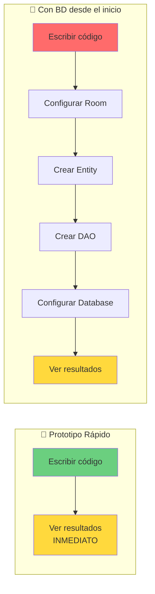


**Beneficios:**

1. ✅ **Velocidad**: Ves la UI funcionando en minutos
2. ✅ **Experimentación**: Prueba diferentes diseños sin complicaciones
3. ✅ **Aprendizaje**: Entiendes el flujo antes de agregar complejidad
4. ✅ **Testing**: Fácil crear escenarios de prueba
5. ✅ **Demos**: Muestra prototipos a stakeholders sin backend

### DataSource en memoria vs persistencia real

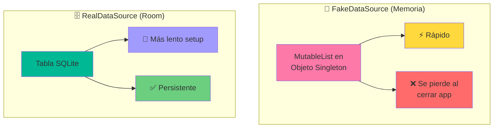


### Crear el FakeDataSource

**Ubicación**: `data/local/FakeGameNoteDataSource.kt`

??? info "FakeDataSource"
    
    ```kotlin
    package com.pmdm.mygamestore.data.local

    import com.pmdm.mygamestore.domain.model.GameNote
    import com.pmdm.mygamestore.domain.model.ProgressStatus

    /**
    * 💾 DataSource falso que simula una base de datos en memoria
    * 
    * PROPÓSITO:
    * - Desarrollo rápido sin configurar Room
    * - Testing con datos controlados
    * - Demos y prototipos
    * 
    * IMPORTANTE:
    * ⚠️ Los datos se pierden al cerrar la app
    * ⚠️ No usar en producción
    * ⚠️ Thread-safe básico (synchronized)
    * 
    * VENTAJAS:
    * ✅ Código simple y directo
    * ✅ Sin configuración
    * ✅ Ideal para aprender el flujo
    */
    object FakeGameNoteDataSource {
        
        /**
        * Lista mutable que simula una tabla de base de datos
        * En Room, esto sería: SELECT * FROM game_notes
        */
        private val notes = mutableListOf<GameNote>()
        
        /**
        * Contador para generar IDs únicos
        * En Room, esto lo hace el autoincrement
        */
        private var nextId = 1
        
        /**
        * 📚 Obtiene todas las notas de un usuario
        * 
        * Equivalente SQL: SELECT * FROM game_notes WHERE username = ?
        */
        @Synchronized
        fun getAllNotes(username: String): List<GameNote> {
            return notes.filter { it.username == username }
        }
        
        /**
        * 🔍 Busca una nota específica por gameId y usuario
        * 
        * Equivalente SQL: SELECT * FROM game_notes WHERE gameId = ? AND username = ?
        */
        @Synchronized
        fun getNoteByGameId(gameId: Int, username: String): GameNote? {
            return notes.find { it.gameId == gameId && it.username == username }
        }
        
        /**
        * 💾 Guarda o actualiza una nota
        * 
        * Si id == 0: INSERT (crear nueva)
        * Si id > 0: UPDATE (actualizar existente)
        * 
        * Equivalente SQL:
        * - INSERT: INSERT INTO game_notes (...) VALUES (...)
        * - UPDATE: UPDATE game_notes SET ... WHERE id = ?
        */
        @Synchronized
        fun saveNote(note: GameNote): GameNote {
            return if (note.id == 0) {
                // Crear nueva nota con ID generado
                val newNote = note.copy(
                    id = nextId++,
                    lastUpdated = System.currentTimeMillis()
                )
                notes.add(newNote)
                newNote
            } else {
                // Actualizar nota existente
                val index = notes.indexOfFirst { it.id == note.id }
                if (index != -1) {
                    val updatedNote = note.copy(lastUpdated = System.currentTimeMillis())
                    notes[index] = updatedNote
                    updatedNote
                } else {
                    // Si no existe, la agregamos (caso edge)
                    val newNote = note.copy(lastUpdated = System.currentTimeMillis())
                    notes.add(newNote)
                    newNote
                }
            }
        }
        
        /**
        * 🗑️ Elimina una nota específica
        * 
        * Equivalente SQL: DELETE FROM game_notes WHERE gameId = ? AND username = ?
        */
        @Synchronized
        fun deleteNote(gameId: Int, username: String): Boolean {
            return notes.removeIf { it.gameId == gameId && it.username == username }
        }
        
        /**
        * 📊 Filtra notas por estado de progreso
        * 
        * Equivalente SQL: SELECT * FROM game_notes WHERE username = ? AND progressStatus = ?
        */
        @Synchronized
        fun getNotesByStatus(username: String, status: ProgressStatus): List<GameNote> {
            return notes.filter { it.username == username && it.progressStatus == status }
        }
        
        /**
        * 🧹 Limpia todos los datos (útil para testing)
        * 
        * Equivalente SQL: DELETE FROM game_notes
        */
        @Synchronized
        fun clearAll() {
            notes.clear()
            nextId = 1
        }
        
        /**
        * 🎲 Agrega datos de ejemplo para testing
        */
        @Synchronized
        fun populateWithSampleData(username: String) {
            val sampleNotes = listOf(
                GameNote(
                    id = nextId++,
                    gameId = 3498,
                    username = username,
                    note = "Increíble jugabilidad, la historia me atrapó desde el principio.",
                    progressStatus = ProgressStatus.PLAYING
                ),
                GameNote(
                    id = nextId++,
                    gameId = 3328,
                    username = username,
                    note = "Completado al 100%. Una obra maestra.",
                    progressStatus = ProgressStatus.COMPLETED
                ),
                GameNote(
                    id = nextId++,
                    gameId = 4200,
                    username = username,
                    note = "Lo dejé en el nivel 5, no me convenció el combate.",
                    progressStatus = ProgressStatus.ABANDONED
                )
            )
            notes.addAll(sampleNotes)
        }
    }
    ```


### Conceptos clave del DataSource

#### 1. **¿Por qué `object` (Singleton)?**

```kotlin
// object: Solo existe UNA instancia en toda la app
object FakeGameNoteDataSource {
    private val notes = mutableListOf<GameNote>()
}

// Equivalente a:
class FakeGameNoteDataSource private constructor() {
    companion object {
        val INSTANCE = FakeGameNoteDataSource()
    }
}

// Ventaja: Todos acceden a los mismos datos
val repo1 = FakeGameNoteRepositoryImpl()
val repo2 = FakeGameNoteRepositoryImpl()
// Ambos ven las mismas notas porque usan el mismo DataSource
```


#### 2. **¿Por qué `@Synchronized`?**

```kotlin
@Synchronized
fun saveNote(note: GameNote) {
    // Thread-safe: Solo un hilo a la vez
}

// Sin @Synchronized:
Thread 1: lee notes.size = 5
Thread 2: lee notes.size = 5
Thread 1: agrega nota → size = 6
Thread 2: agrega nota → size = 6 ❌ (perdió el cambio de Thread 1)

// Con @Synchronized:
Thread 1: lee notes.size = 5
Thread 1: agrega nota → size = 6
Thread 2: espera...
Thread 2: lee notes.size = 6
Thread 2: agrega nota → size = 7 ✅
```


#### 3. **Generación de IDs**

```kotlin
private var nextId = 1

fun saveNote(note: GameNote): GameNote {
    if (note.id == 0) {
        val newNote = note.copy(id = nextId++)
        // nextId++ → usa el valor actual y luego incrementa
        // Equivalente a:
        // val newId = nextId
        // nextId = nextId + 1
        // note.copy(id = newId)
    }
}
```


---

## 6. FASE 4: FakeRepository (Implementación en Memoria)

### Implementar la interfaz con datos fake

Ahora creamos la primera **implementación** de nuestra interfaz `GameNoteRepository`. Esta versión usa el `FakeDataSource` que acabamos de crear.

### Simular delays de red para realismo

Un detalle profesional: aunque los datos están en memoria, **simulamos delays** para que la experiencia sea realista y podamos probar los estados de `Loading`.

```kotlin
// Simula que estamos esperando una respuesta de API
delay(800) // 800ms como una petición HTTP promedio
```


### Flujo de datos con FakeRepository

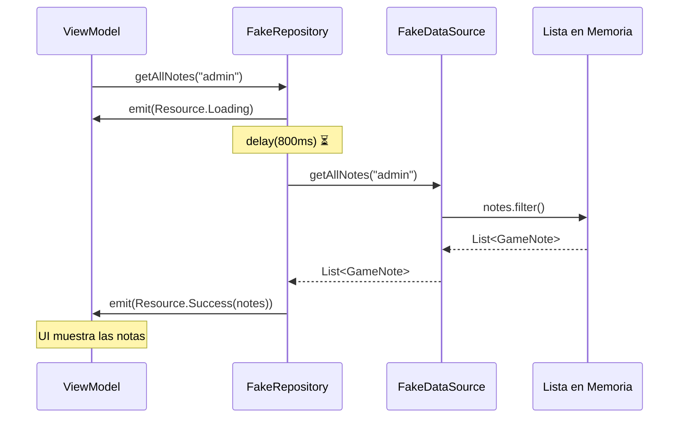


### Crear el FakeRepository

**Ubicación**: `data/repository/FakeGameNoteRepositoryImpl.kt`

??? info "FakeRepository"
    
    ```kotlin
    /**
    * 💾 Implementación FAKE del repositorio de notas
    * 
    * PROPÓSITO:
    * - Desarrollo rápido sin configurar Room
    * - Testing con datos controlados
    * - Demostración de funcionalidad
    * 
    * CARACTERÍSTICAS:
    * ✅ Implementa GameNoteRepository (cumple el contrato)
    * ✅ Usa FakeDataSource (datos en memoria)
    * ✅ Simula delays de red (realismo)
    * ✅ Devuelve Resource (Loading/Success/Error)
    * ✅ Maneja errores con try-catch
    * 
    * IMPORTANTE:
    * ⚠️ Los datos NO persisten al cerrar la app
    * ⚠️ NO usar en producción
    * 
    * TRANSICIÓN A REAL:
    * Cambiar SOLO esta clase por GameNoteRepositoryImpl
    * El resto del código NO cambia (ViewModel, UseCases, UI)
    */
    class FakeGameNoteRepositoryImpl : GameNoteRepository {
        
        /**
        * Referencia al DataSource falso
        * En la versión real, esto sería: private val dao: GameNoteDao
        */
        private val dataSource = FakeGameNoteDataSource
        
        /**
        * 🌐 Simula un delay de red para testing realista
        * 
        * ¿Por qué?
        * - Permite ver el estado Loading en la UI
        * - Simula latencia de API real
        * - Ayuda a detectar problemas de UX (ej: doble click en botón)
        */
        private suspend fun simulateNetworkDelay() {
            delay(800) // 800ms = latencia promedio de API
        }
        
        /**
        * 📚 Implementación: Obtener todas las notas
        * 
        * FLUJO:
        * 1. Emite Loading
        * 2. Simula delay de red
        * 3. Obtiene datos del DataSource
        * 4. Emite Success con los datos
        * 5. Si falla, emite Error
        */
        override fun getAllNotes(username: String): Flow<Resource<List<GameNote>>> = flow {
            try {
                // 1. Empezamos mostrando loading
                emit(Resource.Loading)
    ```kotlin
    // 2. Simulamos latencia de red
                simulateNetworkDelay()
                
                // 3. Obtenemos datos del DataSource
                val notes = dataSource.getAllNotes(username)
                
                // 4. Emitimos éxito con los datos
                emit(Resource.Success(notes))
                
            } catch (e: Exception) {
                // 5. Si algo falla, emitimos error
                emit(Resource.Error(
                    AppError.Unknown("Failed to load notes: ${e.message}")
                ))
            }
        }
        
        /**
        * 🔍 Implementación: Obtener nota específica por gameId
        * 
        * DIFERENCIA con getAllNotes:
        * - No usa Flow (no necesita reactividad)
        * - Devuelve Resource<GameNote?> directamente
        * - El "?" indica que puede no existir
        */
        override suspend fun getNoteByGameId(gameId: Int, username: String): Resource<GameNote?> {
            return try {
                simulateNetworkDelay()
                
                val note = dataSource.getNoteByGameId(gameId, username)
                Resource.Success(note) // null si no existe
                
            } catch (e: Exception) {
                Resource.Error(
                    AppError.Unknown("Failed to get note: ${e.message}")
                )
            }
        }
        
        /**
        * 💾 Implementación: Guardar o actualizar nota
        * 
        * LÓGICA:
        * - Si note.id == 0 → Crear nueva
        * - Si note.id > 0 → Actualizar existente
        * 
        * VALIDACIONES:
        * - Verificar que note.isValid() antes de llamar
        * - El DataSource maneja la lógica de INSERT/UPDATE
        */
        override suspend fun saveNote(note: GameNote): Resource<Unit> {
            return try {
                // Validación en Repository
                if (!note.isValid()) {
                    return Resource.Error(
                        AppError.ValidationError("Note text cannot be empty and must be less than 500 characters")
                    )
                }
                
                simulateNetworkDelay()
                
                // Guardar en DataSource (devuelve la nota con ID generado)
                dataSource.saveNote(note)
                
                // Devolvemos Unit porque no necesitamos retornar nada
                Resource.Success(Unit)
                
            } catch (e: Exception) {
                Resource.Error(
                    AppError.Unknown("Failed to save note: ${e.message}")
                )
            }
        }
        
        /**
        * 🗑️ Implementación: Eliminar nota
        * 
        * RETORNO:
        * - Success(Unit) si se eliminó correctamente
        * - Error si no existía o falló
        */
        override suspend fun deleteNote(gameId: Int, username: String): Resource<Unit> {
            return try {
                simulateNetworkDelay()
                
                val deleted = dataSource.deleteNote(gameId, username)
                
                if (deleted) {
                    Resource.Success(Unit)
                } else {
                    Resource.Error(AppError.NotFound)
                }
                
            } catch (e: Exception) {
                Resource.Error(
                    AppError.Unknown("Failed to delete note: ${e.message}")
                )
            }
        }
        
        /**
        * 📊 Implementación: Filtrar por estado
        * 
        * Uso típico:
        * - Mostrar solo juegos "Jugando"
        * - Crear pantalla de "Completados"
        */
        override fun getNotesByStatus(
            username: String, 
            status: ProgressStatus
        ): Flow<Resource<List<GameNote>>> = flow {
            try {
                emit(Resource.Loading)
                simulateNetworkDelay()
                
                val notes = dataSource.getNotesByStatus(username, status)
                emit(Resource.Success(notes))
                
            } catch (e: Exception) {
                emit(Resource.Error(
                    AppError.Unknown("Failed to filter notes: ${e.message}")
                ))
            }
        }
    }
    ```


    ### Conceptos clave del FakeRepository

    #### 1. **Flow builder con try-catch**

    ```kotlin
    fun getData(): Flow<Resource<T>> = flow {
        try {
            emit(Resource.Loading)
            // Operación que puede fallar
            val data = fetchData()
            emit(Resource.Success(data))
        } catch (e: Exception) {
            emit(Resource.Error(AppError.Unknown(e.message)))
        }
    }
    ```


**¿Por qué este patrón?**

- ✅ El `try-catch` captura cualquier error
- ✅ `emit()` envía valores al observador
- ✅ `Resource` unifica los estados
- ✅ La UI recibe estados ordenados: Loading → Success/Error

#### 2. **suspend fun vs Flow: ¿Cuándo usar cada uno?**

```kotlin
// ✅ Flow: Para observar cambios en el tiempo
override fun getAllNotes(): Flow<Resource<List<GameNote>>>
// Uso: viewModel.getAllNotes().collect { ... }
// Beneficio: Si cambias una nota, el Flow emite de nuevo

// ✅ suspend fun: Para operaciones únicas
override suspend fun getNoteByGameId(): Resource<GameNote?>
// Uso: val result = repository.getNoteByGameId(...)
// Beneficio: Más simple para operaciones one-shot
```


#### 3. **Resource.Success(Unit)**

```kotlin
// Unit es como "void" en Java
// Indica que la operación fue exitosa pero no devuelve datos

suspend fun saveNote(note: GameNote): Resource<Unit> {
    dataSource.saveNote(note)
    return Resource.Success(Unit) // ✅ "Guardado correctamente"
}

// En el ViewModel:
when (result) {
    is Resource.Success -> showMessage("Saved!")
    is Resource.Error -> showError(result.error)
}
```


---

## 7. FASE 5: Casos de Uso (Domain Layer)

### ¿Qué es un UseCase?

Un **UseCase** (Caso de Uso) representa una **acción específica** que un usuario puede realizar en la aplicación. Encapsula la lógica de negocio y orquesta llamadas a uno o más repositorios.

!!! tip "Diferencia entre UseCase y Repository"
    - **Repository**: *"¿Cómo obtener/guardar datos?"* (acceso a datos)
    - **UseCase**: *"¿Qué reglas aplicar a esos datos?"* (lógica de negocio)

### Lógica de negocio vs acceso a datos

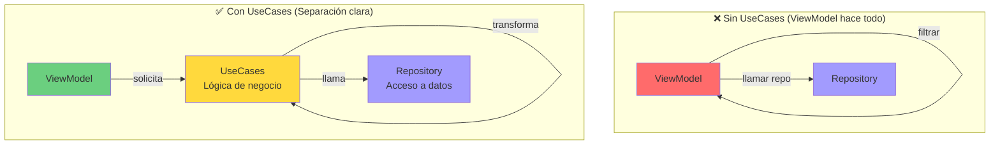


### UseCases orquestando Repository

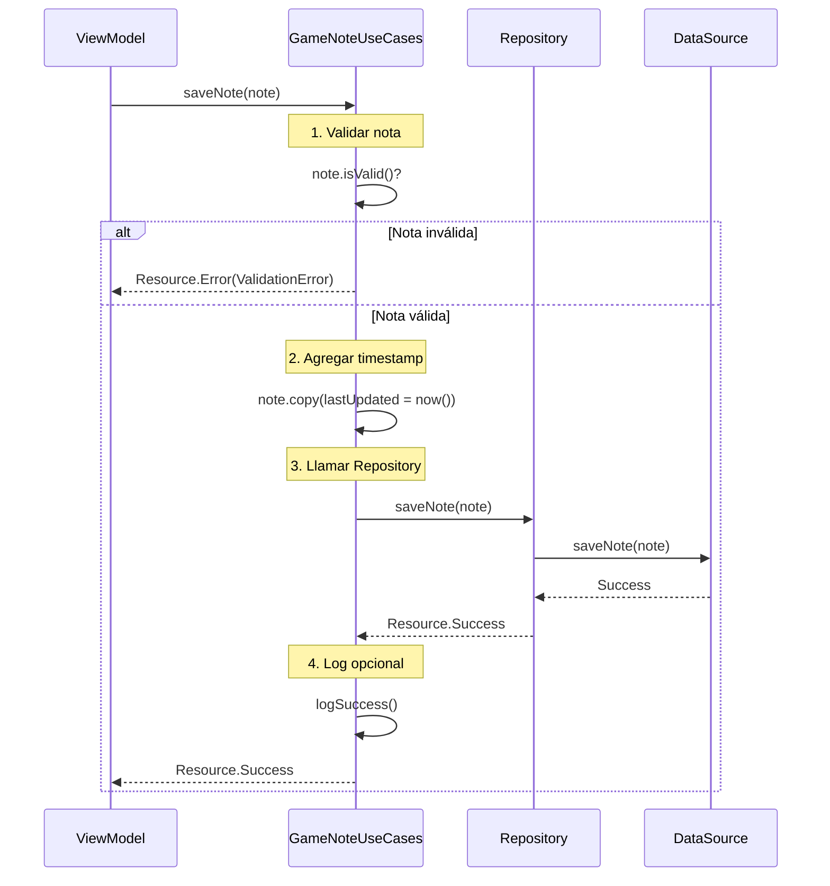


### Crear los UseCases

**Ubicación**: `domain/usecase/GameNoteUseCases.kt`

??? info "GameNoteUseCases.kt"
    
    ```kotlin
    package com.pmdm.mygamestore.domain.usecase

    import com.pmdm.mygamestore.domain.model.AppError
    import com.pmdm.mygamestore.domain.model.GameNote
    import com.pmdm.mygamestore.domain.model.ProgressStatus
    import com.pmdm.mygamestore.domain.model.Resource
    import com.pmdm.mygamestore.domain.repository.GameNoteRepository
    import kotlinx.coroutines.flow.Flow
    import kotlinx.coroutines.flow.map

    /**
    * 💼 Casos de uso para operaciones con notas de juego
    * 
    * PATRÓN USE CASE:
    * - Encapsula lógica de negocio específica
    * - Orquesta llamadas a repositories
    * - Aplica validaciones y transformaciones
    * - Es independiente del framework (no depende de Android)
    * 
    * RESPONSABILIDADES:
    * ✅ Validar datos antes de guardar
    * ✅ Transformar datos según reglas de negocio
    * ✅ Combinar múltiples llamadas a repositorios
    * ✅ Aplicar lógica de dominio (ej: calcular estadísticas)
    * 
    * NO ES RESPONSABILIDAD:
    * ❌ Acceso directo a DataSource/Room
    * ❌ Manejo de estados de UI
    * ❌ Navegación
    * 
    * @property repository Repositorio de notas (puede ser Fake o Real)
    */
    class GameNoteUseCases(
        private val repository: GameNoteRepository
    ) {
        
        /**
        * 📚 Caso de uso: Obtener todas las notas de un usuario
        * 
        * LÓGICA ADICIONAL:
        * - Ordena por fecha de actualización (más recientes primero)
        * - Podría agregar filtros adicionales
        * 
        * @param username Usuario actual
        * @return Flow con notas ordenadas
        */
        fun getNotesForUser(username: String): Flow<Resource<List<GameNote>>> {
            return repository.getAllNotes(username)
                .map { resource ->
                    when (resource) {
                        is Resource.Success -> {
                            // Ordenar por fecha (más recientes primero)
                            val sortedNotes = resource.data.sortedByDescending { it.lastUpdated }
                            Resource.Success(sortedNotes)
                        }
                        is Resource.Loading -> resource
                        is Resource.Error -> resource
                    }
                }
        }
        
        /**
        * 🔍 Caso de uso: Obtener nota de un juego específico
        * 
        * Sin lógica adicional por ahora, pero podría:
        * - Verificar permisos
        * - Registrar analytics
        * - Cachear resultados
        */
        suspend fun getNoteForGame(gameId: Int, username: String): Resource<GameNote?> {
            return repository.getNoteByGameId(gameId, username)
        }
        
        /**
        * 💾 Caso de uso: Guardar o actualizar nota
        * 
        * VALIDACIONES DE NEGOCIO:
        * 1. Verificar que el texto no esté vacío
        * 2. Verificar longitud máxima (500 caracteres)
        * 3. Actualizar timestamp automáticamente
        * 4. Sanitizar texto (opcional)
        * 
        * FLUJO:
        * Usuario → ViewModel → UseCase (valida) → Repository (guarda)
        * 
        * @param note Nota a guardar
        * @return Resource.Success si se guardó, Error si falló validación
        */
        suspend fun saveNote(note: GameNote): Resource<Unit> {
            // 1. Validación básica
            if (!note.isValid()) {
                return Resource.Error(
                    AppError.ValidationError("Note must have content and be less than 500 characters")
                )
            }
            
            // 2. Validación de negocio adicional
            if (note.gameId <= 0) {
                return Resource.Error(
                    AppError.ValidationError("Invalid game ID")
                )
            }
            
            if (note.username.isBlank()) {
                return Resource.Error(
                    AppError.ValidationError("Username is required")
                )
            }
            
            // 3. Sanitizar texto (quitar espacios extra)
            val sanitizedNote = note.copy(
                note = note.note.trim(),
                lastUpdated = System.currentTimeMillis() // Actualizar timestamp
            )
            
            // 4. Guardar en repository
            return repository.saveNote(sanitizedNote)
        }
        
        /**
        * 🗑️ Caso de uso: Eliminar nota
        * 
        * VALIDACIONES:
        * - Verificar que el juego tenga nota antes de intentar eliminar
        * 
        * LÓGICA ADICIONAL:
        * - Podría pedir confirmación
        * - Registrar en analytics
        * - Crear backup antes de eliminar
        */
        suspend fun deleteNote(gameId: Int, username: String): Resource<Unit> {
            // Verificar que existe antes de eliminar
            val existingNote = repository.getNoteByGameId(gameId, username)
            
            return when (existingNote) {
                is Resource.Success -> {
                    if (existingNote.data == null) {
                        Resource.Error(
                            AppError.NotFound
                        )
                    } else {
                        repository.deleteNote(gameId, username)
                    }
                }
                is Resource.Error -> existingNote
                is Resource.Loading -> Resource.Error(
                    AppError.Unknown("Unexpected loading state")
                )
            }
        }
        
        /**
        * 📊 Caso de uso: Obtener notas por estado
        * 
        * LÓGICA ADICIONAL:
        * - Ordena por fecha
        * - Podría agregar contador de notas por estado
        * 
        * @param username Usuario actual
        * @param status Estado a filtrar
        * @return Flow con notas filtradas y ordenadas
        */
        fun getNotesByStatus(
            username: String, 
            status: ProgressStatus
        ): Flow<Resource<List<GameNote>>> {
            return repository.getNotesByStatus(username, status)
                .map { resource ->
                    when (resource) {
                        is Resource.Success -> {
                            val sortedNotes = resource.data.sortedByDescending { it.lastUpdated }
                            Resource.Success(sortedNotes)
                        }
                        is Resource.Loading -> resource
                        is Resource.Error -> resource
                    }
                }
        }
        
        /**
        * 📈 Caso de uso: Obtener estadísticas de notas
        * 
        * LÓGICA DE NEGOCIO COMPLEJA:
        * - Cuenta notas por estado
        * - Calcula porcentajes
        * - Útil para pantalla de estadísticas
        * 
        * Ejemplo de lógica que NO debe estar en Repository
        */
        suspend fun getNotesStatistics(username: String): Resource<NoteStatistics> {
            val notesResult = repository.getAllNotes(username)
            
            // Convertir Flow a lista (tomar primer valor)
            var statistics: NoteStatistics? = null
            
            notesResult.collect { resource ->
                when (resource) {
                    is Resource.Success -> {
                        val notes = resource.data
                        
                        statistics = NoteStatistics(
                            total = notes.size,
                            pending = notes.count { it.progressStatus == ProgressStatus.PENDING },
                            playing = notes.count { it.progressStatus == ProgressStatus.PLAYING },
                            completed = notes.count { it.progressStatus == ProgressStatus.COMPLETED },
                            abandoned = notes.count { it.progressStatus == ProgressStatus.ABANDONED }
                        )
                    }
                    is Resource.Error -> {
                        return@collect
                    }
                    is Resource.Loading -> {
                        // Esperar...
                    }
                }
            }
            
            return if (statistics != null) {
                Resource.Success(statistics!!)
            } else {
                Resource.Error(AppError.Unknown("Failed to calculate statistics"))
            }
        }
    }

    /**
    * 📊 Modelo para estadísticas de notas
    * 
    * Ejemplo de modelo auxiliar que solo existe en la capa de dominio
    */
    data class NoteStatistics(
        val total: Int,
        val pending: Int,
        val playing: Int,
        val completed: Int,
        val abandoned: Int
    ) {
        val completionRate: Float
            get() = if (total > 0) completed.toFloat() / total * 100 else 0f
    }
    ```


### Conceptos clave de UseCases

#### 1. **Validación en capas**

```kotlin
// Domain Model: Validación básica
data class GameNote(...) {
    fun isValid(): Boolean = note.isNotBlank() && note.length <= 500
}

// UseCase: Validación de negocio
class GameNoteUseCases {
    suspend fun saveNote(note: GameNote): Resource<Unit> {
        if (!note.isValid()) return Resource.Error(...)
        if (note.gameId <= 0) return Resource.Error(...)
        if (note.username.isBlank()) return Resource.Error(...)
        
        return repository.saveNote(note)
    }
}

// Repository: Validación de datos
class FakeRepository {
    override suspend fun saveNote(note: GameNote): Resource<Unit> {
        if (!note.isValid()) return Resource.Error(...)
        // Guardar...
    }
}
```


**¿Por qué validar en múltiples lugares?**

- **Model**: Validación estructural (formato)
- **UseCase**: Validación de reglas de negocio
- **Repository**: Validación de consistencia de datos

#### 2. **Flow.map para transformar Resource**

```kotlin
fun getNotesForUser(username: String): Flow<Resource<List<GameNote>>> {
    return repository.getAllNotes(username)
        .map { resource ->
            when (resource) {
                is Resource.Success -> {
                    // Transformar SOLO los datos exitosos
                    val sorted = resource.data.sortedByDescending { it.lastUpdated }
                    Resource.Success(sorted)
                }
                is Resource.Loading -> resource // Propagar sin cambios
                is Resource.Error -> resource   // Propagar sin cambios
            }
        }
}
```


**¿Por qué este patrón?**

- ✅ Solo transformas datos exitosos
- ✅ Loading y Error se propagan intactos
- ✅ La UI recibe estados correctos

#### 3. **Sanitización de datos**

```kotlin
val sanitizedNote = note.copy(
    note = note.note.trim(),           // Quitar espacios al inicio/final
    lastUpdated = System.currentTimeMillis()  // Actualizar timestamp
)
```


**Otros ejemplos de sanitización:**

```kotlin
// Eliminar caracteres especiales
val clean = note.filter { it.isLetterOrDigit() || it.isWhitespace() }

// Capitalizar primera letra
val capitalized = note.capitalize()

// Limitar longitud
val truncated = note.take(500)
```


---

## 8. FASE 6: Estado y ViewModel

### Single Source of Truth

El **ViewModel** es el único responsable de gestionar el estado de la UI. Todos los componentes observan este estado centralizado.

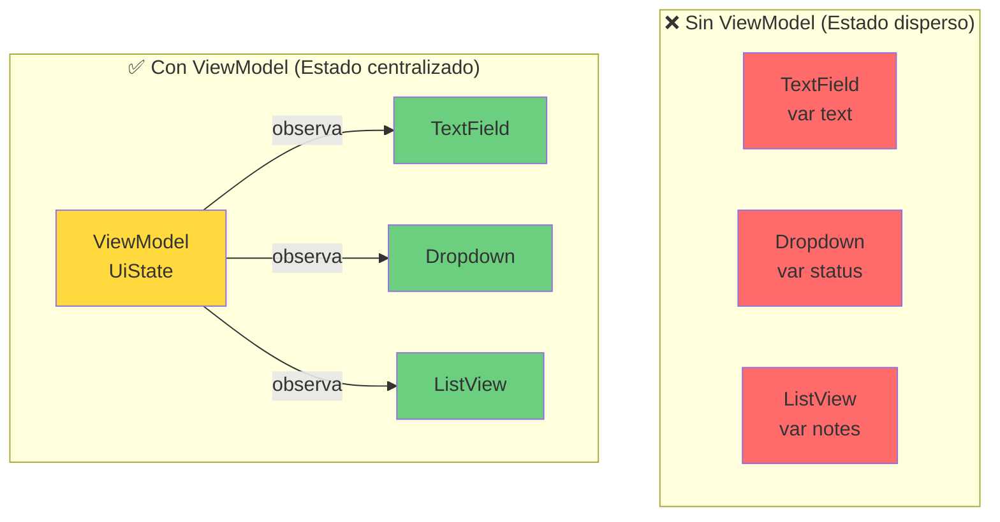


### Crear el Estado: GameNoteUiState.kt

**Ubicación**: `presentation/viewmodel/GameNoteUiState.kt`

??? info "GameNoteUiState.kt"
    
    ```kotlin
    package com.pmdm.mygamestore.presentation.viewmodel

    import com.pmdm.mygamestore.domain.model.GameNote
    import com.pmdm.mygamestore.domain.model.ProgressStatus

    /**
    * 🎨 Estado de la UI para la pantalla de notas de juego
    * 
    * SINGLE SOURCE OF TRUTH:
    * - Representa TODO lo que la UI necesita para renderizarse
    * - Inmutable (val): Solo el ViewModel puede modificarlo
    * - Data class: Fácil de copiar con cambios específicos
    * 
    * PRINCIPIO:
    * Estado → UI (unidireccional)
    * UI no modifica el estado directamente, emite eventos al ViewModel
    * 
    * @property notes Lista de notas guardadas del usuario
    * @property currentNoteText Texto que el usuario está escribiendo
    * @property selectedStatus Estado seleccionado en el dropdown
    * @property isLoading Indica si hay una operación en curso
    * @property errorMessage Mensaje de error a mostrar (null si no hay)
    * @property successMessage Mensaje de éxito (null si no hay)
    * @property isSaved Indica si se acaba de guardar (para trigger navegación/mensaje)
    */
    data class GameNoteUiState(
        // Datos
        val notes: List<GameNote> = emptyList(),
        val currentNoteText: String = "",
        val selectedStatus: ProgressStatus = ProgressStatus.PENDING,
        
        // Estados de carga
        val isLoading: Boolean = false,
        val isSaving: Boolean = false,
        
        // Mensajes
        val errorMessage: String? = null,
        val successMessage: String? = null,
        
        // Flags
        val isSaved: Boolean = false,
        val showDeleteDialog: Boolean = false,
        val noteToDelete: GameNote? = null
    ) {
        /**
        * 🔍 Utilidad: Verifica si el formulario tiene datos válidos para guardar
        */
        val canSave: Boolean
            get() = currentNoteText.isNotBlank() && 
                    currentNoteText.length <= 500 && 
                    !isSaving
        
        /**
        * 📊 Utilidad: Cuenta notas por estado
        */
        val notesCount: Int get() = notes.size
        
        /**
        * ✅ Utilidad: Verifica si hay notas para mostrar
        */
        val hasNotes: Boolean get() = notes.isNotEmpty()
    }
    ```


    ### Flujo unidireccional de datos (UDF)

    ```
    graph LR
        USER[👤 Usuario]
        UI[🎨 UI/Screen]
        VM[🧠 ViewModel]
        STATE[📦 UiState]
        
        USER -->|"1. Evento<br/>(click, texto)"| UI
        UI -->|"2. Llama método<br/>viewModel.onEvent()"| VM
        VM -->|"3. Actualiza<br/>_uiState.update { }"| STATE
        STATE -->|"4. Emite nuevo<br/>estado"| UI
        UI -->|"5. Recomposición<br/>automática"| USER
        
        style USER fill:#4d96ff
        style UI fill:#6bcf7f
        style VM fill:#ff6b6b
        style STATE fill:#ffd93d
    ```


### Crear el ViewModel

**Ubicación**: `presentation/viewmodel/GameNoteViewModel.kt`

??? info "GameNoteViewModel.kt"

    ```kotlin
    package com.pmdm.mygamestore.presentation.viewmodel

    import androidx.lifecycle.ViewModel
    import androidx.lifecycle.viewModelScope
    import com.pmdm.mygamestore.domain.model.GameNote
    import com.pmdm.mygamestore.domain.model.ProgressStatus
    import com.pmdm.mygamestore.domain.model.Resource
    import com.pmdm.mygamestore.domain.usecase.GameNoteUseCases
    import kotlinx.coroutines.flow.MutableStateFlow
    import kotlinx.coroutines.flow.StateFlow
    import kotlinx.coroutines.flow.asStateFlow
    import kotlinx.coroutines.flow.update
    import kotlinx.coroutines.launch

    /**
    * 🧠 ViewModel para la pantalla de notas de juego
    * 
    * RESPONSABILIDADES:
    * ✅ Gestionar el estado de la UI (GameNoteUiState)
    * ✅ Coordinar casos de uso (GameNoteUseCases)
    * ✅ Manejar eventos del usuario
    * ✅ Transformar Resource a estados de UI
    * ✅ Sobrevivir a cambios de configuración (rotación)
    * 
    * NO ES RESPONSABILIDAD:
    * ❌ Acceso directo a Repository
    * ❌ Lógica de negocio (eso es de UseCases)
    * ❌ Navegación (eso es de la UI)
    * ❌ Referencias a Views/Composables
    * 
    * @property useCases Casos de uso de notas
    * @property gameId ID del juego actual
    * @property username Usuario actual
    */
    class GameNoteViewModel(
        private val useCases: GameNoteUseCases,
        private val gameId: Int,
        private val username: String
    ) : ViewModel() {
        
        /**
        * 🔒 Estado PRIVADO (mutable)
        * Solo el ViewModel puede modificarlo
        */
        private val _uiState = MutableStateFlow(GameNoteUiState())
        
        /**
        * 🔓 Estado PÚBLICO (inmutable)
        * La UI solo puede observarlo
        */
        val uiState: StateFlow<GameNoteUiState> = _uiState.asStateFlow()
        
        init {
            // Cargar notas al iniciar
            loadNotes()
            loadExistingNote()
        }
        
        /**
        * 📚 Carga todas las notas del usuario
        * 
        * Observa el Flow del UseCase y actualiza el estado según
        * el Resource recibido (Loading/Success/Error)
        */
        private fun loadNotes() {
            viewModelScope.launch {
                useCases.getNotesForUser(username).collect { resource ->
                    when (resource) {
                        is Resource.Loading -> {
                            _uiState.update { it.copy(isLoading = true) }
                        }
                        
                        is Resource.Success -> {
                            _uiState.update {
                                it.copy(
                                    notes = resource.data,
                                    isLoading = false,
                                    errorMessage = null
                                )
                            }
                        }
                        
                        is Resource.Error -> {
                            _uiState.update {
                                it.copy(
                                    isLoading = false,
                                    errorMessage = "Failed to load notes: ${resource.error}"
                                )
                            }
                        }
                    }
                }
            }
        }
        
        /**
        * 🔍 Carga la nota existente del juego actual (si existe)
        * 
        * Si el usuario ya tiene una nota para este juego,
        * la cargamos en el formulario para editar
        */
        private fun loadExistingNote() {
            viewModelScope.launch {
                val result = useCases.getNoteForGame(gameId, username)
                
                when (result) {
                    is Resource.Success -> {
                        result.data?.let { note ->
                            _uiState.update {
                                it.copy(
                                    currentNoteText = note.note,
                                    selectedStatus = note.progressStatus
                                )
                            }
                        }
                    }
                    is Resource.Error -> {
                        // No hacer nada, el juego no tiene nota aún
                    }
                    is Resource.Loading -> {
                        // No debería pasar con suspend fun
                    }
                }
            }
        }
        
        /**
        * ✏️ Evento: Usuario escribe en el TextField
        * 
        * @param text Nuevo texto
        */
        fun onNoteTextChange(text: String) {
            _uiState.update { it.copy(currentNoteText = text, errorMessage = null) }
        }
        
        /**
        * 📊 Evento: Usuario selecciona un estado en el dropdown
        * 
        * @param status Nuevo estado seleccionado
        */
        fun onStatusChange(status: ProgressStatus) {
            _uiState.update { it.copy(selectedStatus = status) }
        }
        
        /**
        * 💾 Evento: Usuario hace click en "Guardar"
        * 
        * FLUJO:
        * 1. Validar formulario
        * 2. Crear objeto GameNote
        * 3. Llamar al UseCase
        * 4. Actualizar estado según resultado
        */
        fun onSaveClick() {
            val state = _uiState.value
            
            // Validación básica UI
            if (state.currentNoteText.isBlank()) {
                _uiState.update { it.copy(errorMessage = "Please enter a note") }
                return
            }
            
            viewModelScope.launch {
                _uiState.update { it.copy(isSaving = true, errorMessage = null) }
                
                // Crear nota
                val note = GameNote(
                    id = 0, // 0 para nueva, o el ID existente para actualizar
                    gameId = gameId,
                    username = username,
                    note = state.currentNoteText,
                    progressStatus = state.selectedStatus
                )
                
                // Guardar via UseCase
                val result = useCases.saveNote(note)
                
                when (result) {
                    is Resource.Success -> {
                        _uiState.update {
                            it.copy(
                                isSaving = false,
                                isSaved = true,
                                successMessage = "Note saved successfully!",
                                currentNoteText = "", // Limpiar formulario
                                errorMessage = null
                            )
                        }
                        
                        // Recargar notas para reflejar cambios
                        loadNotes()
                    }
                    
                    is Resource.Error -> {
                        _uiState.update {
                            it.copy(
                                isSaving = false,
                                errorMessage = when (result.error) {
                                    is com.pmdm.mygamestore.domain.model.AppError.ValidationError -> 
                                        result.error.message
                                    else -> "Failed to save note"
                                }
                            )
                        }
                    }
                    
                    is Resource.Loading -> {
                        // No debería pasar con suspend fun
                    }
                }
            }
        }
        
        /**
        * 🗑️ Evento: Usuario solicita eliminar una nota
        * 
        * @param note Nota a eliminar
        */
        fun onDeleteClick(note: GameNote) {
            _uiState.update {
                it.copy(
                    showDeleteDialog = true,
                    noteToDelete = note
                )
            }
        }
        
        /**
        * ✅ Evento: Usuario confirma eliminación en el diálogo
        */
        fun confirmDelete() {
            val noteToDelete = _uiState.value.noteToDelete ?: return
            
            viewModelScope.launch {
                _uiState.update { it.copy(showDeleteDialog = false, isLoading = true) }
                
                val result = useCases.deleteNote(noteToDelete.gameId, username)
                
                when (result) {
                    is Resource.Success -> {
                        _uiState.update {
                            it.copy(
                                isLoading = false,
                                successMessage = "Note deleted successfully",
                                noteToDelete = null
                            )
                        }
                        loadNotes()
                    }
                    
                    is Resource.Error -> {
                        _uiState.update {
                            it.copy(
                                isLoading = false,
                                errorMessage = "Failed to delete note",
                                noteToDelete = null
                            )
                        }
                    }
                    
                    is Resource.Loading -> {}
                }
            }
        }
        
        /**
        * ❌ Evento: Usuario cancela eliminación
        */
        fun cancelDelete() {
            _uiState.update {
                it.copy(
                    showDeleteDialog = false,
                    noteToDelete = null
                )
            }
        }
        
        /**
        * 🧹 Limpia mensajes de error/éxito
        */
        fun clearMessages() {
            _uiState.update {
                it.copy(
                    errorMessage = null,
                    successMessage = null,
                    isSaved = false
                )
            }
        }
    }
    ```


### Ciclo de vida del estado

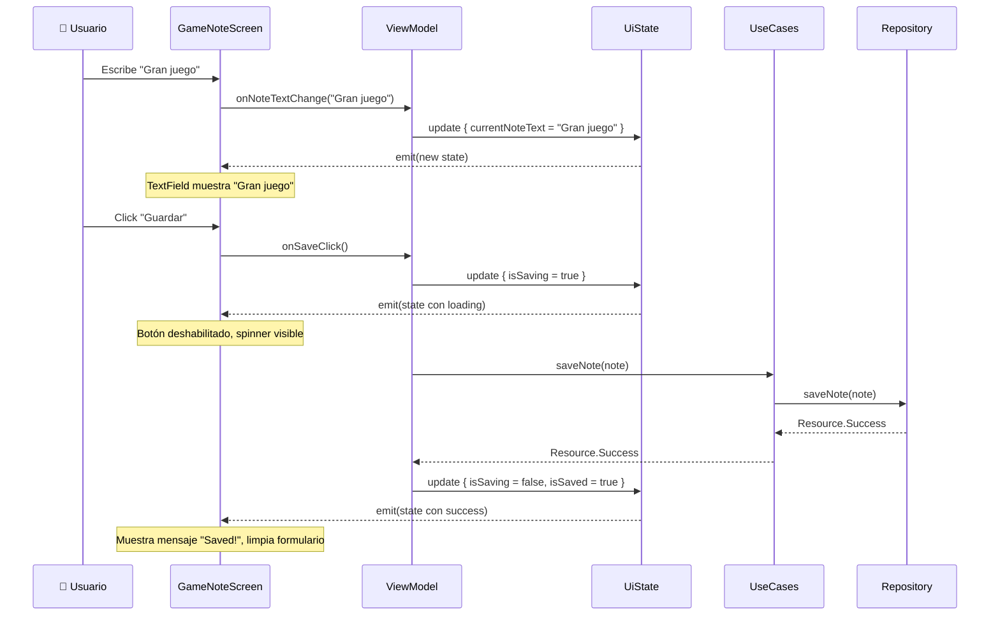


---

## 9. FASE 7: UI Screen (Composable)

### Diseño de la pantalla

Nuestra pantalla tendrá tres secciones principales:

1. **Formulario**: TextField + Selector de estado + Botón guardar
2. **Lista de notas**: LazyColumn con las notas guardadas
3. **Diálogo de confirmación**: Para eliminar notas

### Componentes reutilizables

Vamos a crear algunos componentes pequeños y reutilizables:

- `NoteTextField`: Campo de texto con contador de caracteres
- `StatusSelector`: Dropdown para seleccionar estado
- `NoteCard`: Tarjeta individual para mostrar una nota
- `DeleteConfirmationDialog`: Diálogo de confirmación

### Estructura visual de componentes

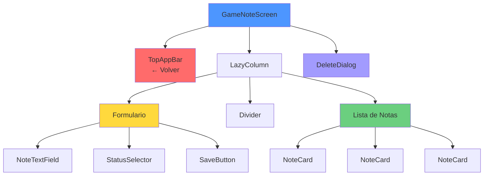


### Crear la Screen

**Ubicación**: `presentation/ui/screens/GameNoteScreen.kt`

??? info "GameNoteScreen.kt"
    

    ```kotlin
    package com.pmdm.mygamestore.presentation.ui.screens

    import androidx.compose.foundation.layout.*
    import androidx.compose.foundation.lazy.LazyColumn
    import androidx.compose.foundation.lazy.items
    import androidx.compose.material.icons.Icons
    import androidx.compose.material.icons.filled.ArrowBack
    import androidx.compose.material.icons.filled.Delete
    import androidx.compose.material3.*
    import androidx.compose.runtime.*
    import androidx.compose.ui.Alignment
    import androidx.compose.ui.Modifier
    import androidx.compose.ui.text.font.FontWeight
    import androidx.compose.ui.unit.dp
    import androidx.lifecycle.viewmodel.compose.viewModel
    import com.pmdm.mygamestore.domain.model.GameNote
    import com.pmdm.mygamestore.domain.model.ProgressStatus
    import com.pmdm.mygamestore.presentation.viewmodel.GameNoteViewModel
    import com.pmdm.mygamestore.presentation.viewmodel.GameNoteViewModelFactory
    import java.text.SimpleDateFormat
    import java.util.*

    /**
    * 🎨 Pantalla de notas de juego
    * 
    * RESPONSABILIDADES:
    * ✅ Observar el estado del ViewModel
    * ✅ Renderizar UI según el estado
    * ✅ Emitir eventos al ViewModel
    * ✅ Mostrar mensajes de feedback
    * 
    * NO ES RESPONSABILIDAD:
    * ❌ Lógica de negocio
    * ❌ Acceso a datos
    * ❌ Gestión de estado
    * 
    * @param gameId ID del juego
    * @param username Usuario actual
    * @param onBack Callback para volver atrás
    */
    @OptIn(ExperimentalMaterial3Api::class)
    @Composable
    fun GameNoteScreen(
        gameId: Int,
        username: String,
        onBack: () -> Unit,
        viewModel: GameNoteViewModel = viewModel(
            factory = GameNoteViewModelFactory(gameId, username)
        )
    ) {
        // 👀 Observar el estado
        val uiState by viewModel.uiState.collectAsState()
        val snackbarHostState = remember { SnackbarHostState() }
        
        // 🚨 Mostrar mensajes de error
        LaunchedEffect(uiState.errorMessage) {
            uiState.errorMessage?.let { error ->
                snackbarHostState.showSnackbar(error)
                viewModel.clearMessages()
            }
        }
        
        // ✅ Mostrar mensajes de éxito
        LaunchedEffect(uiState.successMessage) {
            uiState.successMessage?.let { message ->
                snackbarHostState.showSnackbar(message)
                viewModel.clearMessages()
            }
        }
        
        Scaffold(
            topBar = {
                TopAppBar(
                    title = { Text("Game Notes") },
                    navigationIcon = {
                        IconButton(onClick = onBack) {
                            Icon(Icons.Default.ArrowBack, "Back")
                        }
                    }
                )
            },
            snackbarHost = { SnackbarHost(snackbarHostState) }
        ) { padding ->
            LazyColumn(
                modifier = Modifier
                    .fillMaxSize()
                    .padding(padding)
                    .padding(16.dp),
                verticalArrangement = Arrangement.spacedBy(16.dp)
            ) {
                // SECCIÓN 1: Formulario
                item {
                    NoteFormSection(
                        noteText = uiState.currentNoteText,
                        selectedStatus = uiState.selectedStatus,
                        canSave = uiState.canSave,
                        isSaving = uiState.isSaving,
                        onNoteChange = viewModel::onNoteTextChange,
                        onStatusChange = viewModel::onStatusChange,
                        onSaveClick = viewModel::onSaveClick
                    )
                }
                
                // SECCIÓN 2: Divider si hay notas
                if (uiState.hasNotes) {
                    item {
                        HorizontalDivider(modifier = Modifier.padding(vertical = 8.dp))
                        Text(
                            text = "Your Notes (${uiState.notesCount})",
                            style = MaterialTheme.typography.titleMedium,
                            fontWeight = FontWeight.Bold
                        )
                    }
                }
                
                // SECCIÓN 3: Lista de notas
                if (uiState.isLoading) {
                    item {
                        Box(
                            modifier = Modifier.fillMaxWidth().height(200.dp),
                            contentAlignment = Alignment.Center
                        ) {
                            CircularProgressIndicator()
                        }
                    }
                } else if (uiState.hasNotes) {
                    items(uiState.notes, key = { it.id }) { note ->
                        NoteCard(
                            note = note,
                            onDeleteClick = { viewModel.onDeleteClick(note) }
                        )
                    }
                } else {
                    item {
                        EmptyNotesState()
                    }
                }
            }
        }
        
        // Diálogo de confirmación de eliminación
        if (uiState.showDeleteDialog) {
            DeleteConfirmationDialog(
                onConfirm = viewModel::confirmDelete,
                onDismiss = viewModel::cancelDelete
            )
        }
    }

    /**
    * 📝 Sección del formulario para crear/editar nota
    */
    @Composable
    private fun NoteFormSection(
        noteText: String,
        selectedStatus: ProgressStatus,
        canSave: Boolean,
        isSaving: Boolean,
        onNoteChange: (String) -> Unit,
        onStatusChange: (ProgressStatus) -> Unit,
        onSaveClick: () -> Unit
    ) {
        Card(
            modifier = Modifier.fillMaxWidth(),
            colors = CardDefaults.cardColors(
                containerColor = MaterialTheme.colorScheme.surfaceVariant
            )
        ) {
            Column(
                modifier = Modifier.padding(16.dp),
                verticalArrangement = Arrangement.spacedBy(12.dp)
            ) {
                Text(
                    text = "Add Your Note",
                    style = MaterialTheme.typography.titleMedium,
                    fontWeight = FontWeight.Bold
                )
                
                // TextField con contador
                NoteTextField(
                    value = noteText,
                    onValueChange = onNoteChange,
                    modifier = Modifier.fillMaxWidth()
                )
                
                // Selector de estado
                StatusSelector(
                    selected = selectedStatus,
                    onSelect = onStatusChange
                )
                
                // Botón guardar
                Button(
                    onClick = onSaveClick,
                    enabled = canSave && !isSaving,
                    modifier = Modifier.fillMaxWidth()
                ) {
                    if (isSaving) {
                        CircularProgressIndicator(
                            modifier = Modifier.size(20.dp),
                            color = MaterialTheme.colorScheme.onPrimary
                        )
                        Spacer(modifier = Modifier.width(8.dp))
                    }
                    Text(if (isSaving) "Saving..." else "Save Note")
                }
            }
        }
    }

    /**
    * ✏️ TextField personalizado con contador de caracteres
    */
    @Composable
    private fun NoteTextField(
        value: String,
        onValueChange: (String) -> Unit,
        modifier: Modifier = Modifier
    ) {
        val maxChars = 500
        
        Column(modifier = modifier) {
            OutlinedTextField(
                value = value,
                onValueChange = { if (it.length <= maxChars) onValueChange(it) },
                modifier = Modifier.fillMaxWidth(),
                placeholder = { Text("Write your thoughts about this game...") },
                minLines = 4,
                maxLines = 6
            )
            
            Text(
                text = "${value.length} / $maxChars",
                style = MaterialTheme.typography.bodySmall,
                color = if (value.length > maxChars * 0.9) {
                    MaterialTheme.colorScheme.error
                } else {
                    MaterialTheme.colorScheme.onSurfaceVariant
                },
                modifier = Modifier.align(Alignment.End).padding(top = 4.dp)
            )
        }
    }

    /**
    * 📊 Selector de estado de progreso
    */
    @Composable
    private fun StatusSelector(
        selected: ProgressStatus,
        onSelect: (ProgressStatus) -> Unit
    ) {
        var expanded by remember { mutableStateOf(false) }
        
        Column {
            Text(
                text = "Progress Status",
                style = MaterialTheme.typography.labelMedium
            )
            
            ExposedDropdownMenuBox(
                expanded = expanded,
                onExpandedChange = { expanded = !expanded }
            ) {
                OutlinedTextField(
                    value = selected.toDisplayString(),
                    onValueChange = {},
                    readOnly = true,
                    trailingIcon = { ExposedDropdownMenuDefaults.TrailingIcon(expanded) },
                    modifier = Modifier.menuAnchor().fillMaxWidth()
                )
                
                ExposedDropdownMenu(
                    expanded = expanded,
                    onDismissRequest = { expanded = false }
                ) {
                    ProgressStatus.entries.forEach { status ->
                        DropdownMenuItem(
                            text = { Text(status.toDisplayString()) },
                            onClick = {
                                onSelect(status)
                                expanded = false
                            }
                        )
                    }
                }
            }
        }
    }

    /**
    * 🃏 Tarjeta individual de nota
    */
    @Composable
    private fun NoteCard(
        note: GameNote,
        onDeleteClick: () -> Unit
    ) {
        Card(
            modifier = Modifier.fillMaxWidth(),
            elevation = CardDefaults.cardElevation(defaultElevation = 2.dp)
        ) {
            Row(
                modifier = Modifier.padding(16.dp),
                horizontalArrangement = Arrangement.SpaceBetween
            ) {
                Column(modifier = Modifier.weight(1f)) {
                    // Estado con ícono
                    Row(verticalAlignment = Alignment.CenterVertically) {
                        Text(
                            text = note.progressStatus.getIcon(),
                            style = MaterialTheme.typography.bodyLarge
                        )
                        Spacer(modifier = Modifier.width(8.dp))
                        Text(
                            text = note.progressStatus.toDisplayString(),
                            style = MaterialTheme.typography.labelLarge,
                            color = note.progressStatus.getColor()
                        )
                    }
                    
                    Spacer(modifier = Modifier.height(8.dp))
                    
                    // Texto de la nota
                    Text(
                        text = note.note,
                        style = MaterialTheme.typography.bodyMedium
                    )
                    
                    Spacer(modifier = Modifier.height(8.dp))
                    
                    // Fecha
                    Text(
                        text = "Updated: ${note.lastUpdated.toFormattedDate()}",
                        style = MaterialTheme.typography.bodySmall,
                        color = MaterialTheme.colorScheme.onSurfaceVariant
                    )
                }
                
                // Botón eliminar
                IconButton(onClick = onDeleteClick) {
                    Icon(
                        Icons.Default.Delete,
                        contentDescription = "Delete",
                        tint = MaterialTheme.colorScheme.error
                    )
                }
            }
        }
    }

    /**
    * 📭 Estado vacío cuando no hay notas
    */
    @Composable
    private fun EmptyNotesState() {
        Box(
            modifier = Modifier.fillMaxWidth().height(200.dp),
            contentAlignment = Alignment.Center
        ) {
            Column(horizontalAlignment = Alignment.CenterHorizontally) {
                Text(
                    text = "📝",
                    style = MaterialTheme.typography.displayLarge
                )
                Spacer(modifier = Modifier.height(8.dp))
                Text(
                    text = "No notes yet",
                    style = MaterialTheme.typography.bodyLarge,
                    color = MaterialTheme.colorScheme.onSurfaceVariant
                )
                Text(
                    text = "Add your first note above!",
                    style = MaterialTheme.typography.bodyMedium,
                    color = MaterialTheme.colorScheme.onSurfaceVariant
                )
            }
        }
    }

    /**
    * 🗑️ Diálogo de confirmación de eliminación
    */
    @Composable
    private fun DeleteConfirmationDialog(
        onConfirm: () -> Unit,
        onDismiss: () -> Unit
    ) {
        AlertDialog(
            onDismissRequest = onDismiss,
            title = { Text("Delete Note?") },
            text = { Text("Are you sure you want to delete this note? This action cannot be undone.") },
            confirmButton = {
                TextButton(onClick = onConfirm) {
                    Text("Delete", color = MaterialTheme.colorScheme.error)
                }
            },
            dismissButton = {
                TextButton(onClick = onDismiss) {
                    Text("Cancel")
                }
            }
        )
    }

    // Extension functions
    private fun ProgressStatus.toDisplayString(): String = when (this) {
        ProgressStatus.PENDING -> "⚪ Pending"
        ProgressStatus.PLAYING -> "🎮 Playing"
        ProgressStatus.COMPLETED -> "✅ Completed"
        ProgressStatus.ABANDONED -> "❌ Abandoned"
    }

    private fun ProgressStatus.getIcon(): String = when (this) {
        ProgressStatus.PENDING -> "⚪"
        ProgressStatus.PLAYING -> "🎮"
        ProgressStatus.COMPLETED -> "✅"
        ProgressStatus.ABANDONED -> "❌"
    }

    @Composable
    private fun ProgressStatus.getColor(): androidx.compose.ui.graphics.Color = when (this) {
        ProgressStatus.PENDING -> MaterialTheme.colorScheme.onSurfaceVariant
        ProgressStatus.PLAYING -> MaterialTheme.colorScheme.primary
        ProgressStatus.COMPLETED -> androidx.compose.ui.graphics.Color(0xFF4CAF50)
        ProgressStatus.ABANDONED -> MaterialTheme.colorScheme.error
    }

    private fun Long.toFormattedDate(): String {
        val sdf = SimpleDateFormat("MMM dd, yyyy HH:mm", Locale.getDefault())
        return sdf.format(Date(this))
    }
    ```


### ViewModelFactory

**Ubicación**: `presentation/viewmodel/GameNoteViewModelFactory.kt`

??? info "ViewModelFactory"
    
    ```kotlin
    package com.pmdm.mygamestore.presentation.viewmodel

    import androidx.lifecycle.ViewModel
    import androidx.lifecycle.ViewModelProvider
    import com.pmdm.mygamestore.data.local.FakeGameNoteDataSource
    import com.pmdm.mygamestore.data.repository.FakeGameNoteRepositoryImpl
    import com.pmdm.mygamestore.domain.usecase.GameNoteUseCases

    /**
    * 🏭 Factory para crear GameNoteViewModel con parámetros
    * 
    * PROPÓSITO:
    * - ViewModel necesita gameId y username que no podemos pasar directamente
    * - ViewModelProvider.Factory permite inyectar dependencias
    * 
    * TEMPORAL:
    * - Instancia FakeRepository directamente
    * - En producción, usaremos Koin para inyección de dependencias
    * 
    * @param gameId ID del juego
    * @param username Usuario actual
    */
    class GameNoteViewModelFactory(
        private val gameId: Int,
        private val username: String
    ) : ViewModelProvider.Factory {
        
        @Suppress("UNCHECKED_CAST")
        override fun <T : ViewModel> create(modelClass: Class<T>): T {
            if (modelClass.isAssignableFrom(GameNoteViewModel::class.java)) {
                // Instanciar dependencias manualmente (temporal)
                val repository = FakeGameNoteRepositoryImpl()
                val useCases = GameNoteUseCases(repository)
                
                return GameNoteViewModel(
                    useCases = useCases,
                    gameId = gameId,
                    username = username
                ) as T
            }
            throw IllegalArgumentException("Unknown ViewModel class: ${modelClass.name}")
        }
    }
    ```

---

## 10. ✅ CHECKPOINT: Feature Funcionando con FakeRepository

### ¡Felicidades! Has completado el prototipo 🎉

En este punto tienes una feature **completamente funcional** usando datos en memoria. Veamos lo que has logrado:

### Resumen de lo logrado

| Componente | Estado | Funcionalidad |
|------------|--------|---------------|
| **Domain Model** | ✅ | GameNote con validaciones |
| **Repository Interface** | ✅ | Contrato definido |
| **FakeDataSource** | ✅ | Lista en memoria |
| **FakeRepository** | ✅ | CRUD completo |
| **UseCases** | ✅ | Lógica de negocio |
| **ViewModel** | ✅ | Estado y eventos |
| **UI Screen** | ✅ | Interfaz completa |

### Pruebas de funcionalidad

Ejecuta la app y verifica:

1. ✅ **Crear nota**: Escribe texto, selecciona estado, guarda
2. ✅ **Ver notas**: La lista se actualiza automáticamente
3. ✅ **Eliminar nota**: Click en icono, confirma eliminación
4. ✅ **Validaciones**: Intenta guardar nota vacía → Error
5. ✅ **Estados de carga**: Ve el spinner al guardar/cargar
6. ✅ **Rotación**: Rota el dispositivo → Estado se mantiene

### Arquitectura actual (sin persistencia real)

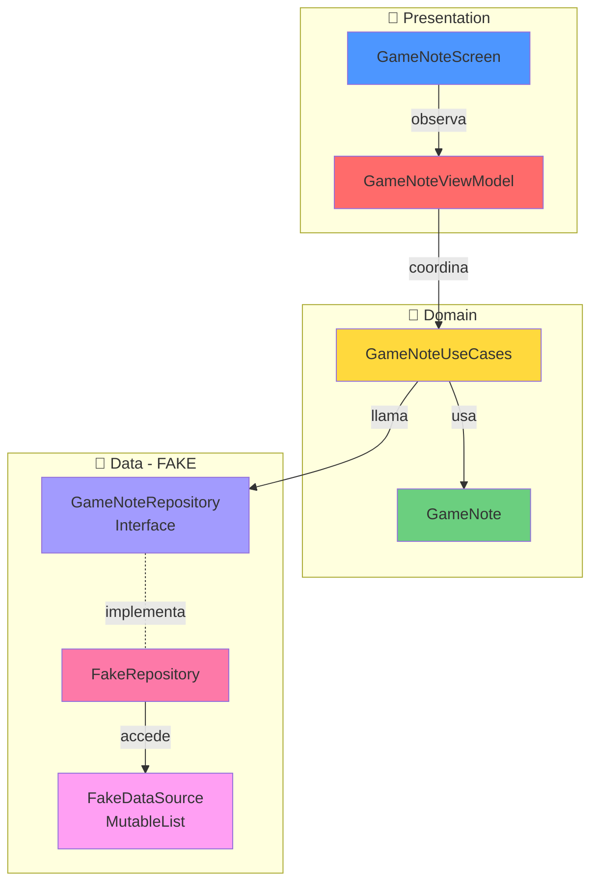


### Ventajas del prototipo

| Aspecto | Beneficio |
|---------|-----------|
| **Velocidad** | De idea a pantalla funcionando en <2 horas |
| **Aprendizaje** | Entiendes el flujo sin complejidad de BD |
| **Demos** | Puedes mostrar a clientes sin backend |
| **Testing** | Fácil crear escenarios de prueba |
| **Iteración** | Cambia UI rápidamente |

### Limitaciones actuales

| Limitación | Impacto |
|------------|---------|
| **No persistente** | ❌ Datos se pierden al cerrar app |
| **No compartible** | ❌ Cada usuario ve datos diferentes |
| **No sincronizable** | ❌ No hay backend para sincronizar |
| **No escalable** | ❌ Limitado a memoria del dispositivo |

---

!!! success "¡Listos para el siguiente nivel!"
    Ahora que la feature funciona perfectamente, vamos a evolucionar hacia **persistencia real con Room**. Lo increíble es que solo cambiaremos **la capa de datos**, el resto permanece intacto.

---

## 11. FASE 8: Evolución - ¿Qué es una Entity?

Ahora que tienes un prototipo funcionando perfectamente con datos en memoria, es momento de evolucionar hacia **persistencia real**. Pero primero, necesitamos entender un concepto fundamental: la diferencia entre **Modelo de Dominio** y **Entity**.

### ¿Por qué necesitamos dos clases diferentes?

Imagina que estás construyendo una casa. Tienes:

- **Plano arquitectónico** (Modelo de Dominio): Cómo quieres que se vea y funcione
- **Plano estructural** (Entity): Cómo debe construirse físicamente

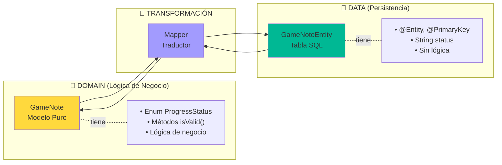


### Modelo vs Entity: Tabla Comparativa

| Aspecto | Domain Model (GameNote) | Entity (GameNoteEntity) |
|---------|------------------------|------------------------|
| **Ubicación** | `domain/model/` | `data/local/entity/` |
| **Dependencias** | ❌ Ninguna (Kotlin puro) | ✅ Room (`@Entity`, `@PrimaryKey`) |
| **Propósito** | Lógica de negocio | Persistencia en BD |
| **Tipos de datos** | ✅ Enums, data classes complejas | ⚠️ Solo tipos primitivos o con `@TypeConverter` |
| **Métodos** | ✅ Validaciones, lógica | ❌ Solo propiedades |
| **Inmutabilidad** | ✅ Siempre `val` | ⚠️ Puede ser `var` (Room lo permite) |
| **Anotaciones** | ❌ Sin anotaciones | ✅ `@Entity`, `@PrimaryKey`, `@ForeignKey` |
| **Testing** | ✅ Fácil (sin dependencias) | ⚠️ Requiere Room |

### Modelo (Dominio) vs Entity (Datos): Código Comparativo

```kotlin
// ══════════════════════════════════════════════════════════
// 💼 DOMAIN MODEL - Cómo lo usa la aplicación
// ══════════════════════════════════════════════════════════
data class GameNote(
    val id: Int = 0,
    val gameId: Int,
    val username: String,
    val note: String,
    val progressStatus: ProgressStatus, // ✅ Enum
    val lastUpdated: Long = System.currentTimeMillis()
) {
    // ✅ Lógica de negocio
    fun isValid(): Boolean = note.isNotBlank() && note.length <= 500
    
    fun getStatusDescription(): String = when (progressStatus) {
        ProgressStatus.PENDING -> "Pendiente de jugar"
        ProgressStatus.PLAYING -> "Jugando actualmente"
        ProgressStatus.COMPLETED -> "Juego completado"
        ProgressStatus.ABANDONED -> "Abandonado"
    }
}

enum class ProgressStatus {
    PENDING, PLAYING, COMPLETED, ABANDONED
}

// ══════════════════════════════════════════════════════════
// 💾 ENTITY - Cómo se guarda en la base de datos
// ══════════════════════════════════════════════════════════
@Entity(tableName = "game_notes")
data class GameNoteEntity(
    @PrimaryKey(autoGenerate = true)
    val id: Int = 0,
    val gameId: Int,
    val username: String,
    val note: String,
    val progressStatus: String, // ⚠️ String (no Enum)
    val lastUpdated: Long
)
// ❌ Sin métodos de lógica
// ❌ Sin Enum (Room no lo entiende directamente)
// ✅ Anotaciones de Room para mapear a tabla SQL
```


### ¿Por qué Room no puede usar el Modelo directamente?

```mermaid
graph TB
    subgraph "❌ Intentar usar Model directamente"
        MODEL1[GameNote<br/>con Enum]
        ROOM1[Room Database]
        SQL1[SQLite]
        
        MODEL1 -.Room no entiende Enum.- ROOM1
        ROOM1 -.❌ ERROR.- SQL1
    end
    
    subgraph "✅ Usar Entity separada"
        MODEL2[GameNote<br/>Enum ProgressStatus]
        MAPPER[Mapper]
        ENTITY[GameNoteEntity<br/>String status]
        ROOM2[Room Database]
        SQL2[SQLite<br/>VARCHAR status]
        
        MODEL2 -->|toEntity| MAPPER
        MAPPER --> ENTITY
        ENTITY --> ROOM2
        ROOM2 --> SQL2
        
        SQL2 --> ROOM2
        ROOM2 --> ENTITY
        ENTITY -->|toDomain| MAPPER
        MAPPER --> MODEL2
    end
    
    style MODEL1 fill:#ff6b6b
    style ROOM1 fill:#ff6b6b
    style SQL1 fill:#ff6b6b
    style MODEL2 fill:#ffd93d
    style ENTITY fill:#00b894
    style MAPPER fill:#a29bfe
```


**Razones técnicas:**

1. **Room solo entiende tipos SQL**: Int, String, Long, Boolean, Float, Double
2. **Enums no son tipos SQL**: Hay que convertirlos a String o Int
3. **Data classes complejas**: Requieren `@TypeConverter` o separación
4. **Anotaciones**: Contaminan el modelo de dominio con detalles de BD

### Ventajas de separar Model y Entity

```kotlin
// 🎯 Ventaja 1: Independencia del Framework
// Si cambias de Room a Realm, solo cambias Entity, no el Model

// 🎯 Ventaja 2: Testing más fácil
class GameNoteTest {
    @Test
    fun `note should be valid when text is not empty`() {
        val note = GameNote(/* ... */) // ✅ Sin dependencias de Room
        assertTrue(note.isValid())
    }
}

// 🎯 Ventaja 3: Evolución independiente
// Puedes cambiar la estructura de la BD sin tocar la lógica de negocio

// Ejemplo: Agregar columna en BD
@Entity(tableName = "game_notes")
data class GameNoteEntity(
    // ... propiedades existentes
    val rating: Int? = null // 🆕 Nueva columna en BD
)

// El modelo sigue igual (no necesita rating)
data class GameNote(
    val id: Int,
    val gameId: Int,
    // ... sin rating
)

// 🎯 Ventaja 4: Múltiples fuentes de datos
// Mismo modelo, diferentes Entities (Room, API, Firebase)
```


### Caso real: ¿Qué pasa si cambias de Room a otra BD?

```kotlin
// Antes: Con Room
@Entity(tableName = "game_notes")
data class GameNoteEntity(...)

// Decides cambiar a Realm
// ❌ SI USARAS MODEL DIRECTO: Tendrías que cambiar TODA la app
// ✅ CON ENTITY SEPARADA: Solo cambias esto:

@RealmClass
open class GameNoteRealmEntity : RealmObject() {
    // Mismo mapeo, diferente framework
}

// Tu GameNote (model) NO CAMBIA
// Tu ViewModel NO CAMBIA
// Tu UI NO CAMBIA
// Solo cambia la Entity y el Mapper
```


---

## 12. FASE 9: Crear la Entity de Room

Ahora vamos a crear la versión "persistible" de nuestro modelo.

### Anotaciones de Room explicadas

Room utiliza anotaciones para entender cómo mapear clases Kotlin a tablas SQL:

| Anotación | Propósito | Ejemplo |
|-----------|-----------|---------|
| `@Entity` | Define una tabla | `@Entity(tableName = "game_notes")` |
| `@PrimaryKey` | Clave primaria | `@PrimaryKey(autoGenerate = true)` |
| `@ForeignKey` | Relación entre tablas | `ForeignKey(entity = UserEntity::class, ...)` |
| `@Index` | Optimiza búsquedas | `@Index(value = ["username", "gameId"])` |
| `@ColumnInfo` | Configura columna | `@ColumnInfo(name = "note_text")` |
| `@Ignore` | Excluye propiedad | `@Ignore val computed: String` |

### Relaciones con otras tablas

En nuestra app, una nota pertenece a un **usuario**. Esto se expresa con Foreign Keys:

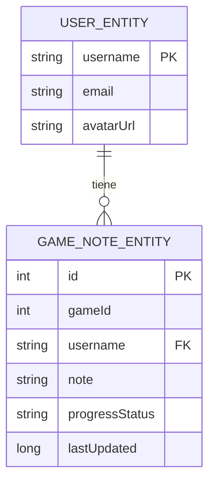


### Esquema de la tabla en SQLite

Cuando Room procesa nuestra Entity, genera este SQL:

```textmate
CREATE TABLE game_notes (
    id INTEGER PRIMARY KEY AUTOINCREMENT NOT NULL,
    gameId INTEGER NOT NULL,
    username TEXT NOT NULL,
    note TEXT NOT NULL,
    progressStatus TEXT NOT NULL,
    lastUpdated INTEGER NOT NULL,
    FOREIGN KEY (username) REFERENCES users(username) ON DELETE CASCADE
);

CREATE INDEX index_game_notes_username_gameId ON game_notes(username, gameId);
```


### Crear la Entity

**Ubicación**: `data/local/entity/GameNoteEntity.kt`

??? info "GameNoteEntity"

    ```kotlin
    package com.pmdm.mygamestore.data.local.entity

    import androidx.room.Entity
    import androidx.room.ForeignKey
    import androidx.room.Index
    import androidx.room.PrimaryKey

    /**
    * 💾 Entity de Room que representa una nota en la base de datos
    * 
    * PROPÓSITO:
    * - Mapea a una tabla SQL en SQLite
    * - Define estructura de persistencia
    * - Gestiona relaciones con otras tablas
    * 
    * DIFERENCIAS CON DOMAIN MODEL:
    * - Tiene anotaciones de Room (@Entity, @PrimaryKey)
    * - Usa tipos primitivos (String en vez de Enum)
    * - No tiene lógica de negocio
    * - Pensada para optimizar acceso a BD
    * 
    * IMPORTANTE:
    * ⚠️ NO usar directamente en ViewModel/UI
    * ⚠️ Siempre convertir a GameNote (modelo) con Mapper
    * 
    * @property id Clave primaria autogenerada
    * @property gameId ID del juego (referencia externa, no FK porque Game no está en Room)
    * @property username Usuario propietario de la nota (FK a UserEntity)
    * @property note Texto de la nota
    * @property progressStatus Estado guardado como String ("PENDING", "PLAYING", etc.)
    * @property lastUpdated Timestamp en epoch millis
    */
    @Entity(
        tableName = "game_notes",
        
        // 🔗 Foreign Key: Relaciona con la tabla de usuarios
        foreignKeys = [
            ForeignKey(
                entity = UserEntity::class,        // Tabla padre
                parentColumns = ["username"],       // Columna en tabla padre
                childColumns = ["username"],        // Columna en esta tabla
                onDelete = ForeignKey.CASCADE       // Si se borra usuario → borrar sus notas
            )
        ],
        
        // 📊 Índices: Optimizan las consultas frecuentes
        indices = [
            // Índice compuesto para búsquedas por usuario y juego
            Index(value = ["username", "gameId"]),
            
            // Índice simple para búsquedas solo por usuario
            Index(value = ["username"])
        ]
    )
    data class GameNoteEntity(
        @PrimaryKey(autoGenerate = true)
        val id: Int = 0,
        
        val gameId: Int,
        val username: String,
        val note: String,
        
        // ⚠️ IMPORTANTE: Guardamos Enum como String
        // Room no entiende Enums directamente
        // Valores posibles: "PENDING", "PLAYING", "COMPLETED", "ABANDONED"
        val progressStatus: String,
        
        val lastUpdated: Long
    )
    ```


### Conceptos clave de la Entity

#### 1. **@PrimaryKey con autoGenerate**

```kotlin
@PrimaryKey(autoGenerate = true)
val id: Int = 0

// Equivalente SQL:
// id INTEGER PRIMARY KEY AUTOINCREMENT NOT NULL

// Comportamiento:
val note = GameNoteEntity(id = 0, ...) // id = 0 significa "generar nuevo"
dao.insert(note)
// Room asigna automáticamente: id = 1, 2, 3, etc.
```


#### 2. **ForeignKey.CASCADE**

```kotlin
ForeignKey(
    entity = UserEntity::class,
    parentColumns = ["username"],
    childColumns = ["username"],
    onDelete = ForeignKey.CASCADE  // 🔥 Eliminación en cascada
)

// Escenario:
// 1. Usuario "admin" tiene 5 notas
// 2. Se ejecuta: DELETE FROM users WHERE username = 'admin'
// 3. Room automáticamente ejecuta: DELETE FROM game_notes WHERE username = 'admin'
// ✅ Sin CASCADE → Error (integridad referencial)
// ✅ Con CASCADE → Se borran las 5 notas automáticamente
```


#### 3. **@Index para optimización**

```kotlin
@Index(value = ["username", "gameId"])

// Sin índice:
// SELECT * FROM game_notes WHERE username = 'admin' AND gameId = 123
// ⏱️ Tiempo: O(n) - Escaneo completo de la tabla

// Con índice:
// Room crea un índice B-Tree
// ⚡ Tiempo: O(log n) - Búsqueda logarítmica

// Cuándo usar índices:
// ✅ Columnas en WHERE frecuentes
// ✅ Columnas en JOIN
// ✅ Foreign Keys
// ❌ Tablas muy pequeñas (<100 registros)
// ❌ Columnas que cambian mucho (overhead en UPDATE)
```


#### 4. **¿Por qué String en vez de Enum?**

```kotlin
// ❌ Room NO soporta esto directamente:
@Entity
data class BadEntity(
    val status: ProgressStatus // Error de compilación
)

// ✅ Debes usar String:
@Entity
data class GameNoteEntity(
    val progressStatus: String // "PENDING", "PLAYING", etc.
)

// Alternativa avanzada: @TypeConverter (más complejo)
class Converters {
    @TypeConverter
    fun fromProgressStatus(value: ProgressStatus): String = value.name
    
    @TypeConverter
    fun toProgressStatus(value: String): ProgressStatus = ProgressStatus.valueOf(value)
}

// Pero en este proyecto usamos Mapper (más simple y claro)
```


### Comparación lado a lado

```kotlin
// ══════════════════════════════════════════════════════════
// 💼 DOMAIN MODEL - Capa de Dominio
// ══════════════════════════════════════════════════════════
package com.pmdm.mygamestore.domain.model

data class GameNote(
    val id: Int = 0,
    val gameId: Int,
    val username: String,
    val note: String,
    val progressStatus: ProgressStatus, // ✅ Enum fuertemente tipado
    val lastUpdated: Long = System.currentTimeMillis()
) {
    // ✅ Lógica de dominio
    fun isValid(): Boolean {
        return note.isNotBlank() && note.length <= 500
    }
    
    fun getStatusDescription(): String {
        return when (progressStatus) {
            ProgressStatus.PENDING -> "Pendiente de jugar"
            ProgressStatus.PLAYING -> "Jugando actualmente"
            ProgressStatus.COMPLETED -> "Juego completado"
            ProgressStatus.ABANDONED -> "Abandonado"
        }
    }
}

enum class ProgressStatus {
    PENDING, PLAYING, COMPLETED, ABANDONED
}

// ══════════════════════════════════════════════════════════
// 💾 ENTITY - Capa de Datos
// ══════════════════════════════════════════════════════════
package com.pmdm.mygamestore.data.local.entity

import androidx.room.*

@Entity(
    tableName = "game_notes",
    foreignKeys = [
        ForeignKey(
            entity = UserEntity::class,
            parentColumns = ["username"],
            childColumns = ["username"],
            onDelete = ForeignKey.CASCADE
        )
    ],
    indices = [Index(value = ["username", "gameId"])]
)
data class GameNoteEntity(
    @PrimaryKey(autoGenerate = true)
    val id: Int = 0,
    val gameId: Int,
    val username: String,
    val note: String,
    val progressStatus: String, // ⚠️ String (sin tipo fuerte)
    val lastUpdated: Long
)
// ❌ Sin lógica de negocio
// ❌ Sin métodos
// ✅ Solo estructura de datos para Room
```


---

## 13. FASE 10: Los Mappers (Transformadores de Datos)

Los **Mappers** son funciones que convierten objetos de un tipo a otro. Son el "puente" entre la capa de datos y la capa de dominio.

### ¿Qué es un Mapper?

Un Mapper es simplemente una función de transformación:

```kotlin
// Función que convierte A → B
fun convertAtoB(a: A): B

// En nuestro caso:
fun GameNoteEntity.toDomain(): GameNote  // Entity → Model
fun GameNote.toEntity(): GameNoteEntity  // Model → Entity
```


### ¿Cuándo convertir Entity → Model?

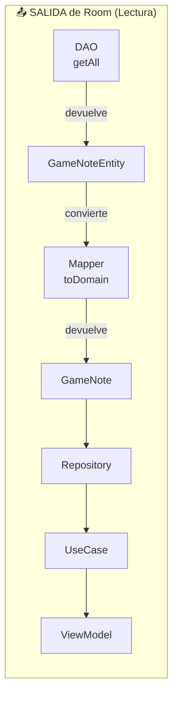


**Casos de uso:**

1. ✅ **Leer de BD**: DAO devuelve Entity → Mapper → Model → ViewModel
2. ✅ **Observar cambios**: Flow<Entity> → map { it.toDomain() } → Flow<Model>
3. ✅ **Queries**: Lista<Entity> → map { it.toDomain() } → Lista<Model>

### ¿Cuándo convertir Model → Entity?

```
graph LR
    subgraph "📥 ENTRADA a Room (Escritura)"
        VM2[ViewModel]
        UC2[UseCase]
        REPO2[Repository]
        MODEL2[GameNote]
        MAPPER2[Mapper<br/>toEntity]
        ENTITY2[GameNoteEntity]
        DAO2[DAO<br/>insert/update]
    end
    
    VM2 --> UC2
    UC2 --> REPO2
    REPO2 -->|pasa| MODEL2
    MODEL2 -->|convierte| MAPPER2
    MAPPER2 -->|devuelve| ENTITY2
    ENTITY2 --> DAO2
    
```


**Casos de uso:**

1. ✅ **Guardar en BD**: ViewModel crea Model → Mapper → Entity → DAO.insert()
2. ✅ **Actualizar**: Model modificado → Mapper → Entity → DAO.update()
3. ✅ **Borrar**: Model → Mapper → Entity → DAO.delete()

### Flujo de conversión bidireccional

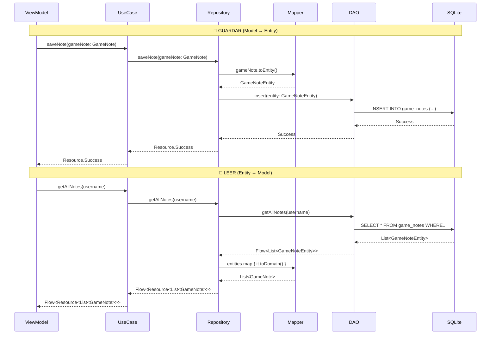


### Crear el Mapper

**Ubicación**: `data/mapper/GameNoteMapper.kt`

??? info "GameNoteMapper.kt"

    ```kotlin
    package com.pmdm.mygamestore.data.mapper

    import com.pmdm.mygamestore.data.local.entity.GameNoteEntity
    import com.pmdm.mygamestore.domain.model.GameNote
    import com.pmdm.mygamestore.domain.model.ProgressStatus

    /**
    * 🔄 Mapper para convertir entre Entity (BD) y Model (Dominio)
    * 
    * PROPÓSITO:
    * - Aislar la capa de datos de la capa de dominio
    * - Transformar tipos de Room (String) a tipos de negocio (Enum)
    * - Permitir evolución independiente de cada capa
    * 
    * PATRÓN:
    * - Extension functions para sintaxis limpia
    * - Conversiones bidireccionales (Entity ↔ Model)
    * - Manejo de errores en conversiones
    * 
    * USO:
    * ```
    * // Entity → Model
    * val entity = GameNoteEntity(...)
    * val model = entity.toDomain()
    * 
    * // Model → Entity
    * val model = GameNote(...)
    * val entity = model.toEntity()
    * ```
    */
    object GameNoteMapper {
        
        /**
        * 📤 Convierte Entity (BD) → Model (Dominio)
        * 
        * CUÁNDO USAR:
        * - Al leer de la base de datos
        * - Al observar cambios (Flow)
        * - Antes de enviar datos al ViewModel
        * 
        * TRANSFORMACIONES:
        * - String → Enum (progressStatus)
        * - Mantiene tipos primitivos (Int, Long, String)
        * 
        * @receiver GameNoteEntity de Room
        * @return GameNote del dominio
        * @throws IllegalArgumentException si el progressStatus no es válido
        */
        fun GameNoteEntity.toDomain(): GameNote {
            return GameNote(
                id = this.id,
                gameId = this.gameId,
                username = this.username,
                note = this.note,
                
                // ✨ Conversión String → Enum
                // valueOf lanza excepción si el string no es válido
                progressStatus = try {
                    ProgressStatus.valueOf(this.progressStatus)
                } catch (e: IllegalArgumentException) {
                    // Valor por defecto si hay datos corruptos en BD
                    ProgressStatus.PENDING
                },
                
                lastUpdated = this.lastUpdated
            )
        }
        
        /**
        * 📥 Convierte Model (Dominio) → Entity (BD)
        * 
        * CUÁNDO USAR:
        * - Al guardar en la base de datos
        * - Al actualizar registros
        * - Al eliminar (para obtener el Entity a borrar)
        * 
        * TRANSFORMACIONES:
        * - Enum → String (progressStatus)
        * - Mantiene tipos primitivos
        * 
        * @receiver GameNote del dominio
        * @return GameNoteEntity para Room
        */
        fun GameNote.toEntity(): GameNoteEntity {
            return GameNoteEntity(
                id = this.id,
                gameId = this.gameId,
                username = this.username,
                note = this.note,
                
                // ✨ Conversión Enum → String
                // .name devuelve el nombre del enum como String
                progressStatus = this.progressStatus.name,
                
                lastUpdated = this.lastUpdated
            )
        }
        
        /**
        * 📋 Convierte Lista<Entity> → Lista<Model>
        * 
        * UTILIDAD:
        * - Sintaxis más limpia para listas
        * - Evita map { it.toDomain() } repetido
        * 
        * @receiver List<GameNoteEntity>
        * @return List<GameNote>
        */
        fun List<GameNoteEntity>.toDomain(): List<GameNote> {
            return this.map { it.toDomain() }
        }
        
        /**
        * 📋 Convierte Lista<Model> → Lista<Entity>
        * 
        * @receiver List<GameNote>
        * @return List<GameNoteEntity>
        */
        fun List<GameNote>.toEntity(): List<GameNoteEntity> {
            return this.map { it.toEntity() }
        }
    }
    ```


### Casos de uso de cada dirección

#### 1. **Entity → Model (toDomain)**

```kotlin
// Caso 1: Leer nota individual
suspend fun getNoteByGameId(gameId: Int, username: String): Resource<GameNote?> {
    return try {
        val entity = dao.getNoteByGameId(gameId, username)
        val model = entity?.toDomain() // 📤 Entity → Model
        Resource.Success(model)
    } catch (e: Exception) {
        Resource.Error(...)
    }
}

// Caso 2: Observar lista con Flow
fun getAllNotes(username: String): Flow<Resource<List<GameNote>>> = flow {
    emit(Resource.Loading)
    
    dao.getAllNotes(username) // Flow<List<GameNoteEntity>>
        .map { entities -> 
            entities.toDomain() // 📤 List<Entity> → List<Model>
        }
        .collect { models ->
            emit(Resource.Success(models))
        }
}

// Caso 3: Query con múltiples resultados
suspend fun getCompletedGames(username: String): List<GameNote> {
    val entities = dao.getNotesByStatus(username, "COMPLETED")
    return entities.toDomain() // 📤 List<Entity> → List<Model>
}
```


#### 2. **Model → Entity (toEntity)**

```kotlin
// Caso 1: Guardar nota nueva
suspend fun saveNote(note: GameNote): Resource<Unit> {
    return try {
        val entity = note.toEntity() // 📥 Model → Entity
        dao.insertNote(entity)
        Resource.Success(Unit)
    } catch (e: Exception) {
        Resource.Error(...)
    }
}

// Caso 2: Actualizar nota existente
suspend fun updateNote(note: GameNote): Resource<Unit> {
    return try {
        val entity = note.toEntity() // 📥 Model → Entity
        dao.updateNote(entity)
        Resource.Success(Unit)
    } catch (e: Exception) {
        Resource.Error(...)
    }
}

// Caso 3: Eliminar nota
suspend fun deleteNote(note: GameNote): Resource<Unit> {
    return try {
        val entity = note.toEntity() // 📥 Model → Entity
        dao.deleteNote(entity)
        Resource.Success(Unit)
    } catch (e: Exception) {
        Resource.Error(...)
    }
}
```

### Mappers en arquitectura completa

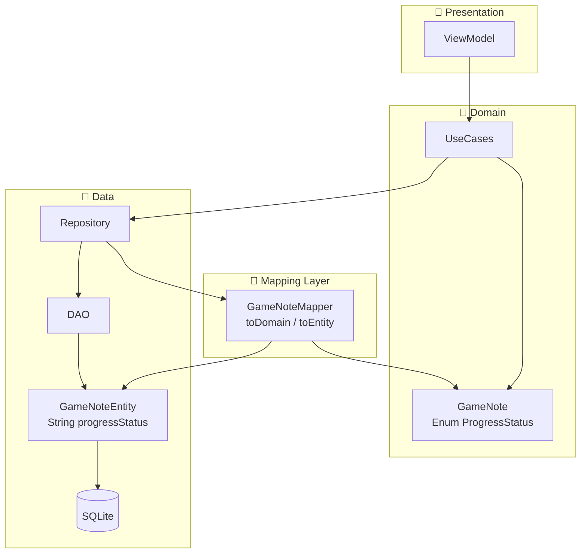
---

## 14. FASE 11: DAO de Room

### ¿Qué es un DAO?

**DAO** significa **Data Access Object** (Objeto de Acceso a Datos). Es una interfaz que define **cómo** acceder a los datos en la base de datos, sin implementar el **cómo** se ejecutan las operaciones (eso lo hace Room automáticamente).

!!! tip "El DAO es el puente directo con SQLite"
    Mientras que el Repository abstrae la fuente de datos (puede ser Room, API, Firebase), el DAO es específico de Room y se comunica directamente con SQLite.

### Consultas SQL en Room

Room traduce métodos de Kotlin a consultas SQL. Esto te da:

1. ✅ **Type-safety**: Errores de SQL en tiempo de compilación
2. ✅ **Autocomplete**: El IDE sugiere columnas válidas
3. ✅ **Verificación**: Room valida que las queries sean correctas

```mermaid
graph LR
    subgraph "Kotlin (DAO)"
        METHOD["@Query<br/>fun getAllNotes(username: String)"]
    end
    
    subgraph "Room Compiler"
        COMPILER[Procesa anotaciones<br/>Genera código]
    end
    
    subgraph "SQL Generado"
        SQL["SELECT * FROM game_notes<br/>WHERE username = ?"]
    end
    
    subgraph "SQLite"
        DB[(Base de Datos)]
    end
    
    METHOD --> COMPILER
    COMPILER --> SQL
    SQL --> DB
```


### Crear el DAO

**Ubicación**: `data/local/dao/GameNoteDao.kt`


??? info "GameNoteDao.kt"
    :!: Este archivo se encuentra en la carpeta `data/local/dao/`

    ```kotlin
    package com.pmdm.mygamestore.data.local.dao

    import androidx.room.*
    import com.pmdm.mygamestore.data.local.entity.GameNoteEntity
    import kotlinx.coroutines.flow.Flow

    /**
    * 🗄️ DAO (Data Access Object) para operaciones de notas en Room
    * 
    * PROPÓSITO:
    * - Define las operaciones de BD sin implementarlas
    * - Room genera el código SQL automáticamente
    * - Type-safe: Errores de SQL en tiempo de compilación
    * 
    * ANOTACIONES PRINCIPALES:
    * - @Dao: Marca esta interfaz como DAO de Room
    * - @Query: Define consultas SQL personalizadas
    * - @Insert: Operación de inserción (con estrategia de conflicto)
    * - @Update: Actualización de registros existentes
    * - @Delete: Eliminación de registros
    * 
    * TIPOS DE RETORNO:
    * - Flow<T>: Para observar cambios en tiempo real
    * - suspend fun: Para operaciones únicas asíncronas
    * - List<T>: Para consultas síncronas (no recomendado)
    * 
    * IMPORTANTE:
    * ⚠️ Los parámetros en @Query se referencian con `:nombreParametro`
    * ⚠️ Room valida que las columnas existan en la Entity
    * ⚠️ Flow emite automáticamente cuando cambian los datos
    */
    @Dao
    interface GameNoteDao {
        
        /**
        * 📚 Obtiene todas las notas de un usuario
        * 
        * CARACTERÍSTICAS:
        * - Devuelve Flow: Se actualiza automáticamente cuando cambian los datos
        * - Ordenado por fecha (más recientes primero)
        * - Filtra por username (solo notas del usuario)
        * 
        * SQL GENERADO:
        * ```sql
        * SELECT * FROM game_notes 
        * WHERE username = ? 
        * ORDER BY lastUpdated DESC
        * ```
        * 
        * @param username Usuario propietario de las notas
        * @return Flow que emite lista actualizada automáticamente
        */
        @Query("SELECT * FROM game_notes WHERE username = :username ORDER BY lastUpdated DESC")
        fun getAllNotes(username: String): Flow<List<GameNoteEntity>>
        
        /**
        * 🔍 Busca la nota de un juego específico para un usuario
        * 
        * CARACTERÍSTICAS:
        * - suspend fun: Operación única (no observa cambios)
        * - Puede devolver null si no existe
        * - Usa índice compuesto (username, gameId) para búsqueda rápida
        * 
        * SQL GENERADO:
        * ```sql
        * SELECT * FROM game_notes 
        * WHERE gameId = ? AND username = ?
        * LIMIT 1
        * ```
        * 
        * USO TÍPICO:
        * - Verificar si el usuario ya tiene nota para este juego
        * - Cargar nota existente para editar
        * 
        * @param gameId ID del juego
        * @param username Usuario propietario
        * @return Nota encontrada o null
        */
        @Query("SELECT * FROM game_notes WHERE gameId = :gameId AND username = :username")
        suspend fun getNoteByGameId(gameId: Int, username: String): GameNoteEntity?
        
        /**
        * 💾 Inserta o reemplaza una nota
        * 
        * ESTRATEGIA DE CONFLICTO:
        * - OnConflictStrategy.REPLACE:
        *   Si existe nota con mismo ID → La reemplaza
        *   Si no existe → La inserta
        * 
        * COMPORTAMIENTO:
        * - Si entity.id == 0: Room genera ID automáticamente (autoGenerate = true)
        * - Si entity.id > 0: Usa ese ID (UPDATE si existe, INSERT si no)
        * 
        * SQL GENERADO (INSERT):
        * ```sql
        * INSERT OR REPLACE INTO game_notes 
        * (gameId, username, note, progressStatus, lastUpdated)
        * VALUES (?, ?, ?, ?, ?)
        * ```
        * 
        * ALTERNATIVAS:
        * - IGNORE: Si existe, no hace nada
        * - ABORT: Si existe, lanza excepción
        * - FAIL: Similar a ABORT
        * - ROLLBACK: Revierte toda la transacción
        * 
        * @param note Entity a insertar/reemplazar
        */
        @Insert(onConflict = OnConflictStrategy.REPLACE)
        suspend fun insertNote(note: GameNoteEntity)
        
        /**
        * ✏️ Actualiza una nota existente
        * 
        * IMPORTANTE:
        * - Debe existir una nota con el mismo @PrimaryKey
        * - Si no existe, no hace nada (no lanza error)
        * - Actualiza TODAS las columnas de la Entity
        * 
        * SQL GENERADO:
        * ```sql
        * UPDATE game_notes 
        * SET gameId = ?, username = ?, note = ?, 
        *     progressStatus = ?, lastUpdated = ?
        * WHERE id = ?
        * ```
        * 
        * @param note Entity con datos actualizados (debe tener ID válido)
        */
        @Update
        suspend fun updateNote(note: GameNoteEntity)
        
        /**
        * 🗑️ Elimina una nota específica
        * 
        * IMPORTANTE:
        * - Usa @PrimaryKey para identificar qué borrar
        * - Si no existe, no hace nada (no lanza error)
        * - Respeta Foreign Keys (si hay CASCADE, borra relacionados)
        * 
        * SQL GENERADO:
        * ```sql
        * DELETE FROM game_notes WHERE id = ?
        * ```
        * 
        * ALTERNATIVA: Usar @Query para más control
        * @Query("DELETE FROM game_notes WHERE gameId = :gameId AND username = :username")
        * 
        * @param note Entity a eliminar (solo necesita el ID)
        */
        @Delete
        suspend fun deleteNote(note: GameNoteEntity)
        
        /**
        * 🗑️ Elimina nota por gameId y username (alternativa más específica)
        * 
        * VENTAJA:
        * - No necesitas tener el Entity completo
        * - Solo pasas los identificadores
        * - Útil cuando solo tienes gameId y username
        * 
        * SQL GENERADO:
        * ```sql
        * DELETE FROM game_notes 
        * WHERE gameId = ? AND username = ?
        * ```
        * 
        * @param gameId ID del juego
        * @param username Usuario propietario
        * @return Número de filas eliminadas (0 si no existía)
        */
        @Query("DELETE FROM game_notes WHERE gameId = :gameId AND username = :username")
        suspend fun deleteNoteByGameId(gameId: Int, username: String): Int
        
        /**
        * 📊 Obtiene notas filtradas por estado de progreso
        * 
        * CARACTERÍSTICAS:
        * - Flow: Reactivo a cambios
        * - Filtra por username Y progressStatus
        * - Usa índice para optimizar búsqueda
        * 
        * SQL GENERADO:
        * ```sql
        * SELECT * FROM game_notes 
        * WHERE username = ? AND progressStatus = ?
        * ORDER BY lastUpdated DESC
        * ```
        * 
        * USO TÍPICO:
        * - Mostrar solo juegos "Jugando"
        * - Crear sección de "Completados"
        * - Estadísticas por estado
        * 
        * @param username Usuario propietario
        * @param status Estado como String ("PENDING", "PLAYING", etc.)
        * @return Flow con notas filtradas
        */
        @Query("""
            SELECT * FROM game_notes 
            WHERE username = :username AND progressStatus = :status
            ORDER BY lastUpdated DESC
        """)
        fun getNotesByStatus(username: String, status: String): Flow<List<GameNoteEntity>>
        
        /**
        * 📈 Cuenta cuántas notas tiene un usuario
        * 
        * SQL GENERADO:
        * ```sql
        * SELECT COUNT(*) FROM game_notes WHERE username = ?
        * ```
        * 
        * @param username Usuario a contar
        * @return Número de notas (0 si no tiene)
        */
        @Query("SELECT COUNT(*) FROM game_notes WHERE username = :username")
        suspend fun getNotesCount(username: String): Int
        
        /**
        * 🧹 Elimina TODAS las notas de un usuario
        * 
        * ⚠️ CUIDADO: Operación irreversible
        * 
        * SQL GENERADO:
        * ```sql
        * DELETE FROM game_notes WHERE username = ?
        * ```
        * 
        * USO TÍPICO:
        * - Cerrar cuenta
        * - Resetear datos del usuario
        * - Testing
        * 
        * @param username Usuario cuyas notas se eliminarán
        * @return Número de notas eliminadas
        */
        @Query("DELETE FROM game_notes WHERE username = :username")
        suspend fun deleteAllNotesFromUser(username: String): Int
        
        /**
        * 🔍 Busca notas que contengan texto específico
        * 
        * CARACTERÍSTICAS:
        * - LIKE '%texto%': Búsqueda case-sensitive por defecto
        * - Puede buscar en cualquier parte del texto
        * - Útil para implementar búsqueda
        * 
        * SQL GENERADO:
        * ```sql
        * SELECT * FROM game_notes 
        * WHERE username = ? AND note LIKE ?
        * ```
        * 
        * USO:
        * ```kotlin
        * dao.searchNotes("admin", "%boss%") // Encuentra "defeated final boss"
        * ```
        * 
        * @param username Usuario propietario
        * @param searchQuery Texto a buscar (debe incluir % para wildcards)
        * @return Flow con notas que coinciden
        */
        @Query("SELECT * FROM game_notes WHERE username = :username AND note LIKE :searchQuery")
        fun searchNotes(username: String, searchQuery: String): Flow<List<GameNoteEntity>>
    }
    ```


### Conceptos clave del DAO

#### 1. **@Query vs @Insert/@Update/@Delete**

```kotlin
// ✅ @Insert: Room genera el SQL automáticamente
@Insert(onConflict = OnConflictStrategy.REPLACE)
suspend fun insertNote(note: GameNoteEntity)

// Equivalente manual con @Query (más verboso):
@Query("""
    INSERT OR REPLACE INTO game_notes 
    (gameId, username, note, progressStatus, lastUpdated)
    VALUES (:gameId, :username, :note, :progressStatus, :lastUpdated)
""")
suspend fun insertNoteManual(
    gameId: Int, 
    username: String, 
    note: String,
    progressStatus: String,
    lastUpdated: Long
)

// ¿Cuándo usar @Query manual?
// - Operaciones complejas (JOINs, subconsultas)
// - Inserciones batch personalizadas
// - Queries con lógica condicional
```


**Ejemplo práctico:**

```kotlin
// Escenario: Usuario edita nota existente
val existingNote = GameNoteEntity(
    id = 10,
    gameId = 123,
    username = "admin",
    note = "Texto original",
    progressStatus = "PLAYING",
    lastUpdated = System.currentTimeMillis()
)

// Usuario modifica el texto
val updatedNote = existingNote.copy(
    note = "Texto actualizado",
    lastUpdated = System.currentTimeMillis()
)

// Con REPLACE: Actualiza la nota existente ✅
dao.insertNote(updatedNote) // UPDATE en BD

// Con IGNORE: No hace nada (mantiene texto original) ⚠️
// Con ABORT: Lanza excepción ❌
```


#### 4. **Parámetros en @Query con `:nombreParametro`**

```kotlin
// ✅ Correcto: Usar : antes del nombre del parámetro
@Query("SELECT * FROM game_notes WHERE username = :username")
fun getAllNotes(username: String): Flow<List<GameNoteEntity>>

// ❌ Error común: Olvidar los dos puntos
@Query("SELECT * FROM game_notes WHERE username = username")
// Room buscará una columna llamada "username" (no el parámetro)

// ✅ Múltiples parámetros
@Query("SELECT * FROM game_notes WHERE username = :username AND gameId = :gameId")
suspend fun getNote(username: String, gameId: Int): GameNoteEntity?

// ✅ Mismo parámetro usado múltiples veces
@Query("""
    SELECT * FROM game_notes 
    WHERE username = :username 
    AND (note LIKE :query OR progressStatus LIKE :query)
""")
fun searchNotesAdvanced(username: String, query: String): Flow<List<GameNoteEntity>>
```


#### 5. **LIKE para búsquedas de texto**

```kotlin
@Query("SELECT * FROM game_notes WHERE note LIKE :searchQuery")
fun searchNotes(searchQuery: String): Flow<List<GameNoteEntity>>

// Uso correcto: Agregar % desde Kotlin
val query = "%boss%" // Encuentra "final boss", "boss battle", etc.
dao.searchNotes(query)

// Wildcards:
// % = Cualquier cantidad de caracteres
// _ = Exactamente 1 carácter

// Ejemplos:
"boss%"    // Empieza con "boss"
"%boss"    // Termina con "boss"
"%boss%"   // Contiene "boss" en cualquier parte
"boss_"    // "boss" + 1 carácter ("bossa", "bossy")
"b_ss"     // "b" + 1 carácter + "ss" ("boss", "bass")

// IMPORTANTE: LIKE es case-sensitive en SQLite por defecto
// Para case-insensitive:
@Query("SELECT * FROM game_notes WHERE LOWER(note) LIKE LOWER(:searchQuery)")
```

### Relación DAO con Repository

```mermaid
sequenceDiagram
    participant REPO as Repository
    participant MAPPER as Mapper
    participant DAO as GameNoteDao
    participant ROOM as Room
    participant SQL as SQLite
    
    Note over REPO,SQL: LEER (Entity → Model)
    
    REPO->>DAO: getAllNotes("admin")
    DAO->>ROOM: Procesa @Query
    ROOM->>SQL: SELECT * FROM game_notes...
    SQL-->>ROOM: Rows
    ROOM-->>DAO: List<GameNoteEntity>
    DAO-->>REPO: Flow<List<GameNoteEntity>>
    REPO->>MAPPER: entities.map { it.toDomain() }
    MAPPER-->>REPO: List<GameNote>
    
    Note over REPO,SQL: ESCRIBIR (Model → Entity)
    
    REPO->>MAPPER: note.toEntity()
    MAPPER-->>REPO: GameNoteEntity
    REPO->>DAO: insertNote(entity)
    DAO->>ROOM: Procesa @Insert
    ROOM->>SQL: INSERT OR REPLACE INTO...
    SQL-->>ROOM: Success
    ROOM-->>DAO: Success
    DAO-->>REPO: Success
```


---

## 15. FASE 12: Repositorio Real con Room

Ahora vamos a crear la implementación **real** del repositorio, que usa Room en lugar de datos en memoria.

### Implementar la misma interfaz

Lo increíble es que usaremos la **misma interfaz** `GameNoteRepository` que definimos en la FASE 2. Esto demuestra el poder de la abstracción.

```kotlin
// La interfaz NO cambia
interface GameNoteRepository {
    fun getAllNotes(username: String): Flow<Resource<List<GameNote>>>
    suspend fun getNoteByGameId(gameId: Int, username: String): Resource<GameNote?>
    suspend fun saveNote(note: GameNote): Resource<Unit>
    suspend fun deleteNote(gameId: Int, username: String): Resource<Unit>
    fun getNotesByStatus(username: String, status: ProgressStatus): Flow<Resource<List<GameNote>>>
}

// Solo cambiamos la implementación
class FakeGameNoteRepositoryImpl    // ❌ Versión fake
class GameNoteRepositoryImpl        // ✅ Versión real
```


### Usar el DAO

El DAO será nuestra puerta de entrada a Room:

```kotlin
class GameNoteRepositoryImpl(
    private val dao: GameNoteDao  // 🔑 Inyectado
) : GameNoteRepository {
    // El DAO hace todo el trabajo pesado
}
```


### Aplicar mappers

Los mappers convierten Entity ↔ Model en cada operación:

```mermaid
graph LR
    subgraph "Repository"
        SAVE[saveNote]
        GET[getAllNotes]
    end
    
    subgraph "Mappers"
        TO_ENTITY[toEntity]
        TO_DOMAIN[toDomain]
    end
    
    subgraph "DAO"
        INSERT[insertNote]
        QUERY[getAllNotes]
    end
    
    SAVE -->|Model| TO_ENTITY
    TO_ENTITY -->|Entity| INSERT
    
    QUERY -->|Entity| TO_DOMAIN
    TO_DOMAIN -->|Model| GET
```


### Flujo completo con Room

```mermaid
sequenceDiagram
    participant VM as ViewModel
    participant UC as UseCase
    participant REPO as GameNoteRepositoryImpl
    participant MAPPER as Mapper
    participant DAO as GameNoteDao
    participant ROOM as Room Compiler
    participant DB as SQLite
    
    Note over VM,DB: Usuario guarda una nota
    
    VM->>UC: saveNote(gameNote)
    UC->>REPO: saveNote(gameNote: GameNote)
    
    Note over REPO: Mapper: Model → Entity
    REPO->>MAPPER: gameNote.toEntity()
    MAPPER-->>REPO: GameNoteEntity
    
    Note over REPO: Guardar en Room
    REPO->>DAO: insertNote(entity)
    DAO->>ROOM: Procesa @Insert
    ROOM->>DB: INSERT OR REPLACE INTO game_notes...
    DB-->>ROOM: ✅ Success
    ROOM-->>DAO: Success
    DAO-->>REPO: Success
    
    REPO-->>UC: Resource.Success(Unit)
    UC-->>VM: Resource.Success(Unit)
    
    Note over VM: UI muestra "Guardado!"
    
    Note over VM,DB: Leer notas (Flow reactivo)
    
    VM->>UC: getNotesForUser("admin")
    UC->>REPO: getAllNotes("admin")
    REPO->>DAO: getAllNotes("admin")
    DAO->>ROOM: Procesa @Query
    ROOM->>DB: SELECT * FROM game_notes WHERE username = ?
    DB-->>ROOM: List<Row>
    ROOM-->>DAO: Flow<List<GameNoteEntity>>
    
    Note over REPO: Mapper: Entity → Model
    DAO-->>REPO: Flow<List<Entity>>
    REPO->>MAPPER: entities.map { it.toDomain() }
    MAPPER-->>REPO: List<GameNote>
    
    REPO-->>UC: Flow<Resource<List<GameNote>>>
    UC-->>VM: Flow<Resource<List<GameNote>>>
    
    Note over VM: UI recompone automáticamente
```


### Crear el Repository Real

**Ubicación**: `data/repository/GameNoteRepositoryImpl.kt`

??? info "GameNoteRepositoryImpl.kt"
    
    ```kotlin
    package com.pmdm.mygamestore.data.repository

    import com.pmdm.mygamestore.data.local.dao.GameNoteDao
    import com.pmdm.mygamestore.data.mapper.GameNoteMapper.toDomain
    import com.pmdm.mygamestore.data.mapper.GameNoteMapper.toEntity
    import com.pmdm.mygamestore.domain.model.AppError
    import com.pmdm.mygamestore.domain.model.GameNote
    import com.pmdm.mygamestore.domain.model.ProgressStatus
    import com.pmdm.mygamestore.domain.model.Resource
    import com.pmdm.mygamestore.domain.repository.GameNoteRepository
    import kotlinx.coroutines.flow.Flow
    import kotlinx.coroutines.flow.catch
    import kotlinx.coroutines.flow.map

    /**
    * 💾 Implementación REAL del repositorio de notas con Room
    * 
    * PROPÓSITO:
    * - Persistencia real en SQLite vía Room
    * - Implementa la misma interfaz que FakeRepository
    * - Usa Mappers para convertir Entity ↔ Model
    * - Maneja errores de base de datos
    * 
    * DIFERENCIAS CON FAKE:
    * ✅ Datos persisten al cerrar app
    * ✅ Reactividad real con Flow de Room
    * ✅ Optimizaciones de BD (índices, transacciones)
    * ✅ Integridad referencial (Foreign Keys)
    * 
    * TRANSICIÓN DESDE FAKE:
    * Solo cambias la inyección de dependencias.
    * El resto del código (ViewModel, UseCases, UI) NO cambia.
    * 
    * @property dao DAO de Room para acceso a BD
    */
    class GameNoteRepositoryImpl(
        private val dao: GameNoteDao
    ) : GameNoteRepository {
        
        /**
        * 📚 Implementación: Obtener todas las notas con Room
        * 
        * FLUJO:
        * 1. DAO devuelve Flow<List<GameNoteEntity>>
        * 2. map transforma cada emisión: Entity → Model
        * 3. Envuelve en Resource.Success
        * 4. catch maneja errores de BD
        * 
        * REACTIVIDAD:
        * - Room detecta cambios en la tabla game_notes
        * - Flow emite automáticamente la nueva lista
        * - UI se recompone sin llamadas manuales
        */
        override fun getAllNotes(username: String): Flow<Resource<List<GameNote>>> {
            return dao.getAllNotes(username)
                .map { entities ->
                    // 🔄 Mapper: List<Entity> → List<Model>
                    val models = entities.map { it.toDomain() }
                    Resource.Success(models)
                }
                .catch { exception ->
                    // 🚨 Captura errores de BD (corrupción, falta de espacio, etc.)
                    emit(Resource.Error(
                        AppError.DatabaseError("Failed to load notes: ${exception.message}")
                    ))
                }
        }
        
        /**
        * 🔍 Implementación: Buscar nota específica
        * 
        * DIFERENCIA CON getAllNotes:
        * - No usa Flow (operación única)
        * - suspend fun (no observa cambios)
        * - Puede devolver null
        */
        override suspend fun getNoteByGameId(
            gameId: Int, 
            username: String
        ): Resource<GameNote?> {
            return try {
                val entity = dao.getNoteByGameId(gameId, username)
                
                // 🔄 Mapper: Entity? → Model?
                val model = entity?.toDomain()
                
                Resource.Success(model)
                
            } catch (e: Exception) {
                Resource.Error(
                    AppError.DatabaseError("Failed to get note: ${e.message}")
                )
            }
        }
        
        /**
        * 💾 Implementación: Guardar nota en Room
        * 
        * LÓGICA:
        * 1. Validar nota (delegar a UseCase idealmente)
        * 2. Convertir Model → Entity con Mapper
        * 3. Insertar en BD via DAO
        * 4. Room maneja INSERT o UPDATE según el ID
        * 
        * ESTRATEGIA:
        * - Si note.id == 0: Room genera nuevo ID (INSERT)
        * - Si note.id > 0: Room actualiza existente (UPDATE)
        * - OnConflictStrategy.REPLACE: Reemplaza si existe
        */
        override suspend fun saveNote(note: GameNote): Resource<Unit> {
            return try {
                // Validación básica (idealmente en UseCase)
                if (!note.isValid()) {
                    return Resource.Error(
                        AppError.ValidationError("Note is not valid")
                    )
                }
                
                // 🔄 Mapper: Model → Entity
                val entity = note.toEntity()
                
                // 💾 Guardar en Room
                dao.insertNote(entity)
                
                Resource.Success(Unit)
                
            } catch (e: Exception) {
                Resource.Error(
                    AppError.DatabaseError("Failed to save note: ${e.message}")
                )
            }
        }
        
        /**
        * 🗑️ Implementación: Eliminar nota
        * 
        * OPCIONES:
        * 1. deleteNoteByGameId (usado aquí): Solo necesita IDs
        * 2. deleteNote(entity): Necesita Entity completo
        * 
        * VENTAJA opción 1:
        * - No necesitas cargar la nota primero
        * - Más eficiente (1 query en vez de 2)
        */
        override suspend fun deleteNote(gameId: Int, username: String): Resource<Unit> {
            return try {
                val deletedCount = dao.deleteNoteByGameId(gameId, username)
                
                if (deletedCount > 0) {
                    Resource.Success(Unit)
                } else {
                    // No había nota para eliminar
                    Resource.Error(AppError.NotFound)
                }
                
            } catch (e: Exception) {
                Resource.Error(
                    AppError.DatabaseError("Failed to delete note: ${e.message}")
                )
            }
        }
        
        /**
        * 📊 Implementación: Filtrar por estado
        * 
        * IMPORTANTE:
        * - DAO espera String, no Enum
        * - Convertimos Enum → String: progressStatus.name
        * - Mapper convierte String → Enum al leer
        */
        override fun getNotesByStatus(
            username: String, 
            status: ProgressStatus
        ): Flow<Resource<List<GameNote>>> {
            return dao.getNotesByStatus(username, status.name) // ✨ Enum → String
                .map { entities ->
                    val models = entities.map { it.toDomain() }
                    Resource.Success(models)
                }
                .catch { exception ->
                    emit(Resource.Error(
                        AppError.DatabaseError("Failed to filter notes: ${exception.message}")
                    ))
                }
        }
    }
    ```


### Conceptos clave del Repository Real

#### 1. **Flow.map para transformar Entity → Model**

```kotlin
dao.getAllNotes(username)  // Flow<List<GameNoteEntity>>
    .map { entities ->
        entities.map { it.toDomain() }  // List<GameNote>
    }

// Explicación paso a paso:
// 1. DAO emite: Flow<List<GameNoteEntity>>
// 2. .map { } transforma cada emisión
// 3. entities.map { it.toDomain() } convierte cada Entity
// 4. Resultado: Flow<List<GameNote>>
```


**¿Por qué dos `.map`?**

```kotlin
// Outer map: Transforma el Flow
dao.getAllNotes()
    .map { entities ->  // 👈 Cada vez que Flow emite
        // Inner map: Transforma la lista
        entities.map { entity ->  // 👈 Cada elemento de la lista
            entity.toDomain()
        }
    }

// Sin el outer map:
dao.getAllNotes() // Flow<List<Entity>> ❌ Tipo incorrecto

// Sin el inner map:
dao.getAllNotes()
    .map { entities ->
        entities // List<Entity> ❌ Sin convertir
    }
```


#### 2. **catch para manejo de errores en Flow**

```kotlin
dao.getAllNotes(username)
    .map { entities -> Resource.Success(entities.toDomain()) }
    .catch { exception ->  // 🚨 Captura errores del Flow
        emit(Resource.Error(AppError.DatabaseError(exception.message)))
    }

// Errores que catch captura:
// - Corrupción de base de datos
// - Falta de espacio en disco
// - Problemas con Foreign Keys
// - Errores en Mappers (valueOf inválido)

// Sin catch:
dao.getAllNotes()
    .map { ... }
// Si falla → Crashea la app ❌

// Con catch:
dao.getAllNotes()
    .map { ... }
    .catch { emit(Resource.Error(...)) }
// Si falla → Emite error, UI muestra mensaje ✅
```


#### 3. **try-catch para suspend fun**

```kotlin
override suspend fun saveNote(note: GameNote): Resource<Unit> {
    return try {
        val entity = note.toEntity()
        dao.insertNote(entity)
        Resource.Success(Unit)
    } catch (e: Exception) {
        Resource.Error(AppError.DatabaseError(e.message))
    }
}

// ¿Por qué try-catch y no .catch?
// - saveNote es suspend fun (no Flow)
// - Los errores se lanzan como excepciones
// - try-catch es la forma estándar de capturarlos
```


#### 4. **Enum → String al guardar, String → Enum al leer**

```kotlin
// GUARDAR: Model (Enum) → Entity (String)
override suspend fun saveNote(note: GameNote): Resource<Unit> {
    val entity = note.toEntity()
    // note.progressStatus = ProgressStatus.PLAYING (Enum)
    // entity.progressStatus = "PLAYING" (String)
    dao.insertNote(entity)
}

// LEER: Entity (String) → Model (Enum)
override fun getAllNotes(username: String): Flow<Resource<List<GameNote>>> {
    return dao.getAllNotes(username)
        .map { entities ->
            entities.map { entity ->
                entity.toDomain()
                // entity.progressStatus = "PLAYING" (String)
                // model.progressStatus = ProgressStatus.PLAYING (Enum)
            }
        }
}

// FILTRAR: Enum → String para query
override fun getNotesByStatus(
    username: String, 
    status: ProgressStatus
): Flow<Resource<List<GameNote>>> {
    // status = ProgressStatus.PLAYING (Enum)
    return dao.getNotesByStatus(username, status.name)  // "PLAYING" (String)
}
```
---

## 16. FASE 13: Cambio Mágico - Inyección de Dependencias

### ¿Qué es la Inyección de Dependencias?

La **Inyección de Dependencias** (Dependency Injection - DI) es un patrón de diseño donde los objetos reciben sus dependencias desde el exterior en lugar de crearlas internamente.

```mermaid
graph TB
    subgraph "❌ Sin Inyección (Acoplado)"
        VM1[ViewModel]
        REPO1[crea new<br/>FakeRepository]
        VM1 -->|depende directamente| REPO1
    end
    
    subgraph "✅ Con Inyección (Desacoplado)"
        DI[Contenedor DI<br/>Koin]
        VM2[ViewModel]
        REPO2[Repository]
        
        DI -->|inyecta| VM2
        DI -->|provee| REPO2
        VM2 -.usa.- REPO2
    end
```


### El poder de la interfaz

Gracias a que definimos una **interfaz** desde el principio, cambiar de implementación es trivial:

```kotlin
// La interfaz define el "qué" (contrato)
interface GameNoteRepository {
    fun getAllNotes(username: String): Flow<Resource<List<GameNote>>>
    // ... más métodos
}

// Implementación Fake (prototipo)
class FakeGameNoteRepositoryImpl : GameNoteRepository { ... }

// Implementación Real (producción)
class GameNoteRepositoryImpl(dao: GameNoteDao) : GameNoteRepository { ... }

// El ViewModel NO SABE cuál implementación usa
class GameNoteViewModel(
    private val useCases: GameNoteUseCases // 👈 Usa interfaz, no implementación
)
```


### Cambio en UNA SOLA LÍNEA

Este es el momento más satisfactorio de todo el desarrollo. Ver cómo todo funciona con persistencia real **sin cambiar ni una línea** en ViewModel, UseCases o UI.

#### Antes: Con FakeRepository

**Ubicación**: `presentation/viewmodel/GameNoteViewModelFactory.kt`

```kotlin
class GameNoteViewModelFactory(
    private val gameId: Int,
    private val username: String
) : ViewModelProvider.Factory {
    
    @Suppress("UNCHECKED_CAST")
    override fun <T : ViewModel> create(modelClass: Class<T>): T {
        if (modelClass.isAssignableFrom(GameNoteViewModel::class.java)) {
            // ❌ ANTES: Instanciamos FakeRepository manualmente
            val repository = FakeGameNoteRepositoryImpl()
            val useCases = GameNoteUseCases(repository)
            
            return GameNoteViewModel(
                useCases = useCases,
                gameId = gameId,
                username = username
            ) as T
        }
        throw IllegalArgumentException("Unknown ViewModel class")
    }
}
```


#### Después: Con RealRepository

```kotlin
class GameNoteViewModelFactory(
    private val gameId: Int,
    private val username: String,
    private val database: AppDatabase  // 👈 Pasamos la BD
) : ViewModelProvider.Factory {
    
    @Suppress("UNCHECKED_CAST")
    override fun <T : ViewModel> create(modelClass: Class<T>): T {
        if (modelClass.isAssignableFrom(GameNoteViewModel::class.java)) {
            // ✅ DESPUÉS: Instanciamos RealRepository con Room
            val dao = database.gameNoteDao()
            val repository = GameNoteRepositoryImpl(dao)  // 🎯 LA ÚNICA LÍNEA QUE CAMBIÓ
            val useCases = GameNoteUseCases(repository)
            
            return GameNoteViewModel(
                useCases = useCases,
                gameId = gameId,
                username = username
            ) as T
        }
        throw IllegalArgumentException("Unknown ViewModel class")
    }
}
```


### Diagrama Comparativo: Antes vs Después

```mermaid
graph TB
    subgraph "❌ ANTES: FakeRepository (Memoria)"
        VM1[GameNoteViewModel]
        UC1[GameNoteUseCases]
        FAKE[FakeRepository]
        FAKE_DS[FakeDataSource<br/>MutableList]
        
        VM1 --> UC1
        UC1 --> FAKE
        FAKE --> FAKE_DS
        
        FAKE_DS -.datos se pierden.- X1[❌ Al cerrar app]
    end
    
    subgraph "✅ DESPUÉS: RealRepository (Room)"
        VM2[GameNoteViewModel<br/>SIN CAMBIOS ✨]
        UC2[GameNoteUseCases<br/>SIN CAMBIOS ✨]
        REAL[GameNoteRepositoryImpl<br/>🎯 NUEVA]
        DAO[GameNoteDao]
        ROOM[Room Database]
        SQL[(SQLite)]
        
        VM2 --> UC2
        UC2 --> REAL
        REAL --> DAO
        DAO --> ROOM
        ROOM --> SQL
        
        SQL -.datos persisten.- OK[✅ Permanentes]
    end
```


### Actualizar la Screen para pasar AppDatabase

**Ubicación**: `presentation/ui/screens/GameNoteScreen.kt`

```kotlin
@Composable
fun GameNoteScreen(
    gameId: Int,
    username: String,
    onBack: () -> Unit,
    viewModel: GameNoteViewModel = viewModel(
        factory = GameNoteViewModelFactory(
            gameId = gameId,
            username = username,
            database = MyGameStoreApp.database  // 👈 Obtener BD del Application
        )
    )
) {
    // ... resto del código sin cambios
}
```


### El resultado: ¡TODO funciona igual!

```kotlin
// ViewModel: SIN CAMBIOS
class GameNoteViewModel(
    private val useCases: GameNoteUseCases,  // Sigue igual
    private val gameId: Int,
    private val username: String
) : ViewModel() {
    // Todo el código es EXACTAMENTE igual
    fun loadNotes() { /* ... */ }
    fun onSaveClick() { /* ... */ }
}

// UseCases: SIN CAMBIOS
class GameNoteUseCases(
    private val repository: GameNoteRepository  // Interfaz, no implementación
) {
    // Todo el código es EXACTAMENTE igual
    fun getNotesForUser(username: String) { /* ... */ }
    suspend fun saveNote(note: GameNote) { /* ... */ }
}

// UI Screen: SIN CAMBIOS
@Composable
fun GameNoteScreen(/* ... */) {
    val uiState by viewModel.uiState.collectAsState()
    
    // Todo el código de UI es EXACTAMENTE igual
    NoteFormSection(/* ... */)
    NoteCard(/* ... */)
}
```


### ¿Por qué funciona sin cambios?

```mermaid
graph LR
    subgraph "Capas Superiores"
        VM[ViewModel]
        UC[UseCases]
    end
    
    subgraph "Abstracción"
        INTERFACE[GameNoteRepository<br/>INTERFACE]
    end
    
    subgraph "Implementaciones Intercambiables"
        FAKE[FakeRepositoryImpl]
        REAL[RepositoryImpl]
    end
    
    VM --> UC
    UC -.depende de.- INTERFACE
    INTERFACE -.implementa.- FAKE
    INTERFACE -.implementa.- REAL
```


**Razones:**

1. ✅ **Interfaz común**: Ambas implementaciones cumplen el mismo contrato
2. ✅ **Mismo Resource<T>**: Ambas devuelven Loading/Success/Error
3. ✅ **Mismo Flow**: Ambas devuelven Flow reactive
4. ✅ **Mismo Model**: Ambas trabajan con GameNote (dominio)

---

## 17. FASE 14: Integración en AppDatabase

Para que Room reconozca nuestra Entity y DAO, debemos registrarlos en `AppDatabase`.

### Agregar Entity a Room Database

**Ubicación**: `data/local/AppDatabase.kt`

```kotlin
package com.pmdm.mygamestore.data.local

import android.content.Context
import androidx.room.Database
import androidx.room.Room
import androidx.room.RoomDatabase
import com.pmdm.mygamestore.data.local.dao.GameNoteDao
import com.pmdm.mygamestore.data.local.entity.GameNoteEntity
import com.pmdm.mygamestore.data.local.entity.UserEntity
// ... otras imports

/**
 * 🗄️ Base de datos principal de la aplicación
 * 
 * Room Database que gestiona todas las tablas y DAOs.
 * 
 * IMPORTANTE:
 * - Incrementar version cada vez que cambia el esquema
 * - Agregar todas las @Entity en el array entities
 * - Agregar abstract fun para cada DAO
 */
@Database(
    entities = [
        UserEntity::class,
        GameNoteEntity::class,  // 🆕 AGREGAR nuestra Entity
        // ... otras entities
    ],
    version = 2,  // 🆕 INCREMENTAR versión (antes era 1)
    exportSchema = false  // true en producción para migrations
)
abstract class AppDatabase : RoomDatabase() {
    
    // DAOs existentes
    abstract fun userDao(): UserDao
    
    // 🆕 AGREGAR nuestro DAO
    abstract fun gameNoteDao(): GameNoteDao
    
    // ... otros DAOs
}
```


### Migración de esquema (si la BD ya existía)

Si tu app ya está en producción con versión 1, necesitas una migración:

```kotlin
@Database(
    entities = [
        UserEntity::class,
        GameNoteEntity::class,
    ],
    version = 2,
    exportSchema = true  // Genera schema en carpeta schemas/
)
abstract class AppDatabase : RoomDatabase() {
    
    abstract fun userDao(): UserDao
    abstract fun gameNoteDao(): GameNoteDao
    
    companion object {
        /**
         * 🔄 Migración de versión 1 a 2
         * 
         * Agrega la tabla game_notes sin perder datos de users
         */
        val MIGRATION_1_2 = object : Migration(1, 2) {
            override fun migrate(database: SupportSQLiteDatabase) {
                // Crear tabla game_notes
                database.execSQL("""
                    CREATE TABLE IF NOT EXISTS game_notes (
                        id INTEGER PRIMARY KEY AUTOINCREMENT NOT NULL,
                        gameId INTEGER NOT NULL,
                        username TEXT NOT NULL,
                        note TEXT NOT NULL,
                        progressStatus TEXT NOT NULL,
                        lastUpdated INTEGER NOT NULL,
                        FOREIGN KEY (username) REFERENCES users(username) ON DELETE CASCADE
                    )
                """)
                
                // Crear índices
                database.execSQL("""
                    CREATE INDEX index_game_notes_username_gameId 
                    ON game_notes(username, gameId)
                """)
                
                database.execSQL("""
                    CREATE INDEX index_game_notes_username 
                    ON game_notes(username)
                """)
            }
        }
        
        /**
         * Builder de la base de datos
         */
        fun build(context: Context): AppDatabase {
            return Room.databaseBuilder(
                context.applicationContext,
                AppDatabase::class.java,
                "mygamestore_db"
            )
            .addMigrations(MIGRATION_1_2)  // 🔄 Agregar migración
            .build()
        }
    }
}
```


### Actualizar MyGameStoreApp

**Ubicación**: `MyGameStoreApp.kt`

```kotlin
package com.pmdm.mygamestore

import android.app.Application
import com.pmdm.mygamestore.data.local.AppDatabase

/**
 * 🚀 Clase Application de la app
 * 
 * Se crea una vez al iniciar el proceso.
 * Ideal para inicializar singletons como la BD.
 */
class MyGameStoreApp : Application() {
    
    companion object {
        /**
         * Instancia singleton de la base de datos
         * Accesible desde cualquier parte de la app
         */
        lateinit var database: AppDatabase
            private set
    }
    
    override fun onCreate() {
        super.onCreate()
        
        // Inicializar base de datos
        database = Room.databaseBuilder(
            applicationContext,
            AppDatabase::class.java,
            "mygamestore_db"
        )
        .addMigrations(AppDatabase.MIGRATION_1_2)  // Si hay migraciones
        .build()
    }
}
```


### Registrar Application en AndroidManifest.xml

**Ubicación**: `app/src/main/AndroidManifest.xml`

```xml
<manifest xmlns:android="http://schemas.android.com/apk/res/android"
    package="com.pmdm.mygamestore">
    
    <application
        android:name=".MyGameStoreApp"
        android:label="@string/app_name"
        android:icon="@mipmap/ic_launcher"
        android:theme="@style/Theme.MyGameStore">
        
        <!-- ... activities -->
        
    </application>
</manifest>
```


---

## 18. Arquitectura Completa Final

### Diagrama de todas las capas conectadas

```mermaid
graph TB
    subgraph "🎨 PRESENTATION LAYER"
        UI[GameNoteScreen<br/>Composable]
        VM[GameNoteViewModel<br/>StateFlow]
        STATE[GameNoteUiState]
    end
    
    subgraph "💼 DOMAIN LAYER"
        UC[GameNoteUseCases<br/>Lógica de negocio]
        MODEL[GameNote<br/>Domain Model]
        REPO_INT[GameNoteRepository<br/>Interface]
    end
    
    subgraph "🔄 MAPPING LAYER"
        MAPPER[GameNoteMapper<br/>toEntity / toDomain]
    end
    
    subgraph "💾 DATA LAYER"
        REPO_IMPL[GameNoteRepositoryImpl<br/>Room]
        DAO[GameNoteDao<br/>SQL Queries]
        ENTITY[GameNoteEntity<br/>Table]
    end
    
    subgraph "🗄️ PERSISTENCE"
        ROOM[Room Database]
        SQL[(SQLite)]
    end
    
    UI -->|observa| VM
    VM -->|gestiona| STATE
    VM -->|coordina| UC
    UC -->|usa| MODEL
    UC -->|llama| REPO_INT
    REPO_INT -.implementa.- REPO_IMPL
    
    REPO_IMPL -->|escribe| MAPPER
    MAPPER -->|Model → Entity| ENTITY
    
    REPO_IMPL -->|lee| DAO
    DAO -->|Entity → Model| MAPPER
    MAPPER --> MODEL
    
    DAO --> ENTITY
    ENTITY --> ROOM
    ROOM --> SQL
```


### Flujo bidireccional completo

```mermaid
sequenceDiagram
    participant USER as 👤 Usuario
    participant UI as GameNoteScreen
    participant VM as ViewModel
    participant UC as UseCases
    participant REPO as Repository
    participant MAPPER as Mapper
    participant DAO as DAO
    participant ROOM as Room
    participant DB as SQLite
    
    Note over USER,DB: 📥 GUARDAR NOTA
    
    USER->>UI: Escribe "Gran juego"<br/>Click Guardar
    UI->>VM: onSaveClick()
    VM->>UC: saveNote(gameNote)
    
    Note over UC: Validaciones<br/>de negocio
    
    UC->>REPO: saveNote(gameNote: GameNote)
    REPO->>MAPPER: gameNote.toEntity()
    MAPPER-->>REPO: GameNoteEntity
    REPO->>DAO: insertNote(entity)
    DAO->>ROOM: Procesa @Insert
    ROOM->>DB: INSERT OR REPLACE INTO game_notes...
    DB-->>ROOM: ✅ ID = 42
    ROOM-->>DAO: Success
    DAO-->>REPO: Success
    REPO-->>UC: Resource.Success
    UC-->>VM: Resource.Success
    VM->>VM: _uiState.update { isSaved = true }
    VM-->>UI: Emite nuevo estado
    UI->>USER: Muestra "Guardado!"
    
    Note over USER,DB: 📤 OBSERVAR CAMBIOS (REACTIVE)
    
    DB->>ROOM: 🔔 Detecta cambio en game_notes
    ROOM->>DAO: Emite nuevo Flow
    DAO->>REPO: Flow<List<GameNoteEntity>>
    REPO->>MAPPER: entities.map { it.toDomain() }
    MAPPER-->>REPO: List<GameNote>
    REPO->>UC: Flow<Resource<List<GameNote>>>
    UC->>VM: Flow emitido
    VM->>VM: _uiState.update { notes = newList }
    VM-->>UI: StateFlow emite
    UI->>USER: ✨ Recomposición automática<br/>Lista actualizada
```


### Operación CRUD completa

```mermaid
sequenceDiagram
    participant UI as UI
    participant VM as ViewModel
    participant UC as UseCases
    participant REPO as Repository
    participant DAO as DAO
    participant DB as SQLite
    
    Note over UI,DB: CREATE (Insertar)
    UI->>VM: onSaveClick()
    VM->>UC: saveNote(note)
    UC->>REPO: saveNote(note)
    REPO->>DAO: insertNote(entity)
    DAO->>DB: INSERT INTO game_notes...
    DB-->>UI: ✅ Nota creada
    
    Note over UI,DB: READ (Leer)
    VM->>UC: getNotesForUser()
    UC->>REPO: getAllNotes()
    REPO->>DAO: getAllNotes()
    DAO->>DB: SELECT * FROM game_notes...
    DB-->>UI: 📋 Lista de notas
    
    Note over UI,DB: UPDATE (Actualizar)
    UI->>VM: onSaveClick() con id existente
    VM->>UC: saveNote(noteWithId)
    UC->>REPO: saveNote(noteWithId)
    REPO->>DAO: insertNote(entity) REPLACE
    DAO->>DB: UPDATE game_notes SET...
    DB-->>UI: ✅ Nota actualizada
    
    Note over UI,DB: DELETE (Eliminar)
    UI->>VM: onDeleteClick(note)
    VM->>UC: deleteNote(gameId, username)
    UC->>REPO: deleteNote(gameId, username)
    REPO->>DAO: deleteNoteByGameId()
    DAO->>DB: DELETE FROM game_notes WHERE...
    DB-->>UI: ✅ Nota eliminada
```


---

## 19. Resumen y Mejores Prácticas

### ✅ Checklist de implementación completa

| Fase | Componente | Archivo | Estado |
|------|-----------|---------|--------|
| **1** | Domain Model | `domain/model/GameNote.kt` | ✅ |
| **2** | Repository Interface | `domain/repository/GameNoteRepository.kt` | ✅ |
| **3** | FakeDataSource | `data/local/FakeGameNoteDataSource.kt` | ✅ |
| **4** | FakeRepository | `data/repository/FakeGameNoteRepositoryImpl.kt` | ✅ |
| **5** | UseCases | `domain/usecase/GameNoteUseCases.kt` | ✅ |
| **6** | UiState | `presentation/viewmodel/GameNoteUiState.kt` | ✅ |
| **6** | ViewModel | `presentation/viewmodel/GameNoteViewModel.kt` | ✅ |
| **7** | Screen UI | `presentation/ui/screens/GameNoteScreen.kt` | ✅ |
| **8** | ✅ CHECKPOINT | Prototipo funcionando | ✅ |
| **9** | Entity | `data/local/entity/GameNoteEntity.kt` | ✅ |
| **10** | Mapper | `data/mapper/GameNoteMapper.kt` | ✅ |
| **11** | DAO | `data/local/dao/GameNoteDao.kt` | ✅ |
| **12** | Real Repository | `data/repository/GameNoteRepositoryImpl.kt` | ✅ |
| **13** | DI Change | `GameNoteViewModelFactory.kt` | ✅ |
| **14** | AppDatabase | `data/local/AppDatabase.kt` | ✅ |

### ❌ Errores comunes a evitar

#### 1. **Usar Entity en ViewModel**

```kotlin
// ❌ MAL: Entity en capa de presentación
class GameNoteViewModel {
    val notes: StateFlow<List<GameNoteEntity>>  // Entity en ViewModel
}

// ✅ BIEN: Model en capa de presentación
class GameNoteViewModel {
    val notes: StateFlow<List<GameNote>>  // Domain Model
}
```


#### 2. **Olvidar convertir en Repository**

```kotlin
// ❌ MAL: Devolver Entity directamente
class GameNoteRepositoryImpl(dao: DAO) : GameNoteRepository {
    override fun getAllNotes(): Flow<List<GameNoteEntity>> {  // ❌ Entity
        return dao.getAllNotes()
    }
}

// ✅ BIEN: Convertir Entity → Model con Mapper
class GameNoteRepositoryImpl(dao: DAO) : GameNoteRepository {
    override fun getAllNotes(): Flow<Resource<List<GameNote>>> {  // ✅ Model
        return dao.getAllNotes()
            .map { entities -> 
                entities.map { it.toDomain() }  // Mapper
            }
    }
}
```


#### 3. **No usar Resource para estados**

```kotlin
// ❌ MAL: Solo devolver datos
fun getAllNotes(): Flow<List<GameNote>>

// ¿Cómo sabe la UI si está cargando?
// ¿Cómo sabe si falló?

// ✅ BIEN: Usar Resource
fun getAllNotes(): Flow<Resource<List<GameNote>>>

// UI puede reaccionar a Loading, Success, Error
```


#### 4. **Crear Repository en ViewModel**

```kotlin
// ❌ MAL: ViewModel crea dependencias
class GameNoteViewModel {
    private val repository = GameNoteRepositoryImpl(...)  // Acoplado
}

// ✅ BIEN: Inyectar dependencias
class GameNoteViewModel(
    private val useCases: GameNoteUseCases  // Inyectado
)
```


#### 5. **Olvidar incrementar versión de BD**

```kotlin
// ❌ MAL: Agregar Entity sin cambiar version
@Database(
    entities = [UserEntity::class, GameNoteEntity::class],
    version = 1  // ❌ No cambió (Room crasheará)
)

// ✅ BIEN: Incrementar version
@Database(
    entities = [UserEntity::class, GameNoteEntity::class],
    version = 2  // ✅ Versión incrementada
)
```


### 💡 Tips profesionales

#### 1. **Nombres consistentes**

```kotlin
// Patrón de nombres claro:
GameNote              // Domain Model
GameNoteEntity        // Room Entity
GameNoteDao           // Room DAO
GameNoteRepository    // Interface
GameNoteRepositoryImpl // Implementation
GameNoteUseCases      // UseCases
GameNoteViewModel     // ViewModel
GameNoteUiState       // UI State
GameNoteScreen        // Composable
GameNoteMapper        // Mapper
```


#### 2. **Documentación clara**

```kotlin
/**
 * 📝 Título descriptivo
 * 
 * PROPÓSITO:
 * - Razón de existir de esta clase
 * 
 * RESPONSABILIDADES:
 * - Qué hace
 * - Qué NO hace
 * 
 * @property param Descripción del parámetro
 */
```


#### 3. **Testing desde el inicio**

```kotlin
// Test del Mapper
class GameNoteMapperTest {
    @Test
    fun `toEntity converts enum to string`() {
        val model = GameNote(progressStatus = ProgressStatus.PLAYING)
        val entity = model.toEntity()
        assertEquals("PLAYING", entity.progressStatus)
    }
}

// Test del ViewModel (con FakeRepository)
class GameNoteViewModelTest {
    @Test
    fun `saveNote shows success message`() = runTest {
        val fakeRepo = FakeGameNoteRepositoryImpl()
        val viewModel = GameNoteViewModel(GameNoteUseCases(fakeRepo), 1, "test")
        
        viewModel.onSaveClick()
        
        assertTrue(viewModel.uiState.value.isSaved)
    }
}
```


### 🚀 Próximos pasos

Ahora que dominas el flujo completo, puedes:

1. **Agregar más features** siguiendo el mismo patrón
2. **Implementar sincronización** con API (Retrofit)
3. **Agregar testing** (Unit tests, UI tests)
4. **Optimizar queries** (índices, paginación)
5. **Implementar caché** (Room + API con política de caché)
6. **Agregar WorkManager** (sincronización en background)

### 📊 Tabla Comparativa Final: Fake vs Real

| Aspecto | FakeRepository | RealRepository (Room) |
|---------|----------------|----------------------|
| **Persistencia** | ❌ En memoria (se pierde) | ✅ SQLite (permanente) |
| **Velocidad desarrollo** | ⚡ Muy rápida | 🐢 Más lenta (configuración) |
| **Complejidad** | 🟢 Baja | 🟡 Media |
| **Testing** | ✅ Muy fácil | ⚠️ Requiere más setup |
| **Reactividad** | ⚠️ Manual (simulate) | ✅ Automática (Flow) |
| **Producción** | ❌ No apta | ✅ Lista |
| **Migración** | - | 🔄 Requiere versioning |
| **Código cambiado** | - | 🎯 1 línea en Factory |

---

### Lo que has aprendido:

✅ **Arquitectura en 3 capas** (Presentación, Dominio, Datos)  
✅ **Prototipado rápido** con FakeRepository  
✅ **Evolución a producción** con Room  
✅ **Separación Model/Entity** y por qué importa  
✅ **Mappers bidireccionales** (Entity ↔ Model)  
✅ **Resource pattern** para estados (Loading/Success/Error)  
✅ **Flow reactivo** para actualizaciones automáticas  
✅ **Inyección de dependencias** (manual o con Koin)  
✅ **Room completo** (Entity, DAO, Database, Migrations)  
✅ **Testing** con repositorios fake  

### Tu siguiente feature será más fácil

Ahora que entiendes el patrón completo, implementar nuevas features será mucho más rápido porque:

- Ya conoces la estructura
- Puedes reutilizar componentes
- Sabes cuándo usar cada herramienta
- Entiendes las responsabilidades de cada capa

**¡Sigue practicando y construyendo apps profesionales! 🚀**
