# **14. Consumo de API con Retrofit**

En esta parte implementaremos el **consumo de una API REST real** usando **Retrofit**, migrando de datos simulados (Mock) a datos reales obtenidos de la API de RAWG.io, una de las bases de datos de videojuegos más completas del mundo.

!!! tip "Repositorio de la Aplicación"
    El código fuente de la aplicación se encuentra en el repositorio de GitHub: [MyGameStore](https://github.com/jssdocente/MyGameStore)

---

## **Resumen**

En esta guía aprenderás a:

1. **Concepto de APIs REST** y cómo consumirlas desde Android
2. **Librerías principales**: Retrofit, OkHttp y Kotlinx Serialization
3. **Configurar dependencias** y permisos necesarios
4. **Definir la capa de datos**: DTOs, API Service y Mappers
5. **Implementar el Repositorio Real** que consume la API de RAWG.io
6. **Inyectar con Koin** la configuración de red, incluyendo interceptores para API_KEY

### Arquitectura que implementaremos

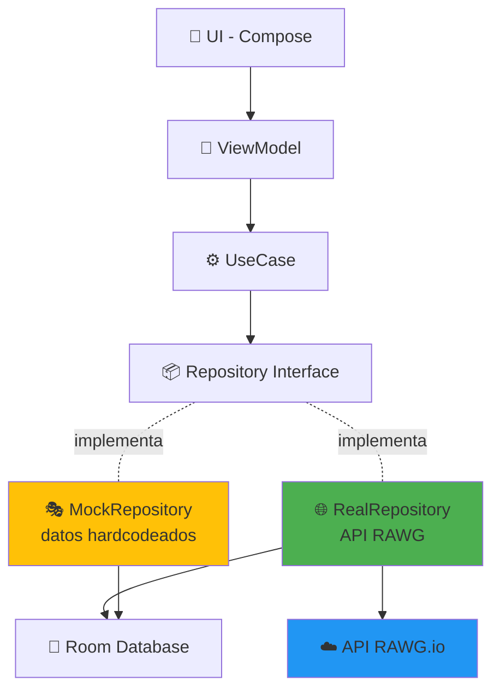


### Flujo de datos completo

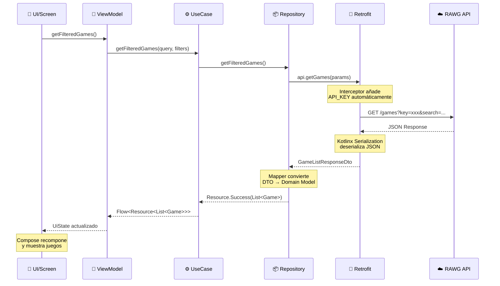


---

## **1. Concepto de APIs y consumo desde Android**

### 1.1. ¿Qué es una API REST?

Una **API (Application Programming Interface)** es un conjunto de reglas que permite que diferentes aplicaciones se comuniquen entre sí. **REST (Representational State Transfer)** es un estilo arquitectónico que define cómo debe estructurarse esa comunicación.

**Características de REST:**

- 📡 **Cliente-Servidor**: Separación clara entre quien solicita (app) y quien provee datos (servidor)
- 🔗 **Basado en HTTP**: Usa los métodos estándar de HTTP
- 📄 **Stateless**: Cada petición es independiente
- 🎯 **Recursos identificados**: Cada recurso tiene una URL única
- 📦 **Formato JSON**: Intercambio de datos en formato legible

### 1.2. Métodos HTTP principales

| Método | Acción | Ejemplo | Uso en MyGameStore |
|--------|--------|---------|-------------------|
| **GET** | Obtener datos | `GET /games` | ✅ Listar juegos |
| **POST** | Crear recurso | `POST /users` | ❌ No usado (API pública) |
| **PUT** | Actualizar completo | `PUT /users/1` | ❌ No usado |
| **PATCH** | Actualizar parcial | `PATCH /users/1` | ❌ No usado |
| **DELETE** | Eliminar | `DELETE /users/1` | ❌ No usado |

!!! info "API de solo lectura"
    La API de RAWG.io es de **solo lectura** (read-only), por lo que solo usaremos **GET**. Las operaciones de escritura (favoritos, biblioteca, notas) se gestionan localmente con **Room**.

### 1.3. Arquitectura Cliente-Servidor

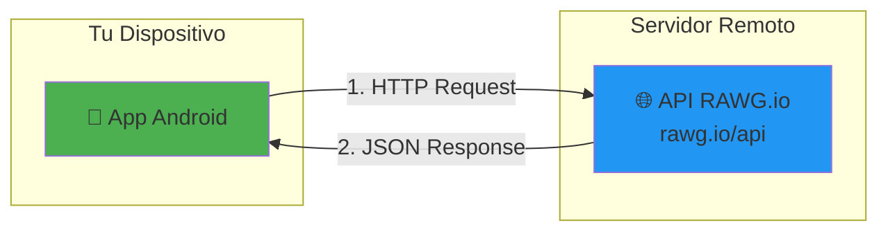


**Flujo:**

1. **App Android** envía una petición HTTP:
```
GET https://api.rawg.io/api/games?key=YOUR_KEY&search=zelda
```


2. **Servidor RAWG** procesa la petición y devuelve JSON:
```json
{
     "count": 850,
     "results": [
       {
         "id": 3328,
         "name": "The Legend of Zelda: Breath of the Wild",
         "rating": 4.65,
         ...
       }
     ]
   }
```


3. **App Android** deserializa el JSON y lo convierte en objetos Kotlin

### 1.4. API de RAWG.io

**RAWG.io** es una base de datos de videojuegos con más de 500,000 juegos catalogados.

**Base URL:** `https://api.rawg.io/api/`

**Endpoints principales que usaremos:**

| Endpoint | Descripción | Parámetros clave |
|----------|-------------|------------------|
| `GET /games` | Lista de juegos con filtros | `search`, `genres`, `platforms`, `ordering` |
| `GET /games/{id}` | Detalle de un juego específico | `id` (path parameter) |

**Autenticación:**

- 🔑 Requiere una **API_KEY** gratuita
- Se incluye en cada petición: `?key=YOUR_API_KEY`
- Registro: [https://rawg.io/apidocs](https://rawg.io/apidocs)

**Ejemplo de petición real:**

```
GET https://api.rawg.io/api/games?key=abc123&search=god%20of%20war&page_size=10
```


**Respuesta (simplificada):**

```json
{
  "count": 150,
  "next": "https://api.rawg.io/api/games?page=2...",
  "results": [
    {
      "id": 13536,
      "name": "God of War",
      "released": "2018-04-20",
      "rating": 4.58,
      "background_image": "https://media.rawg.io/...",
      "platforms": [
        { "platform": { "id": 4, "name": "PC" } },
        { "platform": { "id": 18, "name": "PlayStation 4" } }
      ],
      "genres": [
        { "id": 4, "name": "Action" }
      ]
    }
  ]
}
```


### 1.5. Comparación: Mock vs API Real

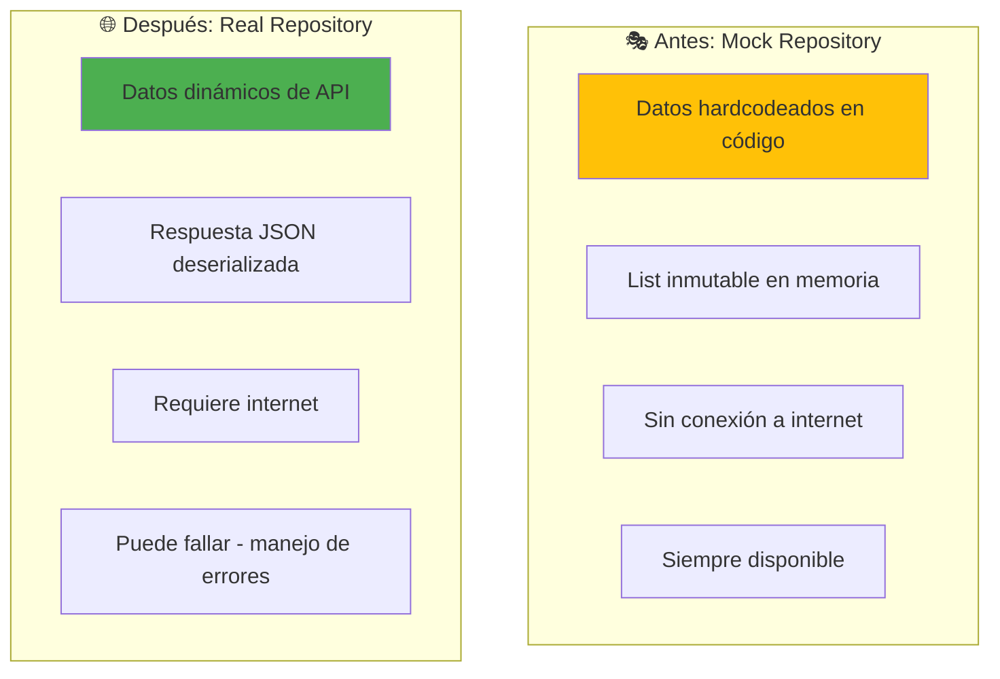


| Aspecto | Mock Repository | Real Repository |
|---------|----------------|-----------------|
| **Fuente de datos** | Hardcodeado en código | API REST remota |
| **Internet** | ❌ No necesita | ✅ Requiere conexión |
| **Cantidad de juegos** | ~20 juegos fijos | 500,000+ juegos |
| **Búsqueda** | Filtrado local | Búsqueda en servidor |
| **Actualización** | Solo con nueva versión | Datos en tiempo real |
| **Errores de red** | No aplica | Requiere manejo de errores |
| **Velocidad** | Instantáneo | Depende de red |
| **Uso** | Desarrollo UI, tests | Producción |

!!! warning "Cuándo usar cada uno"
    - **Mock**: Desarrollo de UI, tests unitarios, sin API disponible
    - **Real**: Producción, demostración con datos reales, testing de integración

---

## **2. Librerías para consumo de APIs**

### 2.1. Stack de red en Android
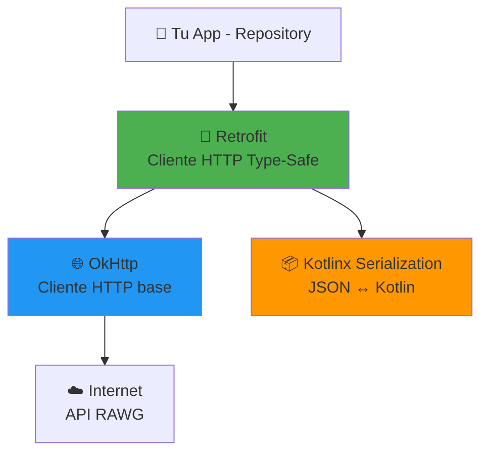
### 2.2. Retrofit

**¿Qué es Retrofit?**

Retrofit es un **cliente HTTP type-safe** para Android y Java creado por Square. Convierte tu API HTTP en una interfaz de Kotlin/Java.

**Ventajas:**

- ✅ **Type-safe**: Detección de errores en compilación
- ✅ **Declarativo**: Define endpoints con anotaciones
- ✅ **Coroutines**: Soporte nativo para `suspend` functions
- ✅ **Conversores**: Automáticos JSON ↔ Kotlin (Gson, Moshi, Kotlinx Serialization)
- ✅ **Interceptores**: Logging, autenticación, caché
- ✅ **Mantenido**: Por Square (empresa detrás de OkHttp, Picasso, LeakCanary)

**Ejemplo de definición de API:**

```kotlin
interface RawgApiService {
    @GET("games")
    suspend fun getGames(
        @Query("search") search: String? = null,
        @Query("page") page: Int? = null
    ): GameListResponseDto
    
    @GET("games/{id}")
    suspend fun getGameDetails(
        @Path("id") id: String
    ): GameDetailDto
}
```
**Conversión automática:**

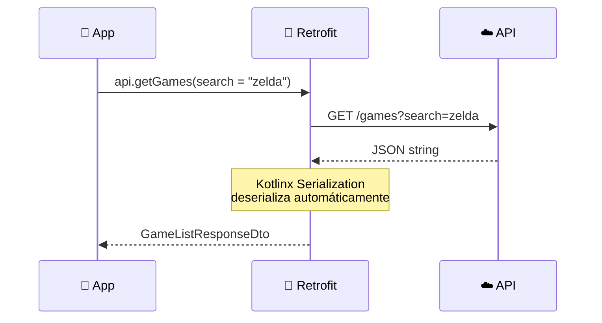


### 2.3. OkHttp

**¿Qué es OkHttp?**

OkHttp es el **cliente HTTP base** que usa Retrofit internamente. Es el motor que ejecuta las peticiones de red.

**Características:**

- ✅ **HTTP/2 y HTTP/3**: Soporte para protocolos modernos
- ✅ **Connection pooling**: Reutiliza conexiones
- ✅ **Interceptores**: Cadena de responsabilidad para procesar requests/responses
- ✅ **Timeouts**: Configurables por operación
- ✅ **Caché**: Soporte para HTTP cache

**Interceptores principales que usaremos:**

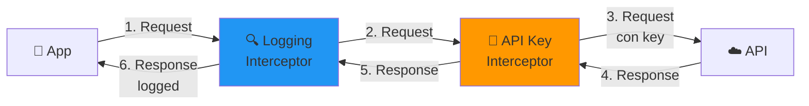
**Ejemplo de configuración:**

```kotlin
val okHttpClient = OkHttpClient.Builder()
    .addInterceptor(HttpLoggingInterceptor().apply {
        level = HttpLoggingInterceptor.Level.BODY
    })
    .addInterceptor { chain ->
        val request = chain.request().newBuilder()
            .addHeader("key", BuildConfig.RAWG_API_KEY)
            .build()
        chain.proceed(request)
    }
    .connectTimeout(30, TimeUnit.SECONDS)
    .readTimeout(30, TimeUnit.SECONDS)
    .build()
```
### 2.4. Kotlinx Serialization

**¿Qué es Kotlinx Serialization?**

Es la librería oficial de Kotlin para **serializar/deserializar** datos entre JSON y objetos Kotlin.

**Ventajas sobre Gson:**

- ✅ **Oficial de Kotlin**: Mantenida por JetBrains
- ✅ **Type-safe**: Usa tipos genéricos de Kotlin correctamente
- ✅ **Multiplatform**: Funciona en JVM, JS, Native
- ✅ **Code generation**: Genera código en compilación (no reflection)
- ✅ **Default values**: Soporte natural para parámetros con valores por defecto

**Ejemplo de DTO:**

```kotlin
@Serializable
data class GameDto(
    val id: Int,
    val name: String,
    val released: String? = null,  // Default value si no viene en JSON
    val rating: Double = 0.0,
    @SerialName("background_image")  // Mapea nombre diferente
    val backgroundImage: String? = null
)
```

**Proceso de deserialización:**

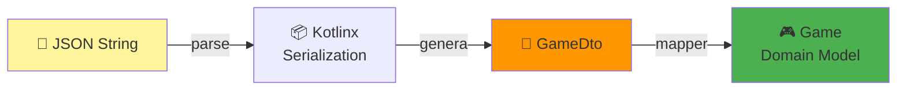
### 2.5. Comparación de alternativas

| Aspecto | Kotlinx Serialization | Gson | Moshi |
|---------|----------------------|------|-------|
| **Mantenedor** | JetBrains (oficial) | Google | Square |
| **Multiplatform** | ✅ Sí | ❌ Solo JVM | ❌ Solo JVM |
| **Performance** | 🚀 Rápido (codegen) | 🐢 Lento (reflection) | 🏃 Rápido (codegen) |
| **Null safety** | ✅ Nativo | ⚠️ Requiere cuidado | ✅ Bueno |
| **Default values** | ✅ Soportado | ❌ No | ⚠️ Con anotaciones |
| **Tamaño APK** | 📦 Pequeño | 📦 Medio | 📦 Medio |

!!! tip "¿Por qué Kotlinx Serialization?"
    - Es la opción **recomendada oficialmente** por Kotlin
    - Mejor integración con **Kotlin Multiplatform** (futuro-proof)
    - **Más rápida** que Gson (usa code generation en lugar de reflection)
    - **Type-safe** y con soporte nativo para características de Kotlin

### 2.6. Flujo completo de una petición

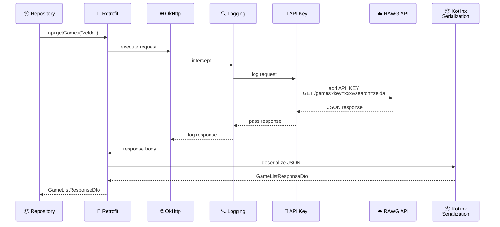

### 2.7. Dependencias necesarias

Para implementar este stack, necesitaremos añadir las siguientes librerías (lo haremos en el siguiente punto):

```kotlin
// Retrofit
implementation("com.squareup.retrofit2:retrofit:2.11.0")
implementation("com.squareup.retrofit2:converter-kotlinx-serialization:1.0.0")

// OkHttp
implementation("com.squareup.okhttp3:okhttp:4.12.0")
implementation("com.squareup.okhttp3:logging-interceptor:4.12.0")

// Kotlinx Serialization
implementation("org.jetbrains.kotlinx:kotlinx-serialization-json:1.6.0")
```

---

## **3. Configuración de dependencias y permisos**

### 3.1. Actualizar Version Catalog

Android recomienda usar **Version Catalog** (`libs.versions.toml`) para gestionar versiones de librerías de forma centralizada.

**Ubicación:** `gradle/libs.versions.toml`

```toml
[versions]
# ... versiones existentes ...
retrofit = "2.11.0"
okhttp = "4.12.0"
kotlinxSerialization = "1.6.3"
retrofitKotlinxSerialization = "1.0.0"

[libraries]
# ... librerías existentes ...

# Retrofit
retrofit-core = { group = "com.squareup.retrofit2", name = "retrofit", version.ref = "retrofit" }
retrofit-kotlin-serialization = { group = "com.jakewharton.retrofit", name = "retrofit2-kotlinx-serialization-converter", version.ref = "retrofitKotlinxSerialization" }

# OkHttp
okhttp-core = { group = "com.squareup.okhttp3", name = "okhttp", version.ref = "okhttp" }
okhttp-logging = { group = "com.squareup.okhttp3", name = "logging-interceptor", version.ref = "okhttp" }

# Kotlinx Serialization
kotlinx-serialization-json = { group = "org.jetbrains.kotlinx", name = "kotlinx-serialization-json", version.ref = "kotlinxSerialization" }
```

!!! tip "Version Catalog"
    Version Catalog permite:
    
    - ✅ **Centralizar versiones**: Un solo lugar para actualizar
    - ✅ **Type-safe**: Autocompletado en `build.gradle.kts`
    - ✅ **Consistencia**: Misma versión en todos los módulos
    - ✅ **Bundles**: Agrupar dependencias relacionadas

### 3.2. Actualizar build.gradle.kts del módulo app

**Ubicación:** `app/build.gradle.kts`

**Paso 1: Añadir plugin de Kotlinx Serialization**

```kotlin
plugins {
    alias(libs.plugins.android.application)
    alias(libs.plugins.kotlin.android)
    alias(libs.plugins.kotlin.compose)
    alias(libs.plugins.ksp)
    // ✅ Añadir plugin de serialization
    kotlin("plugin.serialization") version "2.1.0"
}
```
!!! info "¿Qué hace este plugin?"
    El plugin de Kotlinx Serialization genera código en tiempo de compilación para serializar/deserializar clases anotadas con `@Serializable`. Sin este plugin, las anotaciones no tendrían efecto.

**Paso 2: Añadir dependencias en la sección dependencies**

```kotlin
dependencies {
    // ... dependencias existentes ...

    // 🌐 Networking
    implementation(libs.retrofit.core)
    implementation(libs.retrofit.kotlin.serialization)
    implementation(libs.okhttp.core)
    implementation(libs.okhttp.logging)
    implementation(libs.kotlinx.serialization.json)

    // ... resto de dependencias ...
}
```
### 3.3. Habilitar BuildConfig

Desde **Android Gradle Plugin 8.0+**, `BuildConfig` está deshabilitado por defecto (ya lo activamos en el la parte 13). Necesitamos habilitarlo para almacenar la `API_KEY`.

**En el mismo archivo `app/build.gradle.kts`:**

```kotlin
android {
    namespace = "com.pmdm.mygamestore"
    compileSdk = 36

    // ... configuraciones existentes ...

    buildFeatures {
        compose = true
        buildConfig = true  // ✅ Habilitar BuildConfig
    }

    // ... resto de configuraciones ...
}
```
!!! warning "BuildConfig es necesario"
    Sin `buildConfig = true`, no podremos usar `BuildConfig.RAWG_API_KEY` en el código. Esto es un cambio importante desde AGP 8.0.

### 3.4. Configurar la API_KEY de forma segura

#### Paso 1: Añadir la clave en local.properties

**Ubicación:** `local.properties` (en la raíz del proyecto)

```properties
# Archivo local.properties (NO subir a Git)
sdk.dir=/Users/tu_usuario/Library/Android/sdk

# ✅ Añadir tu API_KEY de RAWG.io
rawg.api.key=TU_API_KEY_AQUI
```
!!! danger "⚠️ Seguridad crítica"
    - `local.properties` está en `.gitignore` por defecto
    - **NUNCA** subas este archivo a Git
    - Cada desarrollador debe tener su propia API_KEY
    - En CI/CD, usa variables de entorno

#### Paso 2: Obtener tu API_KEY de RAWG.io

1. Visita: [https://rawg.io/apidocs](https://rawg.io/apidocs)
2. Haz clic en **"Get API Key"**
3. Crea una cuenta gratuita
4. Copia tu API_KEY
5. Pégala en `local.properties`

  ```properties
  rawg.api.key=a1b2c3d4e5f6g7h8i9j0k1l2m3n4o5p6
  ```

#### Paso 3: Leer la clave desde build.gradle.kts

Necesitamos leer `local.properties` y exponerlo como `BuildConfig.RAWG_API_KEY`.

**En `app/build.gradle.kts`:**

```kotlin
import java.util.Properties

// ✅ Leer local.properties
val localProperties = Properties().apply {
    val localPropertiesFile = rootProject.file("local.properties")
    if (localPropertiesFile.exists()) {
        load(localPropertiesFile.inputStream())
    }
}

android {
    namespace = "com.pmdm.mygamestore"
    compileSdk = 36

    defaultConfig {
        applicationId = "com.pmdm.mygamestore"
        minSdk = 26
        targetSdk = 36
        versionCode = 1
        versionName = "1.0"

        // ✅ Crear BuildConfig field para API_KEY
        buildConfigField("String","RAWG_API_KEY","\"${localProperties.getProperty("rawg.api.key", "")}\"")
    }

    // ... resto de configuraciones ...
}
```
!!! info "¿Cómo funciona buildConfigField?"
    ```kotlin
    buildConfigField("String", "RAWG_API_KEY", "\"abc123\"")
    ```
    
    Genera en `BuildConfig.kt`:
    ```kotlin
    object BuildConfig {
        const val RAWG_API_KEY = "abc123"
    }
    ```

#### Paso 4: Verificar que funciona

Después de sincronizar Gradle, deberías poder usar:
```kotlin
import com.pmdm.mygamestore.BuildConfig

val apiKey = BuildConfig.RAWG_API_KEY
Timber.d("🔑 API Key cargada: ${apiKey.take(8)}***")
```
### 3.5. Añadir permiso de Internet

(revisar si está activo de antes)

**Ubicación:** `app/src/main/AndroidManifest.xml`
```xml
<?xml version="1.0" encoding="utf-8"?>
<manifest xmlns:android="http://schemas.android.com/apk/res/android"
    xmlns:tools="http://schemas.android.com/tools">

    <!-- ✅ Permiso de Internet (obligatorio para Retrofit) -->
    <uses-permission android:name="android.permission.INTERNET" />

    <application
        android:name=".MyGameStoreApp"
        android:allowBackup="true"
        android:icon="@mipmap/ic_launcher"
        android:label="@string/app_name"
        android:theme="@style/Theme.MyGameStore">
        
        <!-- ... activities ... -->
        
    </application>
</manifest>
```
!!! warning "Permiso obligatorio"
    Sin `INTERNET`, la app fallará al intentar hacer peticiones de red con un `SecurityException`. Este permiso es obligatorio para Retrofit/OkHttp.

### 3.6. Sincronizar Gradle

1. En Android Studio, haz clic en **"Sync Now"** (aparece arriba tras modificar `build.gradle.kts`)
2. O desde menú: **File → Sync Project with Gradle Files**

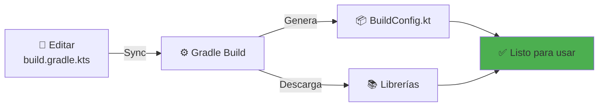

!!! check "Verificación instalación"

    Para verificar que todo está correctamente instalado, puedes crear una clase temporal:

    ```kotlin
    package com.pmdm.mygamestore

    import timber.log.Timber

    object NetworkConfig {
        fun checkSetup() {
            // Verificar que BuildConfig está disponible
            val apiKey = BuildConfig.RAWG_API_KEY
            
            if (apiKey.isBlank()) {
                Timber.e("❌ API_KEY no configurada en local.properties")
            } else {
                Timber.i("✅ API_KEY configurada correctamente: ${apiKey.take(8)}***")
            }
            
            // Verificar que las clases de Retrofit están disponibles
            try {
                Class.forName("retrofit2.Retrofit")
                Timber.i("✅ Retrofit disponible")
            } catch (e: ClassNotFoundException) {
                Timber.e("❌ Retrofit no está en el classpath")
            }
            
            // Verificar OkHttp
            try {
                Class.forName("okhttp3.OkHttpClient")
                Timber.i("✅ OkHttp disponible")
            } catch (e: ClassNotFoundException) {
                Timber.e("❌ OkHttp no está en el classpath")
            }
            
            // Verificar Kotlinx Serialization
            try {
                Class.forName("kotlinx.serialization.json.Json")
                Timber.i("✅ Kotlinx Serialization disponible")
            } catch (e: ClassNotFoundException) {
                Timber.e("❌ Kotlinx Serialization no está en el classpath")
            }
        }
    }
    ```
    Llama a esta función desde `MyGameStoreApp.onCreate()`:
    ```
    kotlin
    class MyGameStoreApp : Application() {
        override fun onCreate() {
            super.onCreate()
            
            // Configurar Timber
            if (BuildConfig.DEBUG) {
                Timber.plant(Timber.DebugTree())
                
                // Verificar configuración de red
                NetworkConfig.checkSetup()
            }
            
            // ... resto del código ...
        }
    }
    ```
### 3.7. Resumen de archivos modificados

| Archivo | Cambios |
|---------|---------|
| `libs.versions.toml` | ➕ Versiones de Retrofit, OkHttp, Kotlinx Serialization |
| `app/build.gradle.kts` | ➕ Plugin serialization<br/>➕ Dependencias de red<br/>➕ buildConfig = true<br/>➕ buildConfigField API_KEY |
| `local.properties` | ➕ rawg.api.key=TU_CLAVE |
| `AndroidManifest.xml` | ✅ Verificar `<uses-permission android:name="android.permission.INTERNET" />` |

### 3.9. Checklist de verificación

Antes de continuar, verifica:

- [ ] ✅ `libs.versions.toml` actualizado con versiones de red
- [ ] ✅ `app/build.gradle.kts` con plugin `kotlin("plugin.serialization")`
- [ ] ✅ Dependencias de Retrofit, OkHttp, Kotlinx Serialization añadidas
- [ ] ✅ `buildConfig = true` habilitado
- [ ] ✅ `buildConfigField` para `RAWG_API_KEY` configurado
- [ ] ✅ `local.properties` con tu API_KEY de RAWG
- [ ] ✅ Permiso `INTERNET` en `AndroidManifest.xml`
- [ ] ✅ Gradle sincronizado sin errores
- [ ] ✅ `BuildConfig.RAWG_API_KEY` accesible en código

!!! success "¡Dependencias configuradas!"
    Con esto, el proyecto está listo para definir la capa de datos y consumir la API de RAWG.io. En el siguiente punto crearemos los DTOs, la interfaz del API Service y los mappers.

---

## **4. Definición de la capa de datos**

La capa de datos (Data Layer) es responsable de obtener y transformar los datos de la API. Está compuesta por tres elementos principales:

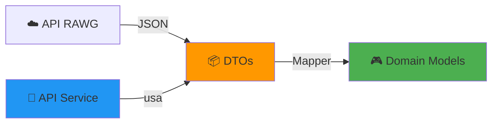
### 4.1. DTOs (Data Transfer Objects)

Los **DTOs** son clases que representan la estructura **exacta** del JSON que devuelve la API. Su única responsabilidad es serializar/deserializar datos de red.

!!! info "¿Por qué DTOs separados?"
    - ✅ **Separación de responsabilidades**: La API puede cambiar sin afectar el dominio
    - ✅ **Independencia**: El modelo de dominio no depende de la API
    - ✅ **Flexibilidad**: Puedes mapear múltiples APIs al mismo modelo de dominio
    - ✅ **Testing**: Puedes mockear fácilmente los DTOs

#### Estructura del paquete

```text
data/
├── remote/
│   ├── dto/
│   │   ├── GameDto.kt           # DTO principal de juego
│   │   ├── GameListResponseDto.kt  # Respuesta paginada
│   │   ├── GameDetailDto.kt     # Detalle completo
│   │   ├── PlatformDto.kt       # Plataforma
│   │   └── GenreDto.kt          # Género
│   ├── api/
│   │   └── RawgApiService.kt    # Interfaz Retrofit
│   └── mapper/
│       └── RemoteToDomainMapper.kt  # DTO → Domain
```
#### GameDto.kt

**Ubicación:** `app/src/main/java/com/pmdm/mygamestore/data/remote/dto/GameDto.kt`

```kotlin
package com.pmdm.mygamestore.data.remote.dto

import kotlinx.serialization.SerialName
import kotlinx.serialization.Serializable

/**
 * DTO que mapea la estructura JSON de un juego devuelto por la API de RAWG
 *
 * @Serializable: Indica a Kotlinx Serialization que genere código de serialización
 * @SerialName: Mapea nombres de JSON a propiedades de Kotlin
 */
@Serializable
data class GameDto(
    val id: Int,
    val name: String,
    val released: String? = null,  // Puede ser null si no tiene fecha
    val rating: Double = 0.0,
    
    @SerialName("background_image")  // JSON usa snake_case
    val backgroundImage: String? = null,
    
    @SerialName("metacritic")
    val metacriticScore: Int? = null,
    
    val platforms: List<PlatformWrapperDto> = emptyList(),
    val genres: List<GenreDto> = emptyList(),
    
    @SerialName("short_screenshots")
    val screenshots: List<ScreenshotDto> = emptyList()
)

/**
 * RAWG envuelve la plataforma en un objeto { platform: {...} }
 */
@Serializable
data class PlatformWrapperDto(
    val platform: PlatformDto
)

@Serializable
data class PlatformDto(
    val id: Int,
    val name: String,
    val slug: String  // Identificador único tipo "playstation-5"
)

@Serializable
data class GenreDto(
    val id: Int,
    val name: String,
    val slug: String
)

@Serializable
data class ScreenshotDto(
    val id: Int,
    val image: String  // URL de la imagen
)
```
!!! tip "Anotaciones de Kotlinx Serialization"
    - `@Serializable`: Genera código de serialización para la clase
    - `@SerialName("json_field")`: Mapea nombres diferentes (snake_case → camelCase)
    - **Default values**: `= null`, `= emptyList()` evitan errores si faltan campos

#### GameListResponseDto.kt

**Ubicación:** `app/src/main/java/com/pmdm/mygamestore/data/remote/dto/GameListResponseDto.kt`

```kotlin
package com.pmdm.mygamestore.data.remote.dto

import kotlinx.serialization.Serializable

/**
 * Respuesta paginada de la API de RAWG para el endpoint /games
 *
 * Ejemplo de JSON:
 * {
 *   "count": 850000,
 *   "next": "https://api.rawg.io/api/games?page=2",
 *   "previous": null,
 *   "results": [ ... lista de juegos ... ]
 * }
 */
@Serializable
data class GameListResponseDto(
    val count: Int,                    // Total de resultados disponibles
    val next: String? = null,          // URL de la siguiente página
    val previous: String? = null,      // URL de la página anterior
    val results: List<GameDto> = emptyList()  // Lista de juegos
)
```
#### GameDetailDto.kt

**Ubicación:** `app/src/main/java/com/pmdm/mygamestore/data/remote/dto/GameDetailDto.kt`

```kotlin
package com.pmdm.mygamestore.data.remote.dto

import kotlinx.serialization.SerialName
import kotlinx.serialization.Serializable

/**
 * DTO para el detalle completo de un juego (endpoint /games/{id})
 * Incluye campos adicionales que no vienen en el listado
 */
@Serializable
data class GameDetailDto(
    val id: Int,
    val name: String,
    val released: String? = null,
    val rating: Double = 0.0,
    
    @SerialName("background_image")
    val backgroundImage: String? = null,
    
    @SerialName("background_image_additional")
    val backgroundImageAdditional: String? = null,
    
    val description: String? = null,  // HTML con descripción completa
    
    @SerialName("description_raw")
    val descriptionRaw: String? = null,  // Texto plano
    
    @SerialName("metacritic")
    val metacriticScore: Int? = null,
    
    val platforms: List<PlatformWrapperDto> = emptyList(),
    val genres: List<GenreDto> = emptyList(),
    
    val publishers: List<PublisherDto> = emptyList(),
    val developers: List<DeveloperDto> = emptyList(),
    
    @SerialName("esrb_rating")
    val esrbRating: EsrbRatingDto? = null,
    
    val website: String? = null
)

@Serializable
data class PublisherDto(
    val id: Int,
    val name: String
)

@Serializable
data class DeveloperDto(
    val id: Int,
    val name: String
)

@Serializable
data class EsrbRatingDto(
    val id: Int,
    val name: String,  // "Everyone", "Teen", "Mature"
    val slug: String
)
```

### 4.2. API Service (Retrofit Interface)

La interfaz `RawgApiService` define los **endpoints** de la API usando anotaciones de Retrofit.

**Ubicación:** `app/src/main/java/com/pmdm/mygamestore/data/remote/api/RawgApiService.kt`
```kotlin
package com.pmdm.mygamestore.data.remote.api

import com.pmdm.mygamestore.data.remote.dto.GameDetailDto
import com.pmdm.mygamestore.data.remote.dto.GameListResponseDto
import retrofit2.http.GET
import retrofit2.http.Path
import retrofit2.http.Query

/**
 * Interfaz que define los endpoints de la API de RAWG.io
 *
 * Retrofit genera automáticamente la implementación en tiempo de compilación
 *
 * ANOTACIONES:
 * @GET("path"): Método HTTP GET
 * @Query("param"): Parámetro de query (?param=value)
 * @Path("id"): Parámetro de path (/games/{id})
 * suspend: Soporte para coroutines (no bloquea el hilo)
 */
interface RawgApiService {

    /**
     * Obtiene una lista de juegos con filtros opcionales
     *
     * Endpoint: GET /games
     * URL completa: https://api.rawg.io/api/games?search=zelda&page=1&...
     *
     * @param page Número de página (paginación)
     * @param pageSize Cantidad de resultados por página (default: 20, max: 40)
     * @param search Texto de búsqueda
     * @param genres IDs de géneros separados por coma (ej: "4,51")
     * @param platforms IDs de plataformas separados por coma (ej: "4,187")
     * @param dates Rango de fechas (ej: "2020-01-01,2023-12-31")
     * @param ordering Campo de ordenamiento (ej: "-rating", "-released")
     */
    @GET("games")
    suspend fun getGames(
        @Query("page") page: Int? = null,
        @Query("page_size") pageSize: Int? = null,
        @Query("search") search: String? = null,
        @Query("genres") genres: String? = null,
        @Query("platforms") platforms: String? = null,
        @Query("dates") dates: String? = null,
        @Query("ordering") ordering: String? = null
    ): GameListResponseDto

    /**
     * Obtiene el detalle completo de un juego específico
     *
     * Endpoint: GET /games/{id}
     * URL completa: https://api.rawg.io/api/games/3328
     *
     * @param id ID del juego (type String para compatibilidad con API)
     */
    @GET("games/{id}")
    suspend fun getGameDetails(
        @Path("id") id: String
    ): GameDetailDto
}
```
!!! info "¿Por qué suspend?"
    Las funciones `suspend` se ejecutan en coroutines, lo que permite hacer peticiones de red sin bloquear el hilo principal (UI thread). Retrofit las convierte automáticamente en llamadas asíncronas.

### 4.3. Mappers (DTO → Domain)

Los **Mappers** transforman los DTOs (capa de datos) en modelos de dominio (capa de negocio).
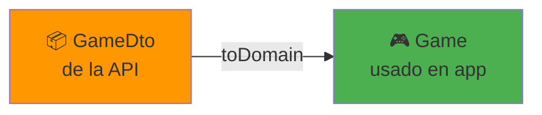

**Ubicación:** `app/src/main/java/com/pmdm/mygamestore/data/remote/mapper/RemoteToDomainMapper.kt`

??? abstract "RemoteToDomainMapper.kt"
    
    ```kotlin
    package com.pmdm.mygamestore.data.remote.mapper

    import com.pmdm.mygamestore.data.remote.dto.GameDto
    import com.pmdm.mygamestore.data.remote.dto.GameDetailDto
    import com.pmdm.mygamestore.data.remote.dto.GenreDto
    import com.pmdm.mygamestore.data.remote.dto.PlatformDto
    import com.pmdm.mygamestore.domain.model.Game
    import com.pmdm.mygamestore.domain.model.GameCategory
    import com.pmdm.mygamestore.domain.model.Genre
    import com.pmdm.mygamestore.domain.model.Platform

    /**
    * Mappers de DTOs remotos a modelos de dominio
    *
    * PATRÓN EXTENSION FUNCTIONS:
    * - Extienden los DTOs con función .toDomain()
    * - Mantienen la lógica de transformación en un solo lugar
    * - Facilitan el testing
    */

    /**
    * Convierte GameDto (API) → Game (Domain)
    */
    fun GameDto.toDomain(): Game {
        return Game(
            id = this.id,
            title = this.name,
            description = "",  // No viene en el listado
            imageUrl = this.backgroundImage ?: "",
            rating = this.rating,
            releaseDate = this.released ?: "Unknown",
            
            // Mapear plataformas
            platforms = this.platforms.map { it.platform.toDomain() },
            
            // Mapear géneros
            genres = this.genres.map { it.toDomain() },
            
            // Determinar categoría principal
            category = this.genres.firstOrNull()?.toCategory() ?: GameCategory.OTHER,
            
            // Screenshots (tomar las primeras 3)
            screenshots = this.screenshots.take(3).map { it.image }
        )
    }

    /**
    * Convierte GameDetailDto (API) → Game (Domain)
    * Incluye descripción completa
    */
    fun GameDetailDto.toDomain(): Game {
        return Game(
            id = this.id,
            title = this.name,
            description = this.descriptionRaw ?: this.description ?: "",
            imageUrl = this.backgroundImage ?: "",
            rating = this.rating,
            releaseDate = this.released ?: "Unknown",
            platforms = this.platforms.map { it.platform.toDomain() },
            genres = this.genres.map { it.toDomain() },
            category = this.genres.firstOrNull()?.toCategory() ?: GameCategory.OTHER,
            screenshots = emptyList()  // El detalle no incluye screenshots
        )
    }

    /**
    * Convierte PlatformDto → Platform
    */
    fun PlatformDto.toDomain(): Platform {
        return Platform(
            id = this.id,
            name = this.name
        )
    }

    /**
    * Convierte GenreDto → Genre
    */
    fun GenreDto.toDomain(): Genre {
        return Genre(
            id = this.id,
            name = this.name
        )
    }

    /**
    * Mapea géneros de RAWG a categorías de la app
    *
    * IDs de géneros en RAWG:
    * 4 = Action
    * 51 = Indie
    * 3 = Adventure
    * 5 = RPG
    * 10 = Strategy
    * 2 = Shooter
    * 40 = Casual
    * 14 = Simulation
    * 7 = Puzzle
    * 11 = Arcade
    * 83 = Platformer
    * 1 = Racing
    * 15 = Sports
    * 59 = Massively Multiplayer
    * 6 = Fighting
    * 19 = Family
    * 28 = Board Games
    * 34 = Educational
    * 17 = Card
    */
    fun GenreDto.toCategory(): GameCategory {
        return when (this.id) {
            4 -> GameCategory.ACTION
            51 -> GameCategory.INDIE
            3 -> GameCategory.ADVENTURE
            5 -> GameCategory.RPG
            10 -> GameCategory.STRATEGY
            2 -> GameCategory.SHOOTER
            40 -> GameCategory.CASUAL
            14 -> GameCategory.SIMULATION
            7 -> GameCategory.PUZZLE
            11 -> GameCategory.ARCADE
            83 -> GameCategory.PLATFORMER
            1 -> GameCategory.RACING
            15 -> GameCategory.SPORTS
            59 -> GameCategory.MULTIPLAYER
            else -> GameCategory.OTHER
        }
    }
    ```

!!! tip "Ventajas de Funciones de extensión (usadas en los Mappers)"
    ```kotlin
    // ✅ Limpio y expresivo
    val game = gameDto.toDomain()
    
    // ❌ Alternativa con función estática
    val game = DtoMapper.mapToGame(gameDto)
    ```

### 4.4. Flujo completo de transformación
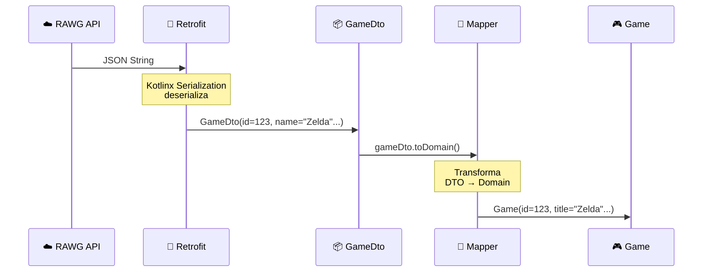
### 4.5. Ejemplo de JSON a Domain

**1. API devuelve JSON:**
```json
{
  "id": 3328,
  "name": "The Legend of Zelda: Breath of the Wild",
  "released": "2017-03-03",
  "rating": 4.65,
  "background_image": "https://media.rawg.io/media/games/...",
  "platforms": [
    { "platform": { "id": 7, "name": "Nintendo Switch", "slug": "nintendo-switch" } }
  ],
  "genres": [
    { "id": 3, "name": "Adventure", "slug": "adventure" }
  ]
}
```
**2. Kotlinx Serialization deserializa a DTO:**
```kotlin
GameDto(
    id = 3328,
    name = "The Legend of Zelda: Breath of the Wild",
    released = "2017-03-03",
    rating = 4.65,
    backgroundImage = "https://media.rawg.io/media/games/...",
    platforms = [PlatformWrapperDto(platform = PlatformDto(7, "Nintendo Switch", "nintendo-switch"))],
    genres = [GenreDto(3, "Adventure", "adventure")]
)
```
**3. Mapper convierte a Domain:**
```kotlin
Game(
    id = 3328,
    title = "The Legend of Zelda: Breath of the Wild",
    description = "",
    imageUrl = "https://media.rawg.io/media/games/...",
    rating = 4.65,
    releaseDate = "2017-03-03",
    platforms = [Platform(7, "Nintendo Switch")],
    genres = [Genre(3, "Adventure")],
    category = GameCategory.ADVENTURE,
    screenshots = []
)
```
### 4.6. Resumen de archivos creados

| Archivo | Ubicación | Responsabilidad |
|---------|-----------|-----------------|
| `GameDto.kt` | `data/remote/dto/` | Mapea JSON de lista de juegos |
| `GameDetailDto.kt` | `data/remote/dto/` | Mapea JSON de detalle completo |
| `GameListResponseDto.kt` | `data/remote/dto/` | Mapea respuesta paginada |
| `PlatformDto.kt` | `data/remote/dto/` | Mapea plataforma |
| `GenreDto.kt` | `data/remote/dto/` | Mapea género |
| `RawgApiService.kt` | `data/remote/api/` | Define endpoints de Retrofit |
| `RemoteToDomainMapper.kt` | `data/remote/mapper/` | Transforma DTO → Domain |

!!! success "Capa de datos lista"
    Con esto, tenemos definida la estructura completa para consumir la API. En el siguiente punto implementaremos el `RawgGamesRepositoryImpl` que usará estos componentes.

---

## **5. Implementación del Repositorio Real**

El `RawgGamesRepositoryImpl` es la implementación **real** del repositorio que consume la API de RAWG.io. Mantiene la integración con Room para funcionalidades locales (favoritos, biblioteca, notas).

### 5.1. Arquitectura del Repositorio

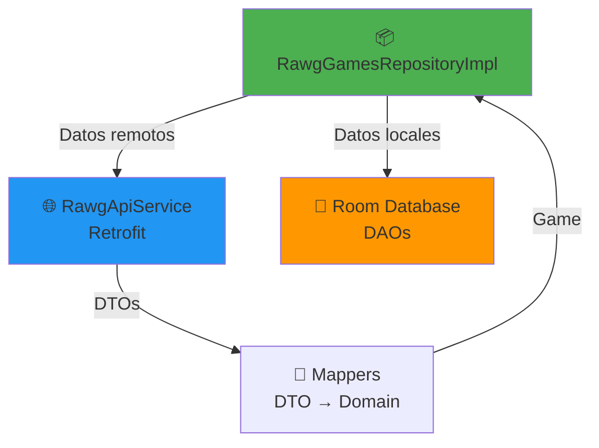
### 5.2. Responsabilidades

| Fuente | Responsabilidad |
|--------|-----------------|
| **API (Retrofit)** | Listado de juegos, búsqueda, filtros, detalles |
| **Room (Local)** | Favoritos, biblioteca, wishlist, historial, notas |

!!! info "Patrón Hybrid Repository"
    Este repositorio combina datos de **dos fuentes**:
    
    - 🌐 **Remoto**: Catálogo completo de juegos (500,000+)
    - 💾 **Local**: Datos del usuario (favoritos, notas, progreso)

### 5.3. Implementación completa

**Ubicación:** `app/src/main/java/com/pmdm/mygamestore/data/repository/RawgGamesRepositoryImpl.kt`

??? abstract "RawgGamesRepositoryImpl.kt"

    ```kotlin
    package com.pmdm.mygamestore.data.repository

    import com.pmdm.mygamestore.MyGameStoreApp
    import com.pmdm.mygamestore.data.remote.api.RawgApiService
    import com.pmdm.mygamestore.data.remote.mapper.toDomain
    import com.pmdm.mygamestore.domain.model.*
    import kotlinx.coroutines.flow.Flow
    import kotlinx.coroutines.flow.flow
    import kotlinx.coroutines.flow.map
    import timber.log.Timber
    import java.io.IOException

    /**
    * Implementación real del repositorio que consume la API de RAWG.io
    *
    * FUENTES DE DATOS:
    * - 🌐 API (Retrofit): Catálogo de juegos, búsqueda, filtros
    * - 💾 Room: Favoritos, biblioteca, notas, historial
    *
    * @param api Servicio de Retrofit para consumir la API
    */
    class RawgGamesRepositoryImpl(
        private val api: RawgApiService
    ) : GamesRepository {

        private val db = MyGameStoreApp.database

        // ==================== DATOS REMOTOS (API) ====================

        /**
        * Obtiene todos los juegos del catálogo (primera página)
        */
        override fun getAllGames(): Flow<Resource<List<Game>>> = flow {
            emit(Resource.Loading)
            Timber.d("🌐 Obteniendo todos los juegos desde API")

            try {
                val response = api.getGames(
                    page = 1,
                    pageSize = 40  // Máximo permitido por RAWG
                )

                val games = response.results.map { it.toDomain() }
                Timber.i("✅ ${games.size} juegos obtenidos desde API")
                emit(Resource.Success(games))

            } catch (e: IOException) {
                val error = AppError.NetworkError(
                    technicalMessage = "IOException: ${e.message}"
                )
                Timber.e(e, "💥 ${error.technicalMessage}")
                emit(Resource.Error(error))

            } catch (e: Exception) {
                val error = AppError.Unknown(
                    technicalMessage = "Unexpected error: ${e.message}"
                )
                Timber.e(e, "💥 ${error.technicalMessage}")
                emit(Resource.Error(error))
            }
        }

        /**
        * Busca juegos aplicando múltiples filtros
        *
        * @param query Texto de búsqueda
        * @param category Categoría del juego (convertida a genre ID)
        * @param platform Plataforma (convertida a platform ID)
        * @param interval Intervalo de fechas
        */
        override fun getFilteredGames(
            query: String,
            category: GameCategory,
            platform: PlatformEnum,
            interval: DateInterval
        ): Flow<Resource<List<Game>>> = flow {
            emit(Resource.Loading)
            Timber.d("🔍 Filtrado - query='$query', category=$category, platform=$platform, interval=$interval")

            try {
                // Convertir filtros a parámetros de API
                val genreId = category.toGenreId()
                val platformId = platform.toPlatformId()
                val dateRange = interval.toDateRange()
                val ordering = determineOrdering(query, category, interval)

                Timber.d("📡 Parámetros API: genres=$genreId, platforms=$platformId, dates=$dateRange, ordering=$ordering")

                val response = api.getGames(
                    search = query.ifBlank { null },
                    genres = genreId,
                    platforms = platformId,
                    dates = dateRange,
                    ordering = ordering,
                    pageSize = 40
                )

                val games = response.results.map { it.toDomain() }
                Timber.i("✅ ${games.size} juegos filtrados obtenidos")
                emit(Resource.Success(games))

            } catch (e: IOException) {
                val error = AppError.NetworkError(
                    technicalMessage = "IOException during search: ${e.message}"
                )
                Timber.e(e, "💥 ${error.technicalMessage}")
                emit(Resource.Error(error))

            } catch (e: Exception) {
                val error = AppError.Unknown(
                    technicalMessage = "Error during search: ${e.message}"
                )
                Timber.e(e, "💥 ${error.technicalMessage}")
                emit(Resource.Error(error))
            }
        }

        /**
        * Obtiene el detalle completo de un juego
        *
        * @param id ID del juego
        */
        override suspend fun getGameById(id: Int): Resource<Game> {
            Timber.d("🎮 Obteniendo detalle del juego ID: $id")

            return try {
                val gameDetail = api.getGameDetails(id.toString())
                val game = gameDetail.toDomain()
                Timber.i("✅ Juego obtenido: ${game.title}")
                Resource.Success(game)

            } catch (e: IOException) {
                val error = AppError.NetworkError(
                    technicalMessage = "IOException getting game $id: ${e.message}"
                )
                Timber.e(e, "💥 ${error.technicalMessage}")
                Resource.Error(error)

            } catch (e: Exception) {
                if (e.message?.contains("404") == true) {
                    val error = AppError.NotFound(
                        technicalMessage = "Game not found with ID: $id"
                    )
                    Timber.w("⚠️ ${error.technicalMessage}")
                    Resource.Error(error)
                } else {
                    val error = AppError.Unknown(
                        technicalMessage = "Error getting game $id: ${e.message}"
                    )
                    Timber.e(e, "💥 ${error.technicalMessage}")
                    Resource.Error(error)
                }
            }
        }

        // ==================== DATOS LOCALES (ROOM) ====================

        /**
        * Obtiene juegos de la biblioteca del usuario
        */
        override fun getLibraryGames(status: LibraryStatus): Flow<Resource<List<Game>>> {
            Timber.d("📚 Obteniendo biblioteca con status: $status")

            return db.libraryDao().getLibraryGames(status).map { entities ->
                try {
                    // Obtener detalles completos desde API
                    val games = entities.mapNotNull { entity ->
                        try {
                            val gameDetail = api.getGameDetails(entity.gameId.toString())
                            gameDetail.toDomain()
                        } catch (e: Exception) {
                            Timber.w(e, "⚠️ Error obteniendo juego ${entity.gameId} de biblioteca")
                            null
                        }
                    }
                    Timber.i("✅ ${games.size} juegos de biblioteca obtenidos")
                    Resource.Success(games)
                } catch (e: Exception) {
                    val error = AppError.DatabaseError(
                        technicalMessage = "Error loading library: ${e.message}"
                    )
                    Timber.e(e, "💥 ${error.technicalMessage}")
                    Resource.Error(error)
                }
            }
        }

        /**
        * Obtiene juegos marcados como favoritos
        */
        override fun getFavoriteGames(): Flow<Resource<List<Game>>> {
            Timber.d("⭐ Obteniendo juegos favoritos")

            return db.libraryDao().getFavorites().map { entities ->
                try {
                    val games = entities.mapNotNull { entity ->
                        try {
                            val gameDetail = api.getGameDetails(entity.gameId.toString())
                            gameDetail.toDomain()
                        } catch (e: Exception) {
                            Timber.w(e, "⚠️ Error obteniendo favorito ${entity.gameId}")
                            null
                        }
                    }
                    Timber.i("✅ ${games.size} favoritos obtenidos")
                    Resource.Success(games)
                } catch (e: Exception) {
                    val error = AppError.DatabaseError(
                        technicalMessage = "Error loading favorites: ${e.message}"
                    )
                    Timber.e(e, "💥 ${error.technicalMessage}")
                    Resource.Error(error)
                }
            }
        }

        /**
        * Alterna el estado de favorito de un juego
        */
        override suspend fun toggleFavorite(gameId: Int): Resource<Unit> {
            Timber.d("⭐ Toggle favorito para gameId: $gameId")

            return try {
                db.libraryDao().toggleFavorite(gameId)
                Timber.i("✅ Favorito actualizado para gameId: $gameId")
                Resource.Success(Unit)

            } catch (e: Exception) {
                val error = AppError.DatabaseError(
                    userMessage = "Could not update favorite status.",
                    technicalMessage = "Error toggling favorite $gameId: ${e.message}"
                )
                Timber.e(e, "💥 ${error.technicalMessage}")
                Resource.Error(error)
            }
        }

        /**
        * Verifica si un juego está marcado como favorito
        */
        override fun isFavorite(gameId: Int): Flow<Boolean> {
            return db.libraryDao().isFavorite(gameId)
        }

        /**
        * Alterna el estado de wishlist de un juego
        */
        override suspend fun toggleWishlist(gameId: Int): Resource<Unit> {
            Timber.d("🎁 Toggle wishlist para gameId: $gameId")

            return try {
                db.libraryDao().toggleWishlist(gameId)
                Timber.i("✅ Wishlist actualizado para gameId: $gameId")
                Resource.Success(Unit)

            } catch (e: Exception) {
                val error = AppError.DatabaseError(
                    userMessage = "Could not update wishlist.",
                    technicalMessage = "Error toggling wishlist $gameId: ${e.message}"
                )
                Timber.e(e, "💥 ${error.technicalMessage}")
                Resource.Error(error)
            }
        }

        /**
        * Verifica si un juego está en la wishlist
        */
        override fun isInWishlist(gameId: Int): Flow<Boolean> {
            return db.libraryDao().isInWishlist(gameId)
        }

        /**
        * Elimina un juego de la biblioteca
        */
        override suspend fun removeFromLibrary(gameId: Int): Resource<Unit> {
            Timber.d("🗑️ Eliminando gameId: $gameId de biblioteca")

            return try {
                db.libraryDao().removeFromLibrary(gameId)
                Timber.i("✅ Juego $gameId eliminado de biblioteca")
                Resource.Success(Unit)

            } catch (e: Exception) {
                val error = AppError.DatabaseError(
                    userMessage = "Could not remove game from library.",
                    technicalMessage = "Error removing game $gameId: ${e.message}"
                )
                Timber.e(e, "💥 ${error.technicalMessage}")
                Resource.Error(error)
            }
        }

        // ==================== HISTORIAL Y NOTAS ====================

        override fun getRecentSearches(): Flow<List<String>> {
            return db.searchHistoryDao().getRecentSearches()
        }

        override suspend fun addSearchQuery(query: String) {
            db.searchHistoryDao().insertSearch(query)
        }

        override fun getRecentGames(): Flow<List<Game>> {
            return db.gameHistoryDao().getRecentGames().map { entities ->
                entities.mapNotNull { entity ->
                    try {
                        val gameDetail = api.getGameDetails(entity.gameId.toString())
                        gameDetail.toDomain()
                    } catch (e: Exception) {
                        Timber.w(e, "⚠️ Error obteniendo juego reciente ${entity.gameId}")
                        null
                    }
                }
            }
        }

        override suspend fun addToRecentGames(gameId: Int) {
            db.gameHistoryDao().insertGameHistory(gameId)
        }

        override fun getNoteForGame(gameId: Int): Flow<String?> {
            return db.gameNotesDao().getNoteForGame(gameId)
        }

        override fun getProgressForGame(gameId: Int): Flow<GameProgress> {
            return db.gameNotesDao().getProgressForGame(gameId)
        }

        override suspend fun saveNoteForGame(
            gameId: Int,
            note: String,
            status: GameProgress
        ): Resource<Unit> {
            Timber.d("📝 Guardando nota para gameId: $gameId, status: $status")

            return try {
                db.gameNotesDao().saveNote(gameId, note, status)
                Timber.i("✅ Nota guardada para gameId: $gameId")
                Resource.Success(Unit)

            } catch (e: Exception) {
                val error = AppError.DatabaseError(
                    userMessage = "Could not save note.",
                    technicalMessage = "Error saving note for game $gameId: ${e.message}"
                )
                Timber.e(e, "💥 ${error.technicalMessage}")
                Resource.Error(error)
            }
        }

        // ==================== FUNCIONES AUXILIARES ====================

        /**
        * Convierte GameCategory a genre ID de RAWG
        */
        private fun GameCategory.toGenreId(): String? {
            return when (this) {
                GameCategory.ACTION -> "4"
                GameCategory.INDIE -> "51"
                GameCategory.ADVENTURE -> "3"
                GameCategory.RPG -> "5"
                GameCategory.STRATEGY -> "10"
                GameCategory.SHOOTER -> "2"
                GameCategory.CASUAL -> "40"
                GameCategory.SIMULATION -> "14"
                GameCategory.PUZZLE -> "7"
                GameCategory.ARCADE -> "11"
                GameCategory.PLATFORMER -> "83"
                GameCategory.RACING -> "1"
                GameCategory.SPORTS -> "15"
                GameCategory.MULTIPLAYER -> "59"
                GameCategory.ALL -> null
                else -> null
            }
        }

        /**
        * Convierte PlatformEnum a platform ID de RAWG
        */
        private fun PlatformEnum.toPlatformId(): String? {
            return when (this) {
                PlatformEnum.PC -> "4"
                PlatformEnum.PLAYSTATION -> "187,18,16,15,27,19,17"  // PS5, PS4, PS3, PS2, PSP, PS Vita, PSX
                PlatformEnum.XBOX -> "1,186,14,80"  // Xbox One, Xbox Series S/X, Xbox 360, Xbox
                PlatformEnum.NINTENDO -> "7,8,9,13,83,105"  // Switch, 3DS, DS, GameCube, Wii, Wii U
                PlatformEnum.MOBILE -> "3,21"  // iOS, Android
                PlatformEnum.ALL -> null
            }
        }

        /**
        * Convierte DateInterval a rango de fechas para API
        */
        private fun DateInterval.toDateRange(): String? {
            val today = java.time.LocalDate.now()
            return when (this) {
                DateInterval.LAST_30_DAYS -> {
                    val start = today.minusDays(30)
                    "$start,$today"
                }
                DateInterval.THIS_YEAR -> {
                    val start = today.withDayOfYear(1)
                    "$start,$today"
                }
                DateInterval.LAST_YEAR -> {
                    val year = today.year - 1
                    "$year-01-01,$year-12-31"
                }
                DateInterval.ALL_TIME -> null
            }
        }

        /**
        * Determina el ordenamiento según los filtros
        */
        private fun determineOrdering(
            query: String,
            category: GameCategory,
            interval: DateInterval
        ): String {
            return when {
                query.isNotBlank() -> "-relevance"  // Por relevancia si hay búsqueda
                interval != DateInterval.ALL_TIME -> "-released"  // Por fecha si hay intervalo
                category != GameCategory.ALL -> "-rating"  // Por rating si hay categoría
                else -> "-added"  // Por defecto: más recientes añadidos a RAWG
            }
        }
    }
    ```
    ### 5.4. Detalles de implementación

    #### Manejo de errores

    ```mermaid
    graph TB
        START[Petición API]
        TRY{try-catch}
        IO{IOException?}
        E404{404?}
        
        START --> TRY
        TRY -->|Exception| IO
        IO -->|Sí| NET[NetworkError]
        IO -->|No| E404
        E404 -->|Sí| NF[NotFound]
        E404 -->|No| UNK[Unknown]
        TRY -->|Success| OK[Resource.Success]
        
        style NET fill:#FF5252
        style NF fill:#FF9800
        style UNK fill:#9E9E9E
        style OK fill:#4CAF50
    ```

#### Conversión de filtros

| Filtro App | Parámetro API | Ejemplo |
|------------|---------------|---------|
| `GameCategory.ACTION` | `genres=4` | Action games |
| `PlatformEnum.PLAYSTATION` | `platforms=187,18,16...` | Todas las PlayStation |
| `DateInterval.THIS_YEAR` | `dates=2026-01-01,2026-03-06` | Juegos de 2026 |
| `query="zelda"` | `search=zelda` | Búsqueda por texto |

### 5.5. Flujo completo de una petición

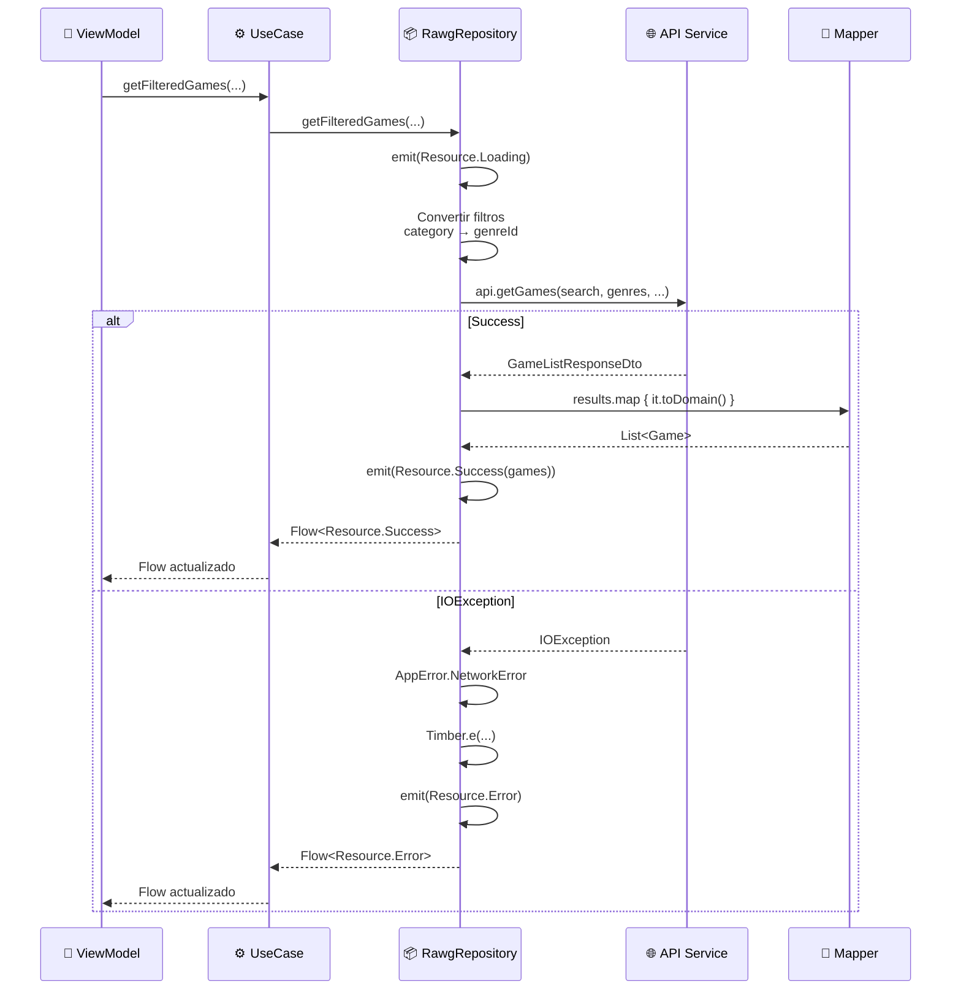
!!! success "Repositorio real implementado"
    Con esto, tenemos el repositorio completo que consume la API de RAWG.io y mantiene la integración con Room. En el siguiente punto configuraremos la inyección de dependencias con Koin.

---

## **6. Inyección de dependencias con Koin**

Ahora configuraremos **Koin** para proveer todas las dependencias de red (OkHttp, Retrofit, API Service) y cambiaremos el binding del repositorio de Mock a Real.

### 6.1. Arquitectura de DI con Koin

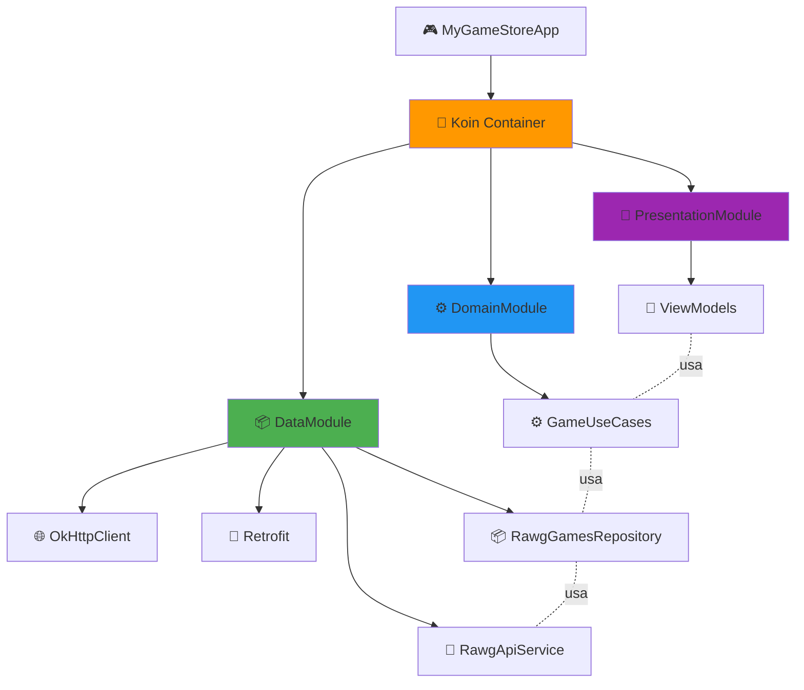
### 6.2. Actualizar DataModule

**Ubicación:** `app/src/main/java/com/pmdm/mygamestore/di/DataModule.kt`

```kotlin
package com.pmdm.mygamestore.di

import com.jakewharton.retrofit2.converter.kotlinx.serialization.asConverterFactory
import com.pmdm.mygamestore.BuildConfig
import com.pmdm.mygamestore.data.auth.GoogleSignInManager
import com.pmdm.mygamestore.data.remote.api.RawgApiService
import com.pmdm.mygamestore.data.repository.AuthRepository
import com.pmdm.mygamestore.data.repository.AuthRepositoryImpl
import com.pmdm.mygamestore.data.repository.GamesRepository
import com.pmdm.mygamestore.data.repository.RawgGamesRepositoryImpl
import com.pmdm.mygamestore.data.repository.SessionManager
import kotlinx.serialization.json.Json
import okhttp3.MediaType.Companion.toMediaType
import okhttp3.OkHttpClient
import okhttp3.logging.HttpLoggingInterceptor
import org.koin.dsl.module
import retrofit2.Retrofit
import timber.log.Timber
import java.util.concurrent.TimeUnit

/**
 * Módulo de Koin para la capa de DATOS
 * 
 * Responsabilidades:
 * - Proveer instancias de Repositories (implementaciones)
 * - Proveer acceso a la base de datos Room
 * - Proveer SessionManager
 * - Proveer GoogleSignInManager
 * - Gestionar fuentes de datos locales y remotas (Retrofit)
 * 
 * Ciclos de vida:
 * - single: Singleton - Una instancia compartida en toda la app
 */
val dataModule = module {

    // Database (Singleton)
    single { MyGameStoreApp.database }

    // Firebase Auth (Singleton)
    single { FirebaseAuth.getInstance() }

    // Google Sign-In Manager (Singleton)
    single { GoogleSignInManager(androidContext()) }

    // Networking: OkHttp & Retrofit
    single {
        val loggingInterceptor = HttpLoggingInterceptor().apply {
            level = HttpLoggingInterceptor.Level.BODY
        }

        val authInterceptor = Interceptor { chain ->
            val originalRequest = chain.request()
            val originalUrl = originalRequest.url

            val urlWithKey = originalUrl.newBuilder()
                .addQueryParameter("key", BuildConfig.RAWG_API_KEY)
                .build()

            val newRequest = originalRequest.newBuilder()
                .url(urlWithKey)
                .build()

            chain.proceed(newRequest)
        }

        OkHttpClient.Builder()
            .addInterceptor(authInterceptor)
            .addInterceptor(loggingInterceptor)
            .build()
    }

    single {
        val json = Json {
            ignoreUnknownKeys = true
            coerceInputValues = true
        }
        Retrofit.Builder()
            .baseUrl("https://api.rawg.io/api/")
            .client(get())
            .addConverterFactory(json.asConverterFactory("application/json".toMediaType()))
            .build()
    }

    single { get<Retrofit>().create(RawgApiService::class.java) }

    // SessionManager (Singleton)
    singleOf(::SessionManagerImpl) bind SessionManager::class

    // AuthRepository: Usando Firebase
    singleOf(::FirebaseAuthRepositoryImpl) bind AuthRepository::class

    // GamesRepository (Cambiado de Mock a Real)
    singleOf(::RawgGamesRepositoryImpl) bind GamesRepository::class
}
```
!!! tip "Ventajas de los Interceptores"
    Los interceptores de OkHttp permiten añadir lógica común a **todas** las peticiones sin modificar cada endpoint:
    
    - 🔑 **Autenticación**: API Key, tokens, headers
    - 🔍 **Logging**: Registrar requests/responses
    - 🔄 **Retry**: Reintentar automáticamente peticiones fallidas
    - 📊 **Analytics**: Medir tiempos de respuesta
    - 🌐 **Offline**: Cachear respuestas

### 6.3. Detalles de configuración

Los interceptores de OkHttp permiten añadir lógica común a **todas** las peticiones sin modificar cada endpoint.

#### Logging Interceptor
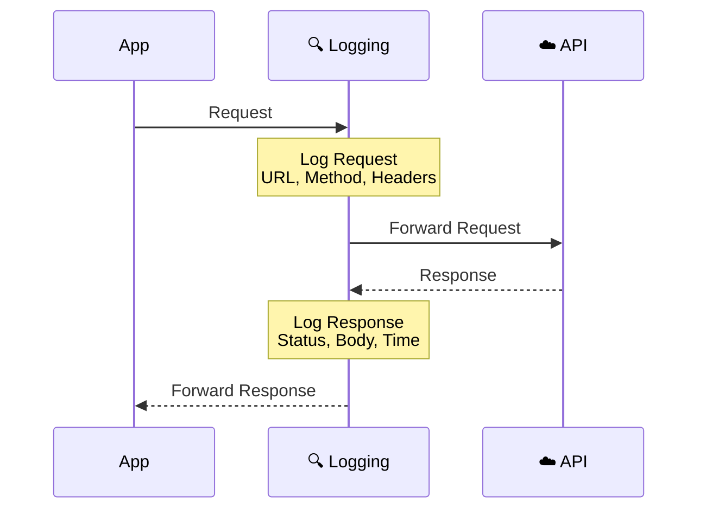
**Ejemplo de log en LogCat:**

```log
D/OkHttp: --> GET https://api.rawg.io/api/games?key=***&search=zelda
D/OkHttp: --> END GET
D/OkHttp: <-- 200 OK https://api.rawg.io/api/games?key=***&search=zelda (1234ms)
D/OkHttp: Content-Type: application/json
D/OkHttp: {"count":850,"results":[...]}
D/OkHttp: <-- END HTTP (45231 bytes)
```
!!! warning "Solo en DEBUG"
    El logging interceptor **solo se activa en DEBUG** para evitar:
    
    - ❌ Logs de datos sensibles en producción
    - ❌ Impacto en rendimiento
    - ❌ Logs innecesarios para el usuario

#### API Key Interceptor
```kotlin
addInterceptor { chain ->
    val originalRequest = chain.request()
    val originalUrl = originalRequest.url

    // Añadir 'key' como query parameter
    val urlWithApiKey = originalUrl.newBuilder()
        .addQueryParameter("key", BuildConfig.RAWG_API_KEY)
        .build()

    val requestWithApiKey = originalRequest.newBuilder()
        .url(urlWithApiKey)
        .build()

    chain.proceed(requestWithApiKey)
}
```
**Transformación automática:**

```text
Original:  GET /games?search=zelda
           ↓ Interceptor
Final:     GET /games?search=zelda&key=abc123***
```
!!! success "Ventajas"
    - ✅ **Centralizado**: La API Key se añade en un solo lugar
    - ✅ **Automático**: No hay que añadirla manualmente en cada endpoint
    - ✅ **Seguro**: Usa `BuildConfig` en lugar de hardcodear
    - ✅ **Testeable**: Fácil de mockear en tests

#### Configuración de JSON

```kotlin
val json = Json {
    ignoreUnknownKeys = true  // Ignorar campos desconocidos
    coerceInputValues = true   // null → default values
    isLenient = true           // JSON no estricto
}
```

| Opción | Propósito | Ejemplo |
|--------|-----------|---------|
| `ignoreUnknownKeys` | API añade campos nuevos sin romper la app | JSON tiene `"new_field": 123` → ignorado |
| `coerceInputValues` | API devuelve null inesperado | `"rating": null` → `0.0` (default) |
| `isLenient` | JSON malformado | Comillas simples, trailing commas |

### 6.4. Cambio de Mock a Real

**Cambio en DataModule:**

```kotlin
// ❌ ANTES
// GamesRepository
singleOf(::MockGamesRepositoryImpl) bind GamesRepository::class

// ✅ AHORA
// GamesRepository (Cambiado de Mock a Real)
singleOf(::RawgGamesRepositoryImpl) bind GamesRepository::class
```

!!! info "Patrón Strategy"
    Gracias a que `GamesRepository` es una **interfaz**, podemos cambiar la implementación sin tocar:
    
    - ✅ ViewModels
    - ✅ UseCases
    - ✅ UI/Screens
    - ✅ Tests unitarios

### 6.5. Verificar configuración

Añade este código en `MyGameStoreApp.onCreate()` para verificar que todo está correctamente inyectado (una vez comprobado, borra el código):

```kotlin
class MyGameStoreApp : Application() {
    override fun onCreate() {
        super.onCreate()

        // Configurar Timber
        if (BuildConfig.DEBUG) {
            Timber.plant(Timber.DebugTree())
        }

        // ... inicializar Room ...

        // Inicializar Koin
        startKoin {
            androidLogger(Level.ERROR)
            androidContext(this@MyGameStoreApp)
            modules(dataModule, domainModule, presentationModule)
        }

        // ✅ Verificar configuración de red
        if (BuildConfig.DEBUG) {
            verifyNetworkConfig()
        }
    }

    private fun verifyNetworkConfig() {
        try {
            val okHttpClient: OkHttpClient = get()
            Timber.i("✅ OkHttpClient inyectado: ${okHttpClient.interceptors.size} interceptors")

            val retrofit: Retrofit = get()
            Timber.i("✅ Retrofit inyectado: ${retrofit.baseUrl()}")

            val apiService: RawgApiService = get()
            Timber.i("✅ RawgApiService inyectado")

            val repository: GamesRepository = get()
            Timber.i("✅ GamesRepository inyectado: ${repository::class.simpleName}")

            if (BuildConfig.RAWG_API_KEY.isBlank()) {
                Timber.e("❌ API_KEY no configurada en local.properties")
            } else {
                Timber.i("✅ API_KEY configurada: ${BuildConfig.RAWG_API_KEY.take(8)}***")
            }

        } catch (e: Exception) {
            Timber.e(e, "💥 Error verificando configuración de red")
        }
    }
}
```
**LogCat esperado:**

```text
I/MyGameStoreApp: ✅ OkHttpClient inyectado: 2 interceptors
I/MyGameStoreApp: ✅ Retrofit inyectado: https://api.rawg.io/api/
I/MyGameStoreApp: ✅ RawgApiService inyectado
I/MyGameStoreApp: ✅ GamesRepository inyectado: RawgGamesRepositoryImpl
I/MyGameStoreApp: ✅ API_KEY configurada: a1b2c3d4***
```
### 6.6. Estructura completa de módulos

**DomainModule.kt** y **PresentationModule.kt** (sin cambios):

### 6.7. Flujo completo de inyección

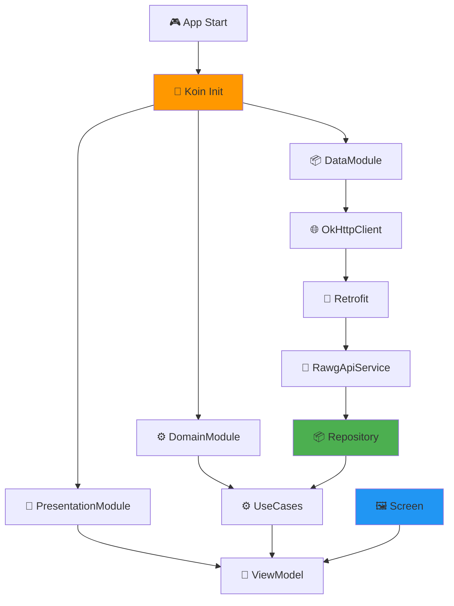
### 6.8. Testing de la configuración

Para probar que la API funciona correctamente, puedes añadir temporalmente en `HomeViewModel`:

```kotlin
init {
    Timber.d("🎮 HomeViewModel inicializado")
    
    // Test de API
    if (BuildConfig.DEBUG) {
        testApi()
    }
}

private fun testApi() {
    viewModelScope.launch {
        Timber.d("🧪 Testeando API...")
        useCases.getAllGames().collect { resource ->
            when (resource) {
                is Resource.Loading -> Timber.d("⏳ Cargando...")
                is Resource.Success -> Timber.i("✅ ${resource.data.size} juegos obtenidos")
                is Resource.Error -> Timber.e("❌ Error: ${resource.error.technicalMessage}")
            }
        }
    }
}
```
**LogCat esperado:**
```text
D/HomeViewModel: 🎮 HomeViewModel inicializado
D/HomeViewModel: 🧪 Testeando API...
D/HomeViewModel: ⏳ Cargando...
D/OkHttp: --> GET https://api.rawg.io/api/games?key=***&page=1&page_size=40
D/OkHttp: <-- 200 OK (1523ms)
I/HomeViewModel: ✅ 40 juegos obtenidos
```

### 6.9. Checklist final

Antes de continuar, verifica:

- [ ] ✅ `DataModule` actualizado con OkHttp, Retrofit, API Service
- [ ] ✅ Logging Interceptor configurado (solo DEBUG)
- [ ] ✅ API Key Interceptor añadiendo `BuildConfig.RAWG_API_KEY`
- [ ] ✅ `GamesRepository` binding cambiado a `RawgGamesRepositoryImpl`
- [ ] ✅ Kotlinx Serialization configurado con `ignoreUnknownKeys`
- [ ] ✅ Timeouts configurados (30 segundos)
- [ ] ✅ Gradle sincronizado sin errores
- [ ] ✅ Verificación de red ejecutada correctamente
- [ ] ✅ LogCat muestra logs de OkHttp en peticiones

!!! success "¡Inyección completada!"
    Con esto, la aplicación está completamente configurada para consumir la API de RAWG.io. En el siguiente punto veremos cómo probar el funcionamiento completo y buenas prácticas.
