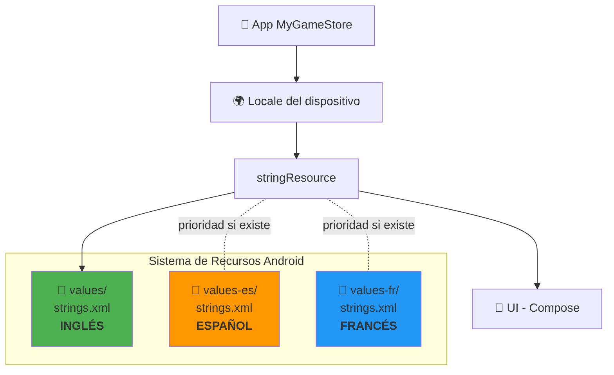
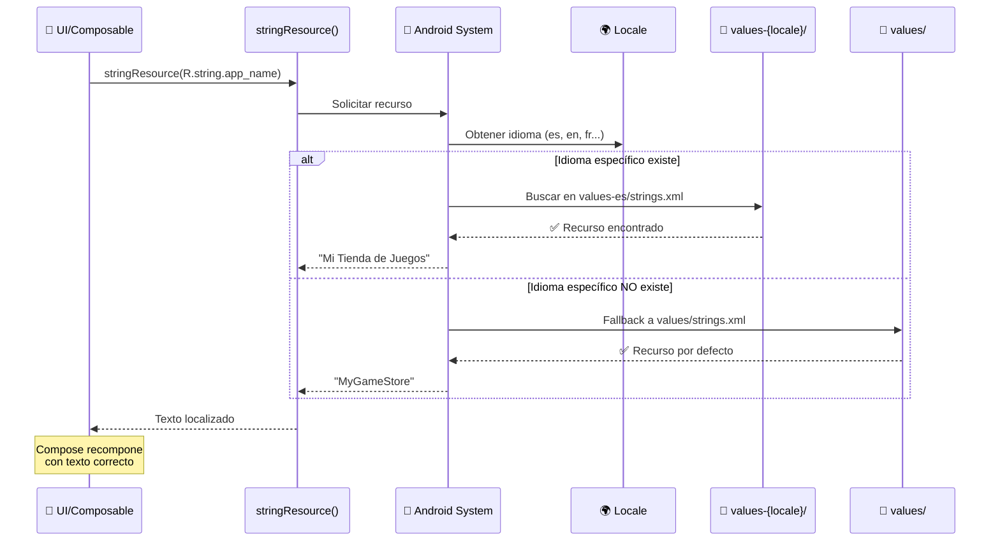
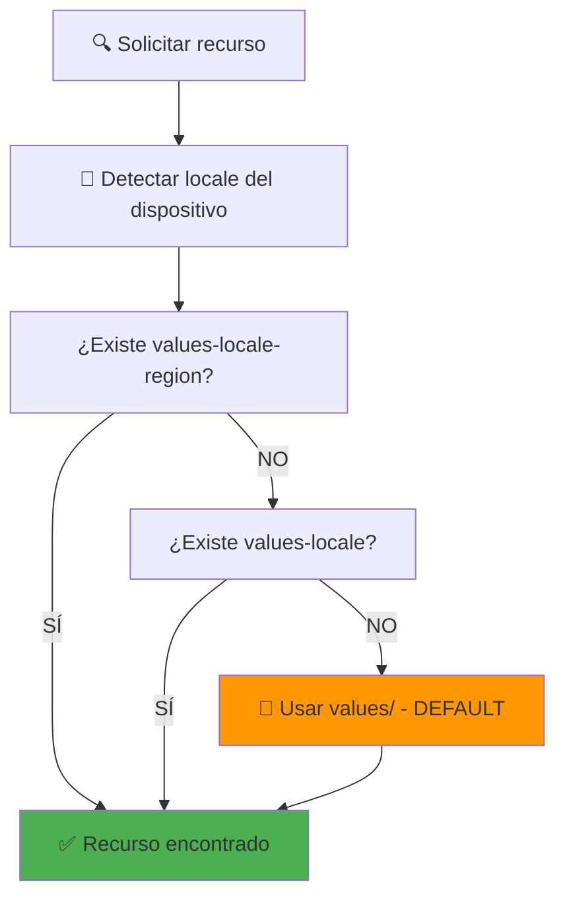

Perfecto, veo que ya tienes estructura de i18n. Voy a crear la guía completa:

# **15. Internacionalización (i18n) - Soporte Multiidioma**

En esta parte implementaremos el **soporte para múltiples idiomas** en MyGameStore, permitiendo que la aplicación se adapte automáticamente al idioma configurado en el dispositivo del usuario.

!!! tip "Repositorio de la Aplicación"
    El código fuente de la aplicación se encuentra en el repositorio de GitHub: [MyGameStore](https://github.com/jssdocente/MyGameStore)

---

## **Resumen**

En esta guía aprenderás a:

1. **Concepto de internacionalización (i18n)** y su importancia
2. **Sistema de recursos de Android** para diferentes idiomas
3. **Proceso de extracción de textos** hardcodeados a archivos de recursos
4. **Implementación práctica** con inglés y español
5. **Uso de recursos en Jetpack Compose** con `stringResource()`
6. **Buenas prácticas** para mantener código internacionalizable

### Arquitectura de recursos multiidioma




### Flujo de resolución de recursos




---

## **1. ¿Qué es la internacionalización (i18n)?**

### 1.1. Conceptos fundamentales

**Internacionalización (i18n)** es el proceso de diseñar y desarrollar una aplicación para que pueda adaptarse fácilmente a diferentes idiomas y regiones **sin cambios en el código**.

!!! info "¿Por qué i18n?"
    **i18n** = **i** + 18 letras + **n** (de "internationalization")

**Localización (l10n)** es el proceso de adaptar la aplicación a un idioma/región específica (traducir textos, adaptar formatos).

!!! info "¿Por qué l10n?"
    **l10n** = **l** + 10 letras + **n** (de "localization")

### 1.2. Diferencias i18n vs l10n

| Aspecto | Internacionalización (i18n) | Localización (l10n) |
|---------|----------------------------|---------------------|
| **¿Qué es?** | Preparar la app para soportar múltiples idiomas | Traducir y adaptar a un idioma específico |
| **Cuándo** | Durante el desarrollo | Después del desarrollo |
| **Quién** | Desarrolladores | Traductores + desarrolladores |
| **Ejemplo** | Usar `stringResource()` en lugar de texto hardcoded | Traducir "Login" a "Iniciar sesión" |
| **Código** | `Text(stringResource(R.string.login_button))` | `<string name="login_button">Iniciar sesión</string>` |

### 1.3. Importancia del soporte multiidioma

**Beneficios:**

- 🌍 **Mayor alcance**: Acceso a usuarios de diferentes países
- 📈 **Mejor UX**: Usuarios leen en su idioma nativo
- 💰 **Más descargas**: Apps localizadas tienen mejor rating
- 🎯 **Profesionalismo**: Demuestra calidad del desarrollo
- ♿ **Accesibilidad**: Facilita uso a personas con diferentes idiomas

**Estadísticas:**

- Apps con soporte multiidioma tienen **128% más descargas** (Google Play)
- **72% de usuarios** prefieren apps en su idioma nativo
- **56% de usuarios** consideran el idioma más importante que el precio

### 1.4. Arquitectura de recursos en Android

Android utiliza un sistema de **recursos alternativos** basado en **cualificadores**:

```
res/
├── values/              ← Por defecto (SIEMPRE inglés)
│   └── strings.xml
├── values-es/           ← Español
│   └── strings.xml
├── values-fr/           ← Francés
│   └── strings.xml
├── values-de/           ← Alemán
│   └── strings.xml
└── values-es-rMX/       ← Español (México)
    └── strings.xml
```


**Flujo de resolución:**

1. Android detecta el **idioma del dispositivo** (ej: español)
2. Busca `values-es/strings.xml`
3. Si existe → usa ese recurso
4. Si NO existe → **fallback** a `values/strings.xml` (inglés)

!!! warning "Idioma por defecto SIEMPRE en inglés"
    **NUNCA** uses español (u otro idioma) en `values/strings.xml`. El idioma por defecto debe ser **inglés** porque es el idioma universal de fallback.

---

## **2. Sistema de recursos en Android**

### 2.1. Estructura de carpetas

**Anatomía de un cualificador de recurso:**

```
values-{locale}-r{region}
       ↑        ↑
       idioma   región (opcional)
```


**Ejemplos:**

| Carpeta | Idioma | Región | Uso |
|---------|--------|--------|-----|
| `values/` | Inglés (default) | - | **Siempre obligatorio** |
| `values-es/` | Español | - | Español genérico |
| `values-es-rES/` | Español | España | Español de España |
| `values-es-rMX/` | Español | México | Español de México |
| `values-fr/` | Francés | - | Francés genérico |
| `values-de/` | Alemán | - | Alemán genérico |
| `values-ja/` | Japonés | - | Japonés |
| `values-zh-rCN/` | Chino | China | Chino simplificado |

### 2.2. Códigos de idioma (ISO 639-1)

| Código | Idioma | Código | Idioma |
|--------|--------|--------|--------|
| `en` | Inglés | `fr` | Francés |
| `es` | Español | `de` | Alemán |
| `pt` | Portugués | `it` | Italiano |
| `ja` | Japonés | `ko` | Coreano |
| `zh` | Chino | `ar` | Árabe |
| `ru` | Ruso | `hi` | Hindi |

### 2.3. Orden de precedencia de recursos

Android sigue un orden específico para resolver recursos:




**Ejemplo práctico:**

Dispositivo configurado en **Español (México)**:

```
1. Buscar: values-es-rMX/strings.xml   ← Español México
2. Si no existe: values-es/strings.xml  ← Español genérico
3. Si no existe: values/strings.xml     ← Inglés (default)
```


### 2.4. Ejemplo de archivo strings.xml

**`values/strings.xml` (Inglés - DEFAULT)**

```xml
<?xml version="1.0" encoding="utf-8"?>
<resources>
    <!-- App Name -->
    <string name="app_name">MyGameStore</string>
    
    <!-- Login Screen -->
    <string name="login_title">Welcome Back</string>
    <string name="login_username_label">Username</string>
    <string name="login_password_label">Password</string>
    <string name="login_button_text">Login</string>
    <string name="login_error_empty_username">Username cannot be empty</string>
    
    <!-- Home Screen -->
    <string name="home_search_placeholder">Search games...</string>
    <string name="home_filter_button">Filters</string>
</resources>
```


**`values-es/strings.xml` (Español)**

```xml
<?xml version="1.0" encoding="utf-8"?>
<resources>
    <!-- App Name -->
    <string name="app_name">Mi Tienda de Juegos</string>
    
    <!-- Login Screen -->
    <string name="login_title">Bienvenido de nuevo</string>
    <string name="login_username_label">Usuario</string>
    <string name="login_password_label">Contraseña</string>
    <string name="login_button_text">Iniciar sesión</string>
    <string name="login_error_empty_username">El usuario no puede estar vacío</string>
    
    <!-- Home Screen -->
    <string name="home_search_placeholder">Buscar juegos...</string>
    <string name="home_filter_button">Filtros</string>
</resources>
```


### 2.5. Fallback automático

Si falta una traducción, Android usa el recurso por defecto:

**Ejemplo:**

`values-es/strings.xml` **NO** tiene `home_new_feature`:

```xml
<resources>
    <string name="app_name">Mi Tienda de Juegos</string>
    <!-- home_new_feature NO está definido -->
</resources>
```


`values/strings.xml` **SÍ** tiene `home_new_feature`:

```xml
<resources>
    <string name="app_name">MyGameStore</string>
    <string name="home_new_feature">New Feature!</string>
</resources>
```


**Resultado:**

| Recurso | Dispositivo ES | Dispositivo EN |
|---------|----------------|----------------|
| `app_name` | "Mi Tienda de Juegos" | "MyGameStore" |
| `home_new_feature` | "New Feature!" ⚠️ | "New Feature!" |

!!! warning "Traducciones incompletas"
    Android **NO da error** si falta una traducción, usa el inglés por defecto. Esto puede causar mezcla de idiomas en la UI.

---

## **3. Proceso de extracción de textos hardcodeados**

### 3.1. ¿Por qué NO hardcodear textos?

**❌ ANTI-PATRÓN: Texto hardcoded**

```kotlin
@Composable
fun LoginScreen() {
    Text("Welcome Back")  // ❌ Hardcoded
    Button(onClick = {}) {
        Text("Login")  // ❌ Hardcoded
    }
}
```


**Problemas:**

- 🚫 Imposible traducir sin modificar código
- 🚫 Textos dispersos por toda la app
- 🚫 Dificulta colaboración con traductores
- 🚫 Código fuente contaminado con strings
- 🚫 Imposible reutilizar textos

**✅ PATRÓN CORRECTO: Recursos localizados**

```kotlin
@Composable
fun LoginScreen() {
    Text(stringResource(R.string.login_title))  // ✅ Localizado
    Button(onClick = {}) {
        Text(stringResource(R.string.login_button_text))  // ✅ Localizado
    }
}
```


**Beneficios:**

- ✅ Fácil traducción (solo editar XML)
- ✅ Centralización de textos
- ✅ Traductores trabajan sin tocar código
- ✅ Código más limpio
- ✅ Reutilización de textos

### 3.2. Identificar textos hardcodeados

**Android Studio detecta automáticamente textos hardcoded:**

```kotlin
Text("Welcome")  // ⚠️ Warning: Hardcoded string "Welcome", should use @string resource
```


**Herramientas para encontrar hardcoded strings:**

1. **Lint Inspection:**
   - `Analyze > Inspect Code`
   - Buscar: "Hardcoded text"

2. **Búsqueda manual:**
   - `Ctrl+Shift+F` (Windows/Linux) o `Cmd+Shift+F` (Mac)
   - Buscar: `Text("`

### 3.3. Proceso de extracción en Android Studio

**Método 1: Extract String Resource (Recomendado)**

1. Seleccionar el texto hardcoded:
```kotlin
Text("Welcome Back")  // Seleccionar "Welcome Back"
     ↑↑↑↑↑↑↑↑↑↑↑↑
```


2. `Alt+Enter` (Windows/Linux) o `Option+Enter` (Mac)

3. Seleccionar: **"Extract string resource"**

4. Rellenar el diálogo:
   - **Resource name:** `login_title`
   - **Resource value:** `Welcome Back`
   - **File:** `strings.xml`

5. Resultado automático:
```kotlin
Text(stringResource(R.string.login_title))
```


**`values/strings.xml`:**
```xml
<string name="login_title">Welcome Back</string>
```


**Método 2: Extracción manual**

1. **Crear el recurso en `strings.xml`:**

```xml
<string name="login_button_text">Login</string>
```


2. **Reemplazar en el código:**

```kotlin
// Antes
Button(onClick = {}) {
    Text("Login")
}

// Después
Button(onClick = {}) {
    Text(stringResource(R.string.login_button_text))
}
```


### 3.4. Convenciones de nombres

**Patrón recomendado:**

```
{screen}_{element}_{type}
```


**Ejemplos:**

| Texto | Nombre del recurso | Explicación |
|-------|-------------------|-------------|
| "Welcome Back" | `login_title` | Título de login |
| "Username" | `login_username_label` | Label del campo usuario |
| "Login" | `login_button_text` | Texto del botón |
| "Search games..." | `home_search_placeholder` | Placeholder de búsqueda |
| "No connection" | `error_network_message` | Mensaje de error de red |
| "1 game" | `game_count_singular` | Contador singular |
| "5 games" | `game_count_plural` | Contador plural |

**Categorías comunes:**

```
login_*          → Pantalla de login
home_*           → Pantalla principal
detail_*         → Pantalla de detalle
settings_*       → Configuración
error_*          → Mensajes de error
success_*        → Mensajes de éxito
common_*         → Textos compartidos (Save, Cancel, etc.)
```


### 3.5. Organización de strings.xml

**Estructura recomendada:**

```xml
<?xml version="1.0" encoding="utf-8"?>
<resources>
    <!-- ============================================ -->
    <!-- APP NAME -->
    <!-- ============================================ -->
    <string name="app_name">MyGameStore</string>

    <!-- ============================================ -->
    <!-- LOGIN SCREEN -->
    <!-- ============================================ -->
    <string name="login_title">Welcome Back</string>
    <string name="login_username_label">Username</string>
    <string name="login_password_label">Password</string>
    <string name="login_button_text">Login</string>
    <string name="login_register_link">Don\'t have an account? Register</string>
    
    <!-- Login Errors -->
    <string name="login_error_empty_username">Username cannot be empty</string>
    <string name="login_error_empty_password">Password cannot be empty</string>
    <string name="login_error_invalid_credentials">Invalid credentials</string>

    <!-- ============================================ -->
    <!-- HOME SCREEN -->
    <!-- ============================================ -->
    <string name="home_title">Discover Games</string>
    <string name="home_search_placeholder">Search games...</string>
    <string name="home_filter_button">Filters</string>
    <string name="home_empty_state">No games found</string>

    <!-- ============================================ -->
    <!-- COMMON -->
    <!-- ============================================ -->
    <string name="common_save">Save</string>
    <string name="common_cancel">Cancel</string>
    <string name="common_delete">Delete</string>
    <string name="common_close">Close</string>
</resources>
```


---

## **4. Implementación práctica en MyGameStore**

### 4.1. Estructura inicial del proyecto

Crear las carpetas necesarias (si no existen):

```
app/src/main/res/
├── values/
│   └── strings.xml      ← Inglés (DEFAULT)
└── values-es/
    └── strings.xml      ← Español
```


### 4.2. Crear strings.xml (Inglés - DEFAULT)

**`app/src/main/res/values/strings.xml`**

??? abstract "Strings en Inglés"
    ```xml
    <?xml version="1.0" encoding="utf-8"?>
    <resources>
        <!-- ============================================ -->
        <!-- APP NAME -->
        <!-- ============================================ -->
        <string name="app_name">MyGameStore</string>

        <!-- ============================================ -->
        <!-- LOGIN SCREEN -->
        <!-- ============================================ -->
        <string name="login_title">Welcome Back</string>
        <string name="login_subtitle">Sign in to continue</string>
        <string name="login_username_label">Username</string>
        <string name="login_username_placeholder">Enter your username</string>
        <string name="login_password_label">Password</string>
        <string name="login_password_placeholder">Enter your password</string>
        <string name="login_button_text">Login</string>
        <string name="login_register_link">Don\'t have an account? <b>Register</b></string>
        
        <!-- Login Errors -->
        <string name="login_error_empty_username">Username cannot be empty</string>
        <string name="login_error_empty_password">Password cannot be empty</string>
        <string name="login_error_invalid_credentials">Invalid username or password</string>
        <string name="login_error_network">Connection error. Please try again.</string>

        <!-- ============================================ -->
        <!-- REGISTER SCREEN -->
        <!-- ============================================ -->
        <string name="register_title">Create Account</string>
        <string name="register_email_label">Email</string>
        <string name="register_confirm_password_label">Confirm Password</string>
        <string name="register_button_text">Register</string>
        <string name="register_login_link">Already have an account? <b>Login</b></string>

        <!-- ============================================ -->
        <!-- HOME SCREEN -->
        <!-- ============================================ -->
        <string name="home_title">Discover Games</string>
        <string name="home_search_placeholder">Search games...</string>
        <string name="home_filter_button">Filters</string>
        <string name="home_filter_apply">Apply</string>
        <string name="home_filter_clear">Clear</string>
        <string name="home_empty_state">No games found</string>
        <string name="home_loading">Loading games...</string>
        
        <!-- Home - Game Card -->
        <string name="home_game_rating">Rating: %1$.2f</string>
        <string name="home_game_released">Released: %1$s</string>

        <!-- ============================================ -->
        <!-- DETAIL SCREEN -->
        <!-- ============================================ -->
        <string name="detail_title">Game Details</string>
        <string name="detail_description_label">Description</string>
        <string name="detail_platforms_label">Platforms</string>
        <string name="detail_genres_label">Genres</string>
        <string name="detail_released_label">Released</string>
        <string name="detail_rating_label">Rating</string>
        <string name="detail_add_to_library">Add to Library</string>
        <string name="detail_remove_from_library">Remove from Library</string>
        <string name="detail_toggle_favorite">Favorite</string>
        
        <!-- Detail - Notes -->
        <string name="detail_notes_label">My Notes</string>
        <string name="detail_notes_placeholder">Write your notes here...</string>
        <string name="detail_notes_save">Save Note</string>

        <!-- ============================================ -->
        <!-- LIBRARY SCREEN -->
        <!-- ============================================ -->
        <string name="library_title">My Library</string>
        <string name="library_tab_all">All</string>
        <string name="library_tab_favorites">Favorites</string>
        <string name="library_empty_state">Your library is empty</string>
        <string name="library_filter_completed">Completed</string>
        <string name="library_filter_playing">Playing</string>

        <!-- ============================================ -->
        <!-- SETTINGS SCREEN -->
        <!-- ============================================ -->
        <string name="settings_title">Settings</string>
        <string name="settings_account">Account</string>
        <string name="settings_language">Language</string>
        <string name="settings_theme">Theme</string>
        <string name="settings_notifications">Notifications</string>
        <string name="settings_logout">Logout</string>
        <string name="settings_logout_confirm">Are you sure you want to logout?</string>

        <!-- ============================================ -->
        <!-- ERROR MESSAGES (AppError) -->
        <!-- ============================================ -->
        <string name="error_network_message">Connection problem. Check your internet.</string>
        <string name="error_database_message">Error saving data. Try again.</string>
        <string name="error_not_found_message">Content not found.</string>
        <string name="error_unauthorized_message">Access denied. Please login again.</string>
        <string name="error_validation_message">Please check the form.</string>
        <string name="error_unknown_message">Something went wrong. Please try again.</string>

        <!-- ============================================ -->
        <!-- COMMON -->
        <!-- ============================================ -->
        <string name="common_save">Save</string>
        <string name="common_cancel">Cancel</string>
        <string name="common_delete">Delete</string>
        <string name="common_close">Close</string>
        <string name="common_confirm">Confirm</string>
        <string name="common_loading">Loading...</string>
        <string name="common_retry">Retry</string>
        <string name="common_ok">OK</string>
        <string name="common_yes">Yes</string>
        <string name="common_no">No</string>

        <!-- ============================================ -->
        <!-- PLURALS -->
        <!-- ============================================ -->
        <plurals name="game_count">
            <item quantity="one">%d game</item>
            <item quantity="other">%d games</item>
        </plurals>
        
        <plurals name="favorite_count">
            <item quantity="one">%d favorite</item>
            <item quantity="other">%d favorites</item>
        </plurals>
    </resources>
    ```


### 4.3. Crear strings.xml (Español)

**`app/src/main/res/values-es/strings.xml`**

??? abstract "Strings en español"
    ```xml
    <?xml version="1.0" encoding="utf-8"?>
    <resources>
        <!-- ============================================ -->
        <!-- APP NAME -->
        <!-- ============================================ -->
        <string name="app_name">Mi Tienda de Juegos</string>

        <!-- ============================================ -->
        <!-- LOGIN SCREEN -->
        <!-- ============================================ -->
        <string name="login_title">Bienvenido de nuevo</string>
        <string name="login_subtitle">Inicia sesión para continuar</string>
        <string name="login_username_label">Usuario</string>
        <string name="login_username_placeholder">Introduce tu usuario</string>
        <string name="login_password_label">Contraseña</string>
        <string name="login_password_placeholder">Introduce tu contraseña</string>
        <string name="login_button_text">Iniciar sesión</string>
        <string name="login_register_link">¿No tienes cuenta? <b>Regístrate</b></string>
        
        <!-- Login Errors -->
        <string name="login_error_empty_username">El usuario no puede estar vacío</string>
        <string name="login_error_empty_password">La contraseña no puede estar vacía</string>
        <string name="login_error_invalid_credentials">Usuario o contraseña incorrectos</string>
        <string name="login_error_network">Error de conexión. Inténtalo de nuevo.</string>

        <!-- ============================================ -->
        <!-- REGISTER SCREEN -->
        <!-- ============================================ -->
        <string name="register_title">Crear cuenta</string>
        <string name="register_email_label">Correo electrónico</string>
        <string name="register_confirm_password_label">Confirmar contraseña</string>
        <string name="register_button_text">Registrarse</string>
        <string name="register_login_link">¿Ya tienes cuenta? <b>Inicia sesión</b></string>

        <!-- ============================================ -->
        <!-- HOME SCREEN -->
        <!-- ============================================ -->
        <string name="home_title">Descubre Juegos</string>
        <string name="home_search_placeholder">Buscar juegos...</string>
        <string name="home_filter_button">Filtros</string>
        <string name="home_filter_apply">Aplicar</string>
        <string name="home_filter_clear">Limpiar</string>
        <string name="home_empty_state">No se encontraron juegos</string>
        <string name="home_loading">Cargando juegos...</string>
        
        <!-- Home - Game Card -->
        <string name="home_game_rating">Puntuación: %1$.2f</string>
        <string name="home_game_released">Lanzado: %1$s</string>

        <!-- ============================================ -->
        <!-- DETAIL SCREEN -->
        <!-- ============================================ -->
        <string name="detail_title">Detalles del Juego</string>
        <string name="detail_description_label">Descripción</string>
        <string name="detail_platforms_label">Plataformas</string>
        <string name="detail_genres_label">Géneros</string>
        <string name="detail_released_label">Lanzamiento</string>
        <string name="detail_rating_label">Puntuación</string>
        <string name="detail_add_to_library">Añadir a Biblioteca</string>
        <string name="detail_remove_from_library">Quitar de Biblioteca</string>
        <string name="detail_toggle_favorite">Favorito</string>
        
        <!-- Detail - Notes -->
        <string name="detail_notes_label">Mis Notas</string>
        <string name="detail_notes_placeholder">Escribe tus notas aquí...</string>
        <string name="detail_notes_save">Guardar Nota</string>

        <!-- ============================================ -->
        <!-- LIBRARY SCREEN -->
        <!-- ============================================ -->
        <string name="library_title">Mi Biblioteca</string>
        <string name="library_tab_all">Todos</string>
        <string name="library_tab_favorites">Favoritos</string>
        <string name="library_empty_state">Tu biblioteca está vacía</string>
        <string name="library_filter_completed">Completados</string>
        <string name="library_filter_playing">Jugando</string>

        <!-- ============================================ -->
        <!-- SETTINGS SCREEN -->
        <!-- ============================================ -->
        <string name="settings_title">Configuración</string>
        <string name="settings_account">Cuenta</string>
        <string name="settings_language">Idioma</string>
        <string name="settings_theme">Tema</string>
        <string name="settings_notifications">Notificaciones</string>
        <string name="settings_logout">Cerrar sesión</string>
        <string name="settings_logout_confirm">¿Estás seguro de que quieres cerrar sesión?</string>

        <!-- ============================================ -->
        <!-- ERROR MESSAGES (AppError) -->
        <!-- ============================================ -->
        <string name="error_network_message">Problema de conexión. Verifica tu internet.</string>
        <string name="error_database_message">Error al guardar datos. Inténtalo de nuevo.</string>
        <string name="error_not_found_message">Contenido no encontrado.</string>
        <string name="error_unauthorized_message">Acceso denegado. Inicia sesión de nuevo.</string>
        <string name="error_validation_message">Por favor revisa el formulario.</string>
        <string name="error_unknown_message">Algo salió mal. Inténtalo de nuevo.</string>

        <!-- ============================================ -->
        <!-- COMMON -->
        <!-- ============================================ -->
        <string name="common_save">Guardar</string>
        <string name="common_cancel">Cancelar</string>
        <string name="common_delete">Eliminar</string>
        <string name="common_close">Cerrar</string>
        <string name="common_confirm">Confirmar</string>
        <string name="common_loading">Cargando...</string>
        <string name="common_retry">Reintentar</string>
        <string name="common_ok">Aceptar</string>
        <string name="common_yes">Sí</string>
        <string name="common_no">No</string>

        <!-- ============================================ -->
        <!-- PLURALS -->
        <!-- ============================================ -->
        <plurals name="game_count">
            <item quantity="one">%d juego</item>
            <item quantity="other">%d juegos</item>
        </plurals>
        
        <plurals name="favorite_count">
            <item quantity="one">%d favorito</item>
            <item quantity="other">%d favoritos</item>
        </plurals>
    </resources>
    ```


### 4.4. Migración de textos hardcodeados

**Ejemplo: LoginScreen**

**❌ ANTES (Hardcoded):**

```kotlin
@Composable
fun LoginScreen(
    onLoginSuccess: () -> Unit,
    onNavigateToRegister: () -> Unit,
    viewModel: LoginViewModel = koinViewModel()
) {
    Column(
        modifier = Modifier.fillMaxSize().padding(16.dp)
    ) {
        Text(
            text = "Welcome Back",  // ❌ Hardcoded
            style = MaterialTheme.typography.headlineMedium
        )
        
        OutlinedTextField(
            value = username,
            onValueChange = { viewModel.updateUsername(it) },
            label = { Text("Username") },  // ❌ Hardcoded
            placeholder = { Text("Enter your username") }  // ❌ Hardcoded
        )
        
        OutlinedTextField(
            value = password,
            onValueChange = { viewModel.updatePassword(it) },
            label = { Text("Password") },  // ❌ Hardcoded
            placeholder = { Text("Enter your password") }  // ❌ Hardcoded
        )
        
        Button(onClick = { viewModel.login() }) {
            Text("Login")  // ❌ Hardcoded
        }
    }
}
```


**✅ DESPUÉS (Internacionalizado):**

```kotlin
@Composable
fun LoginScreen(
    onLoginSuccess: () -> Unit,
    onNavigateToRegister: () -> Unit,
    viewModel: LoginViewModel = koinViewModel()
) {
    Column(
        modifier = Modifier.fillMaxSize().padding(16.dp)
    ) {
        Text(
            text = stringResource(R.string.login_title),  // ✅ Localizado
            style = MaterialTheme.typography.headlineMedium
        )
        
        OutlinedTextField(
            value = username,
            onValueChange = { viewModel.updateUsername(it) },
            label = { Text(stringResource(R.string.login_username_label)) },  // ✅ Localizado
            placeholder = { Text(stringResource(R.string.login_username_placeholder)) }  // ✅ Localizado
        )
        
        OutlinedTextField(
            value = password,
            onValueChange = { viewModel.updatePassword(it) },
            label = { Text(stringResource(R.string.login_password_label)) },  // ✅ Localizado
            placeholder = { Text(stringResource(R.string.login_password_placeholder)) }  // ✅ Localizado
        )
        
        Button(onClick = { viewModel.login() }) {
            Text(stringResource(R.string.login_button_text))  // ✅ Localizado
        }
    }
}
```


### 4.5. Strings con parámetros

**Uso de placeholders para valores dinámicos:**

**`strings.xml`:**

```xml
<!-- Formato: %1$s = primer argumento (String), %1$.2f = primer argumento (Float con 2 decimales) -->
<string name="home_game_rating">Rating: %1$.2f</string>
<string name="detail_released_label">Released: %1$s</string>
<string name="library_game_count">You have %1$d games in your library</string>
```


**Uso en Compose:**

```kotlin
// Un parámetro
Text(
    text = stringResource(R.string.home_game_rating, game.rating)
)
// Resultado: "Rating: 4.58"

// Múltiples parámetros
Text(
    text = stringResource(
        R.string.game_details_info,
        game.title,
        game.releaseDate,
        game.rating
    )
)
```


**Español (`values-es/strings.xml`):**

```xml
<string name="home_game_rating">Puntuación: %1$.2f</string>
<string name="detail_released_label">Lanzado: %1$s</string>
<string name="library_game_count">Tienes %1$d juegos en tu biblioteca</string>
```


### 4.6. Plurales

**Para manejar singular/plural correctamente:**

**`values/strings.xml`:**

```xml
<plurals name="game_count">
    <item quantity="one">%d game</item>
    <item quantity="other">%d games</item>
</plurals>

<plurals name="favorite_count">
    <item quantity="one">%d favorite</item>
    <item quantity="other">%d favorites</item>
</plurals>
```


**`values-es/strings.xml`:**

```xml
<plurals name="game_count">
    <item quantity="one">%d juego</item>
    <item quantity="other">%d juegos</item>
</plurals>

<plurals name="favorite_count">
    <item quantity="one">%d favorito</item>
    <item quantity="other">%d favoritos</item>
</plurals>
```


**Uso en Compose:**

```kotlin
import androidx.compose.ui.res.pluralStringResource

@Composable
fun LibraryHeader(gameCount: Int) {
    Text(
        text = pluralStringResource(
            R.plurals.game_count,
            gameCount,
            gameCount
        )
    )
}

// Si gameCount = 1 (EN): "1 game"
// Si gameCount = 1 (ES): "1 juego"
// Si gameCount = 5 (EN): "5 games"
// Si gameCount = 5 (ES): "5 juegos"
```


### 4.7. String Arrays

**Para listas predefinidas:**

**`values/strings.xml`:**

```xml
<string-array name="game_genres">
    <item>Action</item>
    <item>Adventure</item>
    <item>RPG</item>
    <item>Strategy</item>
    <item>Sports</item>
</string-array>

<string-array name="game_platforms">
    <item>PC</item>
    <item>PlayStation</item>
    <item>Xbox</item>
    <item>Nintendo Switch</item>
</string-array>
```


**`values-es/strings.xml`:**

```xml
<string-array name="game_genres">
    <item>Acción</item>
    <item>Aventura</item>
    <item>RPG</item>
    <item>Estrategia</item>
    <item>Deportes</item>
</string-array>

<string-array name="game_platforms">
    <item>PC</item>
    <item>PlayStation</item>
    <item>Xbox</item>
    <item>Nintendo Switch</item>
</string-array>
```


**Uso en Compose:**

```kotlin
import androidx.compose.ui.res.stringArrayResource

@Composable
fun GenreFilter() {
    val genres = stringArrayResource(R.array.game_genres)
    
    genres.forEach { genre ->
        FilterChip(
            selected = false,
            onClick = {},
            label = { Text(genre) }
        )
    }
}
```


---

## **5. Uso de recursos en Jetpack Compose**

### 5.1. stringResource()

**Función principal para obtener strings:**

```kotlin
import androidx.compose.ui.res.stringResource

@Composable
fun MyScreen() {
    // String simple
    Text(stringResource(R.string.login_title))
    
    // String con un parámetro
    Text(stringResource(R.string.home_game_rating, 4.58f))
    
    // String con múltiples parámetros
    Text(stringResource(R.string.game_info, "Zelda", "2017", 4.9f))
}
```


### 5.2. pluralStringResource()

**Para manejar plurales:**

```kotlin
import androidx.compose.ui.res.pluralStringResource

@Composable
fun GameCounter(count: Int) {
    Text(
        text = pluralStringResource(
            R.plurals.game_count,
            count,      // Cantidad para decidir singular/plural
            count       // Valor a insertar en %d
        )
    )
}
```


### 5.3. stringArrayResource()

**Para obtener arrays de strings:**

```kotlin
import androidx.compose.ui.res.stringArrayResource

@Composable
fun PlatformFilter() {
    val platforms = stringArrayResource(R.array.game_platforms)
    
    LazyColumn {
        items(platforms) { platform ->
            Text(platform)
        }
    }
}
```


### 5.4. Ejemplo completo: DetailScreen

```kotlin
@Composable
fun DetailScreen(
    gameId: Int,
    viewModel: DetailViewModel = koinViewModel { parametersOf(gameId) }
) {
    val uiState by viewModel.uiState.collectAsState()
    
    Scaffold(
        topBar = {
            TopAppBar(
                title = { Text(stringResource(R.string.detail_title)) }
            )
        }
    ) { padding ->
        Column(
            modifier = Modifier
                .fillMaxSize()
                .padding(padding)
                .padding(16.dp)
        ) {
            // Título
            Text(
                text = uiState.game?.title ?: "",
                style = MaterialTheme.typography.headlineMedium
            )
            
            // Rating con parámetro
            Text(
                text = stringResource(
                    R.string.home_game_rating,
                    uiState.game?.rating ?: 0f
                )
            )
            
            // Fecha de lanzamiento
            Text(
                text = stringResource(
                    R.string.detail_released_label,
                    uiState.game?.releaseDate ?: ""
                )
            )
            
            // Sección descripción
            Text(
                text = stringResource(R.string.detail_description_label),
                style = MaterialTheme.typography.titleMedium
            )
            
            Text(
                text = uiState.game?.description ?: ""
            )
            
            // Botones
            Button(
                onClick = { viewModel.toggleLibrary() }
            ) {
                Text(
                    stringResource(
                        if (uiState.isInLibrary) {
                            R.string.detail_remove_from_library
                        } else {
                            R.string.detail_add_to_library
                        }
                    )
                )
            }
        }
    }
}
```


### 5.5. Previsualización con diferentes idiomas

**Android Studio permite previsualizar en diferentes idiomas:**

```kotlin
import androidx.compose.ui.tooling.preview.Preview
import androidx.compose.ui.tooling.preview.PreviewParameter

@Preview(
    name = "English",
    locale = "en",
    showBackground = true
)
@Preview(
    name = "Español",
    locale = "es",
    showBackground = true
)
@Composable
fun LoginScreenPreview() {
    MyGameStoreTheme {
        LoginScreen(
            onLoginSuccess = {},
            onNavigateToRegister = {}
        )
    }
}
```


**Resultado:** Android Studio mostrará dos previsualizaciones lado a lado, una en inglés y otra en español.

---

## **6. Internacionalización de AppError**

### 6.1. Problema con mensajes hardcoded en AppError

**❌ ANTES:**

```kotlin
sealed class AppError {
    abstract val userMessage: String
    abstract val technicalMessage: String
}

data class NetworkError(
    override val userMessage: String = "Connection problem. Check your internet.",  // ❌ Hardcoded
    override val technicalMessage: String
) : AppError()
```


**Problema:** Los mensajes de error están hardcoded en inglés.

### 6.2. Solución: Usar Resource IDs

**✅ DESPUÉS:**

```kotlin
sealed class AppError {
    abstract val userMessageRes: Int  // Resource ID en lugar de String
    abstract val technicalMessage: String
}

data class NetworkError(
    override val userMessageRes: Int = R.string.error_network_message,
    override val technicalMessage: String
) : AppError()

data class DatabaseError(
    override val userMessageRes: Int = R.string.error_database_message,
    override val technicalMessage: String
) : AppError()

data class NotFound(
    override val userMessageRes: Int = R.string.error_not_found_message,
    override val technicalMessage: String = "Resource not found (404)"
) : AppError()

data class ValidationError(
    override val userMessageRes: Int,  // Específico, sin default
    override val technicalMessage: String = ""
) : AppError()
```


### 6.3. Actualizar strings.xml

**`values/strings.xml`:**

```xml
<!-- Error Messages -->
<string name="error_network_message">Connection problem. Check your internet.</string>
<string name="error_database_message">Error saving data. Try again.</string>
<string name="error_not_found_message">Content not found.</string>
<string name="error_unauthorized_message">Access denied. Please login again.</string>
<string name="error_validation_message">Please check the form.</string>
<string name="error_unknown_message">Something went wrong. Please try again.</string>
```


**`values-es/strings.xml`:**

```xml
<!-- Error Messages -->
<string name="error_network_message">Problema de conexión. Verifica tu internet.</string>
<string name="error_database_message">Error al guardar datos. Inténtalo de nuevo.</string>
<string name="error_not_found_message">Contenido no encontrado.</string>
<string name="error_unauthorized_message">Acceso denegado. Inicia sesión de nuevo.</string>
<string name="error_validation_message">Por favor revisa el formulario.</string>
<string name="error_unknown_message">Algo salió mal. Inténtalo de nuevo.</string>
```


### 6.4. Uso en UI (SnackBar)

```kotlin
@Composable
fun DetailScreen(
    gameId: Int,
    viewModel: DetailViewModel = koinViewModel { parametersOf(gameId) }
) {
    val uiState by viewModel.uiState.collectAsState()
    val snackbarHostState = remember { SnackbarHostState() }

    // Mostrar errores localizados
    LaunchedEffect(uiState.error) {
        uiState.error?.let { appError ->
            snackbarHostState.showSnackbar(
                message = getString(appError.userMessageRes),  // ✅ Localizado
                duration = SnackbarDuration.Short
            )
            viewModel.clearError()
        }
    }

    Scaffold(
        snackbarHost = { SnackbarHost(snackbarHostState) }
    ) { /* ... */ }
}
```


**Alternativa usando Context:**

```kotlin
@Composable
fun DetailScreen(...) {
    val context = LocalContext.current
    
    LaunchedEffect(uiState.error) {
        uiState.error?.let { appError ->
            snackbarHostState.showSnackbar(
                message = context.getString(appError.userMessageRes),
                duration = SnackbarDuration.Short
            )
            viewModel.clearError()
        }
    }
}
```


### 6.5. Uso en Repository

```kotlin
override suspend fun getGameById(id: Int): Resource<Game> {
    return try {
        Timber.d("🎮 Buscando juego con ID: $id")
        simulateNetworkDelay()
        
        val game = dataSource.games.find { it.id == id }
        
        if (game != null) {
            Timber.i("✅ Juego encontrado: ${game.title}")
            Resource.Success(game)
        } else {
            val error = AppError.NotFound(
                technicalMessage = "Game not found with ID: $id"
            )
            Timber.w("⚠️ ${error.technicalMessage}")
            Resource.Error(error)
        }
    } catch (e: Exception) {
        val error = AppError.Unknown(
            technicalMessage = "Exception: ${e.message}"
        )
        Timber.e(e, "💥 ${error.technicalMessage}")
        Resource.Error(error)
    }
}
```


---

## **7. Buenas prácticas**

### 7.1. ✅ QUÉ HACER

```kotlin
// ✅ Usar stringResource() siempre
Text(stringResource(R.string.login_title))

// ✅ Idioma por defecto en INGLÉS (values/)
values/strings.xml → English (ALWAYS)

// ✅ Nombres descriptivos y consistentes
login_username_label
home_search_placeholder
error_network_message

// ✅ Agrupar por funcionalidad
<!-- LOGIN SCREEN -->
<!-- HOME SCREEN -->
<!-- COMMON -->

// ✅ Usar plurales correctamente
pluralStringResource(R.plurals.game_count, count, count)

// ✅ Parámetros para valores dinámicos
<string name="game_rating">Rating: %1$.2f</string>

// ✅ No traducir nombres de marca
<string name="app_name" translatable="false">MyGameStore</string>

// ✅ Comentarios organizativos
<!-- ============================================ -->
<!-- LOGIN SCREEN -->
<!-- ============================================ -->
```


### 7.2. ❌ QUÉ NO HACER

```kotlin
// ❌ NUNCA hardcodear textos
Text("Welcome Back")

// ❌ NUNCA español en values/ (solo inglés)
values/strings.xml → Español ❌

// ❌ NUNCA concatenar strings manualmente
val text = "You have " + count + " games"  // ❌
// Usar parámetros:
stringResource(R.string.library_game_count, count)  // ✅

// ❌ Nombres genéricos sin contexto
<string name="text1">Login</string>  // ❌
<string name="login_button_text">Login</string>  // ✅

// ❌ Traducir URLs, emails, nombres de marca
<string name="support_email">soporte@mygamestore.com</string>  // ❌ (ES)
<string name="support_email">support@mygamestore.com</string>  // ✅ (EN)

// ❌ Duplicar strings
<string name="save">Save</string>
<string name="save_button">Save</string>
// Usar common_save para reutilizar ✅
```


### 7.3. Marcar strings como no traducibles

**Para contenido que NO debe traducirse:**

```xml
<!-- Nombre de la app (marca) -->
<string name="app_name" translatable="false">MyGameStore</string>

<!-- URLs -->
<string name="api_base_url" translatable="false">https://api.rawg.io/api/</string>

<!-- Emails -->
<string name="support_email" translatable="false">support@mygamestore.com</string>

<!-- Claves técnicas -->
<string name="preference_key_theme" translatable="false">pref_theme</string>
```


### 7.4. Convención de nomenclatura completa

| Tipo | Patrón | Ejemplo |
|------|--------|---------|
| **Pantalla - Título** | `{screen}_title` | `login_title` |
| **Pantalla - Subtítulo** | `{screen}_subtitle` | `login_subtitle` |
| **Campo - Label** | `{screen}_{field}_label` | `login_username_label` |
| **Campo - Placeholder** | `{screen}_{field}_placeholder` | `login_username_placeholder` |
| **Campo - Hint** | `{screen}_{field}_hint` | `register_password_hint` |
| **Botón - Texto** | `{screen}_{action}_button` | `login_button_text` |
| **Error** | `{screen}_error_{type}` | `login_error_empty_username` |
| **Mensaje éxito** | `{screen}_success_{type}` | `register_success_message` |
| **Común** | `common_{action}` | `common_save` |
| **Plurales** | `{entity}_count` | `game_count` |

### 7.5. Evitar concatenación manual

**❌ MAL:**

```kotlin
// ❌ Concatenación (no se adapta bien a otros idiomas)
val text = "You have " + count + " games"
```


**✅ BIEN:**

```xml
<!-- strings.xml -->
<string name="library_game_count">You have %1$d games</string>
```


```kotlin
// ✅ Usar parámetros
Text(stringResource(R.string.library_game_count, count))
```


**Razón:** Diferentes idiomas tienen estructuras gramaticales diferentes:

- EN: "You have **5 games**"
- ES: "Tienes **5 juegos**"
- FR: "Vous avez **5 jeux**"

### 7.6. Organización de archivos grandes

**Para proyectos grandes, dividir strings.xml:**

```
res/
├── values/
│   ├── strings.xml           ← Común
│   ├── strings_login.xml     ← Login
│   ├── strings_home.xml      ← Home
│   ├── strings_detail.xml    ← Detail
│   └── strings_errors.xml    ← Errores
└── values-es/
    ├── strings.xml
    ├── strings_login.xml
    ├── strings_home.xml
    ├── strings_detail.xml
    └── strings_errors.xml
```


---

## **8. Testing de internacionalización**

### 8.1. Cambiar idioma del emulador/dispositivo

**Método 1: Configuración del dispositivo**

1. Abrir **Settings** (Configuración)
2. **System** → **Languages & input** → **Languages**
3. Añadir idioma (ej: Español)
4. Arrastrar arriba para establecer como principal
5. Reiniciar app

**Método 2: Android Studio (solo emuladores)**

1. **Tools** → **Device Manager**
2. Seleccionar emulador → **⋮** → **Settings**
3. **Advanced Settings** → **Locale**
4. Seleccionar idioma
5. Reiniciar emulador

### 8.2. Verificar traducciones

**Checklist:**

- ✅ Todos los textos visibles están traducidos
- ✅ No hay mezcla de idiomas (inglés en pantalla española)
- ✅ Textos largos no se cortan (layouts responsive)
- ✅ Plurales funcionan correctamente
- ✅ Parámetros dinámicos se muestran bien
- ✅ Mensajes de error localizados

### 8.3. Previsualización en Android Studio

**Preview múltiple:**

```kotlin
@Preview(name = "English", locale = "en")
@Preview(name = "Español", locale = "es")
@Preview(name = "Français", locale = "fr")
@Composable
fun LoginScreenPreview() {
    MyGameStoreTheme {
        LoginScreen(
            onLoginSuccess = {},
            onNavigateToRegister = {}
        )
    }
}
```


### 8.4. Lint: Detectar strings sin traducir

**Ejecutar análisis:**

1. `Analyze` → `Inspect Code`
2. Seleccionar módulo `app`
3. Buscar: **"Incomplete translation"**

**Resultado:**

```
⚠️ Incomplete translation
   values-es/strings.xml is missing translations for:
   - home_new_feature
   - detail_share_button
```


### 8.5. Testing de textos largos

**Problema:** Algunas traducciones son más largas que otras.

**Ejemplo:**

- EN: "Login" (5 caracteres)
- ES: "Iniciar sesión" (15 caracteres)
- DE: "Anmelden" (8 caracteres)

**Solución:**

```kotlin
// ✅ Layout flexible
Button(
    onClick = {},
    modifier = Modifier.fillMaxWidth()  // Se adapta al ancho
) {
    Text(stringResource(R.string.login_button_text))
}

// ❌ Ancho fijo (puede cortarse)
Button(
    onClick = {},
    modifier = Modifier.width(100.dp)  // Puede quedar pequeño
) {
    Text(stringResource(R.string.login_button_text))
}
```


### 8.6. RTL (Right-to-Left) - Consideraciones básicas

**Para idiomas RTL (árabe, hebreo):**

```xml
<!-- AndroidManifest.xml -->
<application
    android:supportsRtl="true"
    ...>
```


**Compose automáticamente invierte layouts en RTL:**

```kotlin
Row(
    modifier = Modifier.fillMaxWidth(),
    horizontalArrangement = Arrangement.Start  // Izquierda en LTR, derecha en RTL
) {
    Icon(...)
    Text(...)
}
```


---

## **9. Estructura final del proyecto**

```
MyGameStore/
└── app/
    └── src/
        └── main/
            └── res/
                ├── values/                     ← INGLÉS (DEFAULT - OBLIGATORIO)
                │   ├── strings.xml
                │   ├── colors.xml
                │   └── themes.xml
                │
                ├── values-es/                  ← ESPAÑOL
                │   └── strings.xml
                │
                ├── values-fr/                  ← FRANCÉS (opcional)
                │   └── strings.xml
                │
                ├── values-de/                  ← ALEMÁN (opcional)
                │   └── strings.xml
                │
                └── values-night/               ← Tema oscuro
                    ├── colors.xml
                    └── themes.xml
```


---

## **10. Resumen**

### ✅ Conceptos clave

| Concepto | Descripción |
|----------|-------------|
| **i18n** | Internacionalización - Preparar app para múltiples idiomas |
| **l10n** | Localización - Traducir app a un idioma específico |
| **values/** | Carpeta con recursos por defecto (SIEMPRE inglés) |
| **values-{locale}/** | Carpeta con recursos para idioma específico |
| **stringResource()** | Función de Compose para obtener strings localizados |
| **pluralStringResource()** | Función para manejar plurales |
| **Fallback** | Si no existe traducción, usa el recurso por defecto |

### ✅ Flujo de implementación

1. **Crear estructura de carpetas** (`values/`, `values-es/`)
2. **Definir strings en inglés** (values/strings.xml)
3. **Traducir a otros idiomas** (values-es/strings.xml)
4. **Migrar textos hardcoded** a `stringResource()`
5. **Usar parámetros** para valores dinámicos
6. **Implementar plurales** para contadores
7. **Internacionalizar errores** (AppError con resourceId)
8. **Testing** en diferentes idiomas

### ✅ Buenas prácticas resumidas

```kotlin
// ✅ HACER
Text(stringResource(R.string.login_title))
values/strings.xml → Inglés (SIEMPRE)
<string name="login_username_label">Username</string>
pluralStringResource(R.plurals.game_count, count, count)

// ❌ NO HACER
Text("Welcome Back")  // Hardcoded
values/strings.xml → Español
<string name="text1">Login</string>  // Nombre genérico
val text = "You have " + count + " games"  // Concatenación
```


### ✅ Checklist final

- [ ] `values/strings.xml` en inglés creado
- [ ] `values-es/strings.xml` en español creado
- [ ] Todos los textos migrados a `stringResource()`
- [ ] AppError usa `userMessageRes: Int`
- [ ] Plurales implementados con `pluralStringResource()`
- [ ] Strings con parámetros usan `%1$s`, `%1$d`, etc.
- [ ] Nombres de marca marcados como `translatable="false"`
- [ ] Previsualizaciones con `@Preview(locale = "es")`
- [ ] Testing en emulador con diferentes idiomas
- [ ] Lint ejecutado para detectar traducciones incompletas

---