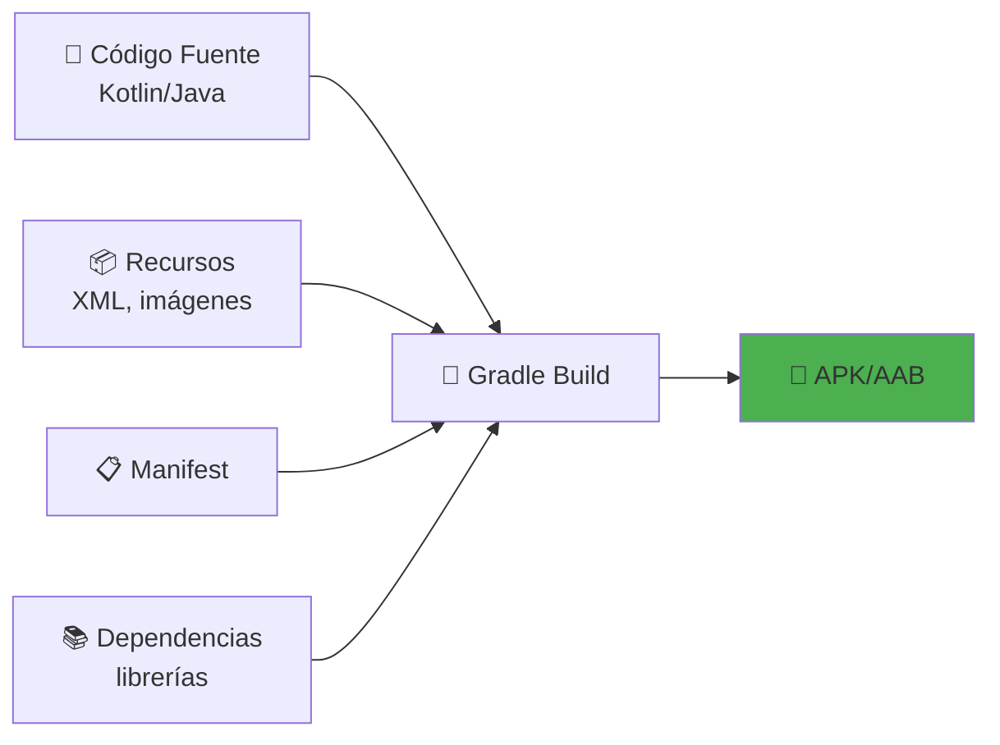
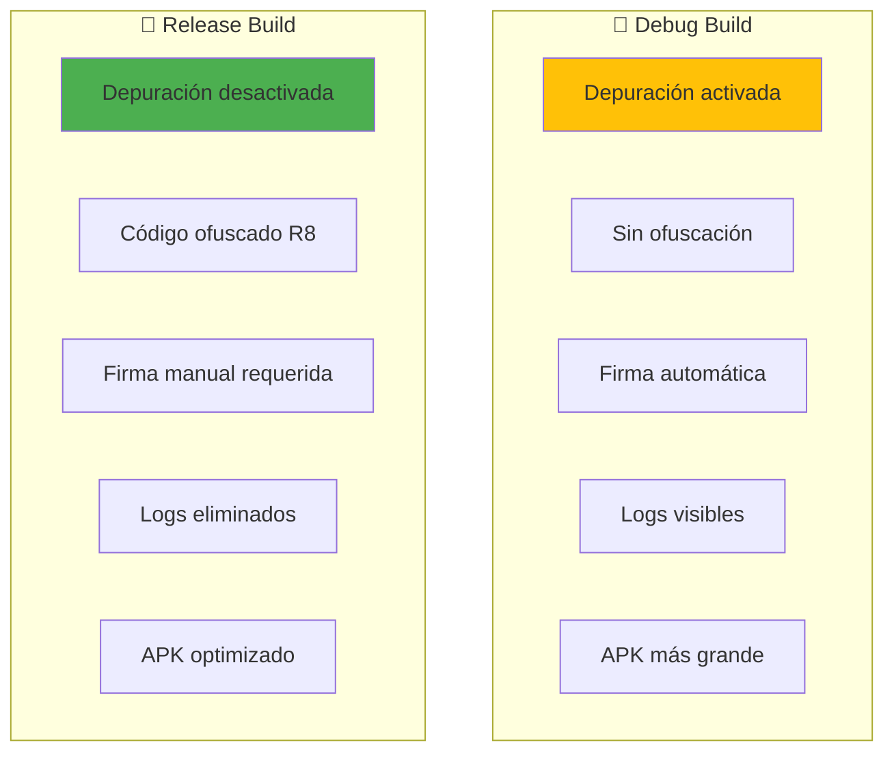
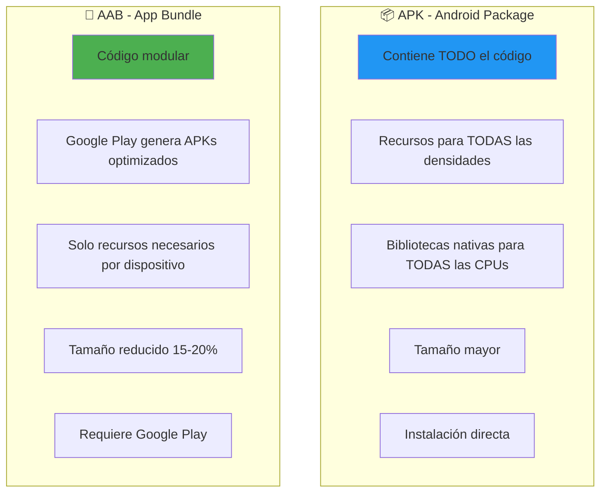
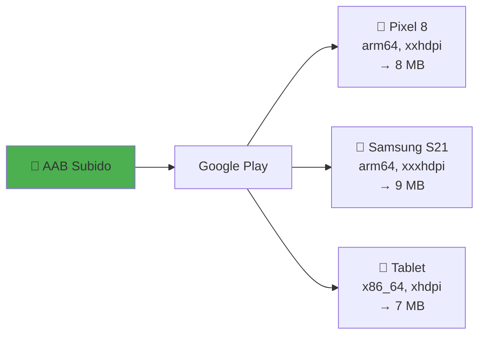
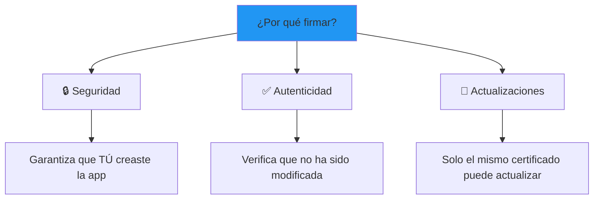
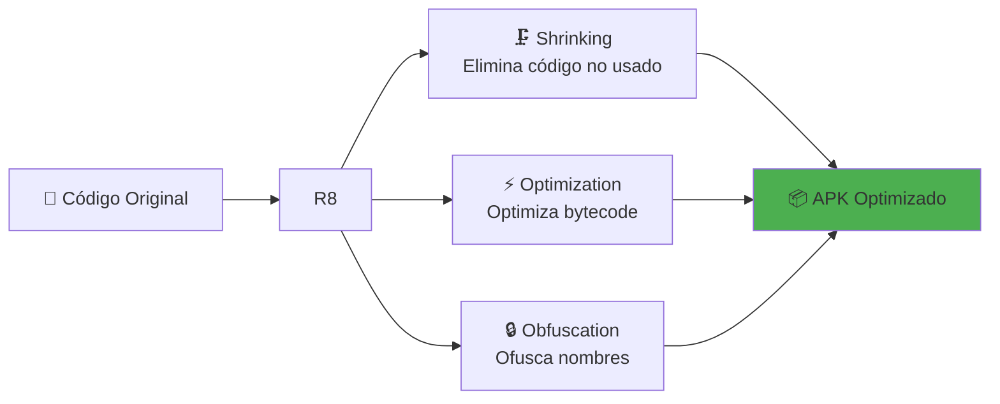
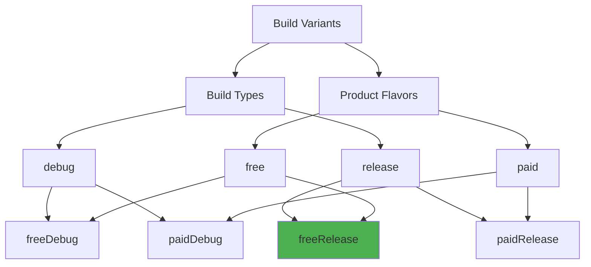
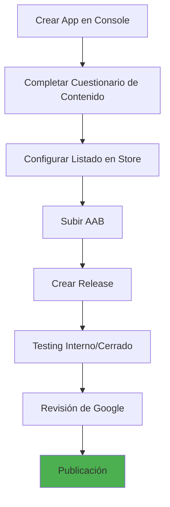
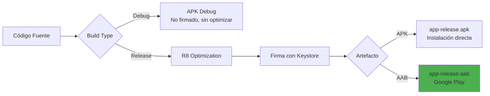

# 16. Compilación y Generación de Artefactos en Android

!!! tip "Repositorio de la Aplicación"
    El código fuente de la aplicación se encuentra en el repositorio de GitHub: [MyGameStore](https://github.com/jssdocente/MyGameStore)

## **Objetivos de Aprendizaje**

Al finalizar esta sección, los alumnos serán capaces de:

1. ✅ Comprender los diferentes **Build Types** (Debug, Release)
2. ✅ Conocer los tipos de artefactos finales (**APK vs AAB**)
3. ✅ Configurar el proceso de **firma de aplicaciones**
4. ✅ Generar builds optimizados con **ProGuard/R8**
5. ✅ Entender las **Build Variants** y **Product Flavors**
6. ✅ Preparar la app para **distribución en Google Play**

---

## **1. Conceptos Fundamentales del Sistema de Build**

### 1.1. ¿Qué es el Sistema de Build de Android?

Android utiliza **Gradle** como sistema de automatización de builds. El proceso convierte tu código fuente en un artefacto ejecutable.




**Archivos
 clave del sistema de build:**

| Archivo | Descripción | Ubicación |
|---------|-------------|-----------|
| `settings.gradle.kts` | Configuración del proyecto | Raíz del proyecto |
| `build.gradle.kts` (root) | Build script del proyecto | Raíz del proyecto |
| `build.gradle.kts` (app) | Build script del módulo | `/app/` |
| `gradle.properties` | Propiedades globales | Raíz del proyecto |
| `local.properties` | Propiedades locales (SDK path) | Raíz del proyecto |

---

## **2. Build Types: Debug vs Release**

### 2.1. ¿Qué son los Build Types?

Los **Build Types** son configuraciones predefinidas que determinan cómo se compila la aplicación. Por defecto, Android tiene dos:




### 2.2. Configuración en build.gradle.kts

```kotlin
android {
    // ... otras configuraciones
    
    buildTypes {
        debug {
            applicationIdSuffix = ".debug"  // Permite instalar debug y release juntos
            versionNameSuffix = "-DEBUG"
            isDebuggable = true
            isMinifyEnabled = false  // No optimizar código
            isShrinkResources = false  // No eliminar recursos no usados
            
            // Configuración de ProGuard/R8
            proguardFiles(
                getDefaultProguardFile("proguard-android.txt"),
                "proguard-rules.pro"
            )
        }
        
        release {
            isDebuggable = false
            isMinifyEnabled = true  // ✅ Optimizar y ofuscar código
            isShrinkResources = true  // ✅ Eliminar recursos no usados
            
            proguardFiles(
                getDefaultProguardFile("proguard-android-optimize.txt"),
                "proguard-rules.pro"
            )
            
            // Firma (se verá en detalle más adelante)
            signingConfig = signingConfigs.getByName("release")
        }
    }
}
```


### 2.3. Comparativa Detallada

| Característica | Debug | Release |
|----------------|-------|---------|
| **Propósito** | Desarrollo y testing | Distribución a usuarios |
| **Depuración** | ✅ Activada | ❌ Desactivada |
| **Logs** | Todos visibles | Solo errores críticos |
| **Ofuscación** | ❌ No | ✅ Sí (R8) |
| **Firma** | Automática (debug.keystore) | Manual (tu keystore) |
| **Tamaño APK** | ~15-20 MB (ejemplo) | ~8-12 MB (optimizado) |
| **Velocidad de build** | Rápida | Más lenta (optimizaciones) |
| **Install ID** | `com.pmdm.mygamestore.debug` | `com.pmdm.mygamestore` |
| **Icono** | Puede tener badge "DEBUG" | Icono final |

### 2.4. Comandos de Compilación

**Desde Terminal:**

```shell
# Compilar Debug
./gradlew assembleDebug

# Compilar Release
./gradlew assembleRelease

# Limpiar + compilar
./gradlew clean assembleRelease
```


**Desde Android Studio:**

1. **Build → Select Build Variant** (panel lateral)
2. Seleccionar `debug` o `release`
3. **Build → Build Bundle(s) / APK(s)**

---

## **3. Tipos de Artefactos Finales**

### 3.1. APK vs AAB (Android App Bundle)




### 3.2. Comparativa Técnica

| Aspecto | APK | AAB (recomendado) |
|---------|-----|-------------------|
| **Tamaño en almacenamiento** | 15 MB | 12 MB (ejemplo) |
| **Tamaño descarga usuario** | 15 MB | 8-10 MB (optimizado por dispositivo) |
| **Distribución** | Directa, stores alternativos | Google Play Store |
| **Optimización** | Manual | Automática por Google Play |
| **Testing** | ✅ Fácil (instalar directamente) | Requiere Play Console o bundletool |
| **Formato requerido Play** | ❌ Obsoleto desde 2021 | ✅ Obligatorio |
| **Soporte multi-módulo** | ❌ Limitado | ✅ Completo (Dynamic Features) |

### 3.3. ¿Qué contiene un APK?

```text
📦 app-release.apk
├── 📁 META-INF/              # Certificados y firma
│   ├── CERT.SF
│   ├── CERT.RSA
│   └── MANIFEST.MF
├── 📁 res/                   # Recursos compilados
│   ├── drawable-hdpi/
│   ├── drawable-xhdpi/
│   └── ...
├── 📁 lib/                   # Bibliotecas nativas
│   ├── arm64-v8a/           # CPU ARM 64-bit
│   ├── armeabi-v7a/         # CPU ARM 32-bit
│   └── x86_64/              # Emuladores
├── 📄 AndroidManifest.xml   # Manifest compilado (binario)
├── 📄 classes.dex           # Código compilado (Dalvik Executable)
├── 📄 resources.arsc        # Tabla de recursos
└── 📄 assets/               # Assets sin compilar
```


### 3.4. ¿Qué contiene un AAB?

```text
🎁 app-release.aab
├── 📁 base/                 # Módulo base (obligatorio)
│   ├── manifest/
│   ├── dex/
│   ├── res/
│   └── assets/
├── 📁 BUNDLE-METADATA/      # Metadatos
│   ├── com.android.tools.build.obfuscation/
│   └── com.android.tools.build.libraries/
└── 📄 BundleConfig.pb      # Configuración del bundle
```


**Google Play genera APKs específicos:**




### 3.5. Comandos de Generación

```shell
# Generar APK Debug
./gradlew assembleDebug
# Output: app/build/outputs/apk/debug/app-debug.apk

# Generar APK Release
./gradlew assembleRelease
# Output: app/build/outputs/apk/release/app-release.apk

# Generar AAB (Bundle) Release
./gradlew bundleRelease
# Output: app/build/outputs/bundle/release/app-release.aab
```


**Desde Android Studio:**

- **APK:** `Build → Build Bundle(s) / APK(s) → Build APK(s)`
- **AAB:** `Build → Build Bundle(s) / APK(s) → Build Bundle(s)`

---

## **4. Firma de Aplicaciones (App Signing)**

### 4.1. ¿Por qué firmar una aplicación?




**Sin firma correcta:**

- ❌ No se puede instalar en dispositivos
- ❌ Google Play rechaza la app
- ❌ No se pueden publicar actualizaciones

### 4.2. Tipos de Keystore

| Tipo | Uso | Ubicación | Seguridad |
|------|-----|-----------|-----------|
| **debug.keystore** | Desarrollo local | `~/.android/debug.keystore` | ⚠️ Pública (todos la tienen) |
| **release.keystore** | Producción | Tu eliges (segura) | 🔒 Privada (**NO compartir**) |

### 4.3. Crear un Keystore de Release

**Opción 1: Desde Android Studio (recomendado)**

1. `Build → Generate Signed Bundle / APK`
2. Seleccionar `Android App Bundle` o `APK`
3. Click en `Create new...`
4. Rellenar el formulario:

```text
Key store path: /ruta/segura/mygamestore-release.keystore
Password: ********** (guárdala en lugar seguro!)
Alias: mygamestore
Alias password: **********
Validity: 25 años (mínimo)

Certificate:
  First and Last Name: Tu Nombre
  Organizational Unit: PMDM
  Organization: Tu Escuela
  City: Tu Ciudad
  State: Tu Provincia
  Country Code: ES
```


**Opción 2: Desde Terminal**

```shell
keytool -genkey -v -keystore mygamestore-release.keystore \
  -alias mygamestore \
  -keyalg RSA \
  -keysize 2048 \
  -validity 10000 \
  -storepass TU_PASSWORD \
  -keypass TU_PASSWORD
```


### 4.4. Configurar Firma en build.gradle.kts

**⚠️ IMPORTANTE: NO incluir passwords en el código**

**Paso 1:** Crear archivo `keystore.properties` (en `.gitignore`)

```properties
# keystore.properties (NO SUBIR A GIT)
storeFile=../keystores/mygamestore-release.keystore
storePassword=tu_password_seguro
keyAlias=mygamestore
keyPassword=tu_password_seguro
```


**Paso 2:** Configurar en `build.gradle.kts`

```kotlin
import java.util.Properties
import java.io.FileInputStream

android {
    namespace = "com.pmdm.mygamestore"
    compileSdk = 36

    // Cargar propiedades del keystore
    val keystorePropertiesFile = rootProject.file("keystore.properties")
    val keystoreProperties = Properties()
    
    if (keystorePropertiesFile.exists()) {
        keystoreProperties.load(FileInputStream(keystorePropertiesFile))
    }

    signingConfigs {
        create("release") {
            storeFile = keystoreProperties["storeFile"]?.let { file(it) }
            storePassword = keystoreProperties["storePassword"] as? String
            keyAlias = keystoreProperties["keyAlias"] as? String
            keyPassword = keystoreProperties["keyPassword"] as? String
        }
    }

    buildTypes {
        release {
            isMinifyEnabled = true
            isShrinkResources = true
            proguardFiles(
                getDefaultProguardFile("proguard-android-optimize.txt"),
                "proguard-rules.pro"
            )
            signingConfig = signingConfigs.getByName("release")
        }
    }
}
```


**Paso 3:** Añadir a `.gitignore`

```.gitignore
# Archivos sensibles
keystore.properties
*.keystore
*.jks
```


---

## **5. Optimización con ProGuard/R8**

### 5.1. ¿Qué es R8?

**R8** es el optimizador de código de Android que reemplazó a ProGuard. Realiza 3 tareas principales:




### 5.2. Efectos de R8

**Antes (Debug):**
```kotlin
// Tamaño: 15 MB
class GameRepository {
    fun getGameById(gameId: Int): Game { ... }
    fun getAllGames(): List<Game> { ... }
    private fun helperMethodNotUsed() { ... }  // ← Será eliminado
}
```


**Después (Release con R8):**
```kotlin
// Tamaño: 8 MB
class a {  // ← Nombre ofuscado
    fun a(int b): c { ... }  // ← getGameById ofuscado
    fun b(): List<c> { ... }  // ← getAllGames ofuscado
    // helperMethodNotUsed eliminado ✂️
}
```


### 5.3. Configuración en proguard-rules.pro

```text
# MyGameStore ProGuard Rules

# Mantener modelos de datos (para serialización)
-keep class com.pmdm.mygamestore.data.model.** { *; }
-keep class com.pmdm.mygamestore.domain.model.** { *; }

# Mantener entidades de Room
-keep @androidx.room.Entity class *
-keep class * extends androidx.room.RoomDatabase

# Kotlinx Serialization
-keepattributes *Annotation*, InnerClasses
-dontnote kotlinx.serialization.AnnotationsKt

-keepclassmembers class kotlinx.serialization.json.** {
    *** Companion;
}
-keepclasseswithmembers class kotlinx.serialization.json.** {
    kotlinx.serialization.KSerializer serializer(...);
}

# Retrofit
-keepattributes Signature, InnerClasses, EnclosingMethod
-keepattributes RuntimeVisibleAnnotations, RuntimeVisibleParameterAnnotations
-keepclassmembers,allowshrinking,allowobfuscation interface * {
    @retrofit2.http.* <methods>;
}

# OkHttp
-dontwarn okhttp3.**
-dontwarn okio.**

# Koin
-keep class org.koin.** { *; }
-keep class com.pmdm.mygamestore.di.** { *; }

# Firebase
-keep class com.google.firebase.** { *; }
-keep class com.google.android.gms.** { *; }
```


### 5.4. Verificar Ofuscación

Después de compilar release, revisa:

```text
app/build/outputs/mapping/release/
├── mapping.txt       # Mapeo de nombres ofuscados → originales
├── seeds.txt         # Clases/métodos mantenidos por reglas
├── usage.txt         # Código eliminado
└── resources.txt     # Recursos eliminados
```


**Ejemplo de mapping.txt:**
```
com.pmdm.mygamestore.data.repository.GameRepositoryImpl -> a.b.c.d:
    getGameById(int) -> a
    getAllGames() -> b
```


---

## **6. Build Variants y Product Flavors**

### 6.1. ¿Qué son las Build Variants?

Las **Build Variants** son combinaciones de **Build Types** + **Product Flavors**.




### 6.2. Ejemplo de Product Flavors

```kotlin
android {
    // ... otras configuraciones

    flavorDimensions += "version"
    
    productFlavors {
        create("free") {
            dimension = "version"
            applicationIdSuffix = ".free"
            versionNameSuffix = "-free"
            
            buildConfigField("Boolean", "SHOW_ADS", "true")
            buildConfigField("Boolean", "PREMIUM_FEATURES", "false")
        }
        
        create("paid") {
            dimension = "version"
            applicationIdSuffix = ".paid"
            versionNameSuffix = "-paid"
            
            buildConfigField("Boolean", "SHOW_ADS", "false")
            buildConfigField("Boolean", "PREMIUM_FEATURES", "true")
        }
    }
}
```


**Estructura de carpetas:**

```text
app/src/
├── main/              # Código común
├── debug/             # Solo para debug builds
├── release/           # Solo para release builds
├── free/              # Solo para versión free
│   ├── res/
│   │   └── values/
│   │       └── strings.xml  # "MyGameStore Free"
│   └── java/
│       └── AdsManager.kt
└── paid/              # Solo para versión paid
    ├── res/
    │   └── values/
    │       └── strings.xml  # "MyGameStore Premium"
    └── java/
        └── AdsManager.kt    # Implementación vacía
```


**Uso en código:**

```kotlin
if (BuildConfig.SHOW_ADS) {
    // Mostrar publicidad
    AdManager.showInterstitial()
}

if (BuildConfig.PREMIUM_FEATURES) {
    // Habilitar features premium
    binding.premiumButton.isVisible = true
}
```


---

## **7. Proceso Completo de Generación**

### 7.1. Checklist Pre-Release

## ✅ Checklist antes de generar Release

### Configuración
- [ ] `versionCode` incrementado
- [ ] `versionName` actualizado
- [ ] Keystore configurado correctamente
- [ ] ProGuard rules actualizadas

### Testing
- [ ] Todos los tests unitarios pasan
- [ ] Tests de UI funcionan correctamente
- [ ] App probada en dispositivos físicos
- [ ] Probada con build release (no solo debug)

### Contenido
- [ ] Recursos de alta calidad (iconos, imágenes)
- [ ] Strings traducidos (si aplica)
- [ ] Permisos del Manifest justificados
- [ ] API Keys de producción configuradas

### Optimización
- [ ] `minifyEnabled = true`
- [ ] `shrinkResources = true`
- [ ] Tamaño del APK/AAB revisado
- [ ] Sin logs de debug en release

### Legal
- [ ] Política de privacidad incluida
- [ ] Licencias de terceros documentadas
- [ ] Cumplimiento GDPR (si aplica)


### 7.2. Generar AAB para Google Play

**Paso a paso:**

1. **Actualizar versión en build.gradle.kts:**

```kotlin
android {
    defaultConfig {
        versionCode = 2  // Incrementar en cada release
        versionName = "1.1.0"
    }
}
```


2. **Limpiar proyecto:**

```shell
./gradlew clean
```


3. **Generar Bundle firmado:**

**Desde Terminal:**
```shell
./gradlew bundleRelease
```


**Desde Android Studio:**
- `Build → Generate Signed Bundle / APK`
- Seleccionar `Android App Bundle`
- Elegir keystore y completar passwords
- Seleccionar `release` build variant
- Click `Finish`

4. **Ubicación del archivo:**

```
app/build/outputs/bundle/release/app-release.aab
```


5. **Verificar el bundle:**

```shell
# Tamaño
ls -lh app/build/outputs/bundle/release/app-release.aab

# Contenido (usando bundletool)
java -jar bundletool.jar validate --bundle=app-release.aab
```


### 7.3. Testing del AAB Localmente

**Instalar bundletool:**

```shell
# Descargar
wget https://github.com/google/bundletool/releases/latest/download/bundletool-all.jar

# Generar APKs desde AAB
java -jar bundletool.jar build-apks \
  --bundle=app-release.aab \
  --output=app-release.apks \
  --ks=mygamestore-release.keystore \
  --ks-key-alias=mygamestore

# Instalar en dispositivo conectado
java -jar bundletool.jar install-apks --apks=app-release.apks
```


---

## **8. Distribución en Google Play**

### 8.1. Preparación de Assets

**Requisitos de Google Play Console:**

| Asset | Tamaño | Formato |
|-------|--------|---------|
| **Icono de app** | 512x512 px | PNG (32-bit) |
| **Feature Graphic** | 1024x500 px | JPG/PNG |
| **Screenshots teléfono** | Mín. 2, 16:9 o 9:16 | JPG/PNG |
| **Screenshots tablet** | Opcional | JPG/PNG |

### 8.2. Proceso de Subida




### 8.3. Configuración de App Signing

**Google Play App Signing (recomendado):**

1. Google gestiona la clave de producción
2. Tú firmas con una "upload key"
3. Mayor seguridad (Google tiene backup)

**Activar en Console:**
- `Release → Setup → App integrity`
- `Use Google Play App Signing`
- Subir certificado o crear nuevo

---

## **10. Recursos Adicionales**

### Documentación Oficial

- [Build Types](https://developer.android.com/build/build-variants#build-types)
- [Shrink, obfuscate, and optimize (R8)](https://developer.android.com/build/shrink-code)
- [Sign your app](https://developer.android.com/studio/publish/app-signing)
- [Android App Bundles](https://developer.android.com/guide/app-bundle)

### Herramientas

- [bundletool](https://github.com/google/bundletool) - Testing de AABs
- [APK Analyzer](https://developer.android.com/studio/debug/apk-analyzer) - Analizar contenido de APKs
- [Play Console](https://play.google.com/console) - Publicación en Google Play

### Comandos Útiles

```shell
# Ver información del APK
aapt dump badging app-release.apk

# Verificar firma
jarsigner -verify -verbose -certs app-release.apk

# Tamaño de APK por componente
./gradlew :app:printApkSize --variant=release

# Dependencias del proyecto
./gradlew :app:dependencies

# Limpiar builds antiguos
./gradlew clean
```


---

## **Resumen Final**




Los alumnos ahora comprenden:

- ✅ Diferencias entre Debug y Release
- ✅ Proceso de firma con Keystores
- ✅ Optimización con R8/ProGuard
- ✅ APK vs AAB
- ✅ Product Flavors y Build Variants
- ✅ Preparación para Google Play